# Statistica descrittiva

## Popolazione, campione e variabili

### Esercizio 1.1 {-}

Secondo un'indagine della Goldman Sachs, soltanto il 4\% delle famiglie statunitensi ha un conto online. In un sondaggio della Cyber Dialogue riportato su USA Today si è cercato di indagare sui motivi per cui i clienti hanno chiuso il proprio conto online dopo un periodo di prova. Di seguito trovate le risposte degli intervistati alla domanda: "*Perchè hai chiuso il tuo conto online?*"

::: {.center}
   *Perchè hai chiuso il tuo conto online?*   
  ------------------------------------------- -----
   Troppo complicato o richiede troppo tempo   27%
      Insoddisfatto dal servizio clienti       25%
     Non mi necessario o non mi interessa      20%
    Preoccupato per la sicurezza del conto     11%
                Troppo costoso                 11%
        Sono preoccupato per la privacy        5%
:::

a)   Descrivere la popolazione per l'indagine della Goldman Sachs;

b)   Descrivere la popolazione per l'indagine della Cyber Dialogue;

c)   La risposta alla domanda considerata è qualitativa o quantitativa?

#### Soluzione {- .sol}

a)   La popolazione di riferimento per l'indagine della Goldman Sachs è costituita da tutte le famiglie statunitensi.

b)   La popolazione di riferimento per l'indagine della Cyber Dialogue è costituita dalle famiglie statunitensi che avevano un conto online e hanno deciso di chiuderlo.

c)   La risposta alla domanda considerata è qualitativa.

### Esercizio 1.2 {-}

In un fast food vengono venduti 3 diversi tipi di bevande: bibite, tè e caffè.

a)   Spiegare perchè il tipo di bevanda venduta è un esempio di carattere qualitativo sconnesso.

b)   Le bibite vengono vendute in 3 dimensioni diverse: piccola, media e grande. Di che carattere si tratta?

#### Soluzione {- .sol}
a)   Il tipo di bevanda è un carattere qualitativo sconnesso: le sue modalità sono definite mediante sostantivi e non ammettono un ordinamento tra loro (infatti date due bevande è possibile affermare  soltanto se esse sono uguali o diverse tra loro).

b)   La dimensione della bibita è un carattere qualitativo ordinato perchè le sue modalità sono attributi non numerici, ma logicamente ordinabili (infatti una bevanda 'piccola' è di dimensione inferiore ad una 'media', che a sua volte è di dimensione inferiore ad una 'grande').

### Esercizio 1.3 {-}

Per ognuna delle seguenti variabili dire di che tipo di variabile si tratta e la scala di misura di riferimento:

a)   Numero di telefoni per famiglia;

b)  Tipo di telefono usato principalmente;

c)   Numero di telefonate al mese;

d)   Numero medio di telefonate al mese;

e)   Durata (in minuti) delle chiamate;

f)   Costo mensile delle telefonate;

g)   Esistenza di una linea telefonica collegata ad un modem.

#### Soluzione {- .sol}

a)   quantitativo discreto, scala proporzionale.

b)   qualitativo sconnesso, scala nominale.

c)   quantitativo discreto, scala proporzionale.

d)   quantitativo continuo, scala proporzionale.

e)   quantitativo continuo, scala proporzionale.

f)   quantitativo continuo, scala proporzionale.

g)   qualitativo sconnesso, scala nominale.

### Esercizio 1.4 {-}
<center>*Identificare le componenti di uno studio*</center>

**(dal libro di testo *OpenIntro Statistics* di Diez et al., es. 1.3-1.7)**

Identificare (i) le unità, (ii) le variabili e la loro tipologia, (iii) l'obiettivo principale di ricerca, (iv) la popolazione di interesse e il campione negli studi descritti qui di seguito. Discutere inoltre sulla possibilità di generalizzare i risultati dello studio alla popolazione e di stabilire dei nessi causali:


a) Alcuni ricercatori hanno raccolto dei dati per esaminare la relazione tra sostanze inquinanti e nascite premature nel sud della California. Durante lo studio i livelli di inquinamento dell'aria
(monossido di carbonio CO, diossido di nitrogeno, ozono, particolato PM 10) sono stati misurati in apposite stazioni di monitoraggio della qualità dell'aria. E' stata inoltre rilevata la durata della gestazione per 143196 nascite tra il 1989 e il 1993 e l'esposizione all'inquinamento dell'aria durante la gestazione è stato calcolato per ciascuna nascita. L'analisi ha mostrato che una maggiore concentrazione
di PM 10 e, in misura minore, di CO possono essere associate a nascite premature.


b) Il metodo Buteyko è una tecnica di respirazione debole sviluppata dal medico russo Konstantin Buteyko nel 1952. L'evidenza empirica suggerisce che il metodo Buteyko aiuta a ridurre i sintomi dell'asma e a migliorare la qualità della vita. In uno studio clinico volto a dimostrare l'efficacia di questo metodo, i ricercatori hanno reclutato 600 pazienti malati asma di età compresa tra i 18 e i 69 anni che erano stati sottoposti ad una terapia medica contro l'asma. Questi pazienti sono stati suddivisi in due gruppi: uno sottoposto al metodo Buteyko, l'altro no. Sono stati rilevati degli indici di qualità della vita, di attività, di sintomi dell'asma e riduzione dei trattamenti medici su una scala da 0 a 10. In media, i pazienti del gruppo Buteyko hanno sperimentato una riduzione significativa nei sintomi dell'asma e un miglioramento di qualità della vita.

#### Soluzione {- .sol}

a)    \ (i) Le unità sono 143196 nuovi nati registrati nel sud della California tra il 1989 e il 1993. (ii) Le variabili misurate sono tutte quantitative continue: monossido di carbonio CO, diossido di nitrogeno, ozono, particolato PM 10. (iii) L'obiettivo della ricerca è stabilire se c'è un'associazione tra l'esposizione all'inquinamento dell'aria e le nascite premature. (iv) La popolazione di interesse è quella di tutte le nascite nel sud della California. Il campione considera invece le 143196 nascite avvenute tra il 1989 e il 1993. Se le nascite in questo periodo di tempo possono essere considerate rappresentative di tutte le nascite del sud della California allora si può pensare che i risultati ottenuti siano generalizzabili all'intera popolazione. Tuttavia, poichè lo studio è di tipo osservazionale, non può essere usato per dimostrare una relazione di tipo causale.


b)    \ (i) Le unità sono 600 pazienti adulti di età compresa tra i 18 e i 69 anni malati di asma e sotto trattamento. (ii) Le variabili misurate su una scala qualitativa ordinale da 0 a 10 (quindi trattabili come quantitative discrete) sono: indici di qualità della vita, di attività, di sintomi dell'asma e riduzione dei trattamenti medici. Inoltre viene considerata una variabile binaria che indica l'appartenenza o non appartenenza al gruppo sperimentale Buteyko. (iii) L'obiettivo della ricerca è dimostrare l'efficacia del metodo Buteyko nel miglioramento della condizione generale del malato d'asma. (iv) La popolazione di riferimento è l'insieme di tutti i pazienti di età compresa tra i 18 e i 69 anni, malati di asma e sotto trattamento. Il campione contiene 600 di questi pazienti. Se assumiamo che il campione contenga dei pazienti volontari, non possiamo pensare che sia un campione rappresentativo e quindi generalizzare i risultati all'intera popolazione. Tuttavia, la natura sperimentale dello studio consente di poter dimostrare statisticamente l'esistenza di una relazione causale.


### Esercizio 1.5 {-}

<center>*Iris di Fisher*</center>
**(dal libro di testo *OpenIntro Statistics* di Diez et al., es. 1.5)**

Il Sig. Ronald Aylmer Fisher era uno statistico inglese, esperto di evoluzione, biologo e genetista, che lavorò tra l'altro su un noto dataset riguardante tre tipi di fiori iris (setosa, versicolor e virginica) per i quali erano state rilevate la lunghezza e la larghezza dei sepali e lunghezza e larghezza dei petali. I dati, relativi a 50 fiori per ciascun tipo^[Foto di rtclauss su Flickr, Iris.; R.A Fisher. "The Use of Multiple Measurements in Taxonomic Problems". In: Annals of Eugenics 7 (1936), pp. 179-188], sono contenuti nel dataset `iris` (riportato in Appendice e disponibile online).


<center></center>


a)   Quante sono le unità?

b)   Quante variabili quantitative sono presenti nel dataset? Indicare quali sono, e se sono continue o discrete.

c)   Quante variabili categoriche sono presenti nel dataset, e quali sono? Elenca le corrispondenti modalità.

#### Soluzione {- .sol}

a)   Le unità sono $50 \times 3=150$.

b)   Ci sono quattro variabili quantitative: lunghezza dei sepali, larghezza dei sepali, lunghezza dei petali e larghezza dei petali.

c)   C'è una sola variabile categorica, il tipo, che presenta tre modalità: *setosa*, *versicolor* e *virginica*.

## Distribuzioni di frequenza

### Esercizio 1.6 {-}
**(dal libro di testo *Introduzione alla statistica* di Sheldon M. Ross, es. 1 pag.59)**

I dati seguenti indicano il gruppo sanguigno di 50 donatori in un centro
di raccolta del sangue.

    0 A 0 AB A A 0 0 B A 0 A AB B 0 0 0 A B A A 0 A A 0
    B A 0 AB A 0 0 A B A A A 0 B 0 0 A 0 A B 0 AB A 0 B

a)   Rappresentare questi dati in una tabella di frequenze.

b)   Rappresentare i dati in una tabella di frequenze relative.

c)   Calcolare inoltre le frequenze percentuali.

#### Soluzione {- .sol}


  ----------- ------------------------ ------------------------------------ ---------------------------
                        \(a\)                    \(b\)                          \(c\)
   gruppo      freq. assolute $n_i$     freq. relative $f_i=\frac{n_i}{n}$   freq. percentuali
       0                  19                     0.38                           38 %
       A                  19                     0.38                           38 %
       AB                 4                      0.08                            8 %
       B                  8                      0.16                           16 %
   **Totale**         $n=$ **50**                   **1**                        **100** %
  ----------- ------------------------ ------------------------------------ ---------------------------


### Esercizio 1.7 {-}

**(dal libro di testo *Introduzione alla statistica* di Sheldon M. Ross, es. 5 pag.35)**

I seguenti dati indicano la concentrazione di ozono nell'aria del centro di Los Angeles durante 25 giorni consecutivi nell'estate del 1984:

    6.2 9.1 2.4 3.6 1.9 1.7 4.5 4.2 3.3 5.1 6.0 1.8 2.3 
    4.9 3.7 3.8 5.5 6.4 8.6 9.3 7.7 5.4 7.2 4.9 6.2

Costruire la distribuzione in classi utilizzando le seguenti classi:

$(0,2]$,$(2,4]$,$(4,7]$, $(7,10]$.

#### Soluzione {- .sol}

    concentrazione   freq. assolute $n_i$
  ---------------- ----------------------
            (0,2\]                    3
            (2,4\]                    6
            (4,7\]                   11
           (7,10\]                    5
           
### Esercizio 1.8 {-}

La seguente tabella riguarda la distribuzione di frequenza del costo di un pasto (espresso in euro):

   Costo di un pasto   Frequenza assoluta
  ------------------- --------------------
       $[10,15)$               1
       $[15,20)$               0
       $[20,25)$               2
       $[25,30)$               15
       $[30,35)$               5
       $[25,40)$               1
       $[40,45)$               3
         $>45$                 15

a)   Di che tipo di carattere si tratta? E di che rappresentazione tabellare si tratta?

b)   Che differenza c'è rispetto a quella dell'Esercizio 1.7?

c)   Costruire le frequenze relative, percentuali.

d)   È possibile ricostruire la corrispondente distribuzione unitaria?

#### Soluzione {- .sol}

a)   Il carattere costo di un pasto è quantitativo continuo. La tabella precedente rappresenta la distribuzione in classi delle frequenze assolute.

b)   La distribuzione data nell'esercizio precente è una distribuzione unitaria, quella che viene richiesto di ricavare è invece una distribuzione in classi: in questo caso possiamo notare che le
    classi sono chiuse a sinistra e aperte a destra e che l'ultima classe è aperta.

c)   La seguente tabella riporta le frequenze relative e percentuali:

    
      ------------------- ----------- --------------------- -------------
       Costo di un pasto   Freq.       Freq.                 Freq.
            classi         assolute    relative              percentuali
                            $n_i$      $f_i=\frac{n_i}{n}$
      ------------------- ----------- --------------------- -------------
           $[10,15)$           1         0.02                 2%
           
           $[15,20)$           0           0                  0%
           
           $[20,25)$           2         0.05                 5%
           
           $[25,30)$          15         0.36                 36%
           
           $[30,35)$           5         0.12                 12%
           
           $[25,40)$           1         0.02                 2%
           
           $[40,45)$           3         0.07                 7%
           
             $>45$            15         0.36                 36%
      
          **Totale**       $n=$**42**      **1**               **100%**
      ------------------- ----------- -------------------- -------------
    

d)   A partire dalla distribuzione in classi non è possibile ricostruire quella unitaria, mentre è possibile il viceversa come abbiamo visto nell'esercizio precedente.

## Rappresentazioni grafiche per caratteri qualitativi

### Esercizio 1.9 {-}
**(dal libro di testo *Introduzione alla statistica* di Sheldon M. Ross, es. 1 pag.59)**

Riprendendo l'Esercizio 1.6, rappresentare la distribuzione mediante un diagramma a barre.

#### Soluzione {- .sol}
<center>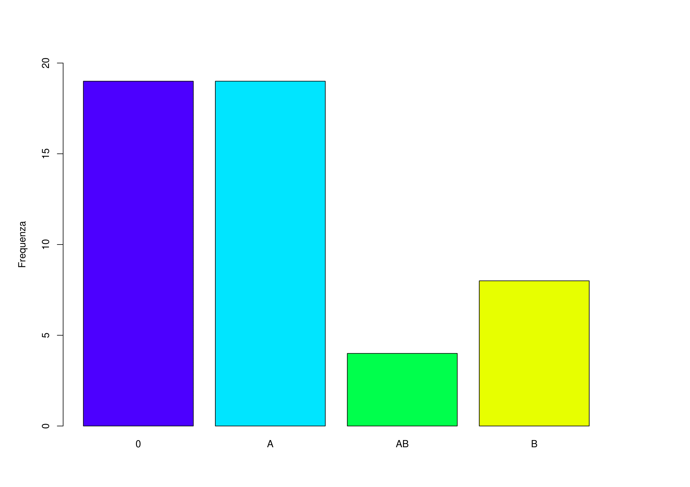</center>

### Esercizio 1.10 {-}

Un articolo del *Wall Stree Journal* del luglio 2003 discute l'influenza che Google ha avuto sul web. La tabella seguente mostra come si sono distribuite le ricerche sul web condotte nel maggio 2003 dagli utenti americani di Internet (valori percentuale).

::: {.center}
        Fonte        Percentuale (%)
  ----------------- ----------------
   Ask Jeeves           3
   AOL Time Warner       19
       Google            32
    MSN-Microsoft        ???
        Yahoo            25
        Altro             6
:::


a)   Completare la tabella inserendo il valore mancante.

b)   Di che tipo di carattere si tratta? Quali sono le unità statistiche di riferimento?

c)   Rappresentare graficamente la distribuzione mediante un diagramma a barre.

#### Soluzione {- .sol}

a.   Poiché le frequenze devono sommare a 100, il valore mancante è 15.

b.   Il carattere considerato è qualitativo sconnesso. Le unità statistiche di riferimento sono le ricerche sul web condotte nel maggio 2003 dagli utenti americani di Internet.

c.   <center>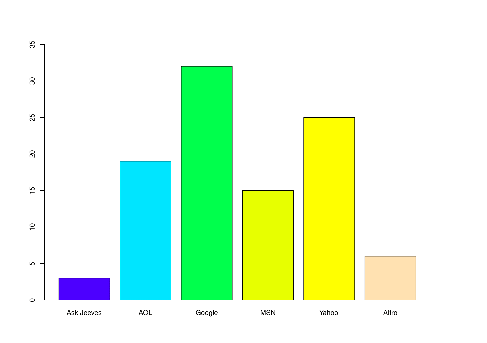</center>

### Esercizio 1.11 {-}

<center>*Uso degli antibiotici nei bambini*</center>
**(dal libro di testo *OpenIntro Statistics* di Diez et al., es. 1.47)**

Nei grafici seguenti viene rappresentata la distribuzione della condizione medica precedente di bambini arruolati in uno studio sulla durata ottimale di una terapia antibiotica per la tracheite.

a.   Quali sono le caratteristiche che emergono dal diagramma a barre ma non dal diagramma a torta?

b.   Quali sono le caratteristiche che emergono dal diagramma a torta ma non dal diagramma a barre?

c.   Quale grafico è preferibile per rappresentare questo tipo di dati?

<center>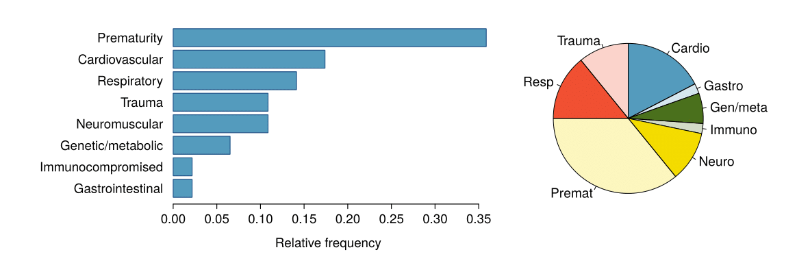</center>

#### Soluzione {- .sol}

a.   Nel diagramma a barre è evidente l'ordinamento tra le categorie e vengono rappresentate le frequenze relative.

b.  Il diagramma a torta non aggiunge altre informazioni utili a quanto mostrato nel diagramma a barre.

c.   In genere il diagramma a barre è preferibile sia per i motivi espressi al punto a. sia perchè il confronto tra lunghezze è più immediato rispetto a quello tra aree.

## Rappresentazioni grafiche e numeriche per caratteri quantitativi

### Esercizio 1.12 {-}

Con riferimento all'Esercizio 1.7

a.   Costruire l'istogramma della distribuzione.

b.   Calcolare la media (ovvero la concentrazione media di ozono a Los Angeles nei 25 giorni considerati).

#### Soluzione {- .sol}

a.   Calcoliamo innanzi tutto le ampiezze delle classi e le densità di
    frequenza.


  concentrazione   freq. assolute $n_i$   ampiezze $d_i$   densità di frequenza $h_i=\frac{n_i}{d_i}$
---------------- ----------------------- ---------------- --------------------------------------------
          (0,2\]                    3          2                   1.50
          (2,4\]                    6          2                   3.00
          (4,7\]                   11          3                   3.67
         (7,10\]                    5          3                   1.67


<center>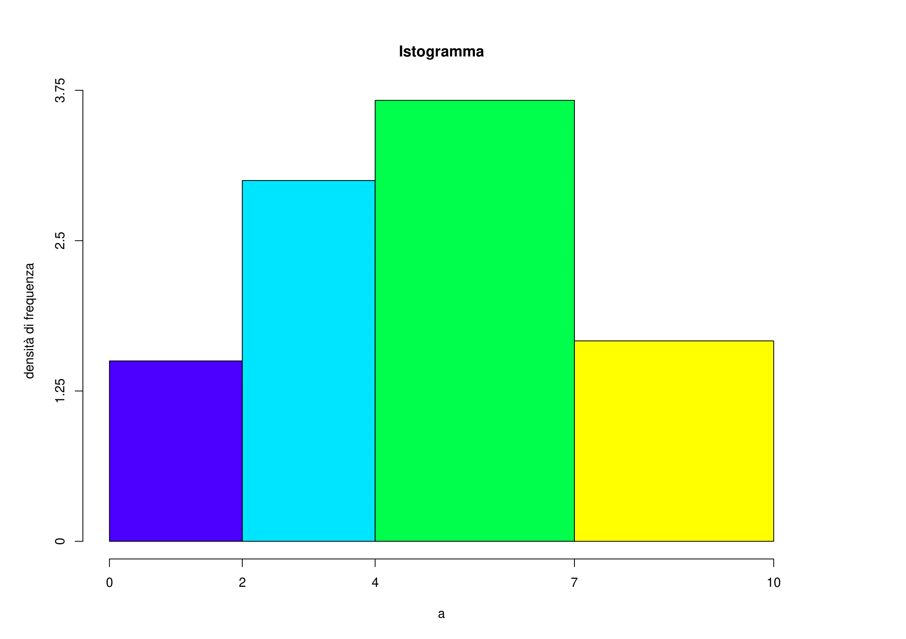</center>

b.   Utilizzando la formula della media $$\begin{align} \bar{x} &= \frac{x_1 + x_2 + \cdots + x_i + \cdots + x_n }{n} = \\ &= \frac{6.2 +9.1 +2.4 +3.6 +1.9 + \cdots + 6.2}{25} = \frac{125.7}{25} = 5.028\end{align}$$

### Esercizio 1.13 {-}

Nella seguente tabella sono riportati i tempi di funzionamento, in mesi prima dell'esaurimento, di un campione di batterie.


  Durata (mesi)   Frequenza
  --------------- -----------
  $[1,3)$         10
  $[3,6)$         42
  $[6,12)$        38
  $[12,24)$       8


a.   Rappresentare graficamente la distribuzione.

b.   Definire e individuare la classe modale.


#### Soluzione {- .sol}
a.   Calcoliamo innanzi tutto le ampiezze delle classi e le densità di frequenza.

   
  Durata (mesi)     Freq. $n_i$   Ampiezza $d_i$   Densità $h_i=\frac{n_i}{d_i}$
  --------------- ------------- ---------------- --------------------------------
  $[1,3)$                  10          2          5.00
  $[3,6)$                  42          3          14.00
  $[6,12]$                 38          6          6.33
  $[12,24)$                 8         12          0.67

<center>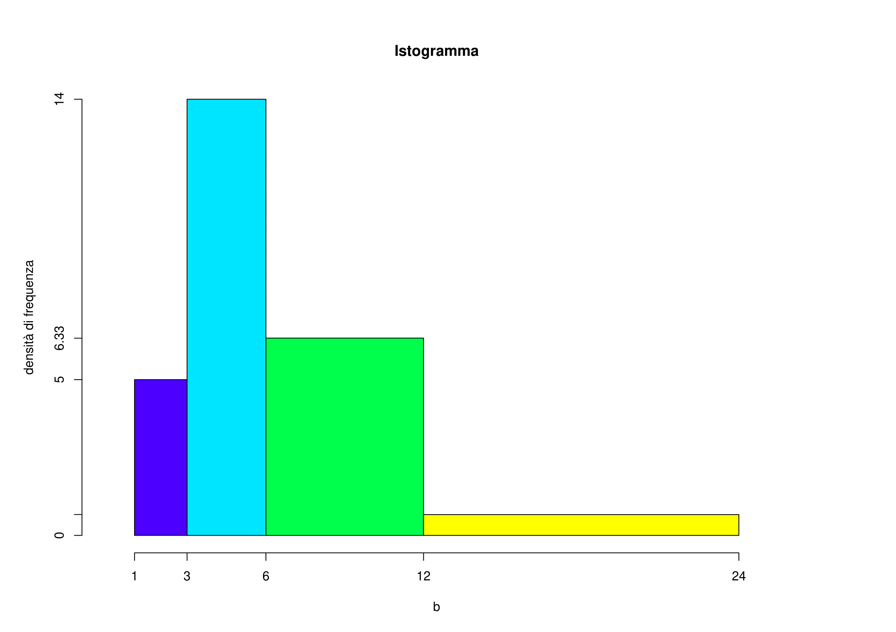</center>

b.   La classe modale è la classe alla quale risulta associata la massima densità di frequenza: in questo caso è la classe $[3,6)$.

### Esercizio 1.14 {-}

In un'indagine sui consumi delle auto a benzina nei percorsi urbani è stata osservata la distribuzione del numero di litri consumati per 100 Km riportata nella seguente tabella.


   Consumo (litri)   Frequenza
  ----------------- -----------
      $[5, 10)$         15
     $[10, 15)$         45
     $[15, 25)$         38
     $[25, 35)$          2


a.   Rappresentare graficamente la distribuzione.

b.   Definire e individuare la classe modale.

#### Soluzione {- .sol}

a.   Calcoliamo innanzi tutto le ampiezze delle classi e le densità di
    frequenza.

    
   Consumo (litri)   Freq. $n_i$   Ampiezza $d_i$   Densità di Frequenza $h_i=\frac{n_i}{d_i}$
  ----------------- ------------- ---------------- --------------------------------------------
      $[5, 10)$         15          5                3
     $[10, 15)$         45          5                9
     $[15, 25)$         38          10              3.8
     $[25, 35)$          2          10              0.2
    

<center>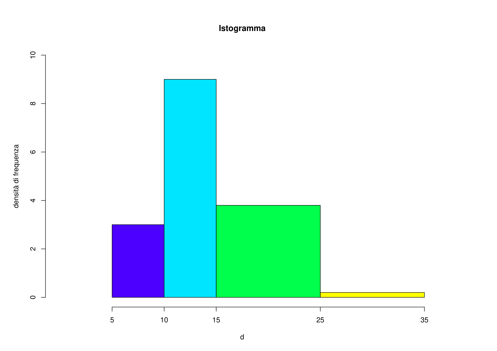</center>

b.   La classe modale è la classe alla quale risulta associata la massima densità di frequenza: in questo caso è la classe $[10,15)$.

### Esercizio 1.15 {-}
<center>*Media dei voti e tempo di studio*</center>

**(dal libro di testo *OpenIntro Statistics* di Diez et al., es. 1.9)**

È stata condotta un'indagine su 218 studenti della Duke University che hanno frequentato un corso di statistica di base nella primavera del 2012. Tra le molte altre domande, gli studenti sono stati interrogati sulla loro media dei voti (*GPA*) e sul numero di ore di studio settimanali (*Study hours/week*). Il seguente grafico a dispersione sotto mostra la relazione tra le due variabili.

<center>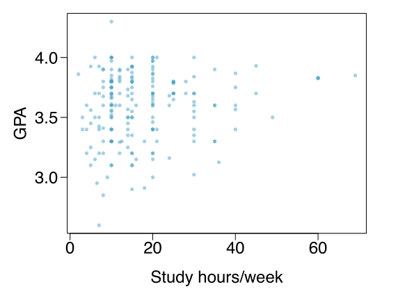</center>

a.   Quale è la variabile esplicativa e quale è la variabile risposta?

b.   Descrivere la relazione tra le due variabili. Mettere in evidenza osservazioni anomale, se ci sono.

c.   Si tratta di un esperimento o uno studio osservazionale?

d.   Possiamo concludere che all'aumentare del numero di ore di studio aumenta la media dei voti?

#### Soluzione {- .sol}

a.   La variabile esplicativa è il numero di ore di studio settimanali mentre la variabile risposta è la media dei voti.

b.   C'è una relazione leggermente positiva tra le due variabili. Uno studente ha una media superiore a 4.0, quindi, si tratta di un errore. Ci sono anche alcuni studenti che riportano un numero di ore di studio settimanale inusualmente alto (60 e 70 ore/settimana). Inoltre, la variabilità della variabile media dei voti sembra essere maggiore per gli studenti che studiano meno rispetto a quelli che studiano di più. Poiché aumenta la dispersione al crescere del numero di ore di studio, è difficile valutare la forza della relazione e anche la variabilità su diversi numeri di ore di studio.

c.   Si tratta di uno studio osservazionale

d.   Proprio perché si tratta di uno studio osservazionale, non si può stabilire una relazione causale tra ore di studio e media dei voti.

### Esercizio 1.16 {-}
<center>*Vita dei mammiferi*</center>
**(dal libro di testo *OpenIntro Statistics* di Diez et al., es. 1.23)**

Sono stati raccolti dei dati che riguardano la durata di vita (anni) e la durata della gestazione (giorni) per 62 mammiferi. Si risponda alle seguenti domande, in base al grafico a dispersione della durata di vita rispetto ai giorni di gestazione, sotto riportato:

<center>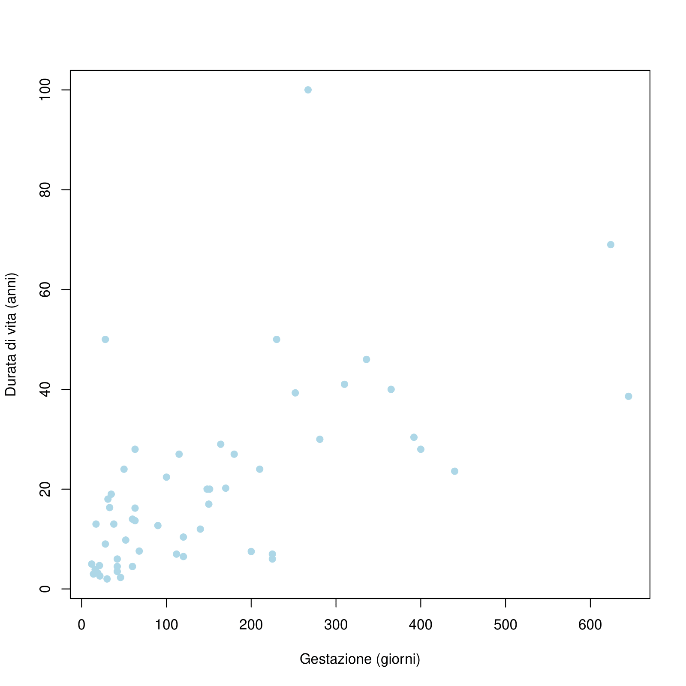</center>

a.   Che tipo di associazione c'è tra durata della vita e durata della gestazione?

b.   Che tipo di associazione ci si potrebbe aspettare se gli assi del plot fossero invertiti?

c.   La durata di vita e la durata di gestazione sono indipendenti? Motivare la risposta.

#### Soluzione {- .sol}

a.   C'è un'associazione positiva: i mammiferi con periodi di gestazione più lunghi tendono a vivere più a lungo.

b.   L'associazione continuerebbe ad essere positiva.

c.   No, non sono indipendenti, come argomentato al punto a).


### Esercizio 1.17 {-} 
<center>*Associazioni*</center>
**(dal libro di testo *OpenIntro Statistics* di Diez et al., es. 1.25)**

Indicare quale dei seguenti grafici mostra

a.   associazione positiva

b.   associazione negativa

c.   assenza di associazione

<center>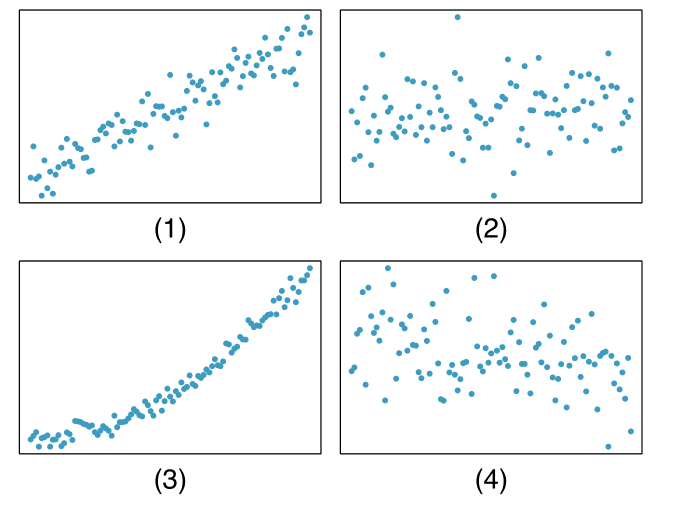</center>

Determinare inoltre se le associazioni positive e negative sono lineari o non lineari.

#### Soluzione {- .sol}

a.   Il grafico (1) mostra associazione positiva lineare mentre il grafico (3) positiva non lineare.

b.   Il grafico (4) mostra una possibile lieve associazione negativa (non lineare) dovuta principalmente ai punti presenti nella parte destra del plot.

c.   Il grafico (2) indica assenza di associazione.

### Esercizio 1.18 {-}
<center>*Abitudine al fumo tra i cittadini UK, parte I*</center>
**(dal libro di testo *OpenIntro Statistics* di Diez et al., es. 1.29)**

È stata condotta un'indagine per studiare l'abitudine al fumo dei residenti UK. Di seguito sono riportati gli istogrammi relativi alle distribuzioni di numero di sigarette fumate durante i giorni della settimana (*amount weekdays*) e durante il fine settimana (*amount weekends*), escludendo i non fumatori. Descrivere le due distribuzioni e confrontarle.

<center>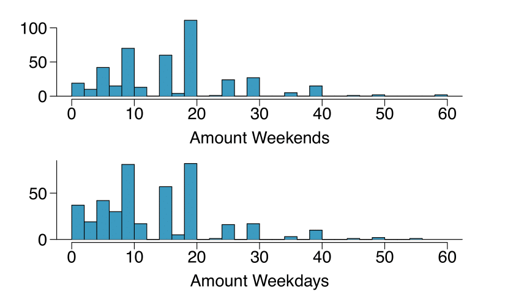</center>

#### Soluzione {- .sol} 
Entrambe le distribuzioni sono asimmetriche a destra e bimodali: una moda in corrispondenza di 10 sigarette e l'altra di 20 sigarette; ciò è dovuto al fatto che gli intervistati tendono a rispondere arrotondando a mezzo pacchetto o un pacchetto intero. La mediana di ciascuna distribuzione è tra 10 e 15 sigarette. In entrambi il range interquartile ha un'ampiezza intorno a 10-15. Ci sono delle osservazioni anomale in corrispondenza di 40 sigarette al giorno. Inoltre, sembra che coloro che fumano solo poche sigarette (da 0 a 5) fumano di più durante la settimana che durante il fine settimana.

### Esercizio 1.19 {-}
<center>*Istogrammi e boxplot*</center>

**(dal libro di testo *OpenIntro Statistics* di Diez et al., es. 1.37)**

Descrivere le tre distribuzioni degli istogrammi riportati di seguito e associare ciascun istogramma al boxplot corrispondente.

<center>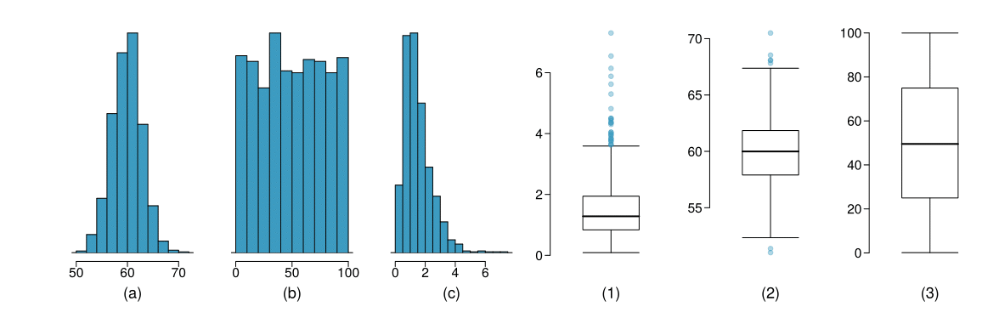</center>


#### Soluzione {- .sol}

a.   Distribuzione unimodale, simmetrica, centrata intorno al valore 60 con una standard deviation approssimativamente pari a 3. Il boxplot corrispondente è il numero 2.

b.   Distribuzione simmetrica e approssimativamente uniforme tra 0 e 100. Il boxplot corrispondente è il numero 3.

c.   Distribuzione asimmetrica a destra, unimodale, centrata attorno al valore 1.5 con la maggior parte delle osservazioni tra 0 e 3 e una frazione molto piccola di osservazioni al di sopra di 5.


### Esercizio 1.20 {-}
<center>*Istogrammi e boxplot*</center>
**(dal libro di testo *OpenIntro Statistics* di Diez et al., es. 1.39)**

Confrontare i due grafici riportati sotto. Quali caratteristiche della distribuzione si possono rilevare dall'istogramma e non dal boxplot? Quali caratteristiche sono evidenti nel boxplot e non nell'istogramma?

<center>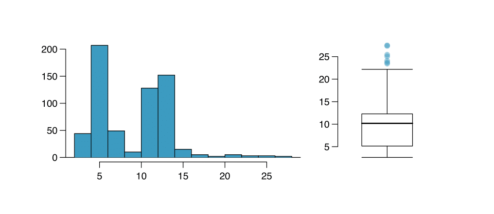</center>


#### Soluzione {- .sol} 
L'istogramma mostra che la distribuzione è bimodale, ciò non si può rilevare dal boxplot. Il boxplot invece permette di identificare in modo più preciso le osservazioni anomale.


### Esercizio 1.21 {-}
<center>*Tempi di pendolarismo, parte I.*</center>
**(dal libro di testo *OpenIntro Statistics* di Diez et al., es. 1.43)**

L'istrogramma riportato sotto è relativo alla distribuzione dei tempi medi di pendolarismo (*mean work travel*) in 3,143 contee US nel 2010. Descrivere la distribuzione e discutere se una trasformazione logaritmica può essere indicata per questi dati.

<center>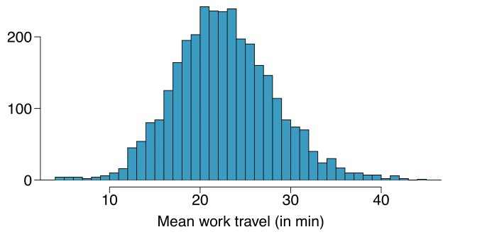</center>

#### Soluzione {- .sol} 
La distribuzione è unimodale e simmetrica con media pari a circa 25 minuti e deviazione standard pari a circa 5 minuti. Non sembra esserci nessuna contea con tempi particolarmente alti o bassi. Poichè la distribuzione è già unimodale e simmetrica, una trasformazione logaritmica non è necessaria.

## Moda, media, mediana e quantili

### Esercizio 1.22 {-}

I dati seguenti riguardano il tempo impiegato per prepararsi al mattino:

  ---- ---- ---- ---- ---- ---- ---- ---- ---- ----
   52   44   43   44   40   29   31   39   35   39
  ---- ---- ---- ---- ---- ---- ---- ---- ---- ----

a.   Di che tipo di carattere si tratta?

b.   Calcolare la moda di questa distribuzione;

c.   Calcolare la media di questa distribuzione;

d.   Calcolare la mediana;

e.   Calcolare il primo e il terzo quartile di questa distribuzione.


#### Soluzione {- .sol}

a.   Il tempo impiegato per prepararsi è un carattere quantitativo continuo.

b.   Costruendo la tabella di frequenza corrispondente alla distribuzione unitaria dei tempi, ci accorgiamo che le modalità 39 e 44 si presentano entrambe due volte (le altre tutte una volta), quindi la distribuzione ha due mode: 39 e 44.

c.   Calcoliamo la media aritmetica: $$\bar{x} = \frac{52 +44 +43 +44 +40 +29 +31 +39 +35 +39}{10} = 39.6$$

d.   Per calcolare la mediana, innanzi tutto ordiniamo le 10 osservazioni disponibili:

    29 31 35 39 39 40 43 44 44 52

  Poi, dal momento che $n = 10$ è pari, consideriamo le osservazioni che occupano le posizioni $n/2$ e $n/2+1$, cioè rispettivamente 39 e 40 e ne calcoliamo la semisomma. La mediana è quindi 39.5.

e.   Per calcolare il primo quartile, consideriamo la prima metà della distribuzione (costituita dalle prime 5 osservazioni) e ne calcoliamo la mediana:

    Q1 = 35

  Dopodichè ripetiamo lo stesso procedimento sulla seconda metà della distribuzione e otteniamo

    Q3 = 44
    
### Esercizio 1.23 {-}

Di seguito viene riportata la distribuzione dei rendimenti del 2003 di 9 fondi comuni specializzati in aziende di piccole dimensioni:

  ------ ------ ------ ------ ------ ------ ------ ------ ------ --
   37.3   39.2   44.2   44.5   53.8   56.6   59.3   62.4   66.5  
  ------ ------ ------ ------ ------ ------ ------ ------ ------ --

a.   Di che tipo di carattere si tratta?

b.   Di che tipo di distribuzione si tratta?

c.   Calcolare la moda di questa distribuzione;

d.   Calcolare la media;

e.   Calcolare la mediana.

#### Soluzione {- .sol}

a.   Si tratta di un carattere quantitativo continuo.

b.   La distribuzione riportata è una distribuzione per unità.

c.   In questo caso la moda della distribuzione non è definita in quanto ogni unità presenta una modalità distinta dalle altre, quindi ciascuna modalità si presenta con frequenza 1.

d.   La media è pari a $$\bar{x} = \frac{37.3+ 39.2 +44.2 +44.5+ 53.8 +56.6+ 59.3+ 62.4 +66.5}{9} = 51.53$$

e.   Per calcolare la mediana innanzi tutto ordiniamo le 9 osservazioni disponibili:

                      37.3 39.2 44.2 44.5 53.8 56.6 59.3 62.4 66.5
    
  poi, dal momento che $n = 9$ è dispari, la mediana è definita come l'osservazione che occupa la posizione $(n+1)/2 = 5$, ovvero $53.8$.

### Esercizio 1.24 {-}

<center>*Quanto si paga per avere accesso ad Internet?*</center>

Di seguito sono riportate gli importi (in dollari) relativi alle bollette mensili pagate da un campione casuale di 50 utenti di provider commerciali di Internet nell'agosto del 2002:


  ---- ---- ---- ---- ---- ---- ---- ---- ---- ----
   20   40   22   22   21   21   20   10   20   20
   20   13   18   50   20   18   15   8    22   26
   22   10   20   22   22   21   15   23   30   12
   9    20   40   22   29   19   15   20   20   20
   20   15   19   21   14   22   21   35   20   22
  ---- ---- ---- ---- ---- ---- ---- ---- ---- ----

a.   Di che carattere si tratta?

b.   Costruire la distribuzione in classi di questo carattere, utilizzando le seguenti classi: $(7.96,18.5]$, $(18.5,29]$, $(29,39.5]$ e $(39.5,50]$;

c.   Determinare la classe modale.

#### Soluzione {- .sol}

a.   Si tratta di un carattere quantitativo continuo.

b.   La distribuzione di frequenza in classi è


        Bollette (dollari)   Freq. assoluta $n_i$  Ampiezza $d_i$   Densità $h_i=\frac{n_i}{d_i}$
      -------------------- ---------------------- ---------------- -------------------------------
              (7.96,18.5\]                   13      10.54            1.23
                (18.5,29\]                   32      10.50            3.05
                (29,39.5\]                    2      10.50            0.19
                (39.5,50\]                    3      10.50            0.29


c.   La classe modale è la classe alla quale è associata la massima
    densità di frequenza (notare che le ampiezze delle classi non sono
    tutte uguali), ovvero la classe (18.5,29\].

### Esercizio 1.25 {-}
<center>*Robustezza*</center>
**(dal libro di testo *OpenIntro Statistics* di Diez et al., es. 1.41)**

Il primo istogramma rappresentato di seguito mostra la distribuzione dei redditi annui di 40 clienti di un bar. Due nuovi clienti hanno rispettivamente un reddito annuo di 225000 $\$$ e 250000 $\$$. Il secondo istogramma mostra la nuova distribuzione e la tabella riporta alcune statistiche riassuntive.

a.   Quale indice rappresenta meglio il tipico reddito dei 42 clienti? La media o la mediana? Cosa rivela questa osservazione rispetto alla robustezza di queste due misure?

b.   Quale indice rappresenta meglio la variabilità nella distribuzione del reddito dei 42 clienti? La deviazione standard o il range interquartilico? Cosa rivela questa osservazione rispetto alla robustezza di queste due misure?

<center>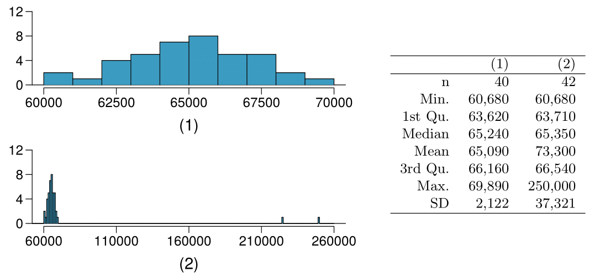</center>


#### Soluzione {- .sol}

a.   La mediana è l'indice più robusto; la media è fortemente influenzata dalle due osservazioni estreme.

b.   Il range interquartilico è l'indice più robusto; la deviazione standard, come la media, è fortemente influenzata dalle due osservazioni estreme.

### Esercizio 1.26 {-}

<center>*Mediana e range interquartile*</center>

**(dal libro di testo *OpenIntro Statistics* di Diez et al., es. 1.33)**

Per ciascuna parte, confrontare le distribuzioni (1) e (2) basandosi su
mediane e range interquartile. Non è necessario calcolare queste
statistiche, ma semplicemente confrontarle, spiegare il proprio
ragionamento.

a.  \ (1) 3, 5, 6, 7, 9\
    \ (2) 3, 5, 6, 7, 20

b.  \ (1) 3, 5, 6, 7, 9\
    \ (2) 3, 5, 8, 7, 9

c.  \ (1) 1, 2, 3, 4, 5\
    \ (2) 6, 7, 8, 9, 10

d.  \ (1) 0, 10, 50, 60, 100\
    \ (2) 0, 100, 500, 600, 1000


#### Soluzione {- .sol}

a.   Entrambe le distribuzioni hanno la stessa mediana e stesso range interquartile

b.   La seconda distribuzione ha una mediana più alta e un range interquartile più alto

c.   La seconda distribuzione ha una mediana più alta e stesso range interquartile.

d.   La seconda distribuzione ha una mediana più alta e un range interquartile più ampio.

## Gli indici di variabilità

### Esercizio 1.27 {-}

Riprendendo l'Esercizio 1.23, consideriamo i rendimenti del 2003 per i fondi comuni ad alto rischio specializzati in aziende di piccole dimensioni.

a.   Definire i **5 numeri di sintesi** della distribuzione;

b.   Disegnare il boxplot della distribuzione;

c.   Calcolare la varianza e la deviazione standard della distribuzione;

d.   Calcolare il coefficiente di variazione.


#### Soluzione {- .sol}

a.   I cinque numeri di sintesi sono:

    Minimo: 37.3, 
    Primo Quartile: 41.7, 
    Mediana: 53.8, 
    Terzo Quartile:60.85, 
    Massimo: 66.5.

b.   Ecco il boxplot corrispondente:

<center>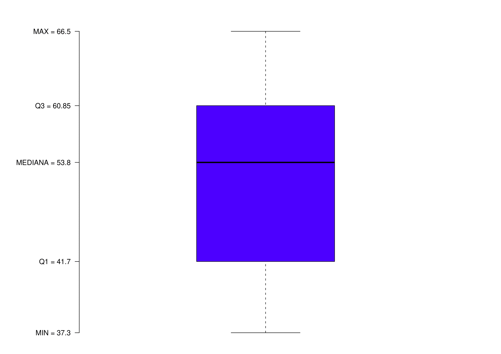</center>

c.   Ricordando che la media è pari a $\bar{x} = 51.53$, calcoliamo la
    varianza, ovvero: $$\begin{aligned}
    s^2 &=& \frac{\sum\limits_{i=1}^n (x_i -\bar{x})^2}{n-1} =  111.395\end{aligned}$$
    La deviazione standard è quindi
    $$s = \sqrt{s^2} = \sqrt{111.395} = 10.554$$

d.   Il coefficiente di variazione è
    $$CV = \frac{s}{\bar{x}} \cdot 100 = 0.205 \cdot 100 = 20.5 \%$$

### Esercizio 1.28 {-}

Il direttore operativo di un'azienda di consegna di pacchi sta pensando all'acquisto di un nuovo parco di autocarri. Quando i pacchi sono depositati negli autocarri in attesa della consegna, si deve tenere conto di 2 vincoli principali: il peso (in chilogrammi) e il volume (in metri cubi) di ciascun pacco. Si considera un campione di 200 pacchi per cui si osserva un peso medio di 9 Kg, con uno scarto quadratico medio di 1.5 Kg, e un volume medio di 2.7 metri cubi, con uno scarto quadratico medio di 0.6 metri cubi. Come è possibile confrontare la variabilità del peso e del volume?

#### Soluzione {- .sol}

Peso e volume sono espressi in unità di misura diverse: si deve quindi prendere in considerazione la variabilità relativa delle osservazioni. Per il peso, il coefficiente di variazione è $$CV_{P}= \frac{s}{\bar{x}} \cdot 100 = \frac{1.5}{9} \cdot 100=16.67\%$$ per il volume è pari a $$CV_{V}=\frac{s}{\bar{x}} \cdot 100 = \frac{0.6}{2.7}\cdot100=22.22\%$$ Pertanto rispetto alla media, il volume dei pacchi più variabile del peso.

### Esercizio 1.29 {-}

Consideriamo la distribuzione in classi ricavata all'Esercizio 1.24

      Classi      $n_{i}$
  -------------- ---------
   (7.96,18.5\]     13
    (18.5,29\]      32
    (29,39.5\]       2
    (39.5,50\]       3


Calcolare varianza e deviazione standard di questo carattere.

#### Soluzione {- .sol}

Per calcolare la varianza abbiamo bisogno delle quantità riportate nella seguente tabella ($\tilde{x}_i$ indica il valore centrale della classe i-esima):


      Classi       $n_{i}$   $\tilde{x}_i$   $f_{i}$   $\tilde{x}_i^2$   $\tilde{x}_i^2 f_{i}$
  --------------- --------- --------------- --------- ----------------- -----------------------
   $(7.96,18.5]$     13          13.23        0.26        175.0329               45.51
    $(18.5,29]$      32          23.75        0.64        564.0625                361
    $(29,39.5]$       2          34.25        0.04        1173.0625              46.92
    $(39.5,50]$       3          44.75        0.06        2002.5625             120.15
      Totale         50                         1                               573.58

La media è pari a $$\bar{x} = (13.23 \cdot 0.26)+(23.75 \cdot 0.64)+(34.25 \cdot 0.04)+(44.75 \cdot 0.06)=22.69$$ e quindi la varianza è $$s^2=\frac{n}{n-1}\left(\sum_{i}\tilde{x}_{i}^{2}f_{i}-\bar{x}^{2}\right) = \frac{50}{49}\left(573.58 - (22.69)^2\right) = 59.94$$ e la deviazione standard $$s = \sqrt{s^2} = \sqrt{59.94} = 7.74$$


### Esercizio 1.30 {-}

Riprendendo dall'Esercizio 1.13 i dati sui tempi di funzionamento di un campione di
batterie,

a.   Calcolare il valore di opportuni indici di posizione e di variabilità.

b.   Come variano gli indici di posizione e di variabilità se il tempo di funzionamento è espresso in settimane (assumendo, per approssimazione, che ciascun mese sia composto esattamente da quattro settimane)?

c.   Se si utilizza il coefficiente di variazione per misurare la variabilità, vi è differenza se si utilizza un'unità di misura diversa (mesi o settimane)? Motivare la risposta.


#### Soluzione {- .sol}

a.   Calcoliamo innanzi tutto le quantità riportate in tabella:

    
       Durata (mesi)   Frequenza   $\tilde{x}_i$   $f_i$   $\tilde{x}_i^2$   $\tilde{x}_i^2 f_{i}$
      --------------- ----------- --------------- ------- ----------------- -----------------------
          (1,3\]          10             2         0.10           4                   0.4
          (3,6\]          42            4.5        0.43         20.25                8.71
          (6,12\]         38             9         0.39          81                  31.59
         (12,24\]          8            18         0.08          324                 25.92
          Totale          98                         1                               66.62
    
    

  La media è $$\bar{x} = (2 \cdot 0.1)+(4.5 \cdot 0.43)+(9 \cdot 0.39)+(18 \cdot 0.08)=7.085$$ e la varianza $$s^2=\frac{n}{n-1}\left(\sum_{i}\tilde{x}_{i}^{2}f_{i}-\bar{x}^{2}\right) = \frac{98}{97}\left(66.62 - (7.085)^2\right) = 16.59$$ e la deviazione standard $$s = \sqrt{s^2} = \sqrt{16.59} = 4.07$$

b.   Esprimere il tempo in settimane anzichè in mesi significa cambiare unità di misura.
    Per le proprietà della media (linearità) sappiamo che per calcolare la durata media in settimane è sufficiente moltiplicare la durata media in mesi per l'opportuno coefficiente (4), ovvero: $$\bar{x}_{settimane} = \bar{x}_{mesi}  \cdot  4 = 7.085 \cdot 4 = 28.34$$ Per quanto riguarda la varianza abbiamo invece: $$s^2_{settimane} = s^2_{mesi}  \cdot  4^2 = 16.59 \cdot 16 = 265.44$$

c.   In entrambi i casi il coefficiente di variazione è pari a $$CV = s / \bar{x}  \cdot  100= 4.07 /7.085  \cdot 100= 0.57 \cdot 100 = 57 \%$$ perchè non dipende dall'unità di misura.

### Esercizio 1.31 {-}

<center>*Abitudine al fumo tra i cittadini UK, parte II*</center>
**(dal libro di testo *OpenIntro Statistics* di Diez et al., es. 1.31)**

Si consideri un campione casuale di 5 fumatori per i quali sono state rilevate le variabili riportate nella seguente tabella:

   Sesso   Età   Stato civile    Reddito lordo   quantità (weekend)   quantità (giorni feriali)  
  ------- ----- --------------- --------------- -------------------- --------------------------- 
     F     51     Coniugato/a     2.600-5.200            20                      20              
     M     24    Celibe/Nubile   10.400-15.600           20                      15              
     F     33     Coniugato/a    10.400-15.600           20                      10              
     F     17    Celibe/Nubile    2.600-5.200            20                      15              
     F     76      Vedovo/a       2.600-5.200            20                      20              

a.   Determinare la quantità media di sigarette fumate nei giorni feriali e nei weekend dai 5 fumatori.

b.   Determinare la deviazione standard della quantità di sigarette fumate nei giorni feriali e nei weekend dai 5 fumatori. La variabilità è maggiore nei weekend o nei giorni feriali?

#### Soluzione {- .sol}

a.   $\bar{x}_{weekend}= 20$; $\bar{x}_{feriali}= \frac{80}{5}=16$.

b.   $s_{weekend}= 0$; $s_{feriali}= 4.18$. La variabilità è dunque maggiore nei giorni feriali.

## Proprietà delle medie

### Esercizio 1.32 {-}

A 10 studenti universitari viene chiesto il numero di esami superati in un anno. La distribuzione unitaria è la seguente:

    4 0 7 1 5 5 0 2 0 12

a.   Calcolare il numero medio di esami;

b.   Se alle informazioni fornite dai 10 studenti si aggiungono quelle di altri 20 studenti, la media aritmetica risulta pari a 5. Determinare la media del numero di esami superati dal secondo gruppo di 20 studenti.


#### Soluzione {- .sol}

a.   Calcoliamo la media aritmetica del numero di esami: $$\bar{x}_A = \frac{4 +0 +7 +1+ 5+ 5+ 0+ 2+ 0+ 12 }{10} =3.6$$

b.   Se indichiamo con $\bar{x}_{TOT} = 5$ il numero medio di esami del campione complessivo, con $\bar{x}_A$ il numero medio di esami nel primo gruppo di numerosità $n_A=10$ e con $\bar{x}_B$ il numero medio di esami nel secondo gruppo di numerosità $n_B=20$, otteniamo: $$\bar{x}_{TOT} = \frac{n_A \cdot \bar{x}_A + n_B \cdot \bar{x}_B }{n_A+ n_B} = \frac{10\cdot3.6+20\cdot\bar{x}_B}{10+20} = 5$$ In questo caso però conosciamo la media complessiva e dalla formula precedente possiamo ricavare quella del secondo gruppo in questo modo: $$\bar{x}_B = \frac{5\cdot30-10\cdot3.6}{20} = 5.7$$

### Esercizio 1.33 {-}

Un uomo d'affari nell'ultimo mese è andato in viaggio a Londra per 10 volte. Il costo medio del biglietto aereo è 120, con una varianza pari a 7. Se l'uomo avesse prenotato tutti i voli da Londra, sapendo che il cambio è 1 euro = 0.87 sterline e che c'è un costo fisso della commissione pari a una sterlina per ciascun cambio, quanto avrebbe speso? Calcolare il costo medio in sterline e la varianza.

#### Soluzione {- .sol}

Per la proprietà di linearità della media otteniamo che: $$\bar{x}_{STERLINE} = \bar{x}_{EURO} \cdot 0.87 + 1 = 105.4$$

Per quanto riguarda la varianza, sappiamo invece che: $$s^2_{STERLINE} = 0.87^2 s^2_{EURO} = 5.298$$

### Esercizio 1.34 {-}

<center>*Esame di recupero*</center>
**(dal libro di testo *OpenIntro Statistics* di Diez et al., es. 1.27)**

In una classe di 25 studenti, 24 hanno svolto un esame in classe e un solo studente è stato sottoposto a una prova di recupero il giorno successivo. Il professore ha valutato il primo blocco di esami, per i quali il punteggio medio è risultato di 74 punti con una deviazione standard di 8.9 punti. La prova di recupero dello studente del giorno dopo ha riportato un punteggio di 64 punti.

a.   Il punteggio del nuovo studente fa aumentare o diminuire il punteggio medio?

b.   Quale è la nuova media?

c.   Il punteggio del nuovo studente fa aumentare o diminuire la deviazione standard?


#### Soluzione {- .sol}

a.   Il punteggio del nuovo studente fa diminuire il punteggio medio.

b.   La media complessiva si ottiene come media ponderata della media dei 24 studenti e del nuovo punteggio con pesi pari a 24 e 1 rispettivamente: $(24*74+1*64)/(24+1) = 73.6$.

c.   Il punteggio del nuovo studente fa aumentare la deviazione standard, perchè dista dalla media precendente più di una deviazione standard.

## I numeri indice

### Esercizio 1.35 {-}

Nella tabella sono riportate le quantità di acciaio di prima fabbricazione prodotte in Italia negli anni del periodo 1976-1981:


::: {.center}
   Anni   Acciaio di prima fabbricazione
  ------ --------------------------------
   1976               23447
   1977               23334
   1978               24283
   1979               24250
   1980               26501
   1981               24777
:::

a.   Calcolare il numero indice semplice con base 1976 per la produzione di acciaio nell'anno 1977 (ossia $_{1976}I_{1977}$) e intepretare tale indice.

b.   Calcolare il numero indice semplice con base 1976 per la produzione di acciaio nell'anno 1980 (ossia $_{1976}I_{1980}$) e intepretare tale indice.

#### Soluzione {- .sol}

a. $_{1976}I_{1977}=\frac{23334}{23447} 100=0.994 100=99.4 \%$\ La produzione di acciaio nel 1977 ha subito un lievissimo decremento rispetto a quella dell'anno precedente: il decremento assoluto rispetto
all'anno precedente è pari a 100-99.4=0.6%.\

b. $_{1976}I_{1980}=\frac{26501}{23447} 100=1.129 100=112.9 \%$\ La produzione di acciaio nel 1980 ha subito un incremento rispetto alla produzione di acciaio nel 1976; l'incremento è del 12.9%.

### Esercizio 1.36 {-}

L'Indice dei prezzi alla produzione dei prodotti industriali (base 2005 - Istat) a luglio e ad agosto 2009 è stato pari, rispettivamente, a 107.3 e 107.9. Qual è stato l'incremento percentuale che il fenomeno ha subito tra i due mesi?

#### Soluzione {- .sol}

La variazione percentuale è stata pari a: $$\frac{107.9-107.3}{107.3}100=+0.6$$ cioè, rispetto al valore di luglio, ad agosto c'è stato un incremento dello $0.6\%$.

### Esercizio 1.37 {-}

Nel 2008 La variazione percentuale, calcolata rispetto all'anno precedente, del Prodotto Interno Lordo italiano è stata pari a $-1.04\%$. Sapendo che nel 2008 il PIL valeva 1276439 milioni di euro, qual era il valore del PIL nel 2007?

#### Soluzione {- .sol}

Indichiamo con $x$ il valore del PIL nel 2007. Sappiamo che $$\frac{1276439-x}{x}100=-1.04$$ da cui $$x=\frac{1276439}{-1.04/100+1}=1289853 \,\,\, \mbox{milioni di euro}.$$

### Esercizio 1.38 {-}

Nella tabella seguente sono riportati i tassi d'inflazione (cioè le variazioni percentuali rispetto allo stesso mese dell'anno precedente) registrati ad agosto 2009 in alcune città.

::: {.center}
        città        variazione $\%$
  ----------------- -----------------
       Torino              0.0
       Milano             -0.6
       Trieste            +1.8
        Roma              +0.2
   Reggio Calabria        +1.3
       Bologna            -0.5
       Firenze            -0.5
:::

Quali informazioni possiamo trarre dal confronto tra i dati? Quale è stata la città col più elevato livello dei prezzi?


#### Soluzione {- .sol}

Rispetto ad agosto 2008, tra le città considerate, Trieste è quella in cui i prezzi hanno subito una maggiore accelerazione, Milano quella in cui i prezzi sono diminuiti con più elevata velocità, mentre a Torino non è stata riscontrata alcuna variazione.

Non siamo in grado di rispondere alla seconda domanda, poichè i dati disponibili danno informazioni solo sul cambiamento che il fenomeno prezzi ha subito tra i due mesi, non sul livello.


## Esercitazione 1.1 {-}

<center><h2>**Rapporti statistici**</h2></center>

### Esercizio 1.1.1 {-}

La seguente tabella riporta i dati relativi alla raccolta (in migliaia di tonnellate) di rifiuti urbani per area geografica nell'anno 2010 (fonte Istat):

```{r, echo=FALSE}
tab1 = data.frame("area" = c('Nord', 'Centro', 'Sud', 'Italia'),
                  "indiff" = c(7167, 5258, 8133, 20558),
                  "diff" = c(7271, 1985, 2194, 11450),
                  "ingom" = c(370, 81, 21, 472),
                  "Totale" = c(14808, 7324, 10348, 32480),
                  "Abitanti" = c(27663, 11321, 20896, 59880))
colnames(tab1) = c("Area Geografica", "Raccolta Indifferenziata", 
                   "Raccolta Differenziata", "Rifiuti Ingombranti", "Totale",
                   "Abitanti (migliaia)")
tab1%>%
  format_cells(rows=4, col=1, 'italics')%>%
  kbl(align = 'c')%>%
  kable_classic(full_width = F, html_font = "Computer Modern")%>%
  row_spec(0, extra_css = "border-top: thin solid; border-bottom: thin solid")%>%
  column_spec(1, bold = T)%>%
  row_spec(4, extra_css = "border-bottom: thin solid")
```

<ol type="a">
  <li> Si determini la composizione percentuale delle varie tipologie di rifiuto per ciascuna delle aree considerate.</li>
  <li> Quali tra gli abitanti delle tre aree geografiche considerate tendono a produrre il maggior quantitativo di rifiuti? Si specifichi la tipologia di rapporto statistico utile a rispondere a questa domanda.</li>
  <li>Si riconosca la natura del rapporto statistico: $$\frac{\mathrm{rifiuti \ indifferenziati \ al \ nord}}{\mathrm{rifiuti \ indifferenziati \ al \ sud}}$$ e se ne interpreti il significato. </li>
</ol>

### Esercizio 1.1.2 {-}

Nella seguente tabella sono riportati:

* il numero di sportelli bancari presenti in alcune provincie lombarde e in Italia negli anni dal 2003 al 2007 (fonte Banca d'Italia);
* la superficie delle provincie lombarde considerate, espressa in $km^2$ (fonte Istat);
* la popolazione residente nel 2003 in ciascuna provincia lombarda considerata (fonte Istat).

```{r echo=F}
tab2 = data.frame("Provincia" = c("Provincia", "Lodi (LO)", "Milano (MI)", "Pavia (PV)", 
                                  "Sondrio (SO)", "Altre provincie", 
                                  "Lombardia", "ITALIA"),
                  "2003" = c(2003, 132, 2313, 310, 120, 2966, 5841, 30502),
                  "2004" = c(2004, 133, 2342, 314, 121, 3030, 5940, 30946),
                  "2005" = c(2005, 137, 2378, 319, 124, 3110, 6068, 31498),
                  "2006" = c(2006, 142, 2458, 322, 127, 3196, 6245, 33333),
                  "2007" = c(2007, 150, 2530, 331, 128, 3314, 6453, 32225),
                  "Superficie" = c("Superficie", 782.25, 1984.39, 3964.73, 3211.30,
                                   14919.58, 24862.85, ""),
                  "Popolazione" = c("Popolazione",200554, 3721428, 497233, 
                                    177568, 4510862,
                                    9108645, ""))
tab2%>%
  format_cells(rows=8, col=1, "italics")%>%
  kbl(align = 'c', col.names = NULL)%>%
  kable_classic(html_font = 'Computer Modern')%>%
  add_header_above(c(' '=1,'$n°$ sportelli'=5,' '=2), extra_css = 'border-top: ')%>%
  column_spec(1, bold = T, border_left = T, border_right = T)%>%
  column_spec(8, border_right = T)%>%
  column_spec(6, border_right = T)%>%
  row_spec(c(0,1), bold = T)%>%
  row_spec(c(0,1), bold = T, extra_css = 'border-top: thin solid;border-bottom: thin solid')%>%
  row_spec(c(6,7,8), extra_css = 'border-bottom: thin solid')
```


<ol type="a">
  <li> 	Si riconosca la natura del rapporto statistico: $$\frac{n°\mathrm{ \ di \  sportelli \ in \ provincia \ di \ Lodi \ nel \ 2005}}{n° \mathrm{ \ di \ sportelli \ in \ Lombardia \ nel \ 2005}}$$ e se interpreti il significato.</li>
  <li> 	Si riconosca la natura del rapporto statistico: $$\frac{n° \mathrm{\ di\ sportelli\ in\ provincia\ di\ Milano\ nel\ 2007}}{n° \mathrm{\ di\ sportelli\ in\ provincia\ di\ Sondrio\ nel\ 2007}}$$ e se interpreti il significato.</li>
  <li> Relativamente all'anno 2007, utilizzando un opportuno rapporto statistico, si valuti la densità degli sportelli bancari sul territorio delle provincie di Milano e di Sondrio. </li>
  <li> Si ricavi il numero di sportelli bancari per mille abitanti relativamente alle provincie di Milano e di Sondrio nell'anno 2003, riconoscendo la natura del rapporto statistico utilizzato.</li>
</ol>

### Soluzioni esercitazione 1.1 {-.sol}

#### Esercizio 1.1.1 {-}

<ol type="a">
  <li> 	Rapporti di composizione (intravedere distribuzioni parziali): 
```{r echo=FALSE}
tab1.rel=tab1
tab1.rel[,2:4]=tab1.rel[,2:4]/tab1.rel[,5]
tab1.rel[,1:4]%>%
  format_cells(rows=4, col=1, 'italics')%>%
  kbl(align = 'c')%>%
  kable_classic(full_width = F, html_font = "Computer Modern", position = 'left')%>%
  row_spec(0, extra_css = "border-top: thin solid; border-bottom: thin solid")%>%
  column_spec(1, bold = T)%>%
  row_spec(4, extra_css = "border-bottom: thin solid")
``` 
  </li>
  <li> Per confrontare la produzione di rifiuti è opportuno eliminare l’influenza del numero di abitanti; quindi, si utilizza un rapporto di derivazione (gli abitanti producono rifiuti) in particolare di seguito si calcolano i rifiuti prodotti ogni mille abitanti. Gli abitanti dell’Italia centrale tendono a produrre più rifiuti.
```{r echo=FALSE}
tab1.deriv = tab1
tab1.deriv$deriv = tab1[,5]/tab1[,6]
colnames(tab1.deriv)[7] = "Rapporto di derivazione"
tab1.deriv[1:4,5:7]%>%
  kbl(align = 'c')%>%
  kable_classic(full_width = F, html_font = "Computer Modern", 
                position = 'left')%>%
  row_spec(0, extra_css = "border-top: thin solid; border-bottom: thin solid")%>%
  row_spec(4, extra_css = "border-bottom: thin solid")

```

  </li>
  <li>  È un rapporto di coesistenza perché si confrontano valori associati a due modalità di uno stesso carattere, in questo caso l’area geografica. Il rapporto è pari a $0.8812$ e indica che per ogni tonnellata (o migliaia di tonnellate) di rifiuti indifferenziati prodotta al sud vengono prodotte $0.8812$ tonnellate di rifiuti indifferenziati al nord.</li>
</ol>

#### Esercizio 1.1.2 {-}

<ol type="a">
  <li> 	Lodi è in Lombardia, quindi gli sportelli di Lodi sono parte degli sportelli della Lombardia, rapporto di composizione. $$\frac{137}{6068}=0.0226$$ Gli sportelli della provincia di Lodi nel 2005 costituivano il $2.26\%$ degli sportelli di tutta la Lombardia.</li>
  <li>	Milano e Sondrio sono due province distinte, rapporto di coesistenza. Nel 2007, per ogni sportello nella provincia di Sondrio ce ne erano $\frac{2530}{128}=10.7656$ nella provincia di Milano.

</li>
  <li>Rapporti di densità. <br> 
  Nel 2007, nella provincia di Milano c’erano $\frac{2530}{1984.39}=1.2375$ sportelli per chilometro quadrato.<br>
  	Nel 2007, nella provincia di Sondrio c’erano $\frac{128}{3211.90}=0.0399$ sportelli per chilometro quadrato.
</li>
  <li> Rapporti di derivazione ipotizzando che la numerosità della popolazione sia causa del numero di sportelli bancari.<br>
  Nel 2003, nella provincia di Milano c’erano $\frac{2313}{3721428}\cdot 1000=0.6215$ sportelli ogni mille abitanti.<br>
  Nel 2003, nella provincia di Sondrio c’erano $\frac{120}{177568}\cdot 1000=0.6758$ sportelli ogni mille abitanti.
</li>
</ol>

## Esercitazione 1.2 {-}

<center>

<h2>

Frequenze e rappresentazioni grafiche

</h2   >

</center>

### Esercizio 1.2.1 {-}

Un certo materiale è stato sottoposto a un esperimento termico. Durante l'esperimento è stata rilevata 60 volte la sua temperatura $X$ (in gradi Celsius). La distribuzione di frequenze di $X$ è riportata nella seguente tabella:

```{r, echo=FALSE}
tab1 = data.frame("Classi"=c("$[5, 10]$","$(10, 13]$","$(13, 17]$",
                             "$(17, 25]$", "$(25, 40]$", "Totale"), 
                  "Frequenze"=c(8,18,8,16,10,60))
colnames(tab1)[1] = 'Classi $X$'
tab1%>%
  kbl(align = 'rc')%>%
  kable_classic(html_font = 'Computer Modern', full_width=F)%>%
  row_spec(0, bold = T)%>%
  row_spec(c(0,5,6), extra_css = 'border-top: thin solid;border-bottom: thin solid')
  
```

<ol type="a">

<li>

Indicare il tipo di carattere e la scala di misurazione.

</li>

<li>

Calcolare le frequenze cumulate e interpretare la quarta di esse.

</li>

<li>

Rappresentare la distribuzione di frequenze relative.

</li>

<li>

Calcolare la frequenza relativa della classe $[11,20)$.

</li>

<li>

Rappresentare la funzione di ripartizione di $X$.

</li>

</ol>

### Esercizio 1.2.2 {-}

La seguente tabella riporta la distribuzione degli utenti di due social network **A** e **B** secondo il numero $X$ di post in un determinato pomeriggio:

```{r echo=FALSE}
tab2 = data.frame("Valori" = c("Valori di $X$",seq(0,5,1),"Totale"),
                  "A" = c("Frequenze di A", 7,9,16,25,23,20,100),
                  "B" = c("Frequenze di B",3,4,8,10,15,40,80))
tab2%>%
  kbl(align = 'c', col.names = NULL)%>%
  kable_classic(html_font = 'Computer Modern', full_width=F)%>%
  column_spec(1, border_left = T, border_right = T)%>%
  column_spec(2, border_left = T, border_right = T)%>%
  column_spec(3, border_left = T, border_right = T)%>%
  row_spec(c(7,8),extra_css = 'border-top: thin solid;border-bottom: thin solid')%>%
  row_spec(1, bold = T, extra_css = 'border-top: thin solid;border-bottom: thin solid')
```

<ol type="a">

<li>

Indicare il tipo di carattere e la scala di misurazione.

</li>

<li>

Rappresentare le due distribuzioni di frequenze in modo tale che siano confrontabili.

</li>

<li>

In quale social network sono stati pubblicati più post tra gli utenti considerati?

</li>

<li>

Rappresentare la funzione di ripartizione di $X$ considerando come collettivo statistico entrambi i social network.

</li>

</ol>

### Esercizio 1.2.3 {-}

In uno stabilimento lavorano 224 operai, di cui 160 sono uomini e 64 sono donne. La seguente tabella riporta la distribuzione degli operai secondo il tempo $X$ (in secondi) impiegato per produrre un pezzo:

```{r echo=FALSE}
tab3 = data.frame("Classi"=c("Classi di $X$","$[10,15)$","$[15,20)$","$[20,30)$","$[30,45)$","Totale"),
                  "Uomini"=c("Frequenze (uomini)", 20,84,46,10,160),
                  "Donne"=c("Frequenze (donne)",16,30,16,2,64))
tab3[] <- lapply(tab3, as.character)
tab3%>%
  kbl(align = 'lcc', col.names = NULL)%>%
  kable_classic(html_font = 'Computer Modern', full_width=F)%>%
  column_spec(1, border_left = T, border_right = T)%>%
  column_spec(2, border_left = T, border_right = T)%>%
  column_spec(3, border_left = T, border_right = T)%>%
  row_spec(c(5,6),extra_css = 'border-top: thin solid;border-bottom: thin solid')%>%
  row_spec(1, bold = T, extra_css = 'border-top: thin solid;border-bottom: thin solid')

```

<ol type="a">

<li>

Si rappresentino le due distribuzioni di frequenze in modo che possano essere confrontate.

</li>

<li>

Si calcoli la frequenza assoluta degli uomini che impiegano tra 15 e 35 secondi per produrre un pezzo.

</li>

<li>

Si calcoli la frequenza relativa degli operai (uomini e donne) che impiegano $[20,30)$ secondi a produrre un pezzo.

</li>

<li>

Rappresentare la funzione di ripartizione di $X$ per entrambe le due sottopopolazioni.

</li>

<li>

Calcolare qual è la proporzione di uomini che impiegano più di 25 secondi a produrre un pezzo.

</li>

</ol>

### Soluzioni esercitazione 1.2 {-.sol}

#### Esercizio 1.2.1 {-}


```{r, echo=FALSE}
tab1.sol = data.frame("j"=c('$j$', 1:5,"Totale"),
  "Classi"=c('Classi $X$',"$[5, 10]$","$(10, 13]$","$(13, 17]$",
                             "$(17, 25]$", "$(25, 40]$", " "), 
                  "nj"=c('$n_j$',8,18,8,16,10,60),
  "Nj"=c('$N_j$', 8, 26, 34, 50, 60,""),
  "dj"=c('$d_j$', 5,3,4,8,15,""),
  "fj"=c('$f_j=\\frac{n_j}{N}$', 0.133,0.3,0.133,0.267,0.167,""),
  "rapp"=c('$\\frac{h_j}{N}=\\frac{f_j}{d_j}$', 0.027,0.1,0.033,0.033,0.011,""),
  "Fj"=c('$F_j$', 0.133,0.433,0.566,0.833,1,""))


tab1.sol%>%
  kbl(align = 'crcccccc',col.names = NULL)%>%
  kable_classic(html_font = 'Computer Modern', full_width=F)%>%
  row_spec(1, bold = T)%>%
  row_spec(c(1:7),extra_css = 'border-top: thin solid;border-bottom: thin solid')
```

<ol type="a">
  <li> Carattere quantitativo continuo su scala di intervalli: lo 0 della scala Celsius è convenzionale e non rappresenta l’assenza di calore, quindi il calore a 30°C non è il doppio del calore a 15°C.</li>
  <li> $N_4=50$ indica che ci sono 50 rilevazioni nelle quali si è osservata una temperatura minore o uguale a 25°Celsius.</li>
  <li> **Istogramma**, le frequenze relative sono rappresentate dall’area dei rettangoli pertanto bisogna calcolare le frequenze relative specifiche. Le ampiezze delle classi di un carattere continuo sono; $$d_j=l_j^+-l_j^-$$</li>
  <li>$$\begin{align}\frac{h_j}{N}([11,20)) & =  (13-11)\cdot\frac{h_2}{N}+\frac{h_3}{N}+(20-17)\cdot\frac{h_4}{N}=\\
  & = 2\cdot 0.1+0.133+3\cdot 0.033 = 0.2 + 0.133+0.099=0.432\end{align}$$</li>
  <li>	Funzione di ripartizione a scalini con altezze pari alla colonna $F_j$.</li>

</ol>

#### Esercizio 1.2.2 {-}

```{r echo=F}
tab2.sol = data.frame("Valori"=c("Valori di $X$", 0:5, "Totale"),
                      "fa"=c("$f_j^A$", 0.07,0.09,0.16,0.25,0.23,0.20,1),
                      "fb"=c("$f_j^B$", 0.0375,0.05,0.1,0.125,0.1875,0.5,1),
                        "n"=c("$n_j$", 10,13,24,35,38,60,180),
                       "N"=c("$N_j$",10,23,47,82,120,180," "),
                       "Fj"=c("$F_j$",0.056,0.128,0.261,0.456,0.667,1," "))

tab2.sol%>%
  kbl(align = 'c', col.names = NULL,)%>%
  kable_classic(html_font = 'Computer Modern', full_width=F)%>%
  add_header_above(c(' '=3,'$X$'=3), extra_css = 'border-top: ')%>%
  row_spec(c(0,1), bold = T)%>%
  row_spec(c(0:8), extra_css = 'border-top: thin solid;border-bottom: thin solid')
```
<ol type="a">
  <li>Carattere quantitativo discreto su scala di rapporti, 0 post indicano assenza di attività sul social network, quindi è uno zero assoluto.</li>
  <li>Le due popolazioni hanno un numero diverso di osservazioni, quindi bisogna considerare le frequenze relative (fare un cenno alle tabelle a doppia entrata e confrontare le frequenze relative, per confrontare le distribuzioni di X nei due social network). **Aste**.</li>
  <li>Nel primo social network sono stati pubblicati $0\cdot 7+1\cdot 9+2\cdot 16+3\cdot 25+4\cdot 23+5\cdot 20=308$ post, nel secondo social network sono stati pubblicati $0\cdot 3+1\cdot 4+2\cdot 8+3\cdot 10+4\cdot 15+5\cdot 40=310$ post.</li>
  <li>Funzione di ripartizione a segmenti con altezze pari alla colonna $F_j$.</li>
</ol>

#### Esercizio 1.2.3 {-}	

```{r echo=FALSE}
tab3.sol = data.frame("Classi"=c("Classi di $X$", "$[10,15)$", "$[15,20)$",
                                 "$[20,30)$", "$[30,45)$", "Totale"),
                      "fu"=c("$f_j^U$",0.125,0.525,0.287,0.063,1),
                      "fd"=c("$f_j^D$",0.250,0.469,0.250,0.031,1),
                      "dj"=c("$d_j$", 5,5,10,15,""),
                      "fracu"=c("$\\frac{h_j^D}{N^U}$",0.025,0.105,0.029,0.004,""),
                      "fracd"=c("$\\frac{h_j^D}{N^U}$",0.050,0.069,0.038,0.002,""),
                      "Fu"=c("$F_j^U$",0.125,0.650,0.937,1,""),
                      "Fd"=c("$F_j^D$",0.250,0.719,0.969,1,""))
tab3.sol%>%
  kbl(align = 'lccccccc', col.names = NULL,)%>%
  kable_classic(html_font = 'Computer Modern', full_width=F)%>%
  row_spec(1, bold = T)%>%
  row_spec(c(1:6), extra_css = 'border-top: thin solid;border-bottom: thin solid')
```
<ol type="a">
  <li> Istogramma di frequenze relative.</li>
  <li>$$f^U([15,35])=0.525+0.287+5\cdot 0.004=0.832$$ $$n^U([15,35])=0.832\cdot 160 =133.12$$</li>
  <li>$$f([20,30))=\frac{46+16}{224}=\frac{62}{224}=0.277$$</li>
  <li>Funzioni di ripartizione a segmenti rispettivamente con altezze pari alle colonne $F_j^U$ e $F_j^D$</li>
  <li>$$F^U(x)\begin{equation}\begin{cases}0, & \mathrm{per\ }x<l_1^-\\ F^U_{j-1}+\frac{h^U_j}{N^U}(x-l_j^-), & \mathrm{per\ }l_j^-\leq x<l_j^+,\,\, j=1,2,\ldots,k\\ 1, & \mathrm{per\ }x\geq l_k^+\end{cases}\end{equation}$$
  $x=25$ cade nella terza classe, quindi $j=3$: $$\begin{align}F^U(25)& =  F^U_{3-1}+\frac{h_3^U}{N^U}(25-l_3^-)=\\ 
  & = 0.650+0.029\cdot(25-20)=\\ &= 0.650+0.145=0.795 \end{align}$$ 
  Questa è la proporzione di uomini che impiega al più 25 secondi a produrre un pezzo. 
  
  Per sapere qual è la proporzione di uomini che impiegano più di 25 secondi a produrre un pezzo è necessario fare il complemento a 1: $1 – 0.795 = 0.205$
  </li>

</ol>


## Esercitazione 1.3 {-}

<center><h2>Medie analitiche e medie lasche</h2></center>

Per gli esercizi da 1 a 4 la fonte dei dati è: **Banca d’Italia – Indagine campionaria**, “*Indagine sui bilanci delle famiglie italiane*”, anno 2006.

La base di dati è costituita da 7768 famiglie, 19551 individui, dei quali 13009 percettori di reddito.


### Esercizio 1.3.1{-}

Si consideri il carattere $X=$“*titolo di studio*”. Di seguito è riportata la distribuzione di frequenze. Si individuino mediana, quartili, decili e moda.

```{r echo=FALSE}
tab1=data.frame("j"=c(1:7,"Totale"),
                "xj"=c("Nessuno", "Licenza elementare", "Licenza media inferiore",
                       "Licenza media superiore", "Laurea triennale", 
                       "Laurea magistrale", "Specializzazione post-laurea",
                       ""),
                "nj"=c(2293,4240,5671,5738,146,1421,42,19551))
colnames(tab1)=c("$j$","<center>$x_j$</center>","$n_j$")
tab1%>%
  format_cells(rows=8, col=3, 'italics')%>%
  kbl(align = 'clc', escape = F)%>%
  kable_classic(html_font = 'Computer Modern', full_width=F)%>%
  row_spec(c(0,8), bold = T)%>%
  row_spec(c(0,8), extra_css = 'border-top: thin solid;border-bottom: thin solid')%>%
  row_spec(7, extra_css = 'border-bottom: thin solid')

```

### Esercizio 1.3.2{-}

Si considerino i seguenti 10 individui e il carattere $X=$“*età in anni compiuti*”. Si individuino mediana, quartili, moda e media aritmetica.

```{r echo=FALSE}
tab2=data.frame(rbind(paste0("$x_{",1:10,"}$"),c(58,36,32,86,52,60,56,19,37,51)))
tab2%>%
  kbl(align = 'c', col.names = NULL)%>%
  kable_classic(html_font = 'Computer Modern', full_width=F)%>%
  row_spec(1, bold = T)%>%
  row_spec(c(1,2), extra_css = 'border-top: thin solid;border-bottom: thin solid')
  
```

### Esercizio 1.3.3{-}

La seguente tabella riporta la distribuzione di frequenze dell’età in anni compiuti $X$ circoscritta all’intervallo $[31,40]$. Si individuino mediana, quartili, moda e media aritmetica.

```{r echo=FALSE}
tab3=data.frame(rbind(c("$x_j$",31:40,"Totale"),
                      c("$n_j$",222,227,227,215,201,294,259,282,271,276,2474)))

tab3%>%
  kbl(align = 'c', col.names = NULL)%>%
  kable_classic(html_font = 'Computer Modern', full_width=F)%>%
  column_spec(c(1,12), bold=T, border_left = T, border_right = T)%>%
  row_spec(1, bold = T)%>%
  row_spec(c(1,2), extra_css = 'border-top: thin solid;border-bottom: thin solid')
```

### Esercizio 1.3.4{-}

Si considerino ora le 7768 famiglie. Per ognuna di esse si osserva il reddito disponibile netto $X$ espresso in migliaia di euro. I dati sono stati raggruppati in classi. Si individuino mediana, quartili, moda e media aritmetica. Si verifichi la somma dagli scarti dalla media aritmetica.

```{r echo=FALSE}
tab4 = data.frame("j"=c("$j$", 1:5, "Totale"),
                  "Classi"=c("<center>Classi</center>", "$(0,50]$", "$(50,100]$",
                             "$(100,150]$", "$(150,350]$", "$(350,850]$",""),
                  "nj"=c("$n_j$", 6696,958,80,26,8,7768))
tab4%>%
  kbl(align = 'crc', col.names = NULL, escape=F)%>%
  kable_classic(html_font = 'Computer Modern', full_width=F)%>%
  column_spec(1, border_left = T, border_right = T, bold=T)%>%
  column_spec(c(2,3), border_left = T, border_right = T)%>%
  row_spec(6,extra_css = 'border-top: thin solid;border-bottom: thin solid')%>%
  row_spec(c(1,7), bold = T, extra_css = 'border-top: thin solid;border-bottom: thin solid')

```
### Esercizio 1.3.5{-}

Nel mese di dicembre, in un comune italiano sono state rilevate le temperature di una giornata ad intervalli regolari di 3 ore. La seguente tabella riporta i valori osservati espressi in gradi Celsius:

```{r echo=FALSE}
tab5 = data.frame("$j$"=c(1:8),
                  "$x_j$"=c(8,6,6,6,11,12,10,10))
colnames(tab5) = c("$j$","$x_j$")

tab5%>%
  kbl(align = 'cc', escape = F)%>%
  kable_classic(html_font = 'Computer Modern', full_width=F)%>%
  column_spec(1, bold = T)%>%
  row_spec(0, bold = T, 
           extra_css = 'border-top: thin solid;border-bottom: thin solid')%>%
  row_spec(8, extra_css = 'border-bottom: thin solid')

```

Si calcoli la media aritmetica. Che valore assumerebbe la media aritmetica se le temperature fossero espresse in gradi Kelvin? E se fossero espresse in gradi Fahrenheit? Si discuta la natura del carattere e delle scale citate. $x_6=12°\,C$ è il doppio di $x_2=6°\,C$?
Si ricordano le relazioni esistenti tra le scale di misurazione della temperatura
$$K=C+273.15$$
$$F=\frac{9}{5} K-459.67$$

Lo zero assoluto corrisponde a $0°\,K$.

### Esercizio 1.3.6{-}

Si consideri una popolazione suddivisa in tre gruppi $A, B$ e $C$. Si calcoli la media aritmetica di ogni gruppo e la media dell’intera popolazione e si verifichi la proprietà associativa della media aritmetica.

```{r echo=FALSE}
tab6_a = data.frame("A"=c(12,34,45,12,75,"Totale 178"))
tab6_b = data.frame("B"=c(90,76,34,45,"Totale 245"))
tab6_c = data.frame("C"=c(98,34,23,64,34,83,"Totale 336"))

knitr::kables(list(
  tab6_a%>%kbl(align = 'c', col.names = "Gruppo $A$")%>%
    kable_classic(html_font = 'Computer Modern', full_width=F,
                  position='right')%>%
    row_spec(5, extra_css = 'border-bottom: thin solid')%>%
    row_spec(c(0,6), bold=T,extra_css = 'border-top: thin solid;border-bottom: thin solid'),
  tab6_b%>%kbl(align = 'c', col.names = "Gruppo $B$")%>%
    kable_classic(html_font = 'Computer Modern', full_width=F,
                  position='center')%>%
    row_spec(4, extra_css = 'border-bottom: thin solid')%>%
    row_spec(c(0,5),bold=T,extra_css = 'border-top: thin solid;border-bottom: thin solid'),
  tab6_c%>%kbl(align = 'c', col.names = "Gruppo $C$")%>%
    kable_classic(html_font = 'Computer Modern', full_width=F,
                  position='left')%>%
    row_spec(6, extra_css = 'border-bottom: thin solid')%>%
    row_spec(c(0,7),bold=T,extra_css = 'border-top: thin solid;border-bottom: thin solid')
))

```


### Esercizio 1.3.7{-}

Un automobilista, nel fare un percorso di $N=100\,Km$, viaggia a velocità diverse. Percorre $20\,Km$ a una velocità di $50\,Km/h$, $30\,Km$ a $80\,Km/h$ e altri $50\,Km$ li percorre a $60\,Km/h$. Valutare la velocità media che lascia invariato il tempo di percorrenza del tragitto.


### Soluzioni esercitazione 1.3 {-.sol}

#### Esercizio 1.3.1 {-}

$X=$ *titolo di studio*. Con $x_j$ indichiamo la $j$-esima modalità, $j=1,2,\ldots,K$. Il carattere presenta $K=7$ modalità distinte. Le modalità devono essere ordinate.

```{r echo=F}
tab1.sol=data.frame("j"=c(1:7,""),
                "xj"=c("Nessuno", "Licenza elementare", "Licenza media inferiore",
                       "Licenza media superiore", "Laurea triennale", 
                       "Laurea magistrale", "Specializzazione post-laurea",
                       ""),
                "nj"=c(2293,4240,5671,5738,146,1421,42,"$N=19551$"),
                "Cj"=c(2293,6533,12204,17942,18088,19509,19551,""))
colnames(tab1.sol)=c("$j$","<center>$x_j$</center>","$n_j$", "$C_j$")
tab1.sol%>%
  format_cells(rows=8, col=3, 'italics')%>%
  kbl(align = 'clc', escape = F)%>%
  kable_classic(html_font = 'Computer Modern', full_width=F)%>%
  row_spec(c(0,8), bold = T)%>%
  row_spec(0, extra_css = 'border-top: thin solid;border-bottom: thin solid')%>%
  row_spec(7, extra_css = 'border-bottom: thin solid')
```

Mediana: $Pos(Me)=\frac{N+1}{2}=9776$, $Me=x_{(9776)}=$ *Licenza media inferiore*.

Per trovare quartili decili e centili si segue la stessa procedura ma cambiano le posizioni delle modalità. 

Quartili: $l\cdot\frac{N+1}{4}$ per $l=1,2,3$. Decili: $l\cdot \frac{N+1}{10}$ per $l=1,2,\ldots,9$. Notare la corrispondenza tra media e secondo quartile.

Esempi: $Pos(Q_1)=4888$, $Pos(Q_3)=14664$, $Pos(D_3)=5865.6\cong 5866$. Per avere una posizione esatta arrotondare sempre per eccesso.

La moda è la modalità che presenta frequenza più elevata, in questo caso $Moda =$ *Licenza media superiore*. È opportuno discuterne la rappresentatività, a tale scopo si valuta la sua frequenza relativa $f_4=\frac{n_4}{N}=\frac{5738}{19551}=0.2935$. La moda rappresenta il $23.35\%$ della popolazione.

#### Esercizio 1.2.2 {-}

Per determinare mediana e i quartili è necessario ordinare le osservazioni

```{r echo=FALSE}
tab2=data.frame(cbind(c("$i$",1:10,"Totale"),c("$x_{(i)}$",19,32,36,37,51,52,56,58,60,86,487)))
tab2%>%
  kbl(align = 'c', col.names = NULL)%>%
  kable_classic(html_font = 'Computer Modern', full_width=F)%>%
  row_spec(1, bold = T, extra_css = 'border-top: thin solid;border-bottom: thin solid')%>%
  row_spec(c(11,12), extra_css = 'border-bottom: thin solid')
  
```
$N$ pari, quindi la mediana corrisponde al valore centrale tra le osservazioni in posizione $\frac{N}{2}$ e  $\frac{N}{2}+1$ , ovvero a $m=\frac{x_{(5)}+x_{(6)}}{2}=51.5$. Il primo quartile invece $x_{\left(   \frac{N+1}{4}\right)}=x_{(2.75)}=x_{(2)}+0.75\cdot \left(x_{(3)}-x_{(2)}\right)=32+0.75\cdot1=32.75$. Il terzo quartile: $x_{\left(3\cdot \frac{N+1}{4}\right) }=x_{(8.25)}=x_{(8)}+0.25\cdot\left(x_{(9)}-x_{(8)}\right)  =58+0.25⋅2=58.5$.
La moda corrisponde all’osservazione maggiormente frequente. Non essendoci ripetizioni la distribuzione è amodale. $$M_1= \frac{487}{10}=48.7.$$


#### Esercizio 1.3.3 {-}

```{r echo=FALSE}
tab3=data.frame(cbind(c("$j$",1:10,"Totale"),
                      c("$x_j$",31:40,""),
                      c("$n_j$",222,227,227,215,201,294,259,282,271,276,2474),
                      c("$N_j$", cumsum(c(222,227,227,215,201,294,259,282,271,276)),""),
                      c("$x_j\\cdot n_j$", 6882, 7264,7491,7310,7035,10584,9583,10716,10569,11040,88474)))

tab3%>%
  kbl(align = 'c', col.names = NULL)%>%
  kable_classic(html_font = 'Computer Modern', full_width=F)%>%
  row_spec(1, bold = T, extra_css = 'border-top: thin solid;border-bottom: thin solid')%>%
  row_spec(c(11,12), extra_css = 'border-bottom: thin solid')
```

I valori sono già ordinati ma per valutare i quantili ora si devono tenere d’occhio le frequenze cumulate.

$$m=q\left(\frac{1}{2}\right)=\begin{cases}x_h,& \text{se  } \frac{N}{2}>N_{h-1}\\ \frac{1}{2}(x_{h-1}+x_{h}),&\text{se  }\frac{N}{2}=N_{h-1}\end{cases}$$ $$\frac{N}{2}=1237>1092=N_5, \quad h=6,\quad m=x_h=x_6=36$$ $$q_1=q\left(\frac{1}{4}\right)=q(0.25)$$ $$\frac{N}{4}=618.5>449=N_2,\quad h=3,\quad q_1=x_3=33$$ $$q_3=q\left(\frac{3}{4}\right)=q(0.75)$$ $$\frac{3}{4}N=1855.5>1645=N_7,\quad h=8,\quad q_3=x_8=38$$ $$M_1=\frac{1}{N}\sum_{j=1}^k x_jn_j=\frac{88474}{2474}=35.7615$$

#### Esercizio 1.3.4 {-}

```{r echo=FALSE}
tab4 = data.frame(cbind(c("$j$", 1:5, "Totale"),
                        c("$n_j$", 6696,958,80,26,8,7768),
                        c("$x_j^c$",25,75,125,250,600,""),
                        c("$l^-_j$",0,50,100,150,350,""),
                        c("$N_j$",6696,7654,7734,7760,7768,""),
                        c("$x_j^c\\cdot n_j$",167400,71850,10000,6500,4800,260550),
                        c("$x_j^c-M_1$",-8.5415,41.4585,91.4585,216.4585,566.4585,907.4585),
                        c("$(x_j^c-M_1)\\cdot n_j$",-57193.5633,39717.2889,7316.6838,5627.9222,4531.6684,"")
))
tab4%>%
  kbl(align = 'c', col.names = NULL, escape=F)%>%
  kable_classic(html_font = 'Computer Modern', full_width=T)%>%
  row_spec(1, bold = T, extra_css = 'border-top: thin solid;border-bottom: thin solid')%>%
  row_spec(c(6,7),extra_css = 'border-bottom: thin solid')
```
$$M_1=\mu=\frac{260550}{7768}=33.5415$$ $$q\left(\frac{l}{v}\right)=l^-_h+\frac{N\cdot\frac{l}{v}-N_{h-1}}{N_h-N_{h-1}}[l_h^+-l_h^-]$$ $$m=q(0.5)$$ $$0.5\cdot N=3384>0,\quad h=1$$ $$m=q(0.5)=0+\frac{3884-0}{6696-0}(50-0)=29.0024$$ $$q_1=q(0.25)$$ $$0.25\cdot N=1942>0,\quad h=1$$ $$q_1=q(0.25)=0+\frac{1942-0}{6696-0}(50-0)=14.5012$$ $$q_3=q(0.75)$$ $$0.75\cdot N=5826>0, h=1$$ $$q_3=q(0.75)=0+\frac{5826-0}{6696-0}(50-0)=43.5039$$

La classe modale corrisponde alla prima e rappresenta il $\frac{6696}{7768}=86,2 \%$ del collettivo.

#### Esercizio 1.3.5 {-}


```{r, echo=FALSE}
tab5.sol = data.frame("$j$"=c(1:8, "Media"),
                  "$x_j$"=c(8,6,6,6,11,12,10,10,"$8.625$"))
colnames(tab5.sol) = c("$j$","$x_j$")

tab5.sol%>%
  format_cells(9,1,value="italics")%>%
  kbl(align = 'cc', escape = F)%>%
  kable_classic(html_font = 'Computer Modern', full_width=F)%>%
  column_spec(1, bold = T)%>%
  row_spec(c(0,9), bold = T, 
           extra_css = 'border-top: thin solid;border-bottom: thin solid')%>%
  row_spec(8, extra_css = 'border-bottom: thin solid')
```

In Kelvin $8.625+273.15=281.775$ e in Fahrenheit $\frac{9}{5}\cdot  281.775-459.67=47.525$.

#### Esercizio 1.3.6 {-}

```{r echo=F}
tab6.sol = data.frame("a"=c(rep("",6),"Somma", "Media"),
                      "A"=c(12,34,45,12,75,"",178, "$35.6$"),
                      "B"=c(90,76,34,45,"","",245,"$61.25$"),
                      "C"=c(98,34,23,64,34,83,336,"$56$"),
                      "Totale"=c(rep("",6),759, "$50.6$"))
tab6.sol%>%
  kbl(align = 'lcccc', col.names = c("","$A$","$B$","$C$","Totale"))%>%
  kable_classic(html_font = 'Computer Modern', full_width=F)%>%
  row_spec(c(0,8), bold = T, 
           extra_css = 'border-top: thin solid;border-bottom: thin solid')%>%
  row_spec(c(6,7), extra_css = 'border-bottom: thin solid')

```
#### Esercizio 1.3.7 {-}

$$T=\sum_{j=1}^k t_j = \sum_{j=1}^k \frac{l_j}{v_j}$$
$$ \sum_{j=1}^k \frac{l_j}{\overline{v}}= \sum_{j=1}^k \frac{l_j}{v_j}$$
$$ \frac{1}{\overline{v}}=\frac{\displaystyle \sum_{j=1}^k \frac{l_j}{v_j}}{\displaystyle \sum_{j=1}^k l_j}$$
$$\overline{v}=\frac{\displaystyle \sum_{j=1}^kl_j}{\displaystyle \sum_{j=1}^k \frac{l_j}{v_j}}$$
È una specie di media armonica ponderata delle velocità, con pesi pari alle lunghezze dei diversi tratti.

```{r echo=FALSE}
tab7.sol = data.frame("j"=c(1:3,"Totale"),
                      "vj"=c(50,80,60,""),
                      "lj"=c(20,30,50,100),
                      "tj"=c(0.4,0.375,0.833,1.608))

tab7.sol%>%
  format_cells(4,c(1,3,4), 'italics')%>%
  kbl(align = 'c', col.names = c("$j$","$v_j$","$l_j$","$t_j$"))%>%
  kable_classic(html_font = 'Computer Modern', full_width=F)%>%
  row_spec(c(0,4), bold = T, 
           extra_css = 'border-top: thin solid;border-bottom: thin solid')%>%
  row_spec(3, extra_css = 'border-bottom: thin solid')
  
```

$$\overline{v}=\frac{100}{1.608}=62.1891 \,\frac{Km}{h}$$


## Esercitazione 1.4 {-}

### Esercizio 1.4.1 {-}

La seguente tabella riporta la distribuzione di 351 imprese secondo il fatturato $X$ del 2017 (in milioni di Euro):

```{r echo=FALSE}
tab1 = data.frame("Classi"=c("$(0,0.6]$", "$(0.6,1]$",
                             "$(1,1.2]$","$(1.2,1.4]$", "Totale"), 
                  "Frequenze"=c(170,148,23,10,351))
tab1%>%
  kbl(align = 'rc', col.names = c("Classi di $X$","Frequenze"))%>%
  kable_classic(html_font = 'Computer Modern', full_width=F)%>%
  column_spec(1, bold = T)%>%
  row_spec(c(0,5), bold = T, 
           extra_css = 'border-top: thin solid;border-bottom: thin solid')%>%
  row_spec(4, extra_css = 'border-bottom: thin solid')
```

<ol type='a'>
  <li>	Si individui la classe modale del carattere $X$.</li>
  <li>Si forniscano il primo ed il terzo quartile di $X$ e di commentino i valori ottenuti.</li>
  <li>Si calcoli la differenza interquartile e si commenti il valore ottenuto.</li>
  <li>Si calcoli la media aritmetica del carattere $X$ e si commenti il valore ottenuto.</li>
  <li>Alle aziende precedentemente considerate, sono state aggiunte altre 134 aziende il cui fatturato del 2017 è mediamente pari a 420000 Euro. Si determini il fatturato medio di tutte le 485 imprese.</li>
  <li>Come varierebbe il risultato precedente se i valori fossero espressi in migliaia di Dollari statunitensi? Si consideri che un Euro vale 1.23 Dollari statunitensi (dato 2017).</li>
</ol>

### Esercizio 1.4.2{-}

Sono stati rilevati i ritardi (espressi in minuti) dei treni di una linea ferroviaria in un determinato giorno. Le diverse rilevazioni sono state classificate a seconda direzione di percorrenza dei treni. La seguente tabella riporta le distribuzioni di frequenza.

```{r echo=FALSE}
tab2 = data.frame("Ritardo"=c("$(0,5]$","$(5,10]$","$(10,20]$","$(20,30]$",
                              "Totale"),
                  "Andata"=c(14,9,7,2,32),"Ritorno"=c(10,8,7,3,28),
                  "Totale"=c(24,17,14,5,60))
tab2%>%
  kbl(align = 'rccc')%>%
  kable_classic(html_font = 'Computer Modern', full_width=F)%>%
  column_spec(c(1,4), bold = T)%>%
  row_spec(c(0,5), bold = T, 
           extra_css = 'border-top: thin solid;border-bottom: thin solid')%>%
  row_spec(4, extra_css = 'border-bottom: thin solid')
```

Con riferimento all’intero insieme dei 60 treni del giorno:
<ol type='a'>
  <li>Si calcoli lo scostamento medio assoluto dalla media aritmetica dei ritardi.</li>
</ol>

Considerando i treni in andata e in ritorno come due gruppi distinti:
<ol type='a' start='2'>
  <li>Si valuti quale gruppo presenta maggiore variabilità.</li>
</ol>


### Esercizio 1.4.3{-}

Gli incassi $X$ (in milioni di euro) di 5 punti vendita di una catena di grandi magazzini sono i seguenti: $$11.5;\,2.3;\, 5.5;\,8.9; \,9.7$$

<ol type='a'>
  <li>Si determinino il campo di variazione e la differenza interquartile di $X$.</li>
  <li>Si calcoli lo scarto quadratico medio di $X$ e si commenti il valore ottenuto.</li>
  <li>Sia $Y$ gli incassi (in milioni di euro) dopo l’applicazione di un’imposta proporzionale del $10\%$ e un’imposta fissa di 10000 euro. Si determini lo scarto quadratico medio di $Y$.</li>
  <li>Si calcoli la differenza media semplice di $X$ e si commenti il valore ottenuto.</li>
</ol>

### Esercizio 1.4.4{-}

La seguente tabella riporta la distribuzione delle retribuzioni mensili $X$ (in migliaia di euro) di 42 dipendenti di un’azienda. I dati sono raggruppati in classi e per ogni classe è riportato anche il totale di $X$.

```{r echo=F}
tab4=data.frame("Classi"=c("$(0,1]$","$(1,1.5]$","$(1.5,2]$","$(2,4]$",
                           "Totale"),
                "N.ro Dipendenti"=c(4,14,21,3,42),
                "Totale di classe"=c(3.4,19.6,34.65,8.1,65.75))
tab4%>%
  kbl(align = 'rcc', col.names = c("Classi", "N.ro Dipendenti", "Totale di classe"))%>%
  kable_classic(html_font = 'Computer Modern', full_width=F)%>%
  column_spec(1, bold = T)%>%
  row_spec(c(0,5), bold = T, 
           extra_css = 'border-top: thin solid;border-bottom: thin solid')%>%
  row_spec(4, extra_css = 'border-bottom: thin solid')
```

<ol type='a'>
  <li>Si calcoli lo scostamento medio assoluto dalla media aritmetica di $X$.</li>
  <li>Si calcoli il coefficiente di variazione di $X$ e si commenti il valore ottenuto.</li>
  <li>Si calcoli la differenza media semplice di $X$ e si commenti il valore ottenuto.</li>
</ol>

### Soluzioni esercitazione 1.4 {-.sol}

#### Esercizio 1.4.1 {-}

```{r echo=FALSE}
tab1.sol=data.frame("j"=c("$j$",1:4,"Totale"),
                    "xj"=c("$\\overline{x}_j$",0.3,0.8,1.1,1.3,""),
                    "nj"=c("$n_j$",170,148,23,10,351),
                    "dj"=c("$d_j$",0.6,0.4,0.2,0.2,""),
                    "hj"=c("$h_j$",283.33,370,115,20,""),
                    "Nj"=c("$N_j$",170,318,341,351,""),
                    "xjnj"=c("$\\overline{x}_jn_j$",51,118.4,23.5,13,207.7),
                    "Fj"=c("$F_j$",0.4843,0.9060,0.9715,1,""))
tab1.sol%>%
  kbl(align = 'c', col.names = NULL)%>%
  column_spec(1, bold = T)%>%
  kable_classic(html_font = 'Computer Modern', full_width=F)%>%
  column_spec(1, bold = T)%>%
  row_spec(c(1,6), bold = T, 
           extra_css = 'border-top: thin solid;border-bottom: thin solid')%>%
  row_spec(1:6, extra_css = 'border-top: thin solid;border-bottom: thin solid')
```

```{r}
# ES 1
rm(list = ls())
breaks <- c(0, 0.6, 1, 1.2, 1.4)
n <- c(170, 148, 23, 10)
k <- length(n)
N <- sum(n)
x <- c(breaks[-1] + breaks[-k-1])/2
d <- c(breaks[-1] - breaks[-k-1])
h <- round(n / d, 2)
Nc <- cumsum(n)
Fj <- Nc / N
```


<ol type='a'>
  <li> 	Dalle frequenze specifiche $h_j$ si osserva che la classe modale è la seconda $(0.6, 1]$ e rappresenta il $42.17\%$ delle imprese considerate. (disegnare istogramma)
  
```{r}
## a)
pos_moda <- which.max(h)
n[pos_moda] / N
barplot(h, width = d, space = 0, col = 'lightblue', border='blue',
        names.arg = c("(0,0.6]", "(0.6,1]", "(1,1.2]", "(1.2,1.4]"),
        main='Istogramma frequenze')
```
  </li>
  <li>	Primo quartile
$$\frac{N}{4}=87.75>0;\quad h=1$$
$$q_1=l_1^-+\frac{\frac{N}{4}-N_0}{N_1-N_0}\cdot [l_1^+-l_1^- ]=0+\frac{87.75-0}{170-0}\cdot [0,6-0]=0.3097$$
Un quarto delle imprese considerate ha un fatturato minore di 309700 Euro.
$$3 \cdot \frac{N}{4}=263.25>170;\quad h=2$$
$$q_3=l_2^-+\frac{3\cdot\frac{N}{4}-N_1}{N_2-N_1}\cdot [l_2^+-l_2^- ]=0.6+\frac{263.25-170}{318-170}\cdot [1-0,6]=0.8520$$
Tre quarti delle imprese considerate ha un fatturato minore di 852000 Euro. (disegnare funzione di ripartizione)

```{r}
## b)
N/4
h <- 1
q1 <- round(breaks[h] + (N/4 - 0)/(Nc[h] - 0)*(breaks[h+1] - breaks[h]), 4); q1

3*N/4
h <- min(which(Nc > 3*N/4)); h
q3 <- round(breaks[h] + (3*N/4 - Nc[h-1])/(Nc[h] - Nc[h-1])*(breaks[h+1] - breaks[h]), 4); q3

q_fun <- approxfun(c(0, Fj), breaks)
plot(q_fun)
q_fun(0.25*c(1, 3))

plot(q_fun(0.25*c(0,1,2,3,4)),0.25*c(0,1,2,3,4), xlab = "Quantili",
     ylab="Funzione di ripartizione", axes = F, col="black", pch=19,
     main="Funzione di ripartizione")
box()
axis(1, at=q_fun(0.25*c(0,1,2,3,4)), labels=c(0,round(q_fun(0.25*c(1,2,3)),2),1))
axis(2, at=0.25*c(0,1,2,3,4), labels=0.25*c(0,1,2,3,4))
for(i in 1:4){
  segments(q_fun(0.25*(i-1)),0.25*(i-1), q_fun(0.25*i), 0.25*(i-1), col = 'black')
}

```

</li>
  <li>	$$Q_3-Q_1=0.8520-0.3097=0.5423$$
Il 50% dei fatturati "centrali" sono compresi in un intervallo di ampiezza pari a 542300 Euro.
```{r}
## c)
q3 - q1
```

</li>
  <li>$$
   \overline{x}=\frac{\displaystyle\sum_{ j=1}^kx_j n_j}{N}=\frac{207.7}{351}=0.5917$$
Mediamente le imprese hanno fatturato 591738 Euro ciascuna.
```{r}
## d)
weighted.mean(x, n)
```

  </li>
  <li>	Proprietà associativa della media aritmetica.
$$M_1=\frac{M_1^{(1)}\cdot N_1+M_1^{(2)}\cdot N_2}{N_1+N_2}=\frac{0.5917\cdot351+0.42\cdot134}{485}=0.5443\quad\mathrm{milioni \ di \ Euro}$$
```{r}
(M1 <- (weighted.mean(x,n)*351+0.42*134)/485)
```

</li>
  <li>Linearità della media aritmetica. $$Y=a+bX\Rightarrow M_1(Y)=a+bM_1(X)$$ $$a=0, \quad b=1.23$$ $$M_1(Y)=1.23\cdot 0.5443=0.6695\quad \mathrm{milioni \ di \ Dollari \ statunitensi}$$
```{r}
M1 * 1.23
```
  
  </li>


</ol>

#### Esercizio 1.4.2 {-}

Tabella sulla distribuzione totale

```{r echo=FALSE}
tab2.sol = data.frame("j"=c(1:4, "Totale"),
                      "xj"=c(2.5,7.5,15,25,""),
                      "nj"=c(24,17,14,5,"N = 60"),
                      "xnj"=c(60,127.5,210,125,522.5),
                      "xj_mu"=c(6.2083,  1.2083,  6.2917, 16.2917,""),
                      "xnj_mu"=c(149, 20.5417,  88.0833,  81.4583,339.0833))
tab2.sol%>%
  kbl(align = 'c', col.names = c("$j$", "$\\overline{x}_j$", "$n_j$",
                                 "$\\overline{x}_jn_j$", "$|\\overline{x}_j-\\mu|$", "$|\\overline{x}_j-\\mu|n_j$"))%>%
  kable_classic(html_font = 'Computer Modern', full_width=T)%>%
  column_spec(1, bold = T)%>%
  row_spec(c(0,5), bold = T, 
           extra_css = 'border-top: thin solid;border-bottom: thin solid')%>%
  row_spec(4, extra_css = 'border-bottom: thin solid')
```

```{r}
# ES 2
rm(list = ls())
breaks <- c(0, 5, 10, 20, 30)
nA <- c(14, 9, 7, 2)
nR <- c(10, 8, 7, 3)
nTot <- nA+nR
N <- sum(nTot)
k <- length(nA)
N_A <- sum(nA)
N_R <- sum(nR)
x <- c(breaks[-1] + breaks[-k-1])/2
d <- c(breaks[-1] - breaks[-k-1])


```
<ol type='a'>
  <li>Calcoliamo la media aritmetica $$\mu=\frac{\displaystyle \sum_{j=1}^kx_jn_j}{N}=\frac{552.5}{60}=8.7083$$
```{r}
(mu <- sum(x*nTot)/N)
```
  Mediamente i ritardi sono pari a 9.2083 minuti.
  
  Quindi calcoliamo $S_\mu$ $$S_\mu=\frac{\displaystyle \sum_{j=1}^k|x_j-\mu|n_j}{N}=\frac{339.0833}{60}=5.6514$$
```{r}
(S_mu <- sum(abs(x-mu)*nTot)/N)
```
  Mediamente i ritardi si discostano dalla media aritmetica di 5.6514 minuti.
  </li>
  <li>Calcoliamo ora le medie e le varianze di ogni singolo gruppo.
  
  Tabella sulla distribuzione dei treni "*Andata*"
```{r echo=FALSE}
tab2.b1.sol=data.frame("j"=c(1:4, "Totale"),
                       "xj"=c(2.5,7.5,15,25,""),
                       "nj1"=c(14,9,7,2,"$N_A=32$"),
                       "xnj1"=c(35,67.5,105,50,257.5),
                       "xj2"=c(6.25,56.25,225,625,""),
                       "x2nj1"=c(87.5,506.25,1575,1250,3418.75))
tab2.b1.sol%>%
  kbl(align = 'c', col.names = c("$j$", "$\\overline{x}_j$", "$n_{jA}$",
                                 "$\\overline{x}_j n_{jA}$", "$\\overline{x}_j^2$", "$\\overline{x}^2_{j}n_{jA}$"))%>%
  kable_classic(html_font = 'Computer Modern', full_width=T)%>%
  column_spec(1, bold = T)%>%
  row_spec(c(0,5), bold = T, 
           extra_css = 'border-top: thin solid;border-bottom: thin solid')%>%
  row_spec(4, extra_css = 'border-bottom: thin solid')
```
  
  $$\overline{x}_A=\frac{\displaystyle \sum_{j=1}^k\overline{x}_jn_{jA}}{N_A}=\frac{257.5}{32}=8.046$$ $$\sigma_A^2=\frac{\displaystyle \sum_{j=1}^k \overline{x}^2_{j}n_{jA}}{N_A}-\overline{x}^2_A=\frac{3418.75}{32}-8.0469^2=42.0837$$
```{r}
(mu_A <- sum(x*nA)/sum(nA))
(sigma2_A <- sum(x^2*nA)/sum(nA)-mu_A^2)
```
  Tabella sulla distribuzione dei treni "*Ritorno*"

```{r echo=FALSE}
tab2.b2.sol=data.frame("j"=c(1:4, "Totale"),
                       "xj"=c(2.5,7.5,15,25,""),
                       "njB"=c(10,8,7,3,"$N_R=28$"),
                       "xnjB"=c(25,60,105,75,265),
                       "xj2"=c(6.25,56.25,225,625,""),
                       "x2njB"=c(62.5,450,1575,1875,3962.5))
tab2.b2.sol%>%
  kbl(align = 'c', col.names = c("$j$", "$\\overline{x}_j$", "$n_{jR}$",
                                 "$\\overline{x}_j n_{jR}$", "$\\overline{x}_j^2$", "$\\overline{x}^2_{j}n_{jR}$"))%>%
  kable_classic(html_font = 'Computer Modern', full_width=T)%>%
  column_spec(1, bold = T)%>%
  row_spec(c(0,5), bold = T, 
           extra_css = 'border-top: thin solid;border-bottom: thin solid')%>%
  row_spec(4, extra_css = 'border-bottom: thin solid')
```  

$$\overline{x}_R=\frac{\displaystyle \sum_{j=1}^k\overline{x}_jn_{jR}}{N_R}=\frac{265}{28}=9.4843$$ $$\sigma_R^2=\frac{\displaystyle \sum_{j=1}^k \overline{x}^2_{j}n_{jR}}{N_R}-\overline{x}^2_R=\frac{3962.5}{28}-9.4843^2=51.9452$$

```{r}
(mu_R <- sum(x*nR)/sum(nR))
(sigma2_R <- sum(x^2*nR)/sum(nR)-mu_R^2)
```
    
Per confrontare la variabilità dei gruppi dobbiamo usare un indice percentuale. $$\sigma_A=\sqrt{\sigma_A^2}=6.4872\,\,\mathrm{minuti}, \quad CV_A=\frac{\sigma_A}{\overline{x}_A}\cdot 100=80.62\%$$ $$\sigma_R=\sqrt{\sigma_R^2}=7.2073\,\,\mathrm{minuti}, \quad CV_R=\frac{\sigma_R}{\overline{x}_R}\cdot 100=76.15\%$$ C'è meno variabilità nel secondo gruppo.

```{r}
(CV_A = sqrt(sigma2_A)/mu_A)
(CV_R = sqrt(sigma2_R)/mu_R)
```


  </li>

</ol>


#### Esercizio 1.4.3 {-}

```{r echo=FALSE}
tab3.sol=data.frame("i"=c(1:5,"Totale"),
                    "xi"=c(2.3,5.5,8.9,9.7,11.5,37.9),
                    "Fi"=c(0.2,0.4,0.6,0.8,1,""),
                    "xi2"=c(5.29,30.25,79.21,94.09,132.25,341.09))
tab3.sol%>%
  kbl(align = 'c', col.names = c("$i$", "$x_{(i)}$", "$F_i$",
                                 "$x_{(i)}^2$"))%>%
  kable_classic(html_font = 'Computer Modern', full_width=F)%>%
  column_spec(1, bold = T)%>%
  row_spec(c(0,6), bold = T, 
           extra_css = 'border-top: thin solid;border-bottom: thin solid')%>%
  row_spec(5, extra_css = 'border-bottom: thin solid')
```

```{r}
# ES 3
rm(list = ls())
x <- c(11.5, 2.3, 5.5, 8.9, 9.7)
N <- length(x)
```

<ol type='a'>
  <li>$$\Delta_C = x_{(N)}-x_{(1)}=11.5-2.3=9.2\,\,\mathrm{milioni \ di \ euro}$$ $$ \frac{N}{4}=1.25>1;\quad h=2;\quad q_1=x_{(2)}=5.5$$ $$3\cdot \frac{N}{4}=3.75>3;\quad  h=4;\quad q_3=x_{(4)}=9.7$$ $$\Delta_q=q_3-q_1=4.2 \,\,\mathrm{milioni \ di \ euro}$$ 
```{r}
## a)
x <- sort(x)
Fi <- 1:N/N
N/4
N/4*3
x[4] - x[2]
```
  </li>
  
  
  <li>$$\overline{x}=\frac{37.9}{5}=7.58 \,\, \mathrm{milioni \ di \ euro}$$ $$M_1(X^2)=\frac{341.09}{5}=68.218$$ $$Var(X)=[(X-\overline{x})^2]=M_1(X^2)-\overline{x}^2=68.218-7.58^2=10.7616$$ $$\sigma=\sqrt{Var(X)}=3.2805\,\,\mathrm{milioni \ di \ euro}$$ Gli incassi dei punti vendita differiscono dal valore medio di 3.2805 milioni di euro.
  
```{r}
(mu = sum(x)/N)
(m_x2 = sum(x^2)/N)
(var_x = m_x2-mu^2)
(sigma = sqrt(var_x))
```
  
  </li>
  <li> $$Y=a+bX\Rightarrow \sigma(Y)=|b|\sigma(X)$$ $$a=0.01,\quad b=0.9$$ $$\sigma(Y)=0.9\cdot3.2805=2.9524\,\,\mathrm{milioni \ di\ euro}$$
```{r}
(sigmaY=0.9*sigma)
```
  </li>
  <li>$$\Delta = \frac{2}{N(N-1)}\sum_{i=2}^N\sum_{j=1}^{i-1} |x_i-x_j|$$
```{r echo=FALSE}
tab3.d.sol=data.frame("xij"=c("$|x_i-x_j|$",2.3,5.5,8.9,9.7,11.5,"Totale"),
                      "a"=c(2.3,0,3.2,6.6,7.4,9.2,""),
                      "b"=c(5.5,"",0,3.4,4.2,6.0,""),
                      "c"=c(8.9,"","",0,0.8,2.6,""),
                      "d"=c(9.7,"","","",0,1.8,""),
                      "e"=c(11.5,"","","","",0,""),
                      "f"=c("Totale","","","","","",42.5))
tab3.d.sol%>%
  kbl(align = 'c', col.names = NULL)%>%
  kable_classic(html_font = 'Computer Modern', full_width=T)%>%
  column_spec(c(1,7), bold = T, border_right = T, border_left = T)%>%
  row_spec(1, bold = T, 
           extra_css = 'border-top: thin solid;border-bottom: thin solid')%>%
  row_spec(c(6,7), extra_css = 'border-bottom: thin solid')
```
  $$\Delta=\frac{2}{4\cdot5}45.2=4.52$$ Gli incassi dei punti vendita differiscono tra loro di 4.52 milioni di Euro
  
```{r}
## d)
abs(outer(x, x, "-"))
sum(abs(outer(x, x, "-")))/2
sum(abs(outer(x, x, "-")))/5/4
```
  </li>
</ol>

#### Esercizio 1.4.4 {-}

```{r echo=FALSE}
tab4.sol = data.frame("j"=c(1:4,""),
                      "nj"=c(4,14,21,3,42),
                      "tj"=c(3.4,19.6,34.65,8.1,65.75),
                      "Nj"=c(4,18,39,42,""),
                      "xj"=c(0.85,1.40,1.65,2.70,""),
                      "xjmu"=c(0.7155,0.1655,0.0845,1.1345,""),
                      "xmunj"=c(2.8620,2.3170,1.7745,3.4035,10.3570),
                      "xj2"=c(0.7225,1.96,2.7225,7.29,""),
                      "xnj2"=c(2.89,27.44,57.1725,21.87,109.3725))
tab4.sol%>%
  kbl(align = 'c', col.names = c("$j$","$n_j$","$t_j$","$N_j$",
                                 "$x_j$","$|x_j-\\mu|$","$|x_j-\\mu|n_j$",
                                 "$x_j^2$","$x_j^2n_j$"))%>%
  kable_classic(html_font = 'Computer Modern', full_width=T)%>%
  column_spec(1, bold = T)%>%
  row_spec(c(0,5), bold = T, 
           extra_css = 'border-top: thin solid;border-bottom: thin solid')%>%
  row_spec(4, extra_css = 'border-bottom: thin solid')
```

```{r}
# ES 4
rm(list = ls())
brk <- c(0, 1, 1.5, 2, 4)
n <- c(4, 14, 21, 3)
t <- c(3.4, 19.6, 34.65, 8.1)
x <- t/n
k <- length(n)
```

<ol type='a'>
  <li>	Notare che $x_jn_j=t_j$ e quindi il loro totale è il numeratore della media aritmetica. $$μ=\frac{65.75}{42}=1.5655\,\,\mathrm{migliaia\ di\ euro}$$
Per calcolare $S_μ$ è più coerente utilizzare i valori centrali come valori rappresentativi della classe
$$S_μ=\frac{\displaystyle \sum_{j=1}^k|x_j-μ| n_j}{N}=\frac{10.3570}{42}=0.2466\,\,\mathrm{migliaia\ di\ euro} $$
```{r}
## a)
m <- round(sum(t) / sum(n), 4); m
x
abs(x - m)
abs(x - m)*n
sum(abs(x - m)*n)
round(sum(abs(x - m)*n) / sum(n), 4)
```

</li>
  <li>	$$CV=M_2 \left(\frac{|X-\mu|}{\mu}\cdot  100\right)=\frac{\sigma}{\mu}\cdot  100$$
Ora come valori rappresentativi prendiamo i valori medi di classe, pari al totale di classe diviso per le rispettive frequenze.
Notare che $x_j n_j=t_j $ e quindi il loro totale è il numeratore della media aritmetica.

$$\begin{align} \sigma^2 & = M_2 (X)^2-M_1 (X)^2=\frac{109.3725}{42}-1.5655^2=0.1533\\
\sigma & =0.3916\,\,\mathrm{migliaia\ di\ euro}\\
CV & =0.2501\cdot 100=25.01\%\end{align}$$

Mediamente i valori di $X$ si discostano dalla media del 25.01%.

```{r}
## b)
(sigma2 <- sum(x^2*n)/sum(n)-m^2)
(sigma <- sqrt(sigma2))
(CV <- sigma/m*100)
```

</li>
  <li>$$\Delta=\frac{2}{N(N-1)}\sum_{i=2}^k\sum_{j=1}^{i-1}|x_i-x_j|n_in_j$$
```{r echo=FALSE}
tab4.d.sol=data.frame("xij"=c("$|x_i-x_j|n_in_j$",0.85,1.40,1.65,2.70,""),
                      "a"=c(0.85,"$0$","$0.55\\cdot56$","$0.80\\cdot84$","$1.85\\cdot12$",4),
                      "b"=c(1.40,"","$0$","$0.25\\cdot294$","$1.30\\cdot42$",14),
                      "c"=c(1.65,"","","$0$","$1.05\\cdot63$",21),
                      "d"=c(2.70,"","","","$0$",3),
                      "e"=c("",4,14,21,3,314.45))
tab4.d.sol%>%
  kbl(align = 'c', col.names = NULL)%>%
  kable_classic(html_font = 'Computer Modern', full_width=T)%>%
  column_spec(c(1,6), bold = T, border_right = T, border_left = T)%>%
  row_spec(1, bold = T, 
           extra_css = 'border-top: thin solid;border-bottom: thin solid')%>%row_spec(6, bold=T)%>%
  row_spec(c(5,6), extra_css = 'border-bottom: thin solid')
  
```
```{r}
## c)
x
n
abs(outer(x, x, "-"))
abs(outer(n, n, "*"))
sum(abs(outer(x, x, "-"))*abs(outer(n, n, "*")))/2

sum(abs(outer(x, x, "-"))*abs(outer(n, n, "*")))/sum(n)/(sum(n) - 1)

sum(abs(outer(x, x, "-"))*abs(outer(n, n, "*")))/sum(n)/(sum(n) - 1)/2/m
```
  
  
  
  </li>
</ol>


## Esercitazione 1.5 {-}

<h2> (continua gli esercizi della esercitazione 1.4) </h2>

### Esercizio 1.5.1 {-}

Gli incassi $X$ (in milioni di euro) di 5 punti vendita di una catena di grandi magazzini sono i seguenti: 

```{r echo=FALSE}
tab1=data.frame(rbind(c("A","B","C","D","E"),
                      c(11.5,2.3,5.5,8.9,9.7)))
tab1%>%
  kbl(align = 'c', col.names = NULL)%>%
  kable_classic(html_font = 'Computer Modern', full_width=F)%>%
  row_spec(1, bold = T, 
           extra_css = 'border-top: thin solid;border-bottom: thin solid')%>%
  row_spec(2, extra_css = 'border-bottom: thin solid')
```

<ol type='a'>
  <li>Si tracci il diagramma di Lorenz e si calcoli il rapporto di concentrazione di Gini commentando il risultato ottenuto.</li>
  <li>	Si commenti il punto di coordinate $(p_3; q_3)$.</li>
  <li> Senza effettuare calcoli si dica come varierebbe l’indice di concentrazione se:
  
*	Il punto vendita B dovesse incassare 3 milioni di euro in più e il punto vendita E incassare 3 milioni di euro in meno.
*	Il punto vendita D dovesse incassare 2 milioni di euro in meno e il punto vendita A incassare 2 milioni di euro in più.
* Tutti i punti vendita dovessero incassare 1 milione di euro in meno.
*	Tutti i punti vendita dovessero incassare 1 milione di euro in più.
*	I conferimenti fossero espressi in milioni di Dollari Statunitensi.
 
</li>
</ol>

### Esercizio 1.5.2 {-}

La seguente tabella riporta la distribuzione delle retribuzioni mensili $X$ (in migliaia di euro) di 42 dipendenti di un'azienda. I dati sono raggruppati in classi e per ogni classe è riportato anche il totale di $X$.

```{r echo=FALSE}
tab2 = data.frame("Classi"=c("Classi","$(0,1]$", "$(1,1.5]$","$(1.5,2]$",
                             "$(2,4]$","Totale"),
                  "nro"=c("N.ro Dipendenti",4,14,21,3,42),
                  "Tot"=c("Totale di classe",3.4,19.6,34.65,8.1,65.75))
tab2%>%
  kbl(align = 'rcc', col.names = NULL)%>%
  kable_classic(html_font = 'Computer Modern', full_width=F)%>%
  column_spec(c(1,2,3), border_left = T,border_right = T)%>%
  row_spec(1, bold = T, 
           extra_css = 'border-top: thin solid;border-bottom: thin solid')%>%
  row_spec(5,extra_css = 'border-bottom: thin solid')%>%
  row_spec(6, bold=T,extra_css = 'border-top: thin solid;border-bottom: thin solid')
```
<ol>
  <li>	Si tracci il diagramma di Lorenz.</li>
  <li>Si commenti il punto di coordinate $(p_2;q_2)$.</li>
</ol>

### Esercizio 1.5.3 {-}

La seguente tabella riporta la distribuzione di 100 progetti di ricerca rispetto alle risorse finanziarie (in migliaia di Euro) impiegate. Si tracci il diagramma di Lorenz.

```{r echo=FALSE}
tab3=data.frame("Classi"=c("Classi","$(0,10]$","$(10,25]$","$(25,50]$","$(50,80]$",
                           "Totale"),
                "nro"=c("N.ro Progetti",62,28,6,4,100))

tab3%>%
  kbl(align = 'rc', col.names = NULL)%>%
  kable_classic(html_font = 'Computer Modern', full_width=F)%>%
  column_spec(c(1,2), border_left = T,border_right = T)%>%
  row_spec(1, bold = T, 
           extra_css = 'border-top: thin solid;border-bottom: thin solid')%>%
  row_spec(5,extra_css = 'border-bottom: thin solid')%>%
  row_spec(6, bold=T,extra_css = 'border-top: thin solid;border-bottom: thin solid')
```


### Esercizio 1.5.4 {-}

La seguente tabella riporta le distribuzioni di frequenze delle nazionalità dei dipendenti di due aziende. Si determinino per entrambe le squadre l’indice di eterogeneità di Gini e l’indice di entropia.

```{r echo=FALSE}
tab4=data.frame(rbind(c("Azienda","Italia","Francia","Germania","Gran Bretagna", 
                        "Spagna", "Totale"),
                      c("A",23,54,67,21,10,175),
                      c("B",34,12,43,78,14,181)))
tab4%>%
  kbl(align = 'c', col.names = NULL)%>%
  kable_classic(html_font = 'Computer Modern', full_width=T)%>%
  column_spec(c(1,7), bold=T, border_left = T,border_right = T)%>%
  row_spec(1, bold = T, 
           extra_css = 'border-top: thin solid;border-bottom: thin solid')%>%
  row_spec(3,extra_css = 'border-bottom: thin solid')
```
### Soluzioni esercitazione 1.5 {-.sol}

#### Esercizio 1.5.1 {-}

```{r}
rm(list = ls())
x <- c(11.5, 2.3, 5.5, 8.9, 9.7)
N <- length(x)
x <- sort(x)
Fi <- 1:N/N
N/4
N/4*3
x[4] - x[2]
abs(outer(x, x, "-"))
sum(abs(outer(x, x, "-")))/2
sum(abs(outer(x, x, "-")))/5/4 -> Delta

m <- mean(x)

round(Delta / 2 / m, 4)

P <- round(Fi, 4)
Q <- round(cumsum(x) / sum(x), 4)

P - Q
sum(P - Q)
```


```{r echo=FALSE}
# ES 1
x <- c(2.3,5.5,8.9,9.7,11.5)
n <- length(x)
xi <- cumsum(x)
qi <- xi/xi[n]
pi <- c(1:n/n)
pi_qi <- pi-qi
```

```{r echo=FALSE}
tab1.sol=data.frame(c(1:5),x,xi,round(qi,4),pi,round(pi_qi,4))
tab1.sol[nrow(tab1.sol)+1,]=c("Totale",37.9,"","","",round(sum(pi_qi),4))
tab1.sol%>%
  kbl(align = 'c', col.names = c("$j$","$x_{(i)}$","$\\sum_ix_{(i)}$","$q_i$",
                                 "$p_i=\\frac{i}{n}$", "$p_i-q_i$"))%>%
  kable_classic(html_font = 'Computer Modern', full_width=T)%>%
  column_spec(1, bold=T)%>%
  row_spec(c(0,6), bold = T, 
           extra_css = 'border-top: thin solid;border-bottom: thin solid')%>%
  row_spec(5,extra_css = 'border-bottom: thin solid')
```
```{r fig.width=6,fig.height=6,fig.align='center'}
plot(c(0,P),c(0,Q), type = 'l', xlab = expression(p[i]),
      ylab = expression(q[i]))
segments(0,0,1,1, lty=2)
```
<ol type='a'>
  <li>Dall'esercitazione precedente $$\Delta=4.52\,\,\mathrm{milioni\ di\ euro}$$ $$M_1(X)=7.58\,\,\mathrm{milioni\ di\ euro}$$ quindi, sapendo che $$G=\frac{\Delta}{2M_1}$$ e l'indice di Gini è $$G=\frac{4.52}{2\cdot 7.58}=0.2982$$
  
  La concentrazione è pari al 29.82% del suo massimo valore teorico. 
  
  Ma possiamo calcolarlo anche attraverso la sua definizione: $$G=\frac{2}{N-1}\sum_{i=1}^{N-1}(P_i-Q_i)=\frac{2}{4}\cdot0.5963=0.2982$$
  </li>
  <li>	Il punto $(p_3;q_3 )=(0.6;\,0.4406)$ indica che il 60% dei punti vendita ha incassato il 44,06% dell’incasso complessivo della catena di grandi magazzini.</li>
  <li> Commenti
  
* B aveva incassato di meno di E, per cui l’operazione è analoga a un trasferimento perequativo che comporta una diminuzione dell’indice di concentrazione.

* D aveva incassato di meno di A, per cui l’operazione è analoga a un trasferimento concentrativo che comporta un aumento dell’indice di concentrazione.

* L’operazione corrisponderebbe alla sottrazione di una costante a tutti i valori, pertanto la concentrazione aumenterebbe.

* L’operazione corrisponderebbe alla somma di una costante a tutti i valori, pertanto la concentrazione diminuirebbe.

* L’operazione corrisponderebbe alla moltiplicazione di tutti i valori per una costante, una trasformazione di scala, pertanto la concentrazione non varierebbe.
  
  
  </li>
</ol>


#### Esercizio 1.5.2 {-}

```{r}
rm(list = ls())
n <- c(4,14,21,3)
t <- c(3.4,19.6,34.65,8.1)
N <- cumsum(n)
x <- t/n
P <- N/N[length(N)]
sum_t <- cumsum(t)
Q <- sum_t/sum_t[length(sum_t)]
P_Q <- P-Q
P_Q
P_Q[-1]
h <- c(P_Q[1])
for(i in 2:length(P_Q)) h[i] <- P_Q[i]+P_Q[i-1]
h*n
sum(h*n)
```
```{r echo=FALSE}
tab2.sol = data.frame("j" = c(1:4), n, t,N,x,round(P,4),sum_t,round(Q,4),round(P_Q,4),round(h,4),round(h*n,4))
tab2.sol = data.frame(rbind(c(rep("",5),0,"",0,0,"$-$","$-$"),tab2.sol,c("",42,65.75,rep("",3),rep("",4),round(sum(h*n),4))))

tab2.sol%>%
  kbl(align = 'c', col.names = c("$j$","$n_j$","$t_j$","$N_j$","$x_j=\\frac{t_j}{n_j}$","$P_j=\\frac{N_j}{N}$","$\\sum_j t_j$","$Q_j$", "$d_j=P_j-Q_j$", "$h_j=d_j+d_{j-1}$","$h_j\\cdot n_j$"))%>%
  kable_classic(html_font = 'Computer Modern', full_width=T, font_size=15)%>%
  column_spec(1, bold=T)%>%
  row_spec(c(0,6), bold = T, 
           extra_css = 'border-top: thin solid;border-bottom: thin solid')%>%
  row_spec(5,extra_css = 'border-bottom: thin solid')  
```
```{r fig.width=6,fig.height=6,fig.align='center'}
plot(c(0,P),c(0,Q), type = 'l', xlab = expression(p[j]),
      ylab = expression(q[j]))
segments(0,0,1,1, lty=2)
```

<ol type='a'>
  <li>BONUS! Dall’esercitazione precedente $$\Delta=0.3652\,\, \mathrm{migliaia\ di\ euro}$$ $$M_1=1.5655\,\, \mathrm{migliaia\ di\ euro}$$ quindi $$G=\frac{0.3652}{2\cdot 1.5655}=0.1166$$
  La concentrazione è pari al 11.66% del suo massimo valore teorico.
  
  Inoltre $$R=\frac{4.7842}{42}=0.1139$$ $$G=\frac{N-1}{N}R=0.116688\approx 0.1167$$
  </li>
  <li>$(p_2;q_2)=(0.4286,0.3498)$ il 42.86% dei dipendenti dell’azienda percepisce il 34.98% delle retribuzioni mensili.</li>
</ol>

#### Esercizio 1.5.3 {-}

```{r}
# ES 3
rm(list = ls())
x <- c(5,17.5,37.5,65)
n <- c(62,28,6,4)
N <- cumsum(n)
P <- N/N[length(N)]
t <- x*n
sum_t <- cumsum(t)
Q <- sum_t/sum_t[length(sum_t)]
P_Q <- P-Q
h <- c(P_Q[1])
for(i in 2:length(P_Q)) h[i] <- P_Q[i]+P_Q[i-1]
hn <- h*n
sum(hn)
```
```{r echo=F}
tab3.sol = data.frame(rbind(c(rep("",4),0,"","",0,0,"$-$","$-$"),
                            data.frame(c(1:4),x,n,N,P,t,sum_t,round(Q,4),round(P_Q,4),round(h,4),round(hn,4)),
                            c("Totale","",100,"","",1285,rep("",4),round(sum(hn),4))))
tab3.sol%>%
  kbl(align = 'c', col.names = c("$j$","$x_j$","$n_j$","$N_j$", "$P_j$", 
                                 "$x_jn_j$","$\\sum_jx_jn_j$","$Q_j$",
                                 "$d_j=P_j-Q_j$","$h_j=d_j+d_{j-1}$","$h_j\\cdot n_j$"))%>%
  kable_classic(html_font = 'Computer Modern', full_width=F, font_size=15)%>%
  column_spec(1, bold=T)%>%
  row_spec(c(0,6), bold = T, 
           extra_css = 'border-top: thin solid;border-bottom: thin solid')%>%
  row_spec(5,extra_css = 'border-bottom: thin solid')  
```
```{r fig.width=6,fig.height=6,fig.align='center'}
plot(c(0,P),c(0,Q), type = 'l', xlab = expression(p[i]),
      ylab = expression(q[i]))
segments(0,0,1,1, lty=2)
```

Bonus: $$R=\frac{45.2546}{100}=0.4525$$ $$G=\frac{45.2546}{99}=0.4571$$
La concentrazione è  pari al 45.71% del suo massimo teorico.

#### Esercizio 1.5.4 {-}

```{r}
# Es 4

rm(list = ls())
nA <- c(23, 54, 67, 21, 10)
nB <- c(34, 12, 43, 78, 14)
names(nA) <- names(nB) <- c("Ita", "Fran", "Ger", "GB", "Spa")

fA <- nA / sum(nA); fA
fA^2
sum(fA^2)
1 - sum(fA^2)
log(fA)
log(fA) * fA
sum(log(fA) * fA)

fB <- nB / sum(nB); fB
fB^2
sum(fB^2)
1 - sum(fB^2)
log(fB)
log(fB) * fB
sum(log(fB) * fB)
```
```{r echo=FALSE}
names(nA)<-names(nB)<-NULL
tab4.sol = data.frame(rbind(c("$j$", "$f_A$", "$f_A^2$","$\\mathrm{ln}f_A$",
                              "$f_A\\mathrm{ln}f_A$", "$f_B$", "$f_B^2$",
                              "$\\mathrm{ln}f_B$", "$f_B\\mathrm{ln}f_B$"),
                            data.frame(c(1:5),round(fA,4), round(fA^2,4), round(log(fA),4), round(fA*log(fA),4),
                                       round(fB,4), round(fB^2,4), round(log(fB),4), round(fB*log(fB),4)),
                            c("", 1, round(sum(fA^2),4), "", round(sum(fA*log(fA)),4),
                              1, round(sum(fB^2),4),"",round(sum(fB*log(fB)),4))))

rownames(tab4.sol) <- c("", "Ita", "Fran", "Ger", "GB", "Spa", "Totale")
tab4.sol%>%
  kbl(align = 'c', col.names = NULL)%>%
  kable_classic(html_font = 'Computer Modern', full_width=F, font_size=16)%>%
  column_spec(1, bold=T, border_left=T)%>%
  column_spec(2, bold=T)%>%
  column_spec(c(2,6,10), border_right=T)%>%
  row_spec(c(1,7), bold = T, 
           extra_css = 'border-top: thin solid;border-bottom: thin solid')%>%
  row_spec(6,extra_css = 'border-bottom: thin solid')    
```

$$e_{1A}=1-0.2767=0.7233$$ $$e_{2A}=1.4151$$ $$e_{1B}=1-0.2878=0.7122$$ $$e_{2B}=1.3962$$


## Esercitazione 1.6 {-}

### Esercizio 1.6.1 {-}

La seguente tabella riporta le serie storiche mensili dei valori (in migliaia di Euro) dei contratti stipulati dalle due filiali di Milano ($X$) e Torino ($Y$) di un’azienda nel corso dell’ultimo semestre del 2017:

```{r echo=F}
tab1 = data.frame("Mese"=c("Luglio", "Agosto", "Settembre", "Ottobre",
                           "Novembre", "Dicembre", "Totale"),
                  "$X$"=c(203,158,87,114,225,253,1040),
                  "$Y$"=c(231,143,134,123,214,249,1094))
tab1%>%
  kbl(align = 'lcc', col.names = c("Mese","$X$","$Y$"))%>%
  kable_classic(html_font = 'Computer Modern', full_width=F)%>%
  column_spec(1, bold=T)%>%
  row_spec(c(0,7), bold = T, 
           extra_css = 'border-top: thin solid;border-bottom: thin solid')%>%
  row_spec(6,extra_css = 'border-bottom: thin solid')
```
<ol type='a'>
  <li>Si calcolino le medie aritmetiche di $X$ e $Y$.</li>
  <li>Si calcolino i tassi di variazione medi mensili di $X$ e $Y$ per l’intero periodo.</li>
  <li>Quali conclusioni si possono dedurre dai risultati ottenuti nei due punti precedenti?</li>
</ol>
	
### Esercizio 1.6.2 {-}

I redditi annui (in migliaia di Euro) di 7 individui sono dati da
$$26,\,\,21,\,\,58,\,\,33,\,\,35,\,\,19,\,\,41.$$
Si stabilisca se la distribuzione dei redditi è simmetrica rispetto alla mediana. In caso contrario si calcoli l’indice di verso di asimmetria.

### Esercizio 1.6.3 {-}

La seguente tabella riporta gli esiti di un esame $X$ di 484 studenti suddivisi in base al corso di studi $Y$.


```{r echo=FALSE}
tab3=data.frame(c("$X$","Insufficiente","Sufficiente","Buono","Ottimo","Totale"),
                c("C1",39,45,53,23,160),c("C2",42,65,44,18,169),
                c("C3",24,76,39,16,155),c("Totale",105,186,136,57,484))
tab3%>%
  kbl(align = 'lcccc', col.names = NULL)%>%
  kable_classic(html_font = 'Computer Modern', full_width=T)%>%
  add_header_above(c(' '=1,'$Y$'=3,' '=1), extra_css = 'border-top: ')%>%
  column_spec(1, bold=T, border_left = T, border_right = T)%>%
  column_spec(5, bold=T, border_left = T, border_right = T)%>%
  row_spec(c(0,1,6), bold = T, 
           extra_css = 'border-top: thin solid;border-bottom: thin solid')%>%
  row_spec(5,extra_css = 'border-bottom: thin solid')
```
<ol>
  <li>Si determini la mediana di $X$.</li>
  <li>Si determini la moda di $Y$ e se ne valuti la rappresentatività.</li>
  <li>Si calcolino le distribuzioni di frequenze relative parziali e la distribuzione di frequenze relative marginali del carattere $X$.</li>
  <li>Si stabilisca, giustificando la risposta, se fra i due caratteri considerati esiste indipendenza distributiva. In caso di risposta negativa, si costruisca la tabella delle frequenze congiunte in modo che i due caratteri risultino indipendenti.</li>
  <li>Si fornisca un indice che misuri il grado di dipendenza tra $X$ e $Y$.</li>
</ol>

Si consideri ora il carattere $Z=$"*voto conseguito all'esame*", esso può essere organizzato in classi in base alle modalità del carattere $X$.

$$\begin{equation*}Z=\begin{cases}[0,17]\quad\,\,\, \mathrm{per\ } X=\mathrm{``Insufficiente"}\\ [18,21]\quad \mathrm{per\ } X=\mathrm{``Sufficiente"}\\ [22,26]\quad \mathrm{per\ } X=\mathrm{``Buono"}\\ [27,30]\quad\mathrm{per\ } X=\mathrm{``Ottimo"}\end{cases}\end{equation*}$$

<ol start=6>
  <li>	Si valuti il grado di dipendenza in media di $Z$ da $Y$ commentando il risultato ottenuto.</li>
</ol>
	
### Soluzioni esercitazione 1.6 {-.sol}	

#### Esercizio 1.6.1 {-}

<ol type='a'>
  <li>$$\overline{x}=\frac{1040}{6}=173.3333\,\,\mathrm{mila\ Euro\ al\ mese}$$ $$\overline{y}=\frac{1094}{6}=182.3333\,\,\mathrm{mila\ Euro\ al\ mese}$$</li>
  <li>$$\overline{V}_X=\sqrt[5]{\frac{253}{203}}-1=0.0450$$ $$\overline{V}_Y=\sqrt[5]{\frac{249}{231}}-1=0.0151$$</li>
  <li>Mediamente, ogni mese la filiale di Torino a prodotto contratti per un valore superiore rispetto alla filiale di Milano.
  
Mediamente il valore dei contratti prodotti dalla filiale di Milano è cresciuto del 4.5% al mese, mentre per quelli prodotti dalla filiale di Torino il valore è cresciuto mediante dell’1.51% al mese.
</li>
</ol>

#### Esercizio 1.6.2 {-}

Valori ordinati: $$19,\,\, 21,\,\, 26,\,\, \mathbf{\underline{33}},\,\, 35,\,\, 41,\,\, 58$$
La mediana è pari a 33. Ora si immagini che i dati siano una distribuzione di frequenze con frequenze unitarie e facciamo la rappresentazione grafica.

```{r fig.align='center', fig.width=10}
rm(list = ls())
val <- c(26,21,58,33,35,19,41)
val <- sort(val)
n <- length(val)
plot(val, rep(1/n,n), xlab='X', ylab='frequenze relative specifiche', 
     ylim = c(0,1), type = 'h', axes = F, lwd=2)
segments(median(val),0,median(val),1/n, col = 'red', lwd = 2)
box()
axis(1, at = val, labels = val)
axis(2, at = seq(0,1,0.2))
```
Affinché la distribuzione sia simmetrica deve verificarsi che  $frs(Me+c)=frs(Me-c),\,\forall c>0.$ Assumendo $c=2$, $frs(Me+c)=frs(35)=0.142\neq frs(Me-c)=frs(31)=0$. Quindi la distribuzione non è simmetrica rispetto la mediana.

Inoltre, si nota che le osservazioni a destra della mediana si allontanano di più di quelle alla sua sinistra, pertanto ci possiamo aspettare asimmetria positiva (media maggiore della mediana).

Per verificare ciò calcoliamo l’indice di verso di asimmetria: $$a_1=(M_1-Me)=(33.2857-33)=0.2857$$

#### Esercizio 1.6.3 {-}

```{r echo=FALSE}
tab3=data.frame(c("$X$","Insufficiente","Sufficiente","Buono","Ottimo","Totale"),
                c("C1",39,45,53,23,160),c("C2",42,65,44,18,169),
                c("C3",24,76,39,16,155),c("Totale",105,186,136,57,484))
tab3%>%
  kbl(align = 'lcccc', col.names = NULL)%>%
  kable_classic(html_font = 'Computer Modern', full_width=T)%>%
  add_header_above(c(' '=1,'$Y$'=3,' '=1), extra_css = 'border-top: ')%>%
  column_spec(1, bold=T, border_left = T, border_right = T)%>%
  column_spec(5, bold=T, border_left = T, border_right = T)%>%
  row_spec(c(0,1,6), bold = T, 
           extra_css = 'border-top: thin solid;border-bottom: thin solid')%>%
  row_spec(5,extra_css = 'border-bottom: thin solid')
```

<ol>
<li> 	La posizione della mediana è $\frac{N+1}{2}=242.2$. Le frequenze cumulate del carattere $X$ sono:
```{r echo=FALSE}
x = c(105,186,136,57)
tab1.1.sol=data.frame(c("Insufficiente","Sufficiente","Buono","Ottimo"),cumsum(x))
tab1.1.sol%>%
  kbl(align = 'lc', col.names = c("$X$", "$C_i$"))%>%
  kable_classic(html_font = 'Computer Modern', full_width=F)%>%
  column_spec(1, bold=T)%>%
  row_spec(0, bold = T, 
           extra_css = 'border-top: thin solid;border-bottom: thin solid')%>%
  row_spec(4,extra_css = 'border-bottom: thin solid')
```
Pertanto, la mediana corrisponde alla modalità "*Sufficiente*".
</li>

<li>	La moda del carattere Y corrisponde alla modalità con frequenza più elevata, essa è *C2* con 169 studenti. Essa rappresenta il 34.92% della popolazione. </li>
<li>
```{r echo=FALSE}
tab6 = data.frame("c1"=c(39,45,53,23,160), "c2"=c(42,65,44,18,169), 
                  "c3"=c(24,76,39,16,155), "tot"=c(105,186,136,57,484))
tab6.3=data.frame(rbind(c("$X$", "C1", "C2", "C3", "Totale"), cbind(c("Insufficiente","Sufficiente","Buono","Ottimo","Totale"),round(mapply('/', tab6, tab6[5,]),4))))
tab6.3%>%
  kbl(align = 'lcccc', col.names = NULL)%>%
  kable_classic(html_font = 'Computer Modern', full_width=T)%>%
  add_header_above(c(' '=1,'$Y$'=3,' '=1), extra_css = 'border-top: ')%>%
  column_spec(1, bold=T, border_left = T, border_right = T)%>%
  column_spec(5, bold=T, border_left = T, border_right = T)%>%
  row_spec(c(0,1,6), bold = T, 
           extra_css = 'border-top: thin solid;border-bottom: thin solid')%>%
  row_spec(5,extra_css = 'border-bottom: thin solid')

```

</li>
<li>	Le distribuzioni parziali di $X$ sono tutte diverse tra di loro e sono diverse dalla distribuzione marginale, pertanto $X$ non è indipendente in distribuzione da $Y$. Nel caso non si fossero già calcolate le distribuzioni parziali per rispondere a questa domanda è sufficiente calcolare una frequenza congiunta teorica nel caso di indipendenza distributiva $\hat{n}_{ij}=\frac{n_{i.}n_{.j}}{N}$ e mostrare che questa è diversa da quelle effettive. Si noti che è sufficiente trovare un’eccezione per confermare che non c’è indipendenza distributiva.
```{r echo=FALSE}
mat = matrix(NA, ncol=3, nrow=4)
y = c(160,169,155)
for(i in 1:length(x)) for(j in 1:length(y)) mat[i,j]=round(x[i]*y[j]/sum(x),2) 
data.frame(rbind(c("$X$", "C1", "C2", "C3", "Totale"),cbind(c("Insufficiente","Sufficiente","Buono","Ottimo"),mat,x), c("Totale", y, sum(y))))%>%
  kbl(align = 'lcccc', col.names = NULL)%>%
  kable_classic(html_font = 'Computer Modern', full_width=T)%>%
  add_header_above(c(' '=1,'$Y$'=3,' '=1), extra_css = 'border-top: ')%>%
  column_spec(1, bold=T, border_left = T, border_right = T)%>%
  column_spec(5, bold=T, border_left = T, border_right = T)%>%
  row_spec(c(0,1,6), bold = T, 
           extra_css = 'border-top: thin solid;border-bottom: thin solid')%>%
  row_spec(5,extra_css = 'border-bottom: thin solid')
```


</li>
<li>$$M_2\left(|\rho|\right)=\left\{\frac{1}{N}\sum_{i=1}^r\sum_{j=1}^c|\rho_{ij}|^2\cdot\hat{n}_{ij}\right\}^{\frac{1}{2}}=\left\{\frac{1}{N}\sum_{i=1}^r\sum_{j=1}^c\left|\frac{C_{ij}}{\hat{n}_{ij}}\right|^2\cdot\hat{n}_{ij}\right\}^{\frac{1}{2}}=\left\{\frac{1}{N}\sum_{i=1}^r\sum_{j=1}^c\frac{C_{ij}^2}{\hat{n}_{ij}}\right\}^{\frac{1}{2}}$$

Contingenze assolute $C_{ij}=n_{ij}-\hat{n}_{ij}$

```{r echo=FALSE}
as.data.frame(rbind(c("$X$", "C1", "C2", "C3", "Totale"),cbind(c("Insufficiente","Sufficiente","Buono","Ottimo", "Totale"),round(as.matrix(tab6)-as.matrix(cbind(rbind(mat,y),c(x,sum(x)))),2))))%>%
  kbl(align = 'lcccc', col.names = NULL)%>%
  kable_classic(html_font = 'Computer Modern', full_width=T)%>%
  add_header_above(c(' '=1,'$Y$'=3,' '=1), extra_css = 'border-top: ')%>%
  column_spec(1, bold=T, border_left = T, border_right = T)%>%
  column_spec(5, border_left = T, border_right = T)%>%
  row_spec(c(0,1), bold = T, 
           extra_css = 'border-top: thin solid;border-bottom: thin solid')%>%
  row_spec(5,extra_css = 'border-bottom: thin solid')%>%
  row_spec(6,extra_css = 'border-top: thin solid;border-bottom: thin solid')
```
$$C_{ij}^2$$
```{r echo=FALSE}
cij2=data.frame(rbind(c("$X$", "C1", "C2", "C3"),cbind(c("Insufficiente","Sufficiente","Buono","Ottimo"),round((as.matrix(tab6[1:4,1:3])-mat)^2,2))))

row.names(cij2)=NULL
cij2%>%
  kbl(align = 'lccc', col.names = NULL)%>%
  kable_classic(html_font = 'Computer Modern', full_width=F)%>%
  add_header_above(c(' '=1,'$Y$'=3), extra_css = 'border-top: ')%>%
  column_spec(1, bold=T, border_left = T, border_right = T)%>%
  column_spec(4, border_right = T)%>%
  row_spec(c(0,1), bold = T, 
           extra_css = 'border-top: thin solid;border-bottom: thin solid')%>%
  row_spec(5,extra_css = 'border-bottom: thin solid')
```
$$\frac{C_{ij}^2}{\hat{n}_{ij}}$$

```{r echo=F}
cij2=(as.matrix(tab6[1:4,1:3])-mat)^2
matij=data.frame(rbind(c("$X$", "C1", "C2", "C3"),cbind(c("Insufficiente","Sufficiente","Buono","Ottimo"),round(cij2/mat,4))))
rownames(matij)=NULL
matij%>%
  kbl(align = 'lccc', col.names = NULL)%>%
  kable_classic(html_font = 'Computer Modern', full_width=F)%>%
  add_header_above(c(' '=1,'$Y$'=3), extra_css = 'border-top: ')%>%
  column_spec(1, bold=T, border_left = T, border_right = T)%>%
  column_spec(4, border_right = T)%>%
  row_spec(c(0,1), bold = T, 
           extra_css = 'border-top: thin solid;border-bottom: thin solid')%>%
  row_spec(5,extra_css = 'border-bottom: thin solid')
```
$$M_2(|\rho|)=\sqrt{\frac{16.5665}{484}}=0.1850$$ mediamente le frequenze effettive si discostano da quelle teoriche di indipendenza distributiva del 18.5%.
</li>

<li>	È necessario sostituire le classi di $Z$ con il loro valore centrale per poter calcolare le medie parziali.
```{r echo=FALSE}
tab3=data.frame(c("$Z$",8.5,19.5,24,28.5,"Totale"),
                c("C1",39,45,53,23,160),c("C2",42,65,44,18,169),
                c("C3",24,76,39,16,155),c("Totale",105,186,136,57,484))
tab3%>%
  kbl(align = 'ccccc', col.names = NULL)%>%
  kable_classic(html_font = 'Computer Modern', full_width=T)%>%
  add_header_above(c(' '=1,'$Y$'=3,' '=1), extra_css = 'border-top: ')%>%
  column_spec(1, bold=T, border_left = T, border_right = T)%>%
  column_spec(5, bold=T, border_left = T, border_right = T)%>%
  row_spec(c(0,1,6), bold = T, 
           extra_css = 'border-top: thin solid;border-bottom: thin solid')%>%
  row_spec(5,extra_css = 'border-bottom: thin solid')
```

Medie parziali $$\overline{z}_1=19.6; \quad \overline{z}_2=18.9;\quad   \overline{z}_3=19.86$$

Media complessiva di Z $$\overline{z}=19.44$$

Varianze parziali di Z $$\sigma_1^2=47.96;\quad \sigma_2^2=43.47;\quad \sigma_3^2=31.99$$

Varianza complessiva di Z $$\sigma^2=41.4$$

Varianza fra le medie $$\begin{align*}V_F & =\frac{\displaystyle\sum_{j=1}^c(\overline{z}_j-\overline{z})^2 n_{.j}}{N}=\\ &=\frac{(19.6-19.44)^2\cdot 160+(18.9-19.44)^2\cdot 169+(19.86-19.44)^2\cdot 155}{484}=\\ &=\frac{80.7312}{484}=0.1668 \end{align*}$$

Varianza nei gruppi $$V_N=\frac{\displaystyle\sum_{j=1}^c\sigma_j^2 n_{.j}}{N}=\frac{47.96\cdot160+43.47\cdot169+31.99\cdot155}{484}=\frac{20037.6}{484}=41.4$$

Verifica $$V_T=\sigma_Z^2=\frac{198924}{484}=41.4\simeq V_F+V_N=\frac{20118.3312}{484}=41.5668$$

Le differenze sono dovute a errori di arrotondamento. 

$$\eta_{Z│Y}^2=\frac{V_F}{V_T} =\frac{0.1638}{40.15}=0.004$$
Il grado di dipendenza in media è pari allo 0.4% del suo massimo valore teorico.
(consiglio: a meno che non venga chiesto di verificare la scomposizione della varianza, scegliere tra $V_T$, $V_N$ e $V_F$ e scegliere le due che si preferisce e ricavare la terza dalle altre due).


</li>

</ol>


