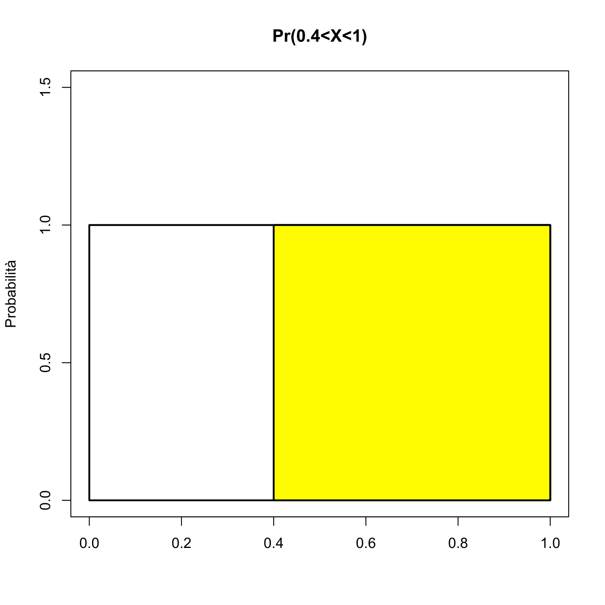

# Probabilità {#probabilita} 

## Esercizi di base di probabilità {-}

### Esercizio 2.1 {-}

<center>*Vero o Falso*</center>

Stabilire se le affermazioni seguenti sono vere o false e motivare in ciascun caso la risposta.

a. Se una moneta regolare viene lanciata molte volte, e negli ultimi 8 lanci dà sempre T (testa), allora la probabilità che nel prossimo lancio dia T sarà leggermente inferiore a $0.5$.

b. Dato un mazzo di carte "italiano", ovvero con 40 carte e quattro semi (Spade, Denari, Coppe, Bastoni), supponiamo di estrarre una carta. Gli eventi $A$={ viene estratta una figura} e $B$={viene estratta una carta di Spade o Denari} sono mutuamente indipendenti

c. Nella stessa situazione di prima, gli eventi $A$ (come sopra) e $C$={viene estratto un Asso} sono mutuamente incompatibili.

### Esercizio 2.2{-}
<center>*Roulette*</center>

Il gioco della roulette consiste in una ruota con 37 slots, ovvero i numeri da 0 a 36, estremi inclusi. Ad ogni giro di roulette, una pallina si sistemerà in uno dei 37 slots: gli slots sono ugualmente probabili. Lo slot $0$ è verde, gli altri 36 sono 18 di colore rosso (R) e 18 di colore nero (N).

a. Si osservano tre lanci consecutivi della pallina. Tutte e tre le volte la pallina si ferma su uno slot rosso (R). Qual è la probabilità che nel lancio successivo si ottenga ancora uno slot R?.

b. Si osservano 300 lanci consecutivi della pallina. Tutte e tre le volte la pallina si ferma su uno slot rosso (R). Qual è la probabilità che nel lancio successivo si ottenga ancora uno slot R?.

c. Hai risposto alle due precedenti domande con la stessa sicurezza? Perché? o perché no? Spiega.

### Esercizio 2.3{-}
<center>*Quattro diversi giochi, un solo vincitore.*</center>

Qui di sotto vengono riportate quattro diverse versioni dello stesso gioco. 

Your archnemisis gets to pick the version of the game, and then you get to choose how many times to flip a coin: 10 times or 100 times. Identify how many coin flips you should choose for each version of the game. Explain your reasoning.

a. If the proportion of heads is larger than 0.60, you win \$1.

b. If the proportion of heads is larger than 0.40, you win \$1.

c. If the proportion of heads is between 0.40 and 0.60, you win \$1.

d. If the proportion of heads is smaller than 0.30, you win \$1.

### Esercizio 2.4{-}
<center>*Backgammon.*</center>

Il backgammon si gioca su un tavolo da due giocatori che muovono dei pezzi a seconda dei risultati di due dadi che lanciano a turno. Il giocatore vince se riesce a togliere tutti i suoi pezzi dal tavolo, e per fare questo è di solito più favorevole che escano, dai dadi, numeri alti. Stai giocando a backgammon con un tuo amico e, nei tuoi primo e secondo turni, ottieni due volte un doppio 6. Il tuo amico ottiene invece un doppio 3, sia nel primo lancio che nel secondo. A questo punto il tuo amico si lamenta e sostiene che stai barando perchè ottenere due volte di fila il oppio è molto improbabile e lo è molto di più del doppio 3.

Usando argomenti di probabilità, cerca di dimostrare al tuo amico che i suoi due doppi 3 hanno la stessa probabilità dei tuoi doppi 6.

### Esercizio 2.5{-}
<center>*Lanci di monete*</center>

Se lanci una moneta regolare 10 volte, qual è la probabilità di ottenere

a. 10 volte Croce (C)?

b. 10 volte Testa (T)?

c. Almeno una T?

### Esercizio 2.6{-}
<center>*Dadi*</center>

Si lancia una coppia di dadi regolari; qual è la probabilità di ottenere

a. una somma pari a 1?

b. una somma pari a 5?

c. una somma pari a 12?

### Esercizio 2.7{-}
<center>*Swing voters*</center> 

In un'indagine demoscopica campionaria del 2014 un istituto privato a chiesto a 2373 persone scelte a caso la loro affiliazione politica. Vi erano 4 possibilità: Centro-sinistra (CS), Centro-destra (CD), Movimento Cinque Stelle (M5S) o altro (A). Inoltre si chiedeva agli intervistati se si considerassero degli "swing voters" (SV),ovvero persone che fino all'ultimo momento sarebbero state incerte su quale schieramento votare. Tra i risultati, riportiamo che il 12% dei rispondenti si dichiarava (A), mentre il 22% si dichiara (SV); inoltre il 7% si identificava in entrambe le categorie sopra citate.

a. Gli eventi A e SV sono mutuamente incompatibili?

b. Disegna un diagramma di Venn per riassumere le relazioni tra gli eventi.

c. Che percentuale di elettori vota A ma non sono SV?

d. Che percentuale di elettori vota A oppure è SV?

e. Che percentuale di elettori non vota A E non è nemmeno SV?

f. Gli eventi A ed SV possono essere considerati statisticamente
indipendenti?

### Esercizio 2.8{-}
<center>*Povertà e Madrelingua.*</center> 

L'indagine "American Community Survey" (ACS) è una indagine che il Bureau of Census negli USA effettua ogni anno per fornire dati utili alle varie comunità per effettuare i loro investimenti e organizzare i propri servizi. Nella edizione del 2010, l'ACS ha stimato che circa il 14.6% degli Americani vive sotto la soglia di povertà, che il 20.7% ha come lingua principale una diversa dall'inglese, e che il 4.2% degli Americani ricade in entrambe le suddette categorie.

a. Gli eventi $A$={Vivere sotto la soglia di povertà} e $B$={avere una madrelingua diversa dall'inglese} sono disgiunti?

b. Traccia un diagramma di Venn che riassuma le informazioni circa gli eventi sopra descritti e le loro probabilità.

c. Quale percentuale di Americani vive sotto la soglia di povertà e parla inglese come madrelingua?

d. Quale percentuale di Americani vive sotto la soglia di povertà e parla una lingua diversa dall'inglese come madrelingua?

e. Quale percentuale di Americani vive sopra la soglia di povertà e parla inglese come madrelingua?

f. Gli eventi $A$ e $B$ sono indipendenti?

### Esercizio 2.9{-}
<center>*Indipendenza e incompatibilità. *</center> 
Nei successivi punti (a) e (b), chiarisci se gli eventi in questione sono indipendenti, incompatibili, o nessuna delle due cose.

a. Tu e un altro studente scelto a caso nella tua classe, avete presso lo stesso voto all'esame di Matematica.

b. Tu e lo studente con cui abitualmente prepari gli esami, avete presso lo stesso voto all'esame di Matematica.

c. Se due eventi $A$ e $B$ si verificano contemporaneamente, devono per forza essere dipendenti? Spiega perché si, o perché no.

### Esercizio 2.10{-}
<center>*"Provarci" allo scritto.*</center> 

In un esame scritto, con domande a risposta multipla, ci sono 5 domande e per ognuna ci sono 4 scelte possibili, (diciamo a, b, c, d). Cinzia non ha studiato per niente, e decide di rispondere a caso alle cinque domande. Qual è la probabilità che Cinzia:

a. risponda bene solo alla quinta domanda?

b. risponda correttamente a tutte le domande?

c. risponda correttamente almeno ad una domanda?


### Esercizio 2.11{-}
<center>*Assenze a scuola*</center> 

Nella contea di DeKalb, Georgia, USA, ogni anno vengono raccolti dati sulle assenze a scuola dei bambini delle scuole elementari. Dai dati emerge che, ogni anno, circa il 25% dei bambini si assenta un solo giorno nell'intero anno; il 15% si assenta per 2 giorni mentre il 28% dei bambini si assenta per 3 o più giorni.

a. Qual è la probabilità che un bambino scelto a caso non abbia mancato nessun giorno di lezione?

b. Qual è la probabilità che un bambino scelto a caso abbia mancato al più un giorno di lezione?

c. Qual è la probabilità che un bambino scelto a caso abbia mancato almeno un giorno di lezione?

d. Se una mamma ha due bimbi che frequentano le scuole nella contea di DeKalb, qual è la probabilità che nessuno dei due bimbi si sia mai assentato nell'anno? Sottolinea le assunzioni importanti che hai fatto per poter rispondere a questa domanda.

e. Se una mamma ha due bimbi che frequentano le scuole nella contea di DeKalb, qual è la probabilità che entrambi i bimbi perdano almeno un giorno di scuola ciascuno? Anche in questo caso sottolinea le assunzioni necessarie per rispondere a questa domanda.

f. Se nelle domande (d) ed (e), hai fatto delle assunzioni, pensi che queste siano ragionevoli? Discuti la questione. Se non hai fatto alcuna assunzione, ricontrolla le tue precedenti risposte.


### Esercizio 2.12{-}
<center>*Distribuzioni dei voti*</center> 

Ogni riga della tabella che segue è una distribuzione di frequenze relative per una classe di studenti in America, dove il sistema di voti va da $A$ ad $F$. Stabilisci, per ciascuna riga, se si tratta di distribuzioni ammissibili, e in ogni caso spiega le tue ragioni.


                        VOTI        
  ------- ----- ------ ------ ----- ------
  \ (1)    0.3   0.3    0.3    0.2   0.1
  \ (2)     0     0      1      0     0
  \ (3)    0.3   0.3    0.3     0     0
  \ (4)    0.3   0.5    0.2    0.1   -0.1
  \ (5)    0.2   0.4    0.2    0.1   0.1
  \ (6)     0    -0.1   1.1     0     0


### Esercizio 2.13 {-}

<center>*Peso e assicurazione sanitaria; I parte.*</center> 

Il Sistema di Sorveglianza sui Fattori di Rischio Comportamentali (BRFSS) è una grande indagine telefonica che viene effettuata negli USA ogni anno, per identificare i fattori di rischio nella popolazione adulta ed individuare potenziali trend nelle dinamiche sanitarie.

La tabella che segue si riferisce a 2 variabili: le condizioni di peso, misurate mediante l'indice di massa corporea, o "body mass index (BMI)" e la copertura assicurativa, che stabilisce se i vari rispondenti possedevano una assicurazione sanitaria oppure no.

::: {.center}
                        Condizioni di Peso                                 
  ----------- -------- -------------------- ------------------ ----------- --------
                            sovrappeso          sovrappeso        obeso    
                          mai (BMI\<25)      25$\leq$ BMI <30   BMI \> 30   Totale
  Copertura      SI           134801              141699         107301     383801
  Sanitaria      NO           15098               15327           14412     44837
               Totale         149899              157026         121713     428638
:::

Si estrae un individuo a caso.

a. Qual è la probabilità che l'individuo sia sovrappeso e non abbia assicurazione sanitaria?

b. Qual è la probabilità che l'individuo sia sovrappeso oppure non abbia assicurazione sanitaria?

## Probabilità condizionata

### Esercizio 2.14 {-}

<center>*Probabilità congiunte e condizionate.*</center> 
Siano $A$ e $B$ due eventi tali che $$P(A) = 0.3; P(B) = 0.7.$$

a. Puoi calcolare $P(A \cap B)$ conoscendo solamente $P(A)$ e $P(B)$?

b. Assumiamo che gli eventi $A$ e $B$ siano indipendenti:\
    i) quanto vale $P(A \cap B)$?\
    ii) quanto vale $P(A \cup B)$?\
    iii) quanto vale $P(A\vert B)$?\

c. Se sapessimo anche che $P(A \cap B)= 0.1$, possiamo ancora dire che $A$ e $B$ sono eventi indipendenti?

d. Se sapessimo anche che $P(A \cap B) = 0.1$, quanto vale $P(A\vert B)$?

### Esercizio 2.15 {-}

<center>*Nutella o Marmellata?*</center> 
Supponiamo che all'80% dei ragazzi italiani piaccia la marmellata, all'89% piaccia la Nutella, e al 78% piacciano entrambi. Dato che ad una persona scelta a caso piace la marmellata, qual è la probabilità che le piaccia anche la Nutella?

### Esercizio 2.16 {-}

<center>*Riscaldamento globale.*</center> 
In una indagine del 2010 effettuata negli USA dalla "Pew Research", vennero intervistati 1306 cittadini americani; la domanda era: "Da quanto hai letto, sentito, visto in TV, esiste secondo lei una solida evidenza che le temperature medie sulla Terra siano aumentate negli ultimi decenni oppure no?". La tabella che segue mostra la distribuzione delle risposte, classificate anche secondo le idee politiche degli intervistati. La tabella riporta le frequenze relative.

::: {.center}
                                 Risposta                                  
  ----------- ----------------- ----------- --------------- -------------- --------
                                   Terra         Terra          Non so     
                                 più calda   non più calda   non rispondo   Totale
                Repubblicani       0.11          0.20            0.2         0.33
  Partito/     Moderati REPUB.     0.06          0.06            0.01        0.13
  Ideologia    Moderati DEMOC.     0.25          0.07            0.02        0.34
                 Democratici       0.18          0.01            0.01        0.20
                   Totale          0.60          0.34            0.06        1.00
:::

a. Qual è la probabilità che una persona scelta a caso creda che la Terra si ora più calda oppure che sia un Democratico?

b. Qual è la probabilità che una persona scelta a caso creda che la Terra si ora più calda dato che si tratta di un Democratico?

c. Qual è la probabilità che una persona scelta a caso creda che la Terra si ora più calda dato che si tratta di un Repubblicano?

d. Ti sembra che le risposte fornite dagli intervistati alla domanda sul riscaldamento siano collegate con le idee politiche degli stessi oppure no? Spiega perché.

e. Qual è la probabilità che una persona scelta a caso sia un moderato Repubblicano dato che egli non crede al riscaldamento terrestre?

### Esercizio 2.17 {-}

<center>*Peso e assicurazione sanitaria; II parte.*</center> 
Nell'Esercizio 2.13 è stata introdotta una tabella di contingenza che riassume la relazione tra condizioni di peso - in termini di Body Mass Index, e possesso di assicurazione sanitaria per un campione di 428638 americani. La tabella che segue è equivalente alla precedente ma è espressa in frequenze relative.

::: {.center}
                        Condizioni di Peso                                 
  ----------- -------- -------------------- ------------------ ----------- --------
                            sovrappeso          sovrappeso        obeso    
                          mai (BMI\<25)      25$\leq$ BMI <30   BMI \> 30   Totale
  Copertura      SI           0.3145              0.3306         0.2503     0.8954
  Sanitaria      NO           0.0352              0.0358         0.0336     0.1046
               Totale         0.3497              0.3664         0.2839      1.0
:::

a. Qual è la probabilità che un individuo scelto a caso sia obeso?

b. Qual è la probabilità che un individuo scelto a caso sia obeso dato che egli possiede l'assicurazione sanitaria?

c. Qual è la probabilità che un individuo scelto a caso sia obeso dato che egli NON possiede l'assicurazione sanitaria?

d. Pensi che i due caratteri, ovvero la condizione di peso e il possesso di assicurazione sanitaria siano indipendenti oppure no? Spiegare perché.

### Esercizio 2.18 {-}

<center></center> 
In una indagine del 2010, SurveyUSA chiese a 500 residenti a Los Angeles: *"Qual è il migliore hamburger della California de sud ?"* Le risposte possibili erano

- Five Guys Burgers

- In-N-Out Burger

- Fat Burger

- Tommy's Hamburgers

- Umami Burger

- Altro 

Qui sotto viene riportata la distribuzione delle risposte, tenendo conto anche del genere dei rispondenti (Maschi=M, Femmine=F)


|               | **Genere** |      |          |
|---------------|------------|------|----------|
|               | **M**      |**F** |**Totale**|
| **Five Guys** | 5          | 6    | 11       |
| **In N Out**  | 162        | 181  | 343      |
| **Fat**       | 10         | 12   | 22       |
| **Tommy's**   | 27         | 27   | 54       |
| **Umami**     | 5          | 1    | 6        |
| **Altri**     | 26         | 20   | 46       |
| **Non so**    | 13         | 5    | 18       |
| **Totale**    | 248        | 252  | 500      |


a. Qual è la probabilità che un uomo scelto a caso preferisca In-N-Out?

b. Qual è la probabilità che una donna scelta a caso preferisca In-N-Out?

c. Qual è la probabilità che un uomo e una donna che escono insieme preferiscano entrambi In-N-Out? Annota qualunque assunzione tu faccia per rispondere a questa domanda e rifletti sul fatto che questa assunzione sia o meno ragionevole.

d. Qual è la probabilità che una persona scelta a caso preferisca Umami oppure che quella persona sia donna?

### Esercizio 2.19 {-}

<center>*Accoppiamento ragionato (Assortative mating).*</center> 

L'accoppiamento ragionato si attua quando individui con genotipi e/o fenotipi simili si accoppiano più frequentemente di quanto farebbero mediante accoppiamenti casuali. Alcuni ricercatori hanno raccolto dati su questo tema, registrando il colore degli occhi di 204 coppie eterosessuali scandinave.

|              |         | **Partner** | **femminile** |       |        |
|:------------:|:-------:|:-----------:|:-------------:|:-----:|:------:|
|              |         | Blu         | Marrone       | Verde | Totale |
|              | Blue    | 78          | 23            | 13    | 114    |
| **Partner**  | Marrone | 19          | 23            | 12    | 54     |
| **maschile** | Verde   | 11          | 9             | 16    | 36     |
|              | Totale  | 108         | 55            | 41    | 204    |

a. Qual è la probabilità che un uomo scelto a caso oppure la sua partner abbiano occhi blu?

b. Qual è la probabilità che un uomo scelto a caso tra quelli con occhi blu abbia una partner con occhi blu?

c. Qual è la probabilità che un uomo scelto a caso tra quelli con occhi marroni abbia una partner con occhi blu? E qual è invece la probabilità che un uomo scelto a caso tra quelli con occhi verdi abbia una partner con occhi blu?

d. Ti sembra che i colori degli occhi dei due partner possano essere considerati caratteri indipendenti? Spiega il tuo ragionamento.

### Esercizio 2.20 {-}

<center>*Saper disegnare un box-plot.*</center> 
Da indagini passate, sappiamo che, dopo aver seguito un corso di Statistica di base, l'80% degli studenti sa disegnare correttamente un box-plot. Tra questi, l'86% ha superato poi l'esame al primo appello, mentre solo il 65% degli studenti che non sa costruire un box-plotè riuscita a superare l'esame.

a. Costruisci un diagramma ad albero oppure una tabella a doppia entrata per descrivere questo scenario.

b. Qual è la probabilità che uno studente sia in grado di disegnare un box-plot sapendo che ha superato l'esame?

### Esercizio 2.21 {-}

<center>*Rischio di trombosi. *</center> 
Un test genetico viene usato per stabilire se un persona ha predisposizione all'insorgere di trombosi, cioè la formazione di grumi di sangue all'interno dei vasi sanguigni che ostruiscono il flusso del sangue stesso nel sistema di circolazione. Si pensa che il 3% della popolazione mondiale ha questo tipo di predisposizione. Il test genetico è accurato al 99% sulle persone effettivamente predisposte, cioè la probabilità che il test sia positivo su un predisposto è 0.99. Lo stesso test è accurato al 98% accurate sui non predisposti. Qual è la probabilità che una persona scelta a caso nella popolazione il cui test è positivo, sia davvero una di quelle predisposte?

### Esercizio 2.22 {-}

<center>*HIV in Swaziland.*</center> 
Lo Swaziland è i paese al mondo con la più alta prevalenza di casi si HIV. Circa il 25.9% della popolazione risulta infatti sieropositiva Il test ELISA è stato uno dei primi e più accurati test per verificare la sieropositività. Per coloro effettivamente positivi all'HIV, il test ELISA ha una accuratezza^[per una definizione di accuratezza si rimanda all'esercizio 2.21] del 99.7%. Per i sieronegativi, il test è accurato al 92.6%. Se un cittadino dello Swaziland effettua il test e risulta positivo, qual è la probabilità che risulti effettivamente sieropositivo?

### Esercizio 2.23 {-}

<center>*Exit poll. *</center> 
Un istituto di ricerca ha effettuato delle indagini di tipo exit-poll (ovvero, interviste a a caldo fuori dai seggi) in occasione delle elezioni comunali a Roma del 2013. I ricercatori stabilirono che , secondo gli exit-poll, il 53% dei rispondenti aveva votato per il candidato del centro-sinistra Ignazio Marino. Inoltre, essi stimarono che il 37% di coloro che avevano votato per Marino, erano laureati mentre la percentuale di laureati tra coloro che NON aveva votato per Marino era del 44%. Supponiamo di selezionare casualmente una persona che ha partecipato all'exit poll e notiamo che si tratta di un laureato/a. Qual è la probabilità che abbia votato per Marino?

### Esercizio 2.24 {-}

<center>*It's never lupus.*</center> 
Il lupus eritematoso sistemico (LES o semplicemente lupus) è una malattia cronica di natura autoimmune, che può colpire diversi organi e tessuti del corpo. Si stima che il 2% della popolazione mondiale soffra di tale patologia. Esiste un test per verificare la effettiva malattia negli esseri umani. Il test ha una accuratezza del 98% tra i malati di Lupus e del 74% tra i non malati La Fox Television negli USA dedica un programma ai potenziali malati di Lupus, che telefonano dopo aver effettuato un test, risultato positivo. Il titolo della trasmissione tende a sdrammatizzare ed è: "It's never lupus." Sulla base delle informazioni sopra riportate, come giudichi tale affermazione? ragionevole? troppo ottimista? Spiega la tua risposta.

### Esercizio 2.25 {-}

<center>*I gemelli.*</center> 
Nella specie umana, circa il 30% dei gemelli sono di tipo omozigotico (cioè identici, cresciuti nella stessa sacca uterina materna) mentre il restante 70% sono di tipo eterozigotico (gemelli diversi). I gemelli identici sono per forza dello stesso sesso, e con uguale probabilità nascono due maschi o due femmine. Al contrario, i gemelli diversi possono avere sesso diverso: infatti il 25% delle coppie di gemelli diversi è composta da due maschi, il 25% è composta da due femmine, e il restante 50% sono coppie miste. Se una coppia ha appena avuto due gemelline femmine, qual è la probabilità che siano identiche?

## Estrazioni da popolazioni a bassa numerosità 

### Esercizio 2.26 {-}

<center>*Palline e Urne, parte I.*</center> 
C'è un'urna con 5 palline rosse (R) 3 blu (B) e 2 arancioni (A). Effettuiamo estrazioni CON ripetizione, cioè una volta estratta,la pallina viene osservata e poi rimessa nell'urna.

a. Qual è la probabilità che la prima pallina estratta sia di tipo B?

b. Supponiamo che la prima pallina estratta sia B. Qual è la probabilità che la seconda pallina estratta sia ancora B?

c. Supponiamo ora che la prima pallina estratta sia A. Sempre effettuando estrazioni senza ripetizione, qual è la probabilità che la seconda pallina estratta sia B?

d. Qual è la probabilità di estrarre due palline B nelle prime due estrazioni?

e. Quando effettuate con ripetizione, le varie estrazioni possono essere considerate indipendenti? Spiegare perché si oppure perché no.

### Esercizio 2.27 {-}

<center>*Calzini nel cassetto.*</center> 
Nel tuo cassetto ci sono 4 calzini blue (B), 5 grigi (G) e 3 neri (N). Ti svegli in ritardo e ti vesti di corsa prendendo due calzini a caso nel cassetto. Qual è la probabilità di ritrovarti con

a. 2 calzini B

b. nessun calzino G

c. almeno 1 calzino N

d. un calzino G

e. calzini dello stesso colore, qualunque esso sia.

### Esercizio 2.28 {-}

<center>*Palline e Urne, parte II.*</center> 
C'è un'urna con 5 palline rosse (R) 3 blu (B) e 2 arancioni (A). Effettuiamo estrazioni SENZA ripetizione, cioè una volta estratta,la pallina viene osservata ma NON viene rimessa nell'urna.

a. Supponiamo che alla prima estrazione venga estratta una pallina B. Qual è la probabilità che anche la seconda sia B?

b. Supponiamo che alla prima estrazione venga estratta una pallina A. Qual è la probabilità che la seconda sia B?

c. Qual è la probabilità di estrarre due palline B nelle prime due estrazioni?

d. Quando effettuate senza ripetizione, le varie estrazioni possono essere considerate indipendenti? Spiegare perché si oppure perché no.

### Esercizio 2.29 {-}

<center>*Libri sullo scaffale. *</center> 

Nella tabella che segue viene riportata la distribuzione dei libri che ho comprato ma non ancora letto, in base al loro contenuto e alla loro copertina.

| **Formato**    | **del libro** |           |        |
|:--------------:|:-------------:|:---------:|:------:|
|                | copertina     | copertina | Totale |
|                | rigida        | morbida   |        |
| **narrativa**  | 13            | 59        | 72     |
| **saggistica** | 15            | 8         | 23     |
| **Totale**     | 28            | 67        | 95     |

Prima di partire per le vacanze vogliamo portarci dietro due libri, da scegliere a caso. Effettuiamo allora delle estrazioni casuali senza ripetizione.

a. Qual è la probabilità di scegliere per primo un libro a copertina rigida e per secondo un libro a copertina morbida di narrativa?

b. Qual è la probabilità di estrarre per primo un libro di narrativa e poi a seguire uno a copertina rigida?

c. Qual è la probabilità dell'evento precedente se le due estrazioni vengono effettuate CON ripetizione?

d. Le risposte ai punti (b) e (c) sono molto simili ma non uguali. Spiega perché.

### Esercizio 2.30 {-}

<center>*L'abbigliamento delle studentesse.*</center> 
In una classe composta da 24 ragazze, 7 indossano jeans, 4 indossano pantaloni corti, 8 indossano la gonna ed il resto della classe indossa dei leggings. Se scegliamo a caso 3 studentesse, senza ripetizione, qualè la probabilità che una delle tre indossi leggings e le altre due abbiano i jeans?

### Esercizio 2.31 {-}

<center>*Il problema dei compleanni.*</center> 
Scegli tre persone a caso. Rispondi alle seguenti domande, sotto l'assunzione che

- nessuno sia nato il 29 febbraio

- la distribuzione delle nascite nella popolazione può essere considerata ragionevolmente uniforme nel corso dell'anno.

a. Qual è la probabilità che le prime due persone estratte festeggino il compleanno nello stesso giorno?

b. Qual è la probabilità che che almeno due delle tre persone estratte festeggino il compleanno nello stesso giorno?

## Variabili casuali

### Esercizio 2.32 {-}

<center>*Studenti fumatori.*</center> 
Il 13% degli studenti universitari fuma almeno 4 sigarette al giorno.

a. Determina il numero atteso di fumatori in una classe di 250 studenti.

b. La palestra del campus apre ogni sabato mattina alle 9 in punto. Un certo sabato, alle 8:55, ci sono 27 studenti all'ingresso principale della palestra che aspettano di entrare. ragionevole utilizzare lo stesso approccio che hai usato al punto (a) per calcolare il numero atteso di fumatori tra i 27 studenti? spiegare la risposta.

### Esercizio 2.33 {-}

<center>*Giochi di carte.*</center> 
Consideriamo un classico mazzo di 52 carte francesi (quattro semi: cuori (C), quadri (Q), picche (P) e fiori (F), ogni seme ha 13 carte: A,2,3,4,5,6,7,8,9,10,J,Q,K). Le regole del gioco sono le seguenti:

- Se estrai a caso una carta rossa (C o Q), non vinci nulla.

- Se estrai a caso una carta di picche, vinci 5 euro.

- Se estrai una carta di fiori vinci 10 euro ma se la carta è l'asso di fiori vinci altri 20 euro. 

Se $X$ è la variabile aleatoria "vincita in una estrazione",

a. Determina la distribuzione di probabilità di $X$.

b. Determina media e deviazione standard di $X$.

c. Qual è la massima cifra che ritieni giusto pagare per partecipare a questo gioco? Spiega il tuo ragionamento.

### Esercizio 2.34 {-}

<center>*Giochi di carte, 2.*</center> 

Con lo stesso mazzo di carte del gioco precedente, si consideri ora un nuovo gioco, in cui vengono estratte in blocco (in pratica, senza ripetizione) tre carte. Le regole sono le seguenti:

- Se estrai tre carte di cuori vinci 50 euro.

- Se estrai tre carte nere (P o F) vinci 25 euro.

- Con qualunque altra combinazione non si vince nulla. 

Sia $Y$ la variabile aleatoria "vincita in una mano del gioco",

a. Determina la distribuzione di probabilità di $Y$.

b. Determina media e deviazione standard di $Y$.

c. Se il prezzo per partecipare ad una mano di questo gioco è 5 euro, quali saranno media e deviazione standard del ricavo aleatorio (cioè la vincita $-$ (meno) il prezzo per partecipare)?

d. Se il prezzo per partecipare ad una mano di questo gioco è 5 euro, decidi di giocare oppure no? spiega la tua scelta.

### Esercizio 2.35 {-}

<center>*Ne vale la pena? *</center>
Andrea è sempre alla ricerca di modi per fare soldi velocemente e senza fatica. Negli ultimi tempi, sta provando con i giochi d'azzardo. In particolare si è concentrato sul seguente gioco: si pagano 2 euro per partecipare. Il giocatore estrae una carta dal solito mazzo di 52 carte francesi. Se il giocatore estrae un numero (le carte da 2 a 10), non vince nulla. Se estrae una figura (J,Q,K) egli vince 3 euro. Se invece estrae un Asso, il giocatore vince 5 euro. Se poi è l'asso di fiori, allora vince altri 20 euro (per un totale di 25 euro). 

Sia $Z$ la variabile aleatoria: "vincita di Andrea".

a. Calcolare la distribuzione di $Z$.

b. Te la senti di consigliare ad Andrea questo come un gioco conveniente? Spiega bene il perché.

### Esercizio 2.36 {-}

<center>*Rendimenti di un portafoglio.*</center>
Il rendimento di un portafoglio di titoli incrementa il suo valore del 18% durante una fase di boom finanziario, mentre cresce solo del 9% in tempi normali. Durante una recessione esso decresce del 12%. Quale è il valore atteso del rendimento di questo portafoglio, se i tre scenari possibili sono considerati ugualmente probabili?

### Esercizio 2.37 {-}

<center>*Roulette, Parte I. *</center>
Il gioco della roulette consiste in una ruota con 37 slots, ovvero i numeri da 0 a 36, estremi inclusi Ad ogni giro di roulette, una pallina si sistemerà in uno dei 37 slots: gli slots sono ugualmente probabili. Lo slot $0$ è verde, gli altri 36 sono 18 di colore rosso (R) e 18 di colore nero (N)

I giocatori possono scommettere, tra le altre cose, sul colore dello slot (R o N): se la pallina si ferma in uno slot del colore da loro prescelto, essi vincono tanto denaro quanto quello giocato (in pratica, se giocano 1 euro, si riprendono l'euro giocato più un altro di vincita). Se invece la pallina si ferma su uno slot di un altro colore, perdono il denaro scommesso. Supponiamo che Tu scommetta 1 euro sul rosso (R). Qual è il valore atteso del tuo ricavo netto? qual è la deviazione standard?

### Esercizio 2.38 {-}

<center>*Roulette, Parte II. *</center>
L'Esercizio 2.37 descrive alcuni tipi di giocate che si possono fare alla roulette.

a. Supponiamo che Tu scommetta 3 euro sul rosso (R) in una mano di roulette. Qual è il valore atteso del tuo ricavo netto? Qual è la deviazione standard?

b. Supponiamo ora che tu decida di scommettere 1 euro in tre mani successive, giocando sempre sul rosso. Qual è il valore atteso del tuo ricavo netto? Qual è la deviazione standard?

c. Puoi fare un confronto tra le risposte che hai dato al punto (a) e al punto (b)? Che cosa ti dicono a proposito del rischio associato alle due strategie?

### Esercizio 2.39 {-}

<center>*Tariffe bagagli. *</center>

Una compagnia aerea applica le seguenti tariffe per i bagagli.

- 25 euro per la prima valigia.

- 35 euro per la seconda valigia. 

Secondo le statistiche della compagnia aerea, il 54% dei passeggeri non imbarca bagagli. il 34% imbarca un solo bagaglio,mentre il 12% dei passeggeri imbarca due bagagli. Per semplicità trascuriamo quella piccola parte di clientela che imbarca più di due bagagli. Sia $X$ la variabile aleatoria: "Ricavo per passeggero".

a. Determina la distribuzione di $X$.

b. Calcola media e deviazione standard di $X$.

c. Qual è il ricavo medio per un volo con 120 passeggeri? Qual è la deviazione standard? Sottolinea ogni eventuale assunzione che hai fatto per produrre una risposta e valuta, volta per volta, se si tratta di una assunzione ragionevole.

### Esercizio 2.40 {-}

<center>*Roma - Lazio *</center>

Tu e un tuo amico fate una scommessa relativa al risultato di Roma-Lazio, derby capitolino. Secondo le attuali statistiche, la Roma ha una probabilità di vincere pari allo 0.45; il pareggio ha probabilità 0.21, mentre la probabilità che vinca la Lazio è pari 0.34. Il tuo amico mette sul banco 5 euro e scommette sulla Roma. Assumendo che il pareggio annullerebbe la scommessa, quanto devi mettere sul banco per scommettere sulla Lazio in modo che la scommessa sia equa?

In termini di quote, sei capace di dire "a quanto vengono date" Roma e Lazio?

### Esercizio 2.41 {-}

<center>*Vendite su Ebay. *</center>

Marzia sta monitorando le quotazioni di due articoli su Ebay:

- Un libro di testo che si vende ad una media di 110 euro con una standard deviation of 4 euro.

- Un videogame di Mario Kart per il Nintendo Wii, che si vende ad una media di 38 euro con uno standard deviation pari a 5 euro.

a. Marzia vuole vendere il videogame e comprare il libro di testo. In media quanto ricavo (cioè entrate $-$ uscite), si aspetta di ottenere Marzia dalle due operazioni? Qual è la deviazione standard associata a tale valore medio?

b. Lucia sta vendendo il libro di testo su Ebay per conto di un amico, il quale le pagherà una commissione del 10%, ovvero Lucia tratterrà per sé il 10% del ricavo. Quanto denaro si aspetta in media di ottenere Lucia? Con quale deviazione standard?

### Esercizio 2.42 {-}

<center>*Quanto costa la colazione.*</center>
Sandra mangia a colazione, ogni mattina, un cappuccino e un cornetto. Ci sono molti bar vicino alla sua abitazione e così ogni giorno ne sceglie a caso uno, indipendentemente dai giorni precedenti. Il prezzo medio di un cappuccino è di 1.40 euro con una deviazione standard di 30 centesimi; il prezzo medio del cornetto è 1 euro con una deviazione standard di 15 centesimi. I due prezzi sono considerati indipendenti.

a. Qual è il prezzo medio della spesa che Sandra sostiene giornalmente per la colazione? Qual è la deviazione standard?

b. Qual è il prezzo medio della spesa che Sandra sostiene in una settimana (7 giorni) per la colazione? Qual è la deviazione standard?


### Esercizio 2.43 {-}

<center>*Ice cream. *</center>
Le gelaterie vendono il gelato in confezioni da 1 kg.; un cono gelato, mediamente, contiene 50 grammi di
gelato. Tuttavia cè una certa variabilità nella confezione delle scatole e nella preparazione dei coni Chiamiamo $X$ la quantità aleatoria di gelato in una scatola e $Y$ la quantità aleatoria di gelato su un cono. Assumiamo che tali variabili aleatorie abbiano le seguenti medie, deviazioni standard e varianze, espresse in grammi.

|       | **media** | **stand. deviation** | **varianza** |
|:-----:|:---------:|:--------------------:|:------------:|
| **X** | 1000      | 10                   | 100          |
| **Y** | 50        | 2                    | 4            |


a. Ad un party viene servita una intera scatola di gelato più tre coni. Mediamente, quanto gelato è stato servito? con quale deviazione standard?

b. Quanto gelato ti aspetti che resti in una nuova scatola, dopo che è stato riempito un cono? In termini matematici, calcola il valore atteso di $X - Y$. Qual è la deviazione standard di tale previsione?

c. Usando come esempio il contesto di questo esercizio, spiega perché, anche quando si calcola la differenza tra due variabili aleatorie, occorre sommare le varianze.


## Distribuzioni continue

### Esercizio 2.44 {-}

<center>*Peso dei gatti.*</center>
L'istogramma di seguito riporta il peso in kg. di 47 femmine e 97 maschi di gatto.

<center></center>

Sulla base delle informazioni fornite dal grafico, potete dare una risposta approssimata alle seguenti domande?

a. Quale percentuale di gatti pesa meno di 2.6 kg.?

b. Quale percentuale di gatti pesa tra 2.4 kg. e 3 kg.?

c. Quale percentuale di gatti pesa oltre i 3.6 kg.?

### Esercizio 2.45 {-}

<center>*Redditi e genere.*</center>

La tabella che segue riporta le frequenze relative della distribuzione dei redditi pro-capite annui per un campione di quasi 100 milioni di cittadini americani, aggiustati in termini di inflazione e relativi al 2009. Questi dati provengono dall'American Community Survey per il periodo 2005-2009. Questo campione è formato dal 59% di uomini e 41% di donne.

|                      |            |
|:--------------------:|:-----------|
|**Classe di Reddito** | **Totale** |
| $\leq 10000$ euro    | 2.2\%      |
| fino a $15000$ euro  | 4.7\%      |
| fino a $25000$ euro  | 15.8\%     |
| fino a $35000$ euro  | 18.3\%     |
| fino a $50000$ euro  | 21.2\%     |
| fino a $65000$ euro  | 13.9\%     |
| fino a $75000$ euro  | 5.8\%      |
| fino a $100000$ euro | 8.4\%      |
| oltre $100000$ euro  | 9.7\%      |

a. Calcolare il reddito mediano pro-capite, indipendentemente dal genere.

b. Qual è la probabilità che un individuo scelto a caso guadagni meno di 50 mila dollari?

c. Qual è la probabilità che un individuo scelto a caso guadagni meno di 50 mila dollari e sia donna? Annota le assunzioni che hai fatto per rispondere a questa domanda.

d. La stessa fonte di dati ci dice che il 71.8% delle donne guadagna meno di 50 mila dollari all'anno. Usa questa informazione per determinare se l'assunzione che hai fatto al punto (c) possa essere considerata valida o meno.

### Esercizio 2.46 {-}

<center></center>

Nel censimento del 2000 ogni persona residente negli USA doveva scegliere da un lungo elenco la propria razza. La categoria \"Ispanico/latino\" è un caso a parte poiché in essa vi possono essere tante razze diverse. Se scegliamo un residente negli USA in modo casuale, in base ai dati del censimento del 2000 abbiamo le seguenti probabilità:

::: {.center}
              Ispanici   Non ispanici
  ---------- ---------- --------------
   Asiatici    0.000        0.036
     Neri      0.003        0.121
   Bianchi     0.060        0.691
    Altro      0.062        0.027
:::

1.  Verifica che questa tabella di probabilità sia corretta.

2.  Quanto vale la probabilità che un americano scelto in modo casuale sia ispanico?

3.  I bianchi di origine non ispanica rappresentano da sempre la maggioranza di residenti negli USA. Quale è la probabilità che un americano scelto in modo casuale non sia membro di questo gruppo?
    
#### Soluzione {- .sol}

1.  Per verificare che questa tabella di probabilità sia corretta
    bisogna verificare che:

    - le probabilità assumono valori tra 0 e 1;

    -   poiché l'evento A="il cittadino è ispanico" e l'evento B="il cittadino è non ispanico" sono complementari ed esauriscono lo spazio degli eventi $S$, allora la somma delle probabilità deve essere pari ad 1.

    La prima condizione è verificata in quanto le probabilità riportate assumono tutte valori tra 0 e 1; anche la seconda condizione è verificata in quanto $$P(S)=P(A)+P(B)=0.125+0.875=1$$ dove 
    
    P(A)=P("il cittadino ispanico")= 0+0.003+0.060+0.062=0.125\
    \
    P(B)=P("il cittadino non ispanico")=0.036+0.121+0.691+0.027=0.875=1-P("il cittadino ispanico")

2.  La probabilità che un americano scelto in modo casuale sia ispanico è pari a P(A)= 0.125;

3.  La probabilità dell'evento C="il cittadino è un bianco non ispanico" è pari a P(C)=0.691; pertanto la probabilità che un americano scelto a caso non sia un bianco ispanico è la probabilità di $C^{c}$, ossia $$P(C^{c})=1-P(C)=1-0.691=0.309$$.

### Esercizio 2.47 {-}

<center></center>

È stato chiesto a 500 soggetti (maschi e femmine) abitanti di un'area metropolitana se amano fare shopping. 136 dei 250 uomini intervistati e 224 delle 250 donne hanno risposto affermativamente. Scelto a caso un soggetto, qual è la probabilità che:

1.  ami fare lo shopping;

2.  sia una donna e ami fare shopping;

3.  sia una donna o ami fare shopping;

4.  sia un uomo o una donna.

#### Soluzione {- .sol}
Per rispondere alle domande, può essere utile schematizzare il problema nella seguente tabella:

::: {.center}
        UOMO   DONNA  
  ---- ------ ------- -----
   SI   136     224    360
   NO   114     26     140
        250     250    500
:::

Possiamo quindi rispondere alle domande:

1.  Sia A l'evento A="un soggetto scelto a caso ama fare shopping".\

    P(A)= \# di soggetti che hanno risposto positivamente$/$ \# di soggetti intervistati=$\frac{360}{500}$=0.72

2.  Definiamo gli eventi:\

    D="un soggetto scelto a caso è una donna"\
    
    A="un soggetto scelto a caso ama fare shopping".\
    
    La probabilità richiesta è la probabilità dell'intersezione dei 2 eventi $P(D \cap A)$ ossia la probabilità di estrarre a caso una donna che ami fare shopping. Dalla tabella, si deduce che tale
    probabilità è pari a\
    
    $P(D \cap A) = \frac{224}{500}=0.448$

3.  La probabilità richiesta è la probabilità dell'unione dei 2 eventi, ossia\

    $P(A \cup D)= P(A)+P(D)-P(A \cap D)=\frac{360}{500} +  \frac{1}{2} - \frac{224}{500}= 0.772$

4.  Definiamo gli eventi:\

    D="il soggetto estratto è una donna"\
    
    U="il soggetto estratto è un uomo"\
    
    I 2 eventi sono complementari e disgiunti, ossia $P(D) = 1-P(U)$. Pertanto la probabilità della loro unione è pari a\
    
    $P(D \cup U) = P(D) + P(U) = 1$.

### Esercizio 2.48 {-}

<center></center>

Ogni anno vengono effettuate delle valutazioni circa le performance delle nuove automobili durante i primi 90 giorni di vita. Supponiamo che le automobili siano classificate in base alla nazionalità della casa produttrice (americana/ non americana) e in base al fatto che la macchina abbia richiesto o meno una riparazione nel periodo di garanzia. In base ai dati raccolti si ottiene una probabilità pari a 0.04 che l'automobile richieda una riparazione durante il periodo di garanzia, una probabilità di 0.6 che l'automobile sia costruita in America e una probabilità pari a 0.025 che una macchina richieda una riparazione durante il periodo di garanzia e sia stata prodotta da una società americana. Scelta a caso un'automobile, calcolare la probabilità che:

1.  richieda una riparazione durante il periodo di garanzia;

2.  richieda una riparazione durante il periodo di garanzia e sia stata prodotta da una società americana;

3.  richieda una riparazione durante il periodo di garanzia o sia stata prodotta da una società americana;

4.  richieda una riparazione durante il periodo di garanzia o non sia stata prodotta da una società americana.

#### Soluzione {- .sol}
Formalizziamo le informazioni fornite dall'esercizio come segue:

-   Sia l'evento A="un'automobile scelta a caso richiede una riparazione"; il testo dell'esercizio ci dice che P(A)=0.04;

-   Sia l'evento B="un'automobile scelta a caso è costruita in America"; il testo dell'esercizio ci dice che P(B)=0.6;

-   $A \cap B$ l'evento "un'automobile scelta a caso richiede una riparazione ed è costruita in America"; il testo ci dice che $P(A \cap B)=0.025$.

Pertanto, possiamo rispondere alle domande:

1.  $P(A)=0.04$;

2.  $P(A \cap B)=0.025$;

3.  $P(A \cup B)=P(A)+P(B)-P(A \cap B) = 0.04 + 0.6 -0.025=0.615$;

4.  L'evento "un'automobile scelta a caso non è stata prodotta da una società americana" è l'evento complementare a B; pertanto la sua probabilità è pari a $P(B^{c})=1-P(B)=0.4$. La probabilità richiesta
    è\
    
    $P(A \cup B^{c})=P(A)+P(B^{c})-P(A \cap B^{c}) = 0.04 + 0.4 -0.015=0.425$\
    
    dove $P(A \cap B^{c}) = P(A) - P(A \cap B) = 0.04 - 0.025= 0.015$.
    
### Esercizio 2.49 {-}

<center></center>

È stata condotta un'indagine per valutare se le aziende di grandi dimensioni sono meno propense delle aziende di medie-piccole dimensioni ad offrire azioni ai membri del proprio consiglio di amministrazione. I risultati campionari sono i seguenti: su 189 aziende di grandi dimensioni, 40 offrono le proprie azioni ai membri del consiglio di amministrazione; su 180 aziende di media-piccola dimensioni, 43 offrono azioni ai membri del proprio consiglio di amministrazione. Scelta a caso un'azienda, calcolare la probabilità che questa:

1.  offra azioni ai membri del consiglio di amministrazione;

2.  sia di dimensioni medio-piccole e non offra azioni ai membri del consiglio di amministrazione;

3.  sia di dimensioni medio-piccole oppure offra azioni ai membri del consiglio amministrazione.

#### Soluzione {- .sol}
Per rispondere alle domande, può essere utile schematizzare il problema nella seguente tabella:

::: {.center}
        Grandi   Medie-Piccole  
  ---- -------- --------------- -----
   SI     40          43         83
   NO    149          137        286
         189          180        369
:::

Possiamo quindi rispondere alle domande:

1.  Sia l'evento A="un'azienda scelta a caso offre azioni ai membri del consiglio di amministrazione"; la probabilità dell'evento è pari a

    $P(A)=\frac{83}{369}=0.225$

2.  Sia l'evento B="un'azienda scelta a caso è di dimensioni medio-piccole"; dobbiamo calcolare $P(A^{c} \cap B)$, ossia la probabilità che un'azienda di dimensioni medio-piccole offra azioni ai membri del consiglio di amministrazione. Dalla tabella si deduce che $P(A^{c} \cap B)=\frac{137}{369}=0.371$

3.  Dobbiamo calcolare la probabilità dell'unione, ossia $P(A \cup B) =P(A)+P(B)-P(A \cap B) = \frac{180}{369} + \frac{83}{369} - \frac{43}{369} = \frac{220}{369}=0.596$

### Esercizio 2.50 {-}

<center></center>

Un 4-soft nel gioco dei 2 dadi, si verifica quando si totalizza un 4, avendo 1 su un dado e 3 sull'altro.

1.  Quale è la probabilità di totalizzare un 4-soft?

2.  Quale è la probabilità di realizzare 4?

3.  Quale è la probabilità di realizzare 5?

#### Soluzione {- .sol}
Con 2 dadi, si possono realizzare un totale di 36 possibili risultati. Con 2 dadi, si può ottenere 4 con i seguenti punteggi: $[1,3], [3,1],[2,2]$; mentre un punteggio totale pari a 5 si può ottenere come $[1,4], [4,1], [2,3],[3,2]$

1.  Gli eventi favorevoli ad un 4-soft sono 2, ossia $[1,3]$ e $[3,1]$; quindi la probabilità di un 4-soft è $\frac{2}{36}=0.055$

2.  Gli eventi favorevoli ad un totale di 4 sono 3, ossia $[1,3], [3,1],[2,2]$; pertanto la probabilità di ottenere un punteggio totale di 4 è pari a $\frac{3}{36}=0.083$

3.  Gli eventi favorevoli ad un totale di 5 sono 4, ossia $[1,4], [4,1], [2,3],[3,2]$; pertanto la probabilità di ottenere un punteggio totale di 4 è pari a $\frac{4}{36}=0.111$

### Esercizio 2.51 {-}

<center></center>

Sia $X$ un numero compreso tra 0 e 1 generato casualmente. Ricava le seguenti probabilità:

1.  $P(0 \leq X \leq 0.4)$;

2.  $P(0.4 \leq X \leq 1)$;

3.  $P(0.3 \leq X \leq 0.5)$.

#### Soluzione {- .sol}
Le probabilità richieste sono pari rispettivamente a

1.  $P(0 \leq X \leq 0.4)=0.4$

2.  $P(0.4 \leq X \leq 1)=0.6$

3.  $P(0.3 \leq X \leq 0.5)=0.2$

Tali probabilità sono rappresentate nelle seguenti figure.


<center>{width=32%} {width=32%} {width=32%}</center>

### Esercizio 2.52 {-}

<center></center>

Si stima che il 30% degli adulti negli Stati Uniti siano obesi, che il 3% siano diabetici e che il 2% siano sia obesi che diabetici. Determina la probabilità che un individuo scelto casualmente

1.  sia diabetico se è obeso;

2.  sia obeso se è diabetico.

#### Soluzione {- .sol}
Indichiamo con O e D i seguenti eventi:

-   O="un individuo scelto casualmente sia obeso";

-   D="un individuo scelto casualmente sia di diabetico".

Il testo ci dice che $P(O)=0.30$, $P(D)=0.03$ e $P(O \cap D)=0.02$.

1.  Il quesito chiede la probabilità che il soggetto sia diabetico *dato* che obeso, ossia $P(D|O)$; applicando la regola della probabilità condizionata si ha $$P(D|O)=\frac{P(D \cap O)}{P(O)}=\frac{0.02}{0.3}=0.067$$

2.  Il quesito chiede la probabilità che il soggetto sia obeso *dato* che diabetico, ossia $P(O|D)$; applicando la regola della probabilità condizionata si ha $$P(O|D)=\frac{P(D \cap O)}{P(D)}=\frac{0.02}{0.03}=0.667$$

### Esercizio 2.53 {-}

<center></center>

Tra i partecipanti ad un concorso per giovani compositori il 50% suona il pianoforte, il 30% suona il violino e il 20% la chitarra. Partecipano ad un concorso per la prima volta il 10% dei pianisti, il 33% dei violinisti e il 10% dei chitarristi. Applicando i concetti di probabilità condizionata e il teorema di Bayes, rispondere alle seguenti domande.

1.  Quale è la probabilità che un compositore scelto a caso sia un aspirante alla prima esperienza?

2.  Sapendo che ad esibirsi per primo sarà un compositore alla prima esperienza, quale è la probabilità che sia un chitarrista?

#### Soluzione {- .sol}
Definiamo gli eventi:

-   A = \"Un partecipante scelto a casa è un aspirante compositore alla prima esperienza\"

-   B = \"Un partecipante scelto a casa è un pianista\"

-   C = \"Un partecipante scelto a casa è un violinista\"

-   D = \"Un partecipante scelto a casa è un chitarrista\"

abbiamo $$\begin{aligned}
    P(A)&=P(A\cap S)=P(A\cap (B\cup C \cup D))\\
    &=P(A \cap B)+P(A \cap C)+P(A \cap D) \\
    &=P(A|B)P(B)+P(A|C)P(C)+P(A|D)P(D)\\
    &=0.1\cdot 0.5+0.33\cdot 0.3+0.1\cdot 0.2=0.17\end{aligned}$$ Per quanto riguarda il secondo quesito abbiamo: $$\begin{aligned}
    P(D|A)&=\frac{P(D \cap A)}{P(A)}\\
    &=\frac{P(A|D)P(D)}{P(A)}= \frac{0.1\cdot 0.2}{0.17}=0.12\end{aligned}$$


### Esercizio 2.54 {-}

<center></center>

Un negozio accetta sia la carta di credito American Express che la VISA. Il 22 percento dei clienti del negozio porta con sè una American Express, il 58 percento una VISA, e il 14 entrambe le carte di credito.

a. Qual è la probabilità che un cliente abbia con sè almeno una di queste carte?

b. Qual è la probabilità che un cliente abbia con sè una VISA e sicuramente non abbia con sè una American Express?

#### Soluzione {- .sol}

a. Sia A l'evento "un cliente ha una America Express", e sia B l'evento "un cliente ha una VISA". Le informazioni note sono quindi le seguenti:

    1.  $P(A)=0.22$;

    2.  $P(B)=0.58$;

    3.  $P(A \cap B)=0.14$.

    La probabilità richiesta $P(A \cup B)$ è $$\begin{aligned}
    P(A \cup B)=P(A)+P(B)-P(A \cap B)=0.22+0.58-0.14=0.66\end{aligned}$$

b. La probabilità richiesta è $P(B \cap A^c)$. Tale probabilità è pari a $$\begin{aligned}
    P(B \cap A^c)=P(B)-P(A \cap B)=0.58-0.14=0.44.\end{aligned}$$


### Esercizio 2.55 {-}

<center></center>

Una scuola elementare offre due corsi opzionali di lingua straniera, uno di francese e uno di spagnolo. Questi corsi sono aperti a tutti i 120 studenti delle ultime classi della scuola. Supponiamo che 32 studenti frequentino il corso di francese, 36 il corso di spagnolo, e 60 almeno un corso. Se scegliamo casualmente uno studente delle ultime classi, qual è la probabilità che questo studente frequenti entrambi i corsi di lingue?

#### Soluzione {- .sol}
Siano A e B gli eventi che lo studente scelto sia iscritto rispettivamente al corso di francese e al corso di spagnolo. Determineremo $P(A \cap B)$, la probabilità che lo studente frequenti sia il corso di francese che quello di spagnolo, usando la seguente formula $$\begin{aligned} P(A \cap B)=P(A)+P(B)-P(A \cup B).\end{aligned}$$ Visto che 32 su 120 studenti sono iscritti al corso di francese, 36 su 120 frequentano il corso di spagnolo, e 60 su 120 frequentano almeno un corso, otteniamo

1.  $P(A)=\frac{32}{120}$;

2.  $P(B)=\frac{36}{120}$;

3.  $P(A \cup B)=\frac{60}{120}$.

Quindi $$\begin{aligned} P(A \cap B)=\frac{32}{120}+\frac{36}{120}-\frac{60}{120}=\frac{8}{120}.\end{aligned}$$
Questo significa che la probabilità che uno studente scelto a caso frequenti entrambi i corsi di lingua è $\frac{8}{120}$.

### Esercizio 2.56 {-}

<center></center>

È stata condotta un'indagine per valutare se le aziende di grandi dimensioni sono meno propense delle aziende di medie-piccole dimensioni ad offrire azioni ai membri del proprio consiglio di amministrazione. I risultati campionari sono i seguenti: su 189 aziende di grandi dimensioni, 40 offrono le proprie azioni ai membri del consiglio di amministrazione; su 180 aziende di media-piccola dimensioni, 43 offrono azioni ai membri del proprio consiglio di amministrazione. Scelta a caso un'azienda, calcolare la probabilità che questa:

1.  offra azioni ai membri del consiglio di amministrazione;

2.  sia di dimensioni medio-piccole e non offra azioni ai membri del consiglio di amministrazione;

3.  sia di dimensioni medio-piccole oppure offra azioni ai membri del consiglio amministrazione.

#### Soluzione {- .sol}
Per rispondere alle domande, può essere utile schematizzare il problema nella seguente tabella:

::: {.center}
        Grandi   Medie-Piccole  
  ---- -------- --------------- -----
   SI     40          43         83
   NO    149          137        286
         189          180        369
:::

Possiamo quindi rispondere alle domande:

1.  Sia l'evento A="un'azienda scelta a caso offre azioni ai membri del consiglio di amministrazione"; la probabilità dell'evento è pari a $P(A)=\frac{83}{369}=0.225$

2.  Sia l'evento B=" un'azienda scelta a caso è di dimensioni medio-piccole"; dobbiamo calcolare $P(A^{c} \cap B)$, ossia la probabilità che un'azienda di dimensioni medio-piccole non offra azioni ai membri del consiglio di amministrazione. Dalla tabella si deduce che $P(A^{c} \cap B)=\frac{137}{369}=0.371$

3.  Dobbiamo calcolare la probabilità dell'unione, ossia $P(A \cup B) =P(A)+P(B)-P(A \cap B) = \frac{83}{369} + \frac{180}{369} - \frac{43}{369} = \frac{220}{369}=0.596$

## Distribuzione della media campionaria

### Esercizio 2.57 {-}

<center></center>

Il dottore di Anna è preoccupato che lei possa soffrire di diabete gestazionale (alto livello di glucosio nel sangue durante la gravidanza). presente una certa variabilità sia nel reale livello di glucosio nel sangue, sia nel risultati del test che lo misura. Una paziente è affetta da diabete gestazionale se il livello di glucosio, un'ora dopo aver ingerito una bevanda zuccherata, è superiore ai 140 milligrammi per decilitro (mg/dl). Il livello di glucosio di Anna varia secondo una distribuzione Normale con media $\mu=125$ mg/dl e $\sigma=10$ mg/dl.

1.  Se si fa una singola misurazione di glucosio, quale è la probabilità che ad Anna sia diagnosticato il diabete gestazionale?

2.  Se invece le misurazioni sono fatte su 4 giorni separati e la regola dei 140 mg/dl viene applicata alla media delle 4 misurazioni, quale è la probabilità che ad Anna venga diagnosticato il diabete gestazionale?

3.  Se invece si facessero 10 misurazioni, come cambierebbe in termini di media e deviazione standard la distribuzione della media?


#### Soluzione {- .sol}

1.  Sia $X$ la variabile aleatoria \"livello di glucosio nel sangue\"; sappiamo che $X \sim N(\mu=125, \sigma=10)$. Vogliamo calcolare la probabilità che $X>140$. Possiamo calcolare tale probabilità come
    segue: $$\begin{aligned}
    Pr(X>140) = 1 - Pr(X \leq 140) &=&\\
    1 - Pr\left(\frac{X- \mu}{\sigma} \leq \frac{140 - \mu}{\sigma}\right) &=&\\
    1 - Pr\left(Z \leq \frac{140 - 125}{10}\right) &=&\\ 
    1-Pr(Z\leq 1.5)&=&\\
    1-0.9332=0.0668
     \end{aligned}$$

2.  La media campionaria $\bar{X}$ ha distribuzione normale con media $\mu$ e deviazione standard $\frac{\sigma}{\mu}$, ossia $$\bar{X} \sim N\left(\mu_{\bar{X}}=125, \sigma_{\bar{X}}=\frac{\sigma}{\sqrt{n}}=5\right)$$

    Pertanto, la probabilità richiesta : $$\begin{aligned}
    Pr(\bar{X}>140) = 1 - Pr(\bar{X} \leq 140) &=&\\
    1 - Pr\left(\frac{X- \mu_{\bar{X}}}{\sigma_{\bar{X}}} \leq \frac{140 - \mu_{\bar{X}}}{\sigma_{\bar{X}}}  \right) &=&\\
    1 - Pr\left(\frac{X- \mu}{\frac{\sigma}{\sqrt{n}}} \leq \frac{140 - \mu}{\frac{\sigma}{\sqrt{n}}}\right) &=&\\
    1 - Pr\left(Z \leq \frac{140 - 125}{\frac{10}{2}}\right) &=&\\ 
    1-Pr(Z\leq 3)&=&\\
    1-0.9987=0.0013
     \end{aligned}$$

3.  Con un campione di numerosità $n = 10$ la distribuzione della media campionaria è più concentrata rispetto alla media delle singole osservazioni; poiché la deviazione standard della media campionaria è pari a $\frac{\sigma}{\sqrt{n}}$, essa diminuirà al crescere di $n$. Pertanto per $n=10$, la media della distribuzione della media campionaria rimane invariata, mentre la deviazione standard si riduce e sarà pari a $\frac{10}{\sqrt{10}}=3.162$.

### Esercizio 2.58 {-}

<center></center>

Negli USA, la tariffa pagata dalle famiglie ai provider di Internet è piuttosto variabile, ma la quota media mensile è di 28 dollari e la deviazione standard di 10. La distribuzione non è Normale: molte famiglie pagano circa 10 dollari per un accesso limitato oppure circa 25 dollari per un accesso illimitato, ma ve ne sono alcune che pagano molto di più per connessioni veloci. In una indagine campionaria si intervista un campione casuale di 500 famiglie con accesso a internet. Quale è la probabilità che la tariffa media pagata dal campione di famiglie sia maggiore di 29 dollari?

#### Soluzione {- .sol}
Sia $X$ la variabile casuale \"tariffa pagata dalle famiglie residenti negli USA per provider di Internet\"; la distribuzione di $X$ nella popolazione ha media $\mu=28$ e deviazione standard $\sigma=10$. Tale distribuzione è non Normale. Tuttavia, il teorema del limite centrale ci garantisce che, qualunque sia la distribuzione di $X$ nella popolazione, se la dimensione del campione $n$ è elevata, la media campionaria $\bar{X}$ ha distribuzione Normale con media $\mu$ e deviazione standard
$\frac{\sigma}{n}$.

Pertanto, per il teorema del limite centrale, $\bar{X} \sim N\left(\mu=28,\sigma=\frac{10}{\sqrt{500}}=0.447\right)$ e la probabilità richiesta è pari a: $$\begin{aligned}
Pr(\bar{X}>29) = 1 - Pr(\bar{X} \leq 29) &=&\\
1 - Pr\left(\frac{X- \mu_{\bar{X}}}{\sigma_{\bar{X}}} \leq \frac{29 - \mu_{\bar{X}}} {\sigma_{\bar{X}}} \right) &=&\\
1 - Pr\left(\frac{X- \mu}{\frac{\sigma}{\sqrt{n}}} \leq \frac{29 - \mu}{\frac{\sigma}{\sqrt{n}}} \right) &=&\\
1 - Pr\left(Z \leq \frac{29 - 28}{0.447} \right) &=&\\ 
1-Pr(Z\leq 2.237)&=&\\
1-0.9875=0.0125\end{aligned}$$

### Esercizio 2.59 {-}

<center></center>

La distribuzione del tempo di vita di un nuovo apparecchio telefonico (misurato in giorni) è Normale con media $\mu=800$ e deviazione standard $\sigma=120$.

a. Qual è la probabilità di sostituire uno qualsiasi degli apparecchi se si fissa la durata di garanzia pari a $600$ giorni?

b. Quale durata deve avere la garanzia affinché solo il 9 percento degli apparecchi debba essere sostituito?

c. Dato un campione casuale di 80 apparecchi, qual è la probabilità che la media campionaria $\bar{X}$ assuma un valore al più pari a 800?

#### Soluzione {- .sol}

a. Sia $X$ la variabile casuale \"durata di un apparecchio telefonico\"; la distribuzione di $X$ nella popolazione ha media $\mu=800$ e deviazione standard $\sigma=120$. La probabilità richiesta è $$\begin{aligned}
    Pr(X< 600) = Pr\left(\frac{X- \mu}{\sigma} < \frac{600 - \mu}{\sigma}\right) &=&\\
    Pr\left(Z < \frac{600 - 800}{120}\right) &=&\\ 
    Pr(Z< -1.67)&=&0.0475\\\end{aligned}$$

b. Dobbiamo individuare il valore $x$ tale che $$\begin{aligned}
    0.09 = Pr\left(X<x\right) &=&\\
    Pr\left(Z < \frac{x - 800}{120}\right) &=&\\ \end{aligned}$$ Poiché $\frac{x-800}{120}=-1.34$, si ha che $x=639.2$

c. La distribuzione della media campionaria $\bar{X}$ è Normale con media 800 e deviazione standard $\frac{120}{\sqrt{80}}=13.4$. Poiché la mediana di $\bar{X}$ è pari a 800, $P(\bar{X} \leq 800)=0.5$

### Esercizio 2.60 {-}

<center></center>

Si stima che il 30% degli adulti negli Stati Uniti sia obeso, che il 3% siano diabetico e che il 2% sia obeso e diabetico. Determina la probabilità che un individuo scelto casualmente

1.  sia diabetico se è obeso;

2.  sia obeso se è diabetico.

#### Soluzione {- .sol}
Indichiamo con O e D i seguenti eventi:

-   O="un individuo scelto casualmente è obeso";

-   D="un individuo scelto casualmente è diabetico".

Il testo ci dice che $P(O)=0.30$, $P(D)=0.03$ e $P(O \cap D)=0.02$.

1.  Il quesito chiede la probabilità che il soggetto sia diabetico *dato* che obeso, ossia $P(D|O)$; applicando la regola della probabilità condizionata si ha $$P(D|O)=\frac{P(D \cap O)}{P(O)}=\frac{0.02}{0.3}=0.067$$

2.  Il quesito chiede la probabilità che il soggetto sia obeso *dato* che diabetico, ossia $P(O|D)$; applicando la regola della probabilità condizionata si ha $$P(O|D)=\frac{P(D \cap O)}{P(D)}=\frac{0.02}{0.03}=0.667$$

### Esercizio 2.61 {-}

<center></center>
A un esame universitario si presentano sia studenti che hanno seguito il corso sia studenti che non l'hanno seguito. Il docente ritiene che il 65% degli studenti abbiano seguito il corso. La probabilità che uno studente superi l'esame dato che ha seguito il corso è 0.75, mentre la probabilità che uno studente superi l'esame dato che non ha seguito il corso è 0.40.

-   Calcolare la probabilità che uno studente superi l'esame.

-   Calcolare la probabilità che uno studente abbia seguito il corso dato che ha superato l'esame.

#### Soluzione {- .sol}
Indichiamo con A e B gli eventi:\

-   A="lo studente supera l'esame";

-   B="lo studente ha seguito il corso"

1.  Dall'informazione fornita dal docente "il 65% degli studenti hanno seguito il corso", approssimando la probabilità con la frequenza relativa, si ha P(B) = 0.65 e $$P(B^c) =1-P(B) =1-0.65 = 0.35$$ e inoltre $P(A|B)=0.75$ e $P(A|B^c)=0.40$. L'evento A può essere rappresentato come l'unione di due eventi incompatibili $A=(A \cap B) \cup (A \cap B^c)$; pertanto $$P(A) = P(A \cap B) + P(A \cap B^c)$$ dove

    -   $P(A \cap B) = P(A|B)\cdot P(B)=0.75 * 0.65 = 0.4875$

    -   $P(A \cap B^c) = P(A|B^c)\cdot P(B^c)=0.40*0.35=0.1400$

    Pertanto $P(A)=0.4875+0.1400=0.6275$

2.  La probabilità richiesta è $$P(B|A)=\frac{P(A \cap B)}{P(A)}=\frac{0.4875}{0.6275}=0.7769$$


### Esercizio 2.62 {-}

<center></center>

Ad una conferenza, partecipano 30 psichiatri e 24 neurologi. Due di queste 54 persone vengono scelte casualmente per fare parte di una commissione. Quale è la probabilità che venga scelto almeno un neurologo?

#### Soluzione {- .sol}
Siano A e B gli eventi

-   A="il soggetto scelto è un neurologo"

-   B="il soggetto scelto è uno psichiatra"

Vogliamo calcolare la probabilità che su 2 soggetti estratti almeno uno sia un neurologo. Possiamo adottare 2 possibili strategie.\

*Strategia 1*: l'evento "estraggo almeno 1 neurologo" è complementare all'evento "non estraggo alcun neurologo". Pertanto
            
  P("almeno 1 sia un neurologo")=1-P("nessuno dei due è neurologo")=1-P("2 psichiatri").\
    
  Sia $B_{1}$ l'evento "seleziono uno psichiatra alla prima selezione" e $B_{2}$ l'evento "seleziono uno psichiatra alla seconda selezione". La probabilità richiesta à pertanto pari a: $$1- P(B_{1} \cap B_{2}) =1- P(B_{1})P(B_{2}|B_{1})=1-\frac{30}{54}\frac{29}{53}=0.6960$$

*Strategia 2*: equivalentemente, dopo aver definito gli eventi:\

  $A_{1}=$ "seleziono un neurologo alla prima selezione"\
  $A_{2}=$ "seleziono un neurologo alla seconda selezione"\
    
  questa probabilità poteva essere calcolata come probabilità dell'unione dei seguenti eventi: $$(A_{1} \cap A_{2}) \cup (A_{1} \cap B_{2}) \cup (B_{1} \cap A_{2})$$
    
  ossia $$P((A_{1} \cap A_{2}) \cup (A_{1} \cap B_{2}) \cup (B_{1} \cap A_{2})) = P((A_{1} \cap A_{2}))+P((A_{1} \cap B_{2}))+P((B_{1} \cap A_{2}))=0.6960$$ poiché

-   $P(A_{1} \cap A_{2})=P(A_{1})P(A_{2}|A_{1})=\frac{24}{54}\frac{23}{53}=0.1929$

-   $P(A_{1} \cap B_{2})=P(A_{1})P(A_{2}|A_{1})=\frac{24}{54}\frac{30}{53}=0.2516$

-   $P(B_{1} \cap A_{2})=P(B_{1})P(A_{2}|B_{1})=\frac{30}{54}\frac{24}{53}=0.2516$

### Esercizio 2.63 {-}
<center></center>

Su un tavolo ci sono 2 monete. Quando vengono lanciate, una moneta dà testa con probabilità 0.5 mentre l'altra dà testa con probabilità 0.6. Una moneta viene scelta a caso e lanciata.

1.  Quale è la probabilità che esca testa?

2.  Se esce croce, quale è la probabilità che fosse la moneta
    equilibrata?

#### Soluzione {- .sol}
Siano

-   $M_{1}$=\"la moneta scelta è la moneta 1\"

-   $M_{2}$=\"la moneta scelta è la moneta 2\"

Il testo afferma che $P(T|M_{1})=0.5$ e $P(T|M_{2})=0.6$.

1.  $P(T)=P(T|M_{1})P(M_{1})+P(T|M_{2})P(M_{2})=0.5\cdot0.5 + 0.6\cdot0.5=0.55$

2.  Si vuole calcolare la probabilità che essendo uscita croce sia stata estratta la moneta 1; applicando il teorema di Bayes $$P(M_{1}|C)=\frac{P(C|M_{1})P(M_{1})}{P(C|M_{1})P(M_{1})+P(C|M_{2})\cdot P(M_{2})}=\frac{0.5\cdot 0.5}{(0.5\cdot 0.5)+(0.4\cdot0.5)}=0.55$$

### Esercizio 2.64 {-}
<center></center>

Tra i partecipanti ad un concorso per giovani compositori il 50% suona il pianoforte, il 30% suona il violino e il 20% la chitarra. Partecipano ad un concorso per la prima volta il 10% dei pianisti, il 33% dei violinisti e il 10% dei chitarristi. Applicando i concetti di probabilità condizionata e il teorema di Bayes, rispondere alle seguenti domande.

1.  Quale è la probabilità che un compositore scelto a caso sia un aspirante alla prima esperienza?

2.  Sapendo che ad esibirsi per primo sarà un compositore alla prima esperienza, quale è la probabilità che sia un chitarrista?


#### Soluzione {- .sol}
Definiamo gli eventi:

-   A = \"Un partecipante scelto a caso è un aspirante compositore alla prima esperienza\"

-   B = \"Un partecipante scelto a caso è un pianista\"

-   C = \"Un partecipante scelto a caso è un violinista\"

-   D = \"Un partecipante scelto a caso è un chitarrista\"

abbiamo $$\begin{aligned}
    P(A)&=P(A\cap S)=P(A\cap (B\cup C \cup D))\\
    &=P(A \cap B)+P(A \cap C)+P(A \cap D) \\
    &=P(A|B)P(B)+P(A|C)P(C)+P(A|D)P(D)\\
    &=0.1\cdot 0.5+0.33\cdot 0.3+0.1\cdot 0.2=0.17\end{aligned}$$ Per quanto riguarda il secondo quesito abbiamo: $$\begin{aligned}
    P(D|A)&=\frac{P(D \cap A)}{P(A)}\\
    &=\frac{P(A|D)P(D)}{P(A)}= \frac{0.1\cdot 0.2}{0.17}=0.12\end{aligned}$$
    

### Esercizio 2.65 {-}
<center></center>

Un esame del sangue riconosce una certa malattia nel 99% dei casi quando essa è in atto. Tuttavia, l'esame fornisce un *falso positivo* (esito positivo quando la malattia non è in atto) nel 2% dei pazienti. Supponiamo che 0.5% della popolazione abbia la malattia. Quale è la probabilità che una persona scelta a caso abbia effettivamente la malattia se il test è positivo?

#### Soluzione {- .sol}
Indichiamo rispettivamente con $D$ ed $E$ gli eventi

-   D = *un soggetto estratto casualmente ha la malattia*

-   E= *il test è positivo*

Il testo ci dice che il test è affidabile al 99%, ossia fornisce un esito positivo quando il soggetto è effettivamente malato. Ciò significa che $$P(E|D)= 0.99$$ Tuttavia, l'esame fornisce un *falso positivo* nel 2% dei casi, ossia $$P(E|D^{c})= 0.02$$ Sapendo che P(D)=0.005, per determinare $P(D|E)$ possiamo utilizzare il teorema di Bayes come segue: $$P(D|E)=\frac{P(E|D)P(D)}{P(E|D)P(D)+P(E|D^{c})P(D^{c})}=\frac{0.99 \cdot 0.005}{0.99 \cdot 0.005 + 0.02 \cdot 0.995}=0.199$$ Risulta quindi che una persona scelta a caso che ottiene risultato positivo al test ha una probabilità del 20% di avere effettivamente la malattia.

### Esercizio 2.66 {-}
<center></center>

Il dottore di Anna è preoccupato che lei possa soffrire di diabete gestazionale (alto livello di glucosio nel sangue durante la gravidanza). presente una certa variabilità sia nel reale livello di glucosio nel sangue, sia nel risultati del test che lo  misura. Una paziente è affetta da diabete gestazionale se il livello di glucosio, un'ora dopo aver ingerito una bevanda zuccherata, è superiore ai 140 milligrammi per decilitro (mg/dl). Il livello di glucosio di Anna varia secondo una distribuzione Normale con media $\mu=125$ mg/dl e $\sigma=10$ mg/dl.

1.  Se si fa una singola misurazione di glucosio, quale è la probabilità che ad Anna sia diagnosticato il diabete gestazionale?

2.  Se invece le misurazioni sono fatte su 4 giorni separati e la regola dei 140 mg/dl viene applicata alla media delle 4 misurazioni, quale è la probabilità che ad Anna venga diagnosticato il diabete gestazionale?

3.  Se invece si facessero 10 misurazioni, come cambierebbe in termini di media e deviazione standard la distribuzione della media?

#### Soluzione {- .sol}

1.  Sia $X$ la variabile aleatoria \"livello di= glucosio nel sangue\"; sappiamo che $X \sim N(\mu=125, \sigma=10)$. Vogliamo calcolare la probabilità che $X>140$. Possiamo calcolare tale probabilità come segue: $$\begin{aligned}
    Pr(X>140) = 1 - Pr(X \leq 140) &=&\\
    1 - Pr\left(\frac{X- \mu}{\sigma} \leq \frac{140 - \mu}{\sigma}\right) &=&\\
    1 - Pr\left(Z \leq \frac{140 - 125}{10}\right) &=&\\ 
    1-Pr(Z\leq 1.5)&=&\\
    1-0.9332=0.0668
     \end{aligned}$$

2.  Per il teorema del limite centrale, le medie campionarie $\bar{X}$ avranno anch'esse distribuzione normale con media $\mu$ e deviazione standard $\frac{\sigma}{\mu}$, ossia $$\bar{X} \sim N\left(\mu_{\bar{X}}=125, \sigma_{\bar{X}}=\frac{\sigma}{\sqrt{n}}=5\right)$$

    Pertanto, la probabilità richiesta : $$\begin{aligned}
    Pr(\bar{X}>140) = 1 - Pr(\bar{X} \leq 140) &=&\\
    1 - Pr\left(\frac{X- \mu_{\bar{X}}}{\sigma_{\bar{X}}} \leq \frac{140 - \mu_{\bar{X}}}{\sigma_{\bar{X}}}  \right) &=&\\
    1 - Pr\left(\frac{X- \mu}{\frac{\sigma}{\sqrt{n}}} \leq \frac{140 - \mu}{\frac{\sigma}{\sqrt{n}}}\right) &=&\\
    1 - Pr\left(Z \leq \frac{140 - 125}{\frac{10}{2}}\right) &=&\\ 
    1-Pr(Z\leq 3)&=&\\
    1-0.9987=0.0013
     \end{aligned}$$

3.  Con un campione di numerosità $n = 10$ la distribuzione delle medie campionarie è piú concentrata rispetto alla media delle singole osservazioni; poiché la deviazione standard delle medie campionarie ha deviazione standard pari a $\frac{\sigma}{\sqrt{n}}$, essa diminuirà al crescere di $n$. Pertanto per $n=10$, la media della distribuzione delle medie campionarie rimane invariata, mentre la deviazione standard si riduce e sarà pari a $\frac{10}{\sqrt{10}}=3.162$.

### Esercizio 2.67 {-}
<center></center>

Negli USA, la tariffa pagata dalle famiglie ai provider di Internet è piuttosto variabile, ma la quota media mensile è di 28 dollari e la deviazione standard di 10. La distribuzione non è Normale: molte famiglie pagano circa 10 dollari per un accesso limitato oppure circa 25 dollari per un accesso illimitato, ma ve ne sono alcune che pagano molto di piú per connessioni veloci. In una indagine campionaria si intervista un campione casuale di 500 famiglie con accesso a internet. Quale è la probabilità che la tariffa media pagata dal campione di famiglie sia maggiore di 29 dollari?

#### Soluzione {- .sol}
Sia $X$ la variabile casuale \"tariffa pagata dalle famiglie residenti negli USA per provider di Internet\"; la distribuzione di $X$ nella popolazione ha media $\mu=28$ e deviazione standard $\sigma=10$. Tale distribuzione è non Normale. Tuttavia, il teorema del limite centrale ci garantisce che qualunque sia la distribuzione di $X$ nella popolazione, se la dimensione del campione $n$ è elevata, la media campionaria $\bar{X}$ ha distribuzione Normale con media $\mu$ e deviazione standard
$\frac{\sigma}{n}$.\

Pertanto, per il teorema del limite centrale, $\bar{X} \sim N\left(\mu=28,\sigma=\frac{10}{\sqrt{500}}=0.447\right)$ e la probabilità richiesta è pari a: $$\begin{aligned}
Pr(\bar{X}>29) = 1 - Pr(\bar{X} \leq 29) &=&\\
1 - Pr\left(\frac{X- \mu_{\bar{X}}}{\sigma_{\bar{X}}} \leq \frac{29 - \mu_{\bar{X}}} {\sigma_{\bar{X}}} \right) &=&\\
1 - Pr\left(\frac{X- \mu}{\frac{\sigma}{\sqrt{n}}} \leq \frac{29 - \mu}{\frac{\sigma}{\sqrt{n}}} \right) &=&\\
1 - Pr\left(Z \leq \frac{29 - 28}{0.447} \right) &=&\\ 
1-Pr(Z\leq 2.237)&=&\\
1-0.9875=0.0125\end{aligned}$$

### Esercizio 2.68 {-}
<center></center>


Il 52% degli elettori di una certa città americana sono Repubblicani, e il 48% sono Democratici. Tra questi elettori, 64% dei Repubblicani e 42% dei Democratici sono contrari alle politiche di agevolazione alle assunzioni di persone svantaggiate nella città. Viene scelto un elettore a caso.

1.  Quale è la probabilità che la persona scelta sia contraria alle agevolazioni?

2.  Se la persona scelta è a favore delle agevolazioni, quale è la probabilità che si tratti di un Repubblicano?

#### Soluzione {- .sol}
Indichiamo con $R$ e $C$ i seguenti eventi:

-   R= *un soggetto estratto casualmente è repubblicano*

-   C= *un soggetto estratto casualmente è contrario alle agevolazioni*

Il testo ci dice che P(R)=0.52, $P(R^{c})=0.48$, $P(C|R)=0.64$ e $P(C|R^{c})=0.42$.

1.  Calcoliamo la probabilità $P(C)$ come segue: $$\begin{aligned}
    P(C) = P(C \cap (R \cup R^{c})) &=&\\
    P(C \cap R) +  P(C \cap R^{c})&=&\\ P(C|R)P(R) +P(C|R^{c})P(R^{c})&=&\\
    0.64 \cdot 0.52 + 0.42 \cdot 0.48 = 0.5344\end{aligned}$$

2.  Dobbiamo calcolare $P(R|C^{c})$; sapendo che $P(C^{c})=1-P(C)=0.4656$, mediante il teorema di Bayes si ha che $$P(R|C^{c})=\frac{P(C^{c}|R)P(R)}{P(C^{c})}=\frac{(1-P(C|R))P(R)}{P(C^{c})}=\frac{0.36 \cdot 0.52}{0.4656}=0.4020$$

### Esercizio 2.69 {-}
<center></center>

L'urna 1 contiene 4 biglie rosse e 3 biglie blu, e l'urna 2 contiene 2 biglie rosse e 2 blu. Una biglia viene scelta a caso dall'urna 1 e inserita nell'urna 2. Poi viene estratta una biglia dall'urna 2.

1.  Quale è la probabilità che la biglia estratta dall'urna 2 sia rossa?

2.  Quale è la probabilità che la biglia estratta dall'urna 1 sia rossa se la biglia estratta dall'urna 2 è blu?

#### Soluzione {- .sol}
Indichiamo con

-   $R_{1}$= *la biglia estratta dall'urna 1 è rossa*

-   $B_{1}$= *la biglia estratta dall'urna 1 è blu*

-   $R_{2}$= *la biglia estratta dall'urna 2 è rossa*

-   $B_{2}$= *la biglia estratta dall'urna 2 è blu*

1.  Dobbiamo calcolare $P(R_{2})$. Si noti che dopo la prima estrazione la composizione dell'urna 1 cambia: se si estrae dall'urna 1 una biglia rossa, l'urna 2 conterrà 5 palline, 3 rosse e 2 blu. Se     invece la biglia estratta dall'urna 1 blu, allora l'urna 2 conterrà 5 palline, 2 rosse e 3 blu. Possiamo quindi calcolare la probabilità richiesta come segue: $$\begin{aligned}
    P(R_{2})=P(R_{2} \cap (R_{1} \cup B_{1}))&=&\\
    P(R_{2}\cap R_{1})+P(R_{2} \cap B_{1})&=&\\
    P(R_{2}|R_{1})P(R_{1})+P(R_{2}|B_{1})P(B_{1})&=&\\
    \frac{3}{5}\frac{4}{7}+\frac{2}{5}\frac{3}{7}=0.5143\end{aligned}$$

2.  Applichiamo il teorema di Bayes come segue: $$\begin{aligned}
    P(R_{1}|B_{2})=\frac{P(B_{2}|R_{1})P(R_{1})}{P(B_{2}|R_{1})P(R_{1})+P(B_{2}|B_{1})P(B_{1})}&=&\\
    \frac{\frac{2}{5}\frac{4}{7}}{\frac{2}{5}\frac{4}{7}+\frac{3}{5}\frac{3}{7}}=0.4706\end{aligned}$$

### Esercizio 2.70 {-}
<center></center>

Vengono lanciati 4 dadi. Trovare la probabilità che:

1.  Il 6 esca almeno 1 volta;

2.  Il 6 esca esattamente 1 volta;

3.  Il 6 esca almeno 2 volte.

#### Soluzione {- .sol}
Indichiamo con $X$ la variabile aleatoria X = *numero di 6 in 4 prove*. La variabile $X$ definisce il numero di successi $s$ in $n$ prove: $X$ ha pertanto distribuzione binomiale con $n=4$ e probabilità di successo (ossia probabilità di fare 6) $p=\frac{1}{6}$.

1.  $$\begin{aligned}
    P(X \geq 1) &= 1 -P(X < 1) = 1 -P(X=0) \\
    &= 1- {4 \choose 0}\left(\frac{1}{6}\right)^{0}\left(1-\frac{1}{6}\right)^{4}\\
    &= 1-\frac{4!}{0! \, 4!} \cdot 1 \cdot \left(\frac{5}{6}\right)^{4}\\
    &= 1-\left(\frac{5}{6}\right)^{4}=(1-0.4822)=0.5178\end{aligned}$$

2.  $$\begin{aligned}
    P(X = 1) &= {4 \choose 1}\left(\frac{1}{6}\right)^{1}\left(1-\frac{1}{6}\right)^{3}\\
    &= \frac{4!}{1! \, 3!} \cdot \frac{1}{6} \cdot \left(\frac{5}{6}\right)^{3}\\
    &= \frac{4 \cdot 3 \cdot 2 \cdot 1}{1 \cdot  3 \cdot 2 \cdot 1} \cdot \frac{1}{6} \cdot \left(\frac{5}{6}\right)^{3}= 4 \cdot \frac{1}{6} \cdot \left(\frac{5}{6}\right)^{3} = 0.3858\end{aligned}$$

3.  $$\begin{aligned}
    P(X \geq 2) &= 1 -P(X \leq 1) = 1 - (P(X=0)+P(X=1))\\
    &= 1-(0.4822+0.3858)=0.1320\end{aligned}$$

### Esercizio 2.71 {-}
<center></center>

La probabilità che un tiratore ha di centrare un bersaglio sparando un colpo è 0.23. Si indichi con $X$ la variabile casuale che descrive il numero di tiri al bersaglio in 8 colpi sparati.

1.  Qual è la probabilità che in 8 colpi sparati, nessuno centri il bersaglio?

2.  Qual è la probabilità che in 8 colpi sparati, almeno 1 centri il bersaglio?

3.  Determinare la media e la varianza di $X$.

#### Soluzione {- .sol}
La variabile casuale che descrive il numero di tiri al bersaglio in 8 colpi sparati è una variabile casuale Binomiale nella quale il numero delle prove è $n=8$ e la probabilità di successo è $p = 0.23$, pertanto $X \sim B( 8,0.23)$ .

1.  $P(X=0) = {8 \choose 0} 0.23^{0}(1-0.23)^{8-0}= \frac{8!}{0! 8!} \cdot 0.23^0 \cdot 0.77^8 = 0.1236$

2.  $P(X \geq 1) = 1 - P(X < 1)= 1 -P(X=0)=0.8764$

3.  Il valore atteso e la varianza sono rispettivamente: $$E[X]=np=8\cdot 0.23=1.84$$ $$Var[X]=np(1-p)=8\cdot 0.23 \cdot 0.77=1.4168$$

### Esercizio 2.72 {-}
<center></center>

Uno stabilimento ha 6 macchinari che usano in media energia elettrica per 20 minuti ogni ora.

a.   Se i macchinari vengono usati indipendentemente, mostrare che la probabilità che 4 o più macchinari usino energia elettrica contemporaneamente è 0.1.

b.   Se lo stabilimento avesse 60 macchinari, quale sarebbe la probabilità di avere al massimo 30 macchinari in funzione contemporaneamente?

c.   Sempre considerando 60 macchinari trovare un numero approssimato r, tale che la probabilità che più di r macchinari usino energia elettrica allo stesso tempo sia 0.1.

#### Soluzione {- .sol}

a.   Consideriamo la variabile casuale X="*numero di macchine che consumano energia*". Possiamo assumere che X abbia una distribuzione binomiale con parametri $(n,p)$, dove

  -   $n = 6$ è pari al numero di macchinari disponibili,

  -   $p=\frac{20}{60} = \frac{1}{3}$ è la probabilità di successo, dove per successo intendiamo il fatto che una macchina consumi energia.

  A questo punto, poiché $X \sim Bin(n,p)$ la probabilità richiesta è $$\begin{aligned}
    P(X \geq 4) &= P(X = 4) + P(X=5) + P(X = 6) = \\
    &= {6 \choose 4} \left(\frac 1 3 \right)^4 \left(\frac 2 3 \right)^{6-4} 
    + {6 \choose 5} \left(\frac 1 3 \right)^5 \left(\frac 2 3 \right)^{6-5}
    + {6 \choose 6} \left(\frac 1 3 \right)^6 \left(\frac 2 3 \right)^{6-6} =\\
    &= \frac{6!}{4! \, 2!} \left(\frac 1 3 \right)^4 \left(\frac 2 3 \right)^{6-4} 
    + \frac{6!}{5! \, 1!} \left(\frac 1 3 \right)^5 \left(\frac 2 3 \right)^{6-5}
    + \frac{6!}{6! \, 0!} \left(\frac 1 3 \right)^6 \left(\frac 2 3 \right)^{6-6} =\\
    &= \frac{6  \cdot 5 \cdot 4\cdot 3 \cdot 2 \cdot 1}{4 \cdot 3 \cdot 2 \cdot 1 \cdot 2 \cdot 1}   \left(\frac 1 3 \right)^4 \left(\frac 2 3 \right)^{2} +
    \frac{6  \cdot 5 \cdot 4\cdot 3 \cdot 2 \cdot 1}{5 \cdot 4 \cdot 3 \cdot 2 \cdot 1 \cdot 1}  \left(\frac 1 3 \right)^5 \left(\frac 2 3 \right)^{1} \\
    &+
    \frac{6  \cdot 5 \cdot 4\cdot 3 \cdot 2 \cdot 1}{6 \cdot 5 \cdot 4 \cdot 3 \cdot 2 \cdot 1 } \left(\frac 1 3 \right)^6 \left(\frac 2 3 \right)^{0} = \\
    &= 15 \cdot  \left(\frac 1 3 \right)^4 \left(\frac 2 3 \right)^{2} +
    6 \cdot \left(\frac 1 3 \right)^5 \left(\frac 2 3 \right) +
     \left(\frac 1 3 \right)^6  =\\
    &= 0.0823 + 0.0165 + 0.0014 = 0.1002\end{aligned}$$

b.   Se consideriamo 60 macchinari, con la stessa probabilità di successo $p$ sappiamo che $X \sim Bin(n=60,p=\frac 1 3)$. In questo caso, per calcolare la probabilità richiesta, possiamo ricorrere all'approssimazione normale della distribuzione binomiale, ovvero considerare $X$ distribuita approssimativamente come $N (np, np(1-p))$, dove

  -   la media è $np = 60 \frac 1 3 = 20$

  -   la varianza è $np(1-p) = 60 \frac 1 3 \frac 2 3 = 13.33$ e quindi la deviazione standard è $3.65$.

  A questo punto la probabilità di avere al massimo 30 macchinari infunzione è $$P(X \leq 30) \cong \Phi\left(\frac{30{\color{red}+0.5}-20}{3.65}\right) = \Phi(2.877) = 0.998$$

  **Da notare:**

  -   la regola empirica per controllare la validità dell'approssimazione normale $np = 20 \geq 10$,  $n(1-p) = 40 \geq 10$ è soddisfatta.

  -   nel calcolo della probabilità di interesse è stata utilizzata la correzione di continuità.

c.   Usando ancora l'approssimazione normale, dobbiamo determinare un numero $r$ tale che $$P(X > r) = 0.1$$

  Standardizzando (e usando di nuovo la correzione di continuità) $$P(X > r) = 1- P(X \leq r) \cong 1-\Phi\left( \frac{r {\color{red}+0.5} - 20}{3.65}\right) = 0.1 \Longleftrightarrow$$ $$\Longleftrightarrow \Phi\left( \frac{r - 19.5}{3.65}\right) = 0.9 \Longleftrightarrow z_{0.9} = \frac{r - 19.5}{3.65} \Longleftrightarrow r = 3.65 z_{0.9} +19.5$$     Leggendo dalle tavole il valore di $z_{0.9} = 1.28$, otteniamo quindi $r = 3.65 \cdot 1.28 +19.5 = 24.172 \approx 24$


## Distribuzioni di variabili casuali

### Distribuzione Normale

### Esercizio 2.73 {-}
<center>*Area sotto la curva normale, parte I.*</center>
Qual è la probabilità che una v.a. normale standard assuma un valore compreso nei seguenti insiemi? Disegnare un grafico può aiutare nella risposta.

a. $Z < -1.35$

b. $Z > 1.48$

c. $-0.4 < Z < 1.5$

d. $\vert Z \vert  > 2$

### Esercizio 2.74 {-}
<center>*Area sotto la curva normale, parte II.*</center>


Qual è la probabilità che una v.a. normale standard assuma un valore compreso nei seguenti insiemi? Disegnare un grafico può aiutare nella risposta.

a. $Z > -1.13$

b. $Z < 0.18$

c. $Z > 8$

d. $\vert Z \vert < 0.5$

### Esercizio 2.75 {-}
<center>*Punteggi al test GRE, Parte I. *</center>

Uno studente senior di college ha sostenuto l'esame Graduate Record Examination, in breve GRE, ed ha ottenuto il punteggio di 620 nella prova di *Ragionamento Verbale* e 670 nella prova di *Ragionamento Quantitativo*. Il punteggio medio per la prova di *Ragionamento Verbale* è di 462 con una deviazione standard pari a 119, mentre il punteggio medio per la prova di *Ragionamento Quantitativo* è pari a 584 con una deviazione standard pari a 151. Supponiamo che entrambe le distribuzioni siano approssimativamente normali.

a. Scrivi in simboli le distribuzioni relative alle due grandezze.

b. Qual è il punteggio standardizzato che lo studente ha ottenuto nella prova di *Ragionamento Verbale*? e quello ottenuto nella prova di *Ragionamento Quantitativo*? Disegna una curva normale standardizzata ed identifica i due punteggi standardizzati.

c. Che cosa ti dicono questi due punteggi?

d. In confronto agli altri studenti, in quale prova lo studente si è comportato meglio?

e. Calcola le prestazioni dello studente in termini di percentili nelle due prove.

f. Quale percentuale di esaminandi hanno fatto meglio di lui nella prova di *Ragionamento Verbale*? e in quella di *Ragionamento Quantitativo*?

g. Spiegare perché la semplice comparazione dei punteggi originali nelle due prove farebbe dire, in modo non corretto, che lo studente si è meglio comportato nella prova di *Ragionamento Quantitativo*.

h. Se la distribuzione dei punteggi in questi due esami non fosse approssimativamente normale, le tue risposte ai punti da (b) a (f) cambierebbero o rimarrebbero uguali? Spiega il tuo ragionamento.

### Esercizio 2.76 {-}
<center>*Prova di Triathlon, Parte I.  *</center>

Nel triathlon, è tipico per i concorrenti essere raggruppati in fasce di età e genere. Leonardo e Maria sono due amici che hanno completato la famosa prova di Hermosa Beach. Leonardo ha gareggiato nella categoria uomini di età $30--34$ anni. Maria ha gareggiato nella categoria donne di età $25--29$ anni. Leonardo ha terminato la gara con il tempo di 1 ora, 22 minuti e 28 secondi (cioè 4948 secondi), mentre Maria ha terminato la gara con il tempo di 1 ora, 31 minuti e 53 secondi (5513 secondi). Come era prevedibile, Leonardo è stato più veloce ma entrambi sono curiosi di sapere come si sono comportati relativamente ai loro concorrenti di fascia. Puoi aiutarli? Queste informazioni ti possono essere utili.

- I tempi impiegati dagli uomini di età $30--34$ hanno una media pari a 4313 secondi con una deviazione standard di 583 secondi.

- I tempi impiegati dalle donne di età $25--29$ hanno una media pari a 5261 secondi con una deviazione standard di 807 secondi.

- Per entrambe le fasce di concorrenti, i tempi di percorrenza possono essere considerati approssimativamente normali.

a. Scrivere in simboli che distribuzione hanno le due grandezze sopra descritte.

b. Quali sono i punteggi $Z$ standardizzati per Leonardo e Maria? Cosa suggeriscono questi punteggi?

c. Chi si è comportato meglio tra i due, dopo aver "aggiustato" i risultati tenendo conto di età e genere? Spiega il tuo ragionamento.

d. Quale percentuale di triatleti ha fatto meglio di Leonardo nel suo gruppo?

e. Quale percentuale di triatlete ha fatto meglio di Maria nel suo gruppo?

f. Se la distribuzione dei tempi di percorrenza in queste due prove non fosse approssimativamente normale, le tue risposte ai punti da (b) a (e) cambierebbero o rimarrebbero uguali? Spiega il tuo ragionamento.

### Esercizio 2.77 {-}
<center>*Punteggi al test GRE, Parte II.*</center>

Nell'Esercizio 2.75 abbiamo lavorato con due distribuzioni normali relative ai punteggi ottenuti nel test GRE: $N (\mu=462,\sigma = 119)$ per la parte verbale del test e $N (\mu = 584, \sigma = 151)$ per la parte quantitativa.

Usa questa informazione per calcolare le seguenti grandezze.

a. Il punteggio ottenuto da uno studente che si trova all'80-esimo percentile nella distribuzione relativa al test *quantitativo*.

b. Il punteggio ottenuto da uno studente che si trova al 70-esimo percentile nella distribuzione relativa al test *verbale*.

### Esercizio 2.78 {-}
<center>*Prova di Triathlon, Parte II.*</center>

Nell'Esercizio 2.76 abbiamo lavorato con due distribuzioni normali relative ai tempi ottenuti in due fasce di età e genere, espresse in secondi; $N (\mu= 4313, \sigma = 583)$ per gli uomini di età $30--34$ e $N (\mu = 5261, \sigma = 807)$ per le donne di età $25--29$.

Usa questa informazione per calcolare le seguenti grandezze.

a. Il tempo massimo necessario per entrare nel gruppo del 5% più veloce tra gli uomini di età $30--34$.

b. Il tempo minimo per entrare nel gruppo del 10% delle donne di età $25--29$ più lente.

### Esercizio 2.79 {-}
<center>*Temperature a Los Angeles, Parte I. *</center>

Nel mese di giugno la temperatura media giornaliera a Los Angeles è di 77 gradi Fahrenheit, in breve 77F. Ricorda che la temperatura F si ottiene da quella espressa in gradi Celsius (C) attraverso la trasformazione lineare $F = 32 + 9/5 C.$ La deviazione standard è pari a 5F. Supponiamo inoltre che le temperature di Giugno possano essere considerate approssimativamente normale.

a. Qual è la probabilità che in una giornata scelta a caso di Giugno si abbia una temperatura media di 83F o maggiore a Los Angeles?

b. Qual è il livello di temperatura media a Los Angeles $Y$ a giugno tale per cui in 95 giorni su 100 si avrà una temperatura media più calda di $Y$?

### Esercizio 2.80 {-}
<center>*Rendimenti di Portafoglio. *</center>

Il modello CAPM (Capital Asset Pricing Model) è un modello usato in finanza in cui si assume che i rendimenti di un portafoglio sono distribuiti in modo normale. Supponiamo che un certo portafoglio abbia un rendimento medio annuo stimato pari al 14.7% con una deviazione standard del 33%. Tieni conto che un rendimento pari allo 0% implica che il valore di un portafoglio non cambia, che un rendimento negativo implica che il portafoglio *perde* denaro, e un rendimento positivo significa che il portafoglio *guadagna* denaro.

a. Qual è la frequenza relativa di anni in cui questo portafoglio perde denaro, ovvero ha un rendimento negativo?

b. Qual è il il punto di cut-off relativo al 15% più elevato dei rendimenti? Ovvero, in una classifica dei rendimenti, qual è il rendimento che si piazzerebbe al quindicesimo posto su 100?

### Esercizio 2.81 {-}
<center>*Temperature a Los Angeles, Parte II.*</center>

Nell'Esercizio 2.79 si diceva che la temperatura media a Los Angeles nel mese di giugno è pari a $77F$ con una deviazione standard di $5F$, e si può assumere che la distribuzione delle temperature medie è approssimativamente normale. Ricordiamo che la formula di trasformazione delle temperature da F (Fahrenheit) a C (Celsius) è: $$C = (F - 32) \times 5 / 9 .$$ 

a. Qual è la distribuzione delle temperature medie a giugno a Los Angeles espressa in gradi Celsius?

b. Qual è la probabilità che in un giorno a caso di giugno, a Los Angeles, si abbia una temperatura di $28C$ o più alta (tieni conto che $28C \approx 83F$)? Per calcolarla, usa l'espressione ottenuta al punto (a).

c. Le risposte fornite al punto (b) precedente e nella parte (a) dell'Esercizio 2.79 sono uguali oppure no? Spiegare perché debbono (o non debbono) essere uguali.

### Esercizio 2.82 {-}
<center>*Le altezze dei bambini a 10 anni.*</center>


A dieci anni, indipendentemente dal genere, la distribuzione delle altezze segue una distribuzione normale di media 139.7 centimetri con deviazione standard di 15 centimetri.

a. Qual è la probabilità che un bambino di 10 anni scelto a caso sia alto meno di 122 cm.?

b. Qual è la probabilità che un bambino di 10 anni scelto a caso abbia un'altezza compresa tra 152 e 165 cm.?

c. Il 10% dei bambini più alti viene classificato come "molto alto". Qual è il punto di cut-off per entrare in questa categoria? In altri termini qual è l'altezza minima necessaria per essere classificato come "molto alto"?

d. Al Luna Park, per essere ammessi alle montagne russe, bisogna essere alti almeno 137 cm.; quale percentuale di bambini di 10 anni viene esclusa dalle montagne russe?

### Esercizio 2.83 {-}
<center>*Premi assicurativi.*</center>

Sul quotidiano di ieri un articolo sosteneva che la distribuzione dei premi di assicurazione auto per i residenti della California è all'incirca normale con media pari a \$1650. L'articolo sostiene anche che il 25% dei residenti della California paga più di \$1800.

a. Qual è il punteggio standardizzato $Z$ che corrisponde al 75-esimo percentile della distribuzione?

b. Determina la deviazione standard della distribuzione dei premi.

### Esercizio 2.84 {-}
<center>*Velocità sulle autostrade, Parte I. *</center>


In un dato tratto della autostrada A1, sono state registrate le velocità medie di un gran numero di automobili. Si è ottenuta una media di 140 km/h. con una deviazione standard di 13 km/h.

a. Quale percentuale di autoveicoli ha una velocità media inferiore a 110 km/h?

b. Quale percentuale di autoveicoli ha una velocità media compresa tra i 120 e i 130 km/h?

c. Qual è la velocità media necessaria per essere classificato tra il 5% delle auto più veloci?

d. Il limite di velocità sulla A1 è di 130 km/h. In termini approssimati, qual è la percentuale di automobili che viola tale limite?

### Esercizio 2.85 {-}
<center>*Bagagli troppo pesanti.*</center>

La distribuzione dei pesi dei bagagli dei passeggeri su un certo volo di linea è approssimativamente normale con media 20.5 kg.e deviazione standard 1.45 kg. La compagnia aerea impone un sovrapprezzo per i bagagli che pesano più di 23 kg. Determina quale percentuale di passeggeri incorrerà nel sovrapprezzo.

### Esercizio 2.86 {-}
<center>*Deviazioni standard. *</center>

Calcola la deviazione standard delle seguenti distribuzioni

a. Il MENSA è un'organizzazione i cui membri hanno un quoziente di intelligenza (QI) che va oltre il 98-esimo percentile della distribuzione del QI nell'intera popolazione. I QI sono misurati secondo un punteggio convenzionale e sono distribuiti normalmente nella popolazione, con media pari a 100. Il minimo QI richiesto per essere ammesso al MENSA è pari a 132.

b. Il livello di colesterolo tra le donne di età nella fascia $20--34$ segue una distribuzione normale con media di 185 milligrammi per decilitro (mg/dl). Le donne con un livello di colesterolo superiore alla soglia di 220 mg/dl sono considerate a rischio di complicazioni sanitarie e circa il 18.5% delle donne supera tale soglia.

### Esercizio 2.87 {-}
<center>*Acquisti su Ebay *</center>

Devi acquistare il libro di testo XXX per un certo corso. Poiché il testo costa molto in libreria, stai considerando l'ipotesi di acquistarlo su Ebay. Osservando alcune precedenti transazioni relative al testo XXX, puoi assumere che la distribuzione dei prezzi di vendita di XXX su Ebay è approssimativamente normale con media pari a 89 euro e deviazione standard pari a 15 euro.

a. Qual è la probabilità che in una transazione scelta a caso il prezzo del libro venga fissato sopra i 100 euro?

b. Il sistema automatico di offerte di eBay ti consente di inserire un'offerta massima. Il sistema aumenterà automaticamente la tua offerta solo di quanto è necessario per consentirti di restare il miglior offerente, ma fino alla soglia che tu hai stabilito. Se tu sei impegnato in un'unica asta, quali sono i vantaggi e gli svantaggi di fissare un'offerta massima troppo alta o troppo bassa? Cosa cambia se tu stai seguendo più aste sullo stesso oggetto, ovvero il testo XXX?

c. Supponiamo che tu, prima di entrare nell'asta, abbia seguito 10 aste in precedenza, sulle quali hai basato le assunzioni distributive. Ragionando in modo approssimato quale percentile potresti usare per la tua offerta massima, per essere praticamente certo di vincere l'asta? È possibile in pratica determinare un'offerta massima che ti dia la pratica certezza di vincere l'asta?

### Esercizio 2.88 {-}
<center>*Punteggi al test SAT. *</center>

I punteggi al test SAT (Standard Assessment Test), necessario per essere ammessi in alcuni college americani, seguono una distribuzione normale con media pari a 1500 e deviazione standard di 300. L'assunzione di normalità è un po' forzata poiché il punteggio massimo raggiungibile è 2400 (e non infinito, come una distribuzione normale supporrebbe). Supponiamo che un comitato di college fornisca un certificato di eccellenza a quegli studenti che realizzano un punteggio superiore a 1900 nel test SAT.

a. Prendendo uno studente a caso, qual è la probabilità che sia uno di quelli col certificato di eccellenza?

b. Qual è la probabilità che quello stesso studente ottenga un punteggio di almeno 2100?

### Esercizio 2.89 {-}
<center>*Voti all'esame di statistica, Parte I. *</center>

I voti di seguito riportati si riferiscono al voto finale dei 20 studenti che hanno superato l'esame di Statistica nell'ultimo appello.

$$18, 20, 21, 21, 22, 22, 22, 23, 23, 23$$
$$24, 24, 24, 24, 25, 25, 25, 26, 27, 28.$$

Il voto medio è di 23.35, con una deviazione standard di 2.4 punti. Usa questa informazione per determinare se i punteggi seguono effettivamente la regola del 68-95-99.7%.

### Esercizio 2.90 {-}
<center>*Altezza delle studentesse al college, Parte I. *</center>

Qui di sotto ci sono le altezze in pollici di 25 studentesse di un college americano (1 pollice = 2.54 centimetri):
$$54, 55, 56, 56, 57, 58, 58, 59, 60, 60, 60, 61, 61,$$
$$62, 62, 63, 63, 63, 64, 65, 65, 67, 67, 69, 73.$$ L'altezza media è di 61.52 pollici con una deviazione standard di 4.58 pollici. Usa questa informazione per determinare se le altezze seguono effettivamente la regola del 68-95-99.7%.

### La distribuzione geometrica

### Esercizio 2.91 {-}
<center>*Prove bernoulliane?  *</center>

Stabilire se le varie situazioni descritte di seguito possono essere considerate esempi di prove bernoulliane.

a. Le cinque carte ottenute in una mano di poker.

b. I risultati di cinque lanci consecutivi di un dado.

c. I cinque tiri liberi consecutivi eseguiti da un giocatore di basket

d. Gli ultimi 5 calci di rigore calciati da un certo calciatore.

### Esercizio 2.92 {-}
<center>*Con e senza ripetizione. *</center>

Nelle situazioni che seguono si assume che metà dei componenti del collettivo siano uomini e metà donne.

a. Supponiamo di dover scegliere a caso due persone da un gruppo di 10. Qual è la probabilità di scegliere due donne se si sceglie senza ripetizione? Qual è la stessa probabilità nel caso di campionamento con ripetizione?

b. Adesso ci troviamo in uno stadio con 10 mila persone. Qual è la probabilità di scegliere due donne se si sceglie senza ripetizione? Qual è la stessa probabilità nel caso di campionamento con ripetizione?

c. Spesso si considerano gli individui estratti da una popolazione come se fossero estratti con ripetizione anche se in realtà sono stati campionati senza ripetizione. Usa i risultati dei due punti precedenti per stabilire se tale assunzione può essere considerato ragionevole.

### Esercizio 2.93 {-}
<center>*Donne sposate. *</center>

Nella edizione del 2010 dell'*American Community Survey* si è stimato che il 47.1% delle donne con età superiore a 15 anni risulta coniugata.

a. Scegliamo a caso tre donne con più di 15 anni. Qual è la probabilità che solo la terza donna selezionata sia sposata?

b. Qual è la probabilità che siano tutte e tre sposate?

c. In media, quante donne ci aspettiamo di estrarre prima di trovarne una sposata? Qual è la deviazione standard associata a tale media?

d. Se la proporzione di donne sposate fosse in realtà del 30%, quante donne ci aspettiamo in media di dover selezionare prima di trovarne una sposata?

e. Con riferimento alle risposte fornite nei punti (c) e (d), quanto la diminuzione della frequenza di un evento (in questo caso la frequenza di osservare una donna sposata) modifica la media e la deviazione standard del numero di donne selezionate prima di ottenere un *successo*, in questo caso l'osservare una donna sposata?

### Esercizio 2.94 {-}
<center>*Tassi di errori. *</center>

Una macchina produce uno speciale transistor, componente necessario nella costruzione dei computer. La macchina ha un tasso di errori del 2%, ovvero produce 2 pezzi difettosi ogni 100, in media. Il processo di produzione è tale che i vari pezzi possono essere considerati mutuamente indipendenti.

a. Qual è la probabilità che il decimo transistor prodotto sia il primo a essere difettoso?

b. Qual è la probabilità che nei primi 100 pezzi prodotti non vi sia alcun pezzo difettoso?

c. In media, quanti transistor ti aspetti che vengano prodotti prima di osservare il primo difettoso? Qual è la deviazione standard associata?

d. Un'altra macchina, che produce anch'essa transistor, ha un tasso di errori del 5% e anche in questo caso i pezzi prodotti possono essere considerati indipendenti. In media, quanti transistor ti aspetti che vengano prodotti prima di osservare il primo difettoso? Qual è la deviazione standard associata?

e. Tenendo conto delle risposte fornite ai punti (c) e (d), quanto la diminuzione della probabilità di un evento influenza la media e la deviazione standard del numero di pezzi necessari a osservare il primo *successo* (la produzione di un pezzo difettoso)?

### Esercizio 2.95 {-}
<center>*Il colore degli occhi, Parte I. *</center>

Marito e moglie hanno entrambi occhi castani ma il loro corredo genetico è tale che, potenzialmente, i loro figli potranno avere occhi di diversi colori. In particolare, ogni loro figlio avrà occhi castani con probabilità 0.75, occhi blu con probabilità 0.125, e occhi verdi con probabilità 0.125. Si assume che il colore degli occhi di ciascun figlio sia indipendente dal colore degli occhi degli altri figli.

a. Qual è la probabilità che il loro primo figlio con occhi verdi sia il terzo?

b. In media, quanti figli deve avere questa coppia prima di avere un figlio con occhi verdi? Qual è la deviazione standard della v.a. *numero di figli necessari per averne uno con occhi verdi*?

### Esercizio 2.96 {-}
<center>*Velocità sulle autostrade, Parte II.*</center>

Nell'Esercizio 2.84 abbiamo visto come la distribuzione delle velocità medie in un certo tratto di autostrada fosse normale con una media di 140 km/h e con una deviazione standard di 13 km/h. La velocità limite in quel tratto di strada è di 130 km/h. Le velocità delle singole auto sono mutuamente indipendenti.

a. Una macchina della polizia stradale è nascosta su un lato della A1. Qual è la probabilità che delle prime 5 macchine che passano, nessuna superi i limiti di velocità?

b. In media, quante auto devono passare prima di osservare la prima che supera il limite di velocità? Qualè la deviazione standard del numero di auto necessarie a osservare la prima auto che supera il limite di velocità?

### Distribuzione Binomiale


### Esercizio 2.97 {-}
<center></center>

La probabilità che un giocatore di basket segni un tiro libero è 0.43. Supponiamo che tiri 8 volte e che gli 8 lanci possano essere considerati mutuamente indipendenti.

a. Qual è la probabilità che non segni mai?

b. Qual è la probabilità che segni almeno una volta?

c. Qual è la probabilità che segni 8 volte?

d. Quanti tiri liberi segnerà in media?

e. Supponiamo ora che il giocatore abbia a disposizione 50 tentativi. Qual è la probabilità che segni almeno 20 volte?

#### Soluzione {- .sol}
Definiamo una variabile aleatoria X che rappresenta il "numero di tiri liberi in 8 prove". X ha distribuzione Binomiale con parametri $n=8$ $p = 0.43$, cioè $X \sim Binom( 8,0.43)$. Le probabilità richieste sono quindi:

a. $P(X=0) = {n \choose 0} p^{0}(1-p)^{n-0} ={8 \choose 0} 0.43^{0}(1-0.43)^{8-0}=0.011$

b. $P(X \geq 1) = 1 - P(X < 1)= 1 -P(X=0)=0.989$

c. $P(X = 8) = {8 \choose 8} 0.43^{8}(1-0.43)^{8-8}=0.001$

d. il numero di tiri liberi segnati in media è pari al valore atteso $$E[X]=np=8\cdot 0.43=3.44$$

e. Se consideriamo 50 tentativi, con la stessa probabilità di segnare $p$ sappiamo che $X \sim Binom(n=50,p=0.43)$. In questo caso, per calcolare la probabilità richiesta, possiamo ricorrere (è verificata la regola empirica $np> 10$ e $n(1-p)>10$) all'approssimazione normale della distribuzione binomiale, ovvero considerare $X$ distribuita approssimativamente come $N(np, np(1-p))$, dove $E(X) = np = 50 \cdot 0.43 = 21.5$ e $Var(X) = np(1-p) = 12.255$.\
A questo punto la probabilità di segnare almeno 20 volte è $$P(X \geq 20) = 1 - P(X < 20 ) \cong 1- \Phi\left( \frac{20-0.5-21.5}{\sqrt{12.255}}\right) =$$ $$=1-\Phi\left(\frac{-2}{3.5}\right) = 1-\Phi(-0.57) = 1-0.284 = 0.716$$

### Esercizio 2.98 {-}
<center>*Minorenni e alcool, Parte I.*</center>

L'agenzia federale americana per il *Monitoraggio degli abusi di sostanze e la salute mentale* ha stimato che il 70% dei giovani nella fascia di età 16-18 anni ha consumato bevande alcoliche nel 2008.

a. Supponiamo di estrarre a caso un campione di 10 minorenni tra i 16 e i 18 anni. Possiamo usare la distribuzione binomiale per calcolare la probabilità che esattamente sei di loro abbiano consumato alcool? Spiegare il perché.

b. Calcolare la probabilità che esattamente sei di loro abbiano consumato alcool.

c. Calcolare la probabilità che esattamente quattro di loro NON abbiano consumato alcool.

d. Calcolare la probabilità che al più due minorenni, su un campione di 5, abbia consumato alcool.

e. Calcolare la probabilità che almeno un minorenne, su un campione di 5, abbia consumato alcool.

### Esercizio 2.99 {-}
<center>*Varicella, Parte I. *</center>

Il Centro Nazionale per i Vaccini informa che il 90% dei residenti adulti in Italia ha contratto la varicella prima dei 18 anni

a. Supponiamo di considerare un campione di 100 residenti adulti in Italia. L'uso della distribuzione binomiale per calcolare la probabilità che esattamente 97 sui 100 selezionati abbia contratto la varicella prima dei 18 anni è appropriata? Spiegare.

b. Calcolare la probabilità che esattamente 97 sui 100 selezionati abbia contratto la varicella prima dei 18 anni.

c. Calcolare la probabilità che esattamente 3 residenti sui 100 di un nuovo campione estratto non abbiano avuto la varicella prima dei 18 anni.

d. Calcolare la probabilità che almeno 1 residente sui 10 selezionati in un nuovo campione abbia contratto la varicella prima dei 18 anni.

e. Calcolare la probabilità che al più 3 residenti sui 10 selezionati in un nuovo campione non abbiano contratto la varicella prima dei 18 anni.

### Esercizio 2.100 {-}
<center>*Minorenni e alcool, Parte II. *</center>

Nell'Esercizio 2.98 si è visto come circa il 70% dei ragazzi nella fascia di età $16--18$ ha consumato bevande alcoliche nel 2008. Consideriamo ora un campione di 50 ragazzi in quella fascia di età

a. Quante persone ti aspetti ci siano nel campione che hanno consumato alcool? Qual è la deviazione standard?

b. Saresti sorpreso se nel campione ci fossero 45 o più persone che hanno consumato alcool?

c. Qual è la probabilità che 45 o più persone nel campione hanno consumato alcool? Come si lega questa risposta a quella fornita al punto (b)?

### Esercizio 2.101 {-}
<center>*Varicella, Parte II.*</center>

Nell'Esercizio 2.99 si è visto come circa il 90% degli adulti ha contratto la varicella prima dei 18 anni. Prendiamo ora un campione casuale di 120 adulti residenti.

a. Quante persone ti aspetti ci siano nel campione che hanno contratto la varicella prima dei 18 anni? Qual è la deviazione standard?

b. Saresti sorpreso se nel campione ci fossero 105 persone che hanno contratto la varicella prima dei 18 anni?

c. Qual è la probabilità che nel campione ci siano AL PIU' 105 persone che hanno contratto la varicella prima dei 18 anni? Come si lega questa risposta a quella fornita al punto (b)?

### Esercizio 2.102 {-}
<center>*Ammissioni all'Università*</center>

Una certa Università americana, ogni anno, ammette 2500 nuove matricole. I posti letto a disposizione sono soltanto 1786. Tuttavia, non tutti gli studenti ammessi decidono di accettare il posto letto: si ritiene che circa il 70% degli studenti ammessi utilizzerà il posto letto fornito dall'università.

a. Qual è la probabilità (approssimata) che l'Università, all'inizio delle lezioni, non abbia sufficienti posti letto?

b. Prendendo per buona la stima del 70% utilizzata al punto (a), quanti posti dovrebbe avere a disposizione l'Università per avere una probabilità del 95% di coprire tutte le richieste?

c. Spiega perché questo problema è, da un punto di vista astratto, identico a quello dell'*overbooking* delle compagnie aeree.

### Esercizio 2.103 {-}
<center>*Tassi di risposta ad un'indagine. *</center>

Una agenzia demoscopica ha riportato che, nel 2012, il tasso tipico di risposta degli intervistati alle indagini da loro svolte è stato circa del 9%. Se, per una particolare indagine, vengono contattate 15 mila famiglie, qual è la probabilità che rispondano almeno in 1500?

### Esercizio 2.104 {-}
<center>*Il dreidel.*</center>

Il dreidel è una sorta di dado a quattro facce, con su scritte quattro lettere dell'alfabeto ebraico: `nun, gimel, hei, shin`, una su ogni lato. Il dreidel è regolare, ovvero ogni faccia ha la stessa probabilità e i lanci effettuati possono essere considerati mutuamente indipendenti. Lanciamo il dreidel 3 volte. Calcolare la probabilità di ottenere

a. almeno un nun;

b. esattamente 2 nun;

c. esattamente 1 hei;

d. al più 2 gimels.

### Esercizio 2.105 {-}
<center>*Aracnofobia.*</center>

Una indagine del 2005 della Gallup, ha evidenziato come il 7% dei *teenager* (età compresa tra i 13 e i 17 anni) soffra di una qualche forma di aracnofobia ed sia particolarmente spaventata dai ragni. In un campo estivo ci sono 10 teenager che dormono in ogni tenda; possiamo assumere che i comportamenti dei vari ragazzi nei confronti dei ragni siano mutuamente indipendenti.

a. Qual è la probabilità che esattamente 2 di loro soffrano di aracnofobia in una certa tenda?

b. Qual è la probabilità che almeno 1 di loro soffra di aracnofobia in una certa tenda?

c. Qual è la probabilità che al più 1 di loro soffra di aracnofobia in una certa tenda?

d. Il responsabile del campo vuole essere sicuro che non ci sia più di un ragazzo con problemi di aracnofobia in ciascuna tenda: è ragionevole, allora, assegnare i posti in modo casuale oppure occorrerebbe una strategia diversa?

### Esercizio 2.106 {-}
<center>*Il colore degli occhi, Parte II.*</center>

L'Esercizio 2.95 considerava una coppia, un uomo e una donna, entrambi con occhi castani. Ad ogni parto, essi hanno una probabilità pari a 0.75 di avere un bambino con occhi castani, pari a 0.125 di avere un bambino con occhi blu e 0.125 di avere un bambino con occhi verdi. I parti possono essere considerati indipendenti.

a. Qual è la probabilità che il loro primo bambino abbia occhi verdi e il secondo non verdi?

b. Qual è la probabilità che esattamente uno dei loro primi due figli abbia occhi verdi?

c. Se la coppia ha sei figli, qual è la probabilità che esattamente due dei loro figli abbia occhi verdi?

d. Se la coppia ha sei figli, qual è la probabilità che almeno 1 dei loro figli abbia occhi verdi?

e. Qual è la probabilità che il loro primo figlio con occhi verdi sia il quarto?

f. Se solo 2 dei loro 6 figli hanno occhi castani, riterresti questo evento improbabile?

### Esercizio 2.107 {-}
<center>*Anemia falciforme. *</center>

L'anemia falciforme è una malattia genetica del sangue, che provoca un irrigidimento dei globuli rossi, che assumono una forma simile a quella della falce. Questa patologia può provocare diverse complicazioni. Se entrambi i genitori sono portatori della malattia, ogni loro figlio ha una probabilità di 0.25 di contrarre la malattia, di 0.50 di essere un portatore sano, e di 0.25 di essere sano e non portatore. Supponiamo che due genitori portatori abbiano tre figli. Calcolare la probabilità che

a. due di loro abbiano la malattia;

b. nessuno abbia la malattia;

c. almeno uno sia sano e non portatore;

d. il primo figlio a contrarre la malattia sia il terzo.

### Esercizio 2.108 {-}
<center>*La roulette. *</center>

Nella roulette, si può scommettere su diversi eventi; tra questi, sul colore del numero che uscirà. Su 37 slots (i numeri da 0 a 36) ce ne sono 18 rossi. Se si scommette sul rosso ed esce un numero rosso, per ogni euro scommesso se ne vince un altro. Se non esce il rosso, si perde la quota giocata. Supponiamo che Tu decida di giocare tre partite, mutuamente indipendenti, ed ogni volta scommetti 1 euro sul rosso. Sia $Y$ la v.a. che rappresenta l'ammontare totale della vincita, che potrà ovviamente essere sia positivo che negativo.

a. Quali valori può assumere $Y$ e con quali probabilità?

b. Calcola il valore medio di $Y$.

### Esercizio 2.109 {-}
<center>*Quiz a risposta multipla.*</center>

In un quiz a risposta multipla ci sono 5 domande. Per ogni domanda ci 4 possibili risposte, diciamo (a, b, c, d). Roberta non ha studiato per niente, e decide di rispondere a caso ad ogni domanda. Calcolare la probabilità che

a. la prima domanda a cui risponde correttamente sia la terza;

b. risponda correttamente a tre domande su cinque;

c. risponda correttamente almeno a tre domande.

### Esercizio 2.110 {-}
<center>*Le combinazioni. *</center>

Il numero di modi in cui si possono ordinare $n$ oggetti distinguibili, ad esempio le 52 carte di un mazzo, è dato dalla semplice formula $$n! = n \times  (n - 1) \times \cdots  \times 2 \times 1.$$ In questo esercizio considereremo alcuni casi speciali e molto semplici di questa formula.

Una piccola compagnia ha 5 impiegati: Anna, Bice, Carlo, Dario, e Emma. Nel cortile ci sono 5 slot per parcheggiare, uno a fianco dell'altro. Nessuno ha un parcheggio personale, ed ogni mattina i cinque impiegati parcheggiano a caso in uno degli slot disponibili. In pratica tutti i possibili ordinamenti delle 5 auto sono possibili ed ugualmente probabili.

a. In quanti modi diversi si possono arrangiare le 5 auto?

b. In un dato giorno, qual è la probabilità che gli impiegati parcheggino in ordine alfabetico?

c. Se gli impiegati fossero 8, con 8 posti auto, in quanti modi diversi potremmo ordinare le 8 auto.

d. Se gli impiegati fossero 8, ma i posti auto solo 5, tre auto dovrebbero essere parcheggiate all'esterno del cortile. Quante diverse cinquine di auto si possono osservare nel cortile, senza tener conto dell'ordine in cui si trovano?

e. Nella stessa situazione precedente, quante diverse cinquine di auto si possono osservare nel cortile, tenendo conto ANCHE dell'ordine in cui si trovano?

### Esercizio 2.111 {-}
<center>*Figli maschi. *</center>

In genere si crede che, per ogni bimbo che nasce, ci sia una uguale probabilità che sia maschio (M) o femmina (F); in realtà non è così. Quasi in tutto il mondo la probabilità di avere un maschio è $P(M) = 0.51$. Una coppia pianifica di avere 3 figli.

a) Usa il modello binomiale per calcolare la probabilità che esattamente due dei tre siano maschi.

b) Elenca esplicitamente tutte le possibili sequenze di M e F potenzialmente osservabili nei tre parti, in cui compaiono due M. Usa questi calcoli per riottenere, utilizzando la regola delle probabilità totali, lo stesso risultato del punto (a).

c) Se volessimo calcolare la probabilità che una coppia che pianifica di avere 8 figli, abbia tre maschi, descrivi brevemente perché l’approccio usato al punto (b) sarebbe in questo caso molto meno conveniente rispetto al metodo usato nel punto (a).

### Altre distribuzioni

### Esercizio 2.112 {-}
<center>*Trova la distribuzione. *</center>

Si lancia un dado regolare 5 volte. Qual è la probabilità che

a. il primo 6 esca al quinto lancio?

b. si ottengano esattamente tre 6?

c. si abbiano tre sei e che il terzo sei esca al quinto lancio?

### Esercizio 2.113 {-}
<center>*Il gioco delle freccette. *</center>

Un bravo giocatore di freccette è in grado di colpire il *bull's eye*, (il cerchio rosso al centro del bersaglio) nel 65% dei suoi lanci. Qual è la probabilità che egli

a. colpisca il cerchio rosso per la decima volta al 15-esimo lancio?

b. colpisca il cerchio rosso 10 volte nei primi 15 lanci?

c. colpisca il cerchio rosso per la prima volta al terzo lancio?

d. Ad ognuna delle tre domande precedenti si può rispondere utilizzando una distribuzione di probabilità nota: sapresti indicare quale nei tre casi?

### Esercizio 2.114 {-}
<center>*Campionamento a scuola. *</center>

Devi effettuare un'indagine campionaria, che consiste nell'intervistare 20 studenti della tua università. Adotti la seguente strategia: ti sistemi all'ingresso della mensa e intervisti 20 persone a caso che escono dopo il pasto. Sappiamo che gli studenti che frequentano la mensa sono per il 45% maschi e per il 55% femmine.

a. Quale modello probabilistico ritieni più adatto per calcolare la probabilità che la quarta persona intervistata sia la seconda femmina? Spiegare perché.

b. Calcola la probabilità del punto (a).

c. I tre possibili scenari che consentono alla $4^a$ persona intervistata di essere la $2^a$ donna sono $$\{M, M, F, F \}, \{M, F, M, F \}, \{F, M, M, F \}.$$ Una caratteristica comune dei tre scenari è che l'ultima lettera è sempre F. Nei primi tre posti della sequenza ci sono invece, sempre, 2 M e 1 F, sia pure in ordine diverso. Che legame cè tra questa constatazione e il coefficiente binomiale?

d. Utilizza le considerazioni fatte al punto precedente per spiegare perché nella formula della distribuzione binomiale negativa appaia il simbolo $\binom{n-1}{k-1}$, laddove nella formula della distribuzione binomiale appaia il simbolo $\binom{n}{k}$.

### Esercizio 2.115 {-}
<center>*Il servizio a pallavolo. *</center>

Un non eccezionale giocatore di pallavolo ha una percentuale di servizi vincenti del 15%. Questo significa che, quando è alla battuta, 15 volte su 100 riesce a ottenere il punto direttamente. Consideriamo le sue battute mutuamente indipendenti.

a. Qual è la probabilità che, alla decima prova, egli ottenga il $3^o$ servizio vincente?

b. Supponiamo che abbia ottenuto due battute vincenti nei primi 9 servizi. Qual è la probabilità che ottenga il suo decimo servizio sia vincente?

c. Anche se le parti (a) e (b) considerano lo stesso scenario, le probabilità calcolate non dovrebbero essere uguali. Puoi spiegare la ragione di questa differenza?

### Esercizio 2.116 {-}
<center>*Clienti al bar, Parte I. *</center>

Un bar dell'ateneo serve, in media, 75 clienti l'ora, nell'ora di punta mattutina.

a. Tra le distribuzioni che conosci, quale ti sembra più appropriata per calcolare la probabilità che un certo numero di clienti arrivi in un'ora in questo periodo di punta?

b. Quali sono la media e la deviazione standard del numero di clienti serviti in un'ora nel periodo di punta?

c. Riterresti inusuale osservare solo 60 clienti serviti in un'ora di punta di un certo giorno? Perché?

### Esercizio 2.117 {-}
<center>*Errori stenografici, Parte I. *</center>

Un'ottima stenografa commette mediamente un errore tipografico ogni ora di lavoro.

a. Tra le distribuzioni che hai studiato quale ti sembra più adatta per calcolare la probabilità di un dato numero di errori commessi dalla stenografa in un'ora?

b. Quali sono la media e la deviazione standard del numero di errori commessi dalla stenografa?

c. Riterresti inusuale rilevare 4 errori della stenografa in una certa ora?

### Esercizio 2.118 {-}
<center>*Clienti al bar, Parte II. *</center>

Nell'Esercizio 2.116 avevamo stabilito che il numero medio di clienti serviti in un'ora in un bar dell'ateneo era pari a 75. Qual è la probabilità che il bar serva esattamente 70 clienti un una certa ora di punta? Qual è la probabilità che ne serva ALMENO 70? Nel rispondere a queste domande puoi utilizzare, eventualmente, delle approssimazioni.

### Esercizio 2.119 {-}
<center>*Errori stenografici, Parte II.*</center>

Nell'Esercizio 2.117 abbiamo visto come il numero medio di errori commessi in un'ora da una certa stenografa era pari a 1.

a. Calcola la probabilità che la stenografa commetta al più due errori in una certa ora.

b. Calcola la probabilità che la stenografa commetta almeno 5 errori in una certa ora.

### Esercizio 2.120 {-}
<center>*Il poker, parte I *</center>

Nel Poker ad ogni giocatore vengono distribuite 5 carte scelte a caso da un mazzo di 52 carte da gioco. Qual è la probabilitdi avere "poker d'assi" servito in una mano di 5 carte?

#### Soluzione {- .sol}

Indichiamo con $A$ l'evento che si verifica se il giocatore ha in mano un poker d'assi servito, ciotra le sue cinque carte ci sono i quattro assi e una qualsiasi altra carta del mazzo.

Dal momento che possiamo assumere che tutti gli insiemi di 5 carte estratti a caso dal mazzo di 52 siano ugualmente possibili, applichiamo la definizione classica e calcoliamo la probabilit richiesta come: $$P(A)=\frac{\mbox{n. casi favorevoli all'evento}}{\mbox{n. casi possibili}}.$$ Il numero di casi possibili dato dal numero di modi in cui posso scegliere 5 carte da un mazzo di 52, indipendentemente dall'ordine di estrazione, cio $$\left(\begin{array}{c} 52\\5\end{array}\right)=\frac{52!}{5! \, (52-5)!}=\frac{52\cdot 51\cdot 50 \cdot 49 \cdot 48}{5 \cdot 4 \cdot 3 \cdot 2 \cdot 1}$$ in cui $n!$ indica il prodotto dei primi $n$ numeri naturali.

Infatti, possiamo scegliere la prima carta in 52 modi diversi, per ognuno di questi abbiamo 51 modi di scegliere la seconda carta tra quelle restanti nel mazzo, 50 per scegliere la terza, 49 per la quarta, 48 per la quinta. Quindi in tutto da un mazzo di 52 possiamo scegliere $52\cdot 51\cdot 50\cdot 49\cdot 48$ mani diverse di 5 carte. Ma queste non sono tutte diverse, perché al al loro interno sono contenute anche mani composte dalle stesse carte estratte in ordine differente. Quindi le possibili mani composte da 5 carte diverse sono meno di $52\cdot 51\cdot 50\cdot 49\cdot 48$. Per trovare il loro numero basta contare quanti sono i modi di ordinare 5 carte fissate e dividere $52\cdot 51\cdot 50\cdot 49\cdot 48$ per tale numero. Fissate 5 carte, abbiamo 5 possibilità di scelta per la prima carta, 4 per la seconda (tra le rimanenti), 3 per la terza, 2 per la quarta e 1 solo per la quinta. In tutto il numero di modi di ordinare 5 carte fissate $5\cdot 4\cdot 3\cdot 2\cdot 1$. Quindi il numero delle possibili mani di 5 carte diverse $$\frac{52\cdot 51\cdot 50 \cdot 49 \cdot 48}{5 \cdot 4 \cdot 3 \cdot 2 \cdot 1}.$$

Per individuare il numero dei casi favorevoli all'evento $A$ dobbiamo contare quante sono le possibili mani di 5 carte di cui 4 sono assi e 1 una qualsiasi delle 48 carte restanti. Per i 4 assi abbiamo $\left(\begin{array}{c} 4\\4\end{array}\right)=1$ possibilità, ciò di fatto c'un solo modo di sceglierli; mentre per l'ultima carta abbiamo $\left(\begin{array}{c} 48\\1\end{array}\right)=48$ possibilità. Quindi il numero di casi favorevoli $1 \cdot 48$.

Allora $$P(A)=\frac{1 \cdot 48}{\left(\begin{array}{c} 52\\5\end{array}\right)}=48 \cdot \frac{ 5 \cdot 4 \cdot 3 \cdot 2 \cdot 1}{52\cdot 51\cdot 50 \cdot 49 \cdot 48}=\frac{5 \cdot 4 \cdot 3 \cdot 2 \cdot 1}{52\cdot 51\cdot 50 \cdot 49}=0.000018$$

### Esercizio 2.121 {-}
<center>*Il poker texano*</center>

Due giocatori, Alessandro e Federico, stanno giocando a Poker texano. In questo gioco a ciascun giocatore vengono distribuite due carte ed altre 5 carte vengono messe coperte sul tavolo. Ogni carta viene scelta a caso da un mazzo di 52 carte da gioco. Quando le 5 carte sul tavolo vengono scoperte, ciascun giocatore pucomporre la sua mano scegliendo 5 carte tra le due che ha ricevuto e le cinque comuni.

-   Se Federico ha 2 assi, qual la probabilitche faccia "poker d'assi"?

-   Se Federico ha 1 asso, qual la probabilitche faccia "poker d'assi"?

-   Prima che Federico guardi le sue carte, qual la probabilitche faccia "poker d'assi"?

#### Soluzione {- .sol} 

In linea di principio, Federico fa poker d'assi anche se tra le cinque carte comuni ci sono i quattro assi, ma in questo caso anche Alessandro consegue lo stesso risultato. Non teniamo conto di questa evenienza e ci riferiamo al caso in cui solo Federico fa poker d'assi.

Consideriamo gli eventi:

$F$ = {Federico fa Poker d'Assi}\
$F_1$ = {Federico ha un asso}\
$F_2$ = {Federico ha due assi}\
$A$ = {Alessandro non ha in mano nessun Asso}\
$B_2$ = {2 delle 5 carte sul tavolo sono Assi}\
$B_3$ = {3 delle 5 carte sul tavolo sono Assi}

1.  Se Federico ha 2 assi, fa "poker d'assi" se Alessandro non ha assi in mano e tra le 5 carte comuni ci sono i restanti 2 assi. Quindi: $$P(F|F_2) = P(A \cap B_2|F_2) = P(B_2|A \cap F_2) P(A|F_2)$$ Dal  momento che $$P(A|F_2)=P(A)=\frac{\left( \begin{array}{c} 48\\2\end{array}\right)}{\left( \begin{array}{c} 50\\2\end{array}\right)}=\frac{48 \cdot 47}{50 \cdot 49}=0.9208$$ e $$P(B_2|A \cap F_2)=\frac{\left( \begin{array}{c} 2\\2\end{array}\right) \left(\begin{array}{c} 46\\3\end{array}\right)}{\left( \begin{array}{c} 48\\5\end{array}\right)}=\frac{5 \cdot 4}{48 \cdot 47}=0.0089$$ si ha $$P(F| F_2)=P(B_2|A \cap F_2)P(A)= \frac{5 \cdot 4}{48 \cdot 47}    \cdot \frac{48 \cdot 47}{50 \cdot 49}=\frac{5 \cdot 4}{50 \cdot    49}=0.0082$$

2.  Se Federico ha 1 asso, fa "poker d'assi" se Alessandro non ha assi in mano e tra le 5 carte comuni ci sono i restanti 3 assi. Quindi: $$P(F| F_1) = P(A \cap B_3| F_1) = P(B_3|A \cap  F_1) P(A| F_1)$$ Ma $$P(B_3|A \cap F_1)=\frac{\left( \begin{array}{c}    3\\3\end{array}\right) \left(\begin{array}{c}    45\\2\end{array}\right)}{\left(    \begin{array}{c} 48\\5\end{array}\right)}=\frac{5 \cdot 4 \cdot3}{48    \cdot 47 \cdot 46}=0.00058$$ e $P(A|F_1)=P(A)$. Allora $$P(F| F_1)=P(B_3|A \cap F_1)P(A)= \frac{5 \cdot 4 \cdot 3}{48 \cdot    47 \cdot 46} \cdot \frac{48 \cdot 47}{50 \cdot 49}=\frac{5 \cdot 4    \cdot 3}{50 \cdot 49 \cdot 46}=0.00053$$

3.  Prima che Federico guardi le sue carte, sappiamo che pu fare "poker d'assi" se ha in mano due assi oppure uno e che i due eventi sono incompatibili. Abbiamo detto che escludiamo il caso in cui fa poker  d'assi senza avere assi in mano, poiché in questo caso anche Alessandro otterrebbe lo stesso risultato. 
Possiamo scrivere $$F=(F \cap F_2 ) \cup (F \cap F_1)$$ e $$P(F)=P(F \cap F_2 ) + P(F \cap F_1)=P(F | F_2)P(F_2)+P(F |    F_1)P(F_1).$$ Ma $$P(F_2)=     \frac{\left( \begin{array}{c} 4\\2\end{array}\right)}{\left(    \begin{array}{c} 52\\2\end{array}\right)}=\frac{6 \cdot 2}{52    \cdot 51}=0.00453$$ e $$P(F_1)=    \frac{\left( \begin{array}{c} 4\\1\end{array}\right)\left(    \begin{array}{c} 48\\1\end{array}\right)}{\left(    \begin{array}{c} 52\\2\end{array}\right)}=\frac{4 \cdot 48 \cdot 2}{52    \cdot 51}=0.144796.$$ Utilizzando le risposte alle domande precedenti: $$\begin{aligned}    P(F) &= P(F | F_2) P(F_2)+     P(F |F_1) P(F_1)=\\    &= \frac{5 \cdot 4}{50\cdot 49}\cdot     \frac{6 \cdot 2}{52 \cdot 51} +    \frac{5 \cdot 4 \cdot 3}{50 \cdot 49 \cdot 46}    \cdot \frac{48 \cdot 4 \cdot 2}{52 \cdot    51}=    0.000114\end{aligned}$$


## Esercitazione 2.1 {-}

### Esercizio 2.1.1 {-}
Si lancia un dado 2 volte. Determinare la probabilità che:
<ol type='a'>
  <li>entrambi i lanci diano luogo ad un numero pari;</li>
  <li>la somma dei due punteggi sia 5.</li>
</ol>

### Esercizio 2.1.2 {-}

Da un’urna contenente 5 palline numerate, delle quali le prime 3 rosse e le ultime 2 nere, ne vengono estratte 2. Considerando prima l’ipotesi di "*estrazioni con reinserimento*" e poi quella di "*estrazioni senza reinserimento*", si determini la probabilità che:

<ol type='a'>
  <li>entrambe siano rosse;</li>
  <li>la prima sia rossa e la seconda sia nera;</li>
  <li>una sola sia rossa.</li>
</ol>

### Esercizio 2.1.3 {-}

Due urne A e B, fra loro alla pari di fronte all’operazione di scelta, contengono:

*	l’urna A è composta da 6 palline nere e 4 gialle;
*	l’urna B è composta da 7 palline nere e 3 verdi.

Si risponda quindi ai seguenti quesiti.
<ol type='a'>
  <li>Scelta a caso un’urna, determinare la probabilità di ottenere da questa una pallina nera.</li>
  <li>Posto di avere ottenuto una pallina nera, qual è la probabilità che provenga dall’urna A?</li>
</ol>

### Esercizio 2.1.4 {-}

In inverno in una certa regione 1 individuo su 5 si vaccina contro l’influenza. La probabilità di contrarre l’influenza è di 0.05 per un individuo vaccinato e 0.65 per un individuo non vaccinato.

<ol type='a'>
  <li>Qual è la probabilità di prendere l’influenza per un individuo della regione?</li>
  <li>Scelto a caso a fine stagione un individuo, che si constata aver contratto l’influenza, qual è la probabilità che NON si fosse vaccinato?</li>
  <li>Come si modificherebbe la probabilità calcolata al punto b) se nella stessa regione si vaccinassero 3 individui su 5?</li>
</ol>

### Esercizio 2.1.5 {-}

Un sacchetto contiene 5 pennarelli di colore diverso: nero, blu, rosso, verde e giallo. Tizio prende dal secchetto 3 pennarelli in blocco.

<ol type='a'>
  <li>Calcolare quante sono le possibili terne.</li>
  <li>Calcolare quante sono le possibili terne che contengono il pennarello nero.</li>
  <li>Calcolare la probabilità che Tizio estragga un pennarello nero.</li>
  <li>Sapendo che nella terna presa da Tizio c’è il pennarello giallo, calcolare la probabilità che Tizio estragga il pennarello nero.</li>
</ol>

### Esercizio 2.1.6 {-}

Una stanza contiene 10 poltrone. Entrano 7 persone e si siedono. Indicare in quanti modi le poltrone possono essere occupate, prima senza distinguere la persona che occupa la poltrona, poi distinguendola.

### Soluzioni esercitazione 2.1 {-.sol}

#### Esercizio 2.1.1 {-}

Lo spazio degli eventi è $\Omega={(i,j):\,\,i=1,…,6;\,\,j=1,…,6}$ e consideriamo ciascun evento equiprobabile. Essendo $N=|\Omega|=6\cdot6=36$ la probabilità di ciascun evento elementare è $\frac{1}{36}$.

<ol type='a'>
  <li>	Indichiamo con $A=\{$*il primo lancio ha dato luogo ad un numero pari*$\}$ e indichiamo con $B=\{$*il secondo lancio ha dato luogo ad un numero pari*$\}$, pertanto stiamo cercando la probabilità $$P(A\cap B)$$ osservando che i due lanci sono indipendenti notiamo che anche gli eventi $A$ e $B$ sono indipendenti tra di loro, pertanto $$P(A\cap B)=P(A)P(B)$$ 

Sappiamo che dal primo lancio tre numeri su sei sono pari $$P(A)=\frac{3}{6}=\frac{1}{2}$$ analogamente nel secondo lancio $$P(B)=\frac{3}{6}=\frac{1}{2}$$

In conclusione $$P(A\cap B)=P(A)P(B)=\frac{1}{2}\cdot\frac{1}{2}=\frac{1}{4}$$
</li>
  <li>	$C=\{$*la somma dei due punteggi è pari a 5*$\}$. Per determinare questa probabilità è opportuno riprodurre lo spazio degli eventi e per ogni evento calcolare la somma dei punteggi dei due dadi
```{r echo=FALSE}
data.frame(c("$w_{ij}=i+j$",1:6),c(1:4,"**5**",6,7),c(2:4,"**5**",6:8),c(3,4,"**5**",6:9),c(4,"**5**",6:10),c("**5**",6:11),c(6:12))%>%
  kbl(align = 'c', col.names = NULL)%>%
  kable_classic(html_font = 'Computer Modern', full_width=T)%>%
  column_spec(1, bold=T, border_left = T, border_right = T)%>%
  column_spec(7, border_right = T)%>%
  row_spec(1, bold = T, 
           extra_css = 'border-top: thin solid;border-bottom: thin solid')%>%
  row_spec(7,extra_css = 'border-bottom: thin solid')  
  

```
Notiamo che $n(C)=4$, pertanto $P(C)=\frac{n(C)}{N}=\frac{4}{36}=\frac{1}{9}$.
A tale risultato possiamo arrivare anche attraverso la probabilità condizionata che fa uso dei due eventi
<center>$D=\{$*al primo lancio numero al più pari a 4*$\}$</center>
<center>$E=\{$*al secondo lancio unico numero che è complemento a 5*$\}$</center>
otteniamo quindi $P(D)=\frac{4}{6}=\frac{2}{3}$ e $P(E│D)=\frac{1}{6}$ e $P(E│\overline{D})=0$
Considerando che l’evento $D$ ed il suo complementare $\overline{D}$ sono una partizione dello spazio degli eventi, possiamo usare la formula delle probabilità totali
$$P(E)=P(E│D)P(D)+P(E│\overline{D})P(\overline{D})=\frac{1}{6}\cdot\frac{2}{3}+0\cdot\frac{1}{3}=\frac{1}{9}$$

  </li>
</ol>

#### Esercizio 2.1.2 {-}
<center><h3>Estrazioni con reinserimento</center></h3>

Le estrazioni con reinserimento implicano indipendenza nelle diverse estrazioni pertanto i diversi punti verranno risolti definendo l’evento $A$ alla prima estrazione e l’evento $B$ alla seconda estrazione e le rispettive probabilità, per ottenere la probabilità congiunta moltiplicando le due precedenti.

<ol>
  <li>$P(A)=\frac{3}{5}, \quad P(B)=\frac{3}{5}, \quad P(A\cap B)=P(A)P(B)=\frac{3}{5}\cdot\frac{3}{5}=\frac{9}{25}$</li>
  <li>$P(A)=\frac{3}{5},\quad P(B)=\frac{2}{5},\quad P(A\cap B)=P(A)P(B)=\frac{3}{5}\cdot\frac{2}{5}=\frac{6}{25}$</li>
  <li>Alla probabilità del punto precedente va sommata la probabilità dell’evento disgiunto: prima nera e seconda rossa $$P(A)=\frac{2}{5},\quad P(B)=\frac{3}{5},\quad P(A\cap B)=\frac{6}{25}$$ pertanto il risultato finale è $$\frac{6}{25}+\frac{6}{25}=\frac{12}{25}$$</li>
</ol>

	
<center><h3>Estrazioni senza reinserimento</center></h3>
	
Le estrazioni senza reinserimento fanno cadere l’indipendenza poiché la composizione dell’urna cambia alla seconda estrazione. Pertanto, i diversi punti verranno risolti definendo l’evento $A$ alla prima estrazione e l’evento $B$ alla seconda estrazione e la probabilità dell’evento $A$, la probabilità dell’evento $B$ _condizionatamente_ al fatto che si sia verificato l’evento $A$, e la probabilità congiunta moltiplicando le due precedenti.

<ol>
  <li>$P(A)=\frac{3}{5},\quad P(B│A)=\frac{2}{4}=\frac{1}{2},\quad P(A\cap B)=P(A)P(B│A)=\frac{3}{5}\cdot\frac{1}{2}=\frac{3}{10}$</li>
  <li>$P(A)=\frac{3}{4},\quad P(B│A)=\frac{2}{4}=\frac{1}{2},\quad P(A\cap B)=P(A)P(B│A)=\frac{3}{5}\cdot\frac{1}{2}=\frac{3}{10}$ </li>
  <li>Alla probabilità del punto precedente va sommata la probabilità dell’evento disgiunto: prima nera e seconda rossa $$P(A)=\frac{2}{5},\quad P(B|A)=\frac{3}{4},\quad P(A\cap B)=P(A)P(B│A)=\frac{2}{5}\cdot\frac{3}{4}=\frac{3}{10}$$ pertanto il risultato finale è $$\frac{3}{10}+\frac{3}{10}=\frac{3}{5}$$</li>
</ol>

#### Esercizio 2.1.3 {-}

<ol type='a'>
  <li>	$N=\{$*pallina nera*$\}$, $P(A)=P(B)$=\frac{1}{2}, $A$ e $B$ costituiscono una partizione dello spazio degli eventi, pertanto $$P(N)=P(N│A)P(A)+P(N│B)P(B)=\frac{6}{10}\cdot\frac{1}{2}+\frac{7}{10}\cdot\frac{1}{2}=\frac{13}{20}$$
</li>
  <li>	Applichiamo la formula di Bayes $$P(A│N)=\frac{P(N│A)P(A)}{P(N)}=\frac{\frac{6}{10}\cdot\frac{1}{2}}{\frac{13}{20}}=\frac{6}{13}$$
</li>
</ol>

#### Esercizio 2.1.4 {-}


<ol type='a'>
  <li>$$P(V)=\frac{1}{5},\quad P(\overline{V})=1-\frac{1}{5}=\frac{4}{5},\quad P(I│V)=0.05,\quad P(I│\overline{V})=0.65$$  $$P(I)=P(I│V)P(V)+P(I│\overline{V})P(\overline{V})=0.05\cdot\frac{1}{5}+0.65\cdot\frac{4}{5}=0.53$$</li>
  <li>$$P(\overline{V}│I)=\frac{P(I│\overline{V})P(\overline{V})}{P(I)} =\frac{0.65\cdot\frac{4}{5}}{0.53}=0.9811$$</li>
  <li>$$P(I)=P(I│V)P(V)+P(I│\overline{V})P(\overline{V})=0.05\cdot\frac{3}{5}+0.65\cdot\frac{2}{5}=0.29$$ $$P(\overline{V}│I)=\frac{P(I│\overline{V})P(\overline{V})}{P(I)} =\frac{0.65\cdot\frac{2}{5}}{0.29}=0.8966$$ diminuirebbe </li>
</ol>

	
#### Esercizio 2.1.5 {-}

	

<ol type='a'>
  <li>$$\require{cancel} N=\begin{pmatrix}5\\ 3\end{pmatrix}=\frac{5!}{3!(5-3)!}=\frac{5\cdot4\cdot\cancel{3!}}{\cancel{3!}\cdot2}=10$$</li>
  <li>	A terne contenenti la pallina nera $$n(A)=\begin{pmatrix}4\\2\end{pmatrix}=\frac{4!}{2!(4-2)!}=\frac{4\cdot3\cdot\cancel{2!}}{\cancel{2!}\cdot2}=6$$
</li>
  <li>$$	P(A)=\frac{n(A)}{N}=\frac{6}{10}=0.6$$</li>
  <li>	$B=\{$*nella terna c’è il pennarello giallo*$\}$, $P(B)=0.6$ $$n(A\cap B)=\begin{pmatrix}3\\1\end{pmatrix}=\frac{3!}{1!2!}=\frac{3\cdot2}{1\cdot2}=3$$ $$P(A\cap B)=\frac{n(A\cap B)}{N}=\frac{3}{10}=0.3$$ $$P(A│B)=\frac{P(A\cap B)}{P(B)} =\frac{3}{10}\cdot\frac{10}{6}=\frac{n(A\cap B)}{n(B)} =\frac{3}{6}=\frac{1}{2}$$
</li>
</ol>


#### Esercizio 2.1.6 {-}

$$C_{10,7}=\begin{pmatrix}10\\7\end{pmatrix}=\frac{10!}{7!(10-7)!}=\frac{10\cdot9\cdot8\cdot\cancel{7!}}{\cancel{7!}\cdot3!}=\frac{10\cdot9\cdot8}{3\cdot2}=10\cdot3\cdot4=120$$

Volendo distinguere le persone che occupano ciascuna poltrona dobbiamo considerare che per ogni combinazione i 7 individui si possono disporre in $7!$ modi diversi, ovvero il rispettivo numero di permutazioni. Il risultato corrisponde alle disposizioni semplici di 10 elementi presi 7 alla volta

$$D_{10,7}=\frac{10!}{(10-7)!}=C_{10,7} P_7=\begin{pmatrix}10\\7\end{pmatrix}7!=120\cdot7!=120\cdot5040=604800$$


## Esercitazione 2.2 {-}

### Esercizio 2.2.1 {-}

Sia data una v.c. $X$ discreta la cui funzione di probabilità è $$f(x)=\begin{cases}ax,\quad\quad x=1,2,…,7\\0,\,\,\,\,\quad\quad\mathrm{altrove}\end{cases}$$
<ol type='a'>
  <li>Si calcoli il valore assunto da $a$ e si tracci il grafico di $f(x)$.</li>
  <li>Si ricavi la funzione di ripartizione e la si rappresenti graficamente.</li>
  <li>Si determinino i quartili e li si riconosca sul grafico di $F(x)$.</li>
  <li>Si calcolino $E(X)$ e $Var(X)$.</li>
  <li>Si calcoli $P(X\geq3│X\leq6)$.</li>
</ol>
	
### Esercizio 2.2.2 {-}
	
Data la funzione $$f(x)=\begin{cases}\frac{1}{2}-ax,\quad\quad x=1,2,…,5\\0,\quad\quad\quad\quad\,\,\,\,\mathrm{altrove}\end{cases}$$

<ol type='a'>
  <li>Si determini il valore di $a$ che rende questa funzione una funzione di probabilità per una variabile casuale discreta $X$ e la si rappresenti graficamente.</li>
  <li>Si calcolino $E(X)$ e $Var(X)$.</li>
  <li>Si ricavi la funzione di ripartizione $F(x)$ e se ne rappresenti il grafico.</li>
  <li>Si calcolino i quartili e li si riconosca sul grafico.</li>
</ol>

### Esercizio 2.2.3 {-} 

Sia data la funzione $$F(x)=\begin{cases}0,\quad\quad\,\, x<1\\0.2a,\quad 1\leq x<2\\0.5a,\quad 2\leq x<4\\0.6a,\quad4\leq x<7\\0.8a,\quad x\geq7\end{cases}$$

<ol type='a'>
  <li>Si determini il valore di a che rende $F(x)$ una funzione di ripartizione per una variabile casuale discreta $X$.</li>
  <li>Si ricavi la funzione di ripartizione di $X$ e se ne tracci il grafico.</li>
  <li>Si determinino $E(X)$ e $Var(X)$.</li>
  <li>Si calcolino i quartili.</li>
</ol>
	
### Esercizio 2.2.4 {-}

Sia data la seguente funzione $$f(x)=\begin{cases}-\frac{1}{2}x+\frac{1}{2}, & 0\leq x<1\\x-1, &1\leq x\leq a\\0,&\mathrm{altrove} \end{cases}$$
	
<ol type='a'>
  <li>Si determini il valore di a che fa in modo che $f(x)$ possa essere considerata una funzione di densità e se ne tracci il grafico.</li>
  <li>Si determini la funzione di ripartizione $F(x)$ e se ne tracci il grafico.</li>
  <li>Si determinino quartili e li si riconoscano sui grafici di $f(x)$ e di $F(x)$.</li>
  <li>Si ricavino $P(1<X<2)$ e $P(X<1.5│X<2)$.</li>
</ol>


### Soluzioni esercitazione 2.2 {-.sol}	

#### Esercizio 2.2.1 {-}

<ol type='a'>
  <li>$$a\cdot(1+2+3+4+5+6+7)=1$$ $$a\cdot28=1$$ $$a=\frac{1}{28}$$
```{r echo=FALSE}
data.frame(rbind(c("$x$",1:7),c("$f(x)$", round(1:7/28,4))))%>%
  kbl(align = 'c', col.names = NULL)%>%
  kable_classic(html_font = 'Computer Modern', full_width=T)%>%
  column_spec(1, bold=T, border_left = T, border_right = T)%>%
  column_spec(8, border_right = T)%>%
  row_spec(1, bold = T)%>%
  row_spec(c(1,2),
           extra_css = 'border-top: thin solid;border-bottom: thin solid')
  
```
```{r fig.align='center'}
# E1
rm(list = ls())

# a
sum(1:7)
plot(1:7/28, type = "h", xlab = "x", ylab = "f(x)")

```
  
  </li>
  <li>
```{r echo=FALSE}
data.frame(rbind(c("$x$",1:7),c("$F(x)$", round(cumsum(1:7/28),4))))%>%
  kbl(align = 'c', col.names = NULL)%>%
  kable_classic(html_font = 'Computer Modern', full_width=T)%>%
  column_spec(1, bold=T, border_left = T, border_right = T)%>%
  column_spec(8, border_right = T)%>%
  row_spec(1, bold = T)%>%
  row_spec(c(1,2),
           extra_css = 'border-top: thin solid;border-bottom: thin solid')
```


```{r fig.align='center'}
# b
plot(cumsum(1:7) / 28, type = "s", xlab = "x", ylab = "F(x)")
```
  
  </li>
  
  <li>	La prima probabilità cumulata che supera 0.25 si osserva con 4, la prima probabilità cumulata che supera 0.5 si osserva con 5, la prima probabilità cumulata che supera o è uguale a 0.75 si osserva con 6. Per il terzo quartile possiamo prendere 6 o il valore che sta in mezzo a 6 e 7, ovvero 6.5</li>
  
  <li>
```{r echo=FALSE}
data.frame(rbind(c("$x$",1:7, "Totale"),c("$f(x)$", round((1:7/28),4), sum(1:7/28)),c("$x\\cdot f(x)$", round(1:7*(1:7/28),4), sum(1:7*(1:7/28))), c("$x^2\\cdot f(x)$", round((1:7)^2*(1:7/28),4), sum((1:7)^2*(1:7/28)))))%>%
  kbl(align = 'c', col.names = NULL)%>%
  kable_classic(html_font = 'Computer Modern', full_width=T)%>%
  column_spec(1, bold=T, border_left = T, border_right = T)%>%
  column_spec(9, border_right = T, border_left = T)%>%
  row_spec(1, bold = T)%>%
  row_spec(1, extra_css = 'border-top: thin solid;border-bottom: thin solid')%>%
  row_spec(4, extra_css = 'border-bottom: thin solid')
```
$$\mu=E(X)=5$$ $$E(X^2)=28$$ $$\sigma^2=Var(X)=E(X^2)-E(X)^2=28-5^2=28-25=3$$ 
  
```{r}
# d
sum(1:7 * 1:7 / 28)

sum((1:7)^2 * 1:7 / 28)

sum((1:7)^2 * 1:7 / 28) - sum(1:7 * 1:7 / 28)^2

(sum((1:7)^2 * 1:7 / 28) - sum(1:7 * 1:7 / 28)^2)^0.5
```
  
  </li>
  <li>	$$\begin{align*}P(X\geq3│X\leq6) & =\frac{P(3\leq X\leq6)}{P(X\leq6)} =\frac{P(X\leq6)-P(X<3)}{P(X\leq6)} =\frac{F(6)-F(2)}{F(6)} =\\ & =\frac{0.75-0.1071}{0.75}=\frac{0.6429}{0.75}=0.8571\end{align*}$$
  
Notare: $$\begin{align*}1-\frac{F(2)}{F(6)} & = 1-\frac{P(X\leq2}{P(X\leq6)} = 1-\frac{P(X\leq2\cap X\leq6)}{P(X\leq6)} =\\ & = 1-P(X\leq2│X\leq6)=1-P(X<3|X\leq6)\end{align*}$$
</li>
</ol>

#### Esercizio 2.2.2 {-}

<ol type='a'>
  <li>	$$\sum_{i=1}^5\left(\frac{1}{2}-a\cdot i\right) =1$$ $$\frac{5}{2}-a\sum_{i=1}^5 i =1$$ $$\frac{5}{2}-a\cdot15=1$$ $$-a\cdot 15=1-\frac{5}{2}$$ $$a\cdot15=\frac{3}{2}$$ $$a=\frac{3}{2\cdot15}=\frac{1}{10}$$

```{r echo=FALSE}
data.frame(rbind(c("$x$",1:5),c("$f(x)$", round(0.5-1:5/10,4))))%>%
  kbl(align = 'c', col.names = NULL)%>%
  kable_classic(html_font = 'Computer Modern', full_width=T)%>%
  column_spec(1, bold=T, border_left = T, border_right = T)%>%
  column_spec(6, border_right = T)%>%
  row_spec(1, bold = T)%>%
  row_spec(c(1,2),
           extra_css = 'border-top: thin solid;border-bottom: thin solid')
  
```

```{r fig.align='center'}
# E2
rm(list = ls())

# a
sum(1:5)
sum(0.5 - 1:5 / 10)
plot(0.5 - 1:5 / 10, type = "h", xlab = 'x', ylab = "f(x)")
```

</li>
  <li>
```{r echo=FALSE}
data.frame(rbind(c("$x$",1:5, "Totale"),c("$f(x)$", round((0.5-1:5/10),4), sum(0.5-1:5/10)),c("$x\\cdot f(x)$", round(1:5*(0.5-1:5/10),4), sum(1:5*(0.5-1:5/10))), c("$x^2\\cdot f(x)$", round((1:5)^2*(0.5-1:5/10),4), sum((1:5)^2*(0.5-1:5/10)))))%>%
  kbl(align = 'c', col.names = NULL)%>%
  kable_classic(html_font = 'Computer Modern', full_width=T)%>%
  column_spec(1, bold=T, border_left = T, border_right = T)%>%
  column_spec(7, border_right = T, border_left = T)%>%
  row_spec(1, bold = T)%>%
  row_spec(1, extra_css = 'border-top: thin solid;border-bottom: thin solid')%>%
  row_spec(4, extra_css = 'border-bottom: thin solid')
```

$$\mu=E(X)=2$$ $$\sigma^2=E(X^2)-E(X)^2=5-2^2=1$$
```{r}
# b
sum(1:4*(0.5 - 1:4 / 10))
sum((1:4)^2*(0.5 - 1:4 / 10))
```

  </li>
  <li>
```{r echo=FALSE}
data.frame(rbind(c("$x$",1:5),c("$F(x)$", round(cumsum(0.5-1:5/10),4))))%>%
  kbl(align = 'c', col.names = NULL)%>%
  kable_classic(html_font = 'Computer Modern', full_width=T)%>%
  column_spec(1, bold=T, border_left = T, border_right = T)%>%
  column_spec(6, border_right = T)%>%
  row_spec(1, bold = T)%>%
  row_spec(c(1,2),
           extra_css = 'border-top: thin solid;border-bottom: thin solid')
```
```{r fig.align='center'}
# c
plot(cumsum(0.5-1:5/10), ylim = c(0, 1), type = "s", xlab = "x", ylab = "F(x)")

```

  </li>
  <li> La prima probabilità cumulata che supera 0.25 è in corrispondenza di 1, che supera 0.5 è in corrispondenza di 2, che supera 0.75 è in corrispondenza di 0.75.</li>
</ol>

#### Esercizio 2.2.3 {-}

<ol type='a'>
  <li>$$0.8a=1$$ $$a=\frac{1}{0.8}=1.25$$

```{r echo=FALSE}
data.frame(rbind(c("$x$",1,2,4,7),c("$F(x)$", round(c(0.2, 0.5, 0.6, 0.8)/0.8,4))))%>%
  kbl(align = 'c', col.names = NULL)%>%
  kable_classic(html_font = 'Computer Modern', full_width=T)%>%
  column_spec(1, bold=T, border_left = T, border_right = T)%>%
  column_spec(5, border_right = T)%>%
  row_spec(1, bold = T)%>%
  row_spec(c(1,2),
           extra_css = 'border-top: thin solid;border-bottom: thin solid')
```

  
```{r fig.align='center'}
# E3
rm(list = ls())

# a
1/0.8
c(0.2, 0.5, 0.6, 0.8)/0.8
plot(c(1, 2, 4, 7), c(0.2, 0.5, 0.6, 0.8)/0.8, ylim = c(0, 1), type = "s", xlab = "x", ylab = "F(x)")
```
  
  </li>
  <li>
```{r echo=FALSE}
Fx <- c(0.2, 0.5, 0.6, 0.8)/0.8
f <- c(0.25, Fx[-1] - Fx[-4])
data.frame(rbind(c("$x$",1,2,4,7),c("$f(x)$", round(f,4))))%>%
  kbl(align = 'c', col.names = NULL)%>%
  kable_classic(html_font = 'Computer Modern', full_width=T)%>%
  column_spec(1, bold=T, border_left = T, border_right = T)%>%
  column_spec(5, border_right = T)%>%
  row_spec(1, bold = T)%>%
  row_spec(c(1,2),
           extra_css = 'border-top: thin solid;border-bottom: thin solid')
```

```{r}
# b
Fx <- c(0.2, 0.5, 0.6, 0.8)/0.8
f <- c(0.25, Fx[-1] - Fx[-4])
f
plot(c(1, 2, 4, 7), f, ylim = c(0, 0.375), type = "h", xlab = "x", ylab = "f(x)")
```
  
  </li>
  <li>
```{r echo=FALSE}
Fx <- c(0.2, 0.5, 0.6, 0.8)/0.8
f <- c(0.25, Fx[-1] - Fx[-4])
x <- c(1, 2, 4, 7)
data.frame(rbind(c("$x$",1,2,4,7, "Totale"),c("$f(x)$", round(f,4), sum(f)),c("$x\\cdot f(x)$", round(x*f,4), sum(x*f)), c("$x^2\\cdot f(x)$", round(x^2*f,4), sum(x^2*f))))%>%
  kbl(align = 'c', col.names = NULL)%>%
  kable_classic(html_font = 'Computer Modern', full_width=T)%>%
  column_spec(1, bold=T, border_left = T, border_right = T)%>%
  column_spec(6, border_right = T, border_left = T)%>%
  row_spec(1, bold = T)%>%
  row_spec(1, extra_css = 'border-top: thin solid;border-bottom: thin solid')%>%
  row_spec(4, extra_css = 'border-bottom: thin solid')
```

$$\mu=E(X)=3.25$$ $$\sigma^2=E(X^2)-E(X)^2=16-10.5625=5.4375$$
  </li>
  <li>La cumulata che è uguale a 0.25 corrisponde a 1 ed è tale fino a 2, quindi il primo quartile viene fissato pari a 1.5, la mediana è pari a 2, il terzo quartile è pari è compreso tra 4 e 7 (5.5).</li>
</ol>


#### Esercizio 2.2.4 {-}

<ol type='a'>
  <li>$$\begin{align*} \int_{-\infty}^{+\infty}f(x)dx &=  \int_0^1-\frac{1}{2} x+\frac{1}{2} dx+\int_1^ax-1 dx=\\ & = \left[-\frac{1}{2} \left(\frac{x^2}{2}\right)+\frac{1}{2} x\right]_0^1+\left[\frac{x^2}{2}-x\right]_1^a=\\ & = \left[-\frac{1}{4}+\frac{1}{2}\right]+\left[\frac{a^2}{2}-a\right]-\left[\frac{1}{2}-1\right]=\frac{1}{4}+\frac{a^2}{2}-a+\frac{1}{2}= \\ & = \frac{1}{2} a^2-1\cdot a+\frac{3}{4}:=1\end{align*}$$ $$\frac{1}{2} a^2-1\cdot a-\frac{1}{4}=0$$ $$a=\frac{-(-1)\pm \sqrt{(-1)^2-4\left[\frac{1}{2} \left(-\frac{1}{4}\right)\right] }}{(2(-1)}=1\pm\sqrt{\frac{3}{2}}=1\pm 1.2247=\begin{cases}-0.2247<1 &\mathrm{NO} \\ 2.2247 &\mathrm{SÌ}\end{cases}$$
  
```{r fig.align='center'}
# E4

#a
f <- Vectorize(function(x) {
  if (x < 0 | x >= 1 + (3/2)^0.5)
    return(0)
  if (x < 1)
    return(-1/2*x+1/2)
  if (x < 1 + (3/2)^0.5)
    return(x - 1)
})

plot(f, from = -1, to = 3, n = 10001, ylab = "f(x)")

```
  
  </li>
  <li>$$F(x)=\int_{-\infty}^xf(t)dt$$ 
  
  In $[0,1)$ $$\int_0^x-\frac{1}{2} t+\frac{1}{2} dt=\left[-\frac{1}{4} t^2+\frac{1}{2} t\right]_0^x=-\frac{1}{4} x^2+\frac{1}{2} x$$ $$\lim_{x\rightarrow1^-} F(x)=-\frac{1}{4}+\frac{1}{2}=\frac{1}{4}=0.25$$
  
  In $[1, 2.2247)$ $$F(1)+\int_1^xt-1\,\, dt=\frac{1}{4}+\left[\frac{1}{2} t^2-t\right]_1^x=\frac{1}{4}+\frac{1}{2} x^2-x-\frac{1}{2}+1=\frac{1}{2} x^2-x+\frac{3}{4}$$ $$F(1)=\frac{1}{4}=0.25$$ $$F\left(1+\sqrt{\frac{3}{2}}\right)=F(2.2247)=1$$
  
```{r fig.align='center'}
# b
Fx <- Vectorize(function(x) {
  if (x < 0)
    return(0)
  if (x < 1)
    return(-1/4*x^2+1/2*x)
  if (x < 1 + (3/2)^0.5)
    return(1/2*x^2-x+3/4)
  return(1)
})

plot(Fx, from = -1, to = 3, n = 10001, ylab = "F(x)")

```  
  </li>
  <li> Il primo quartile corrisponde con 1, il secondo quartile è maggiore di 1, quindi $$\frac{1}{2} x^2-x+\frac{3}{4}=\frac{2}{4}$$ $$\frac{1}{2} x^2-x+\frac{1}{4}=0$$ $$x=\frac{(-1)\pm\sqrt{(-1)^2-4 \frac{1 }{2}\frac{1}{4}  }}{2(-1)} =1\pm\frac{1}{\sqrt{2}}$$
```{r}
# c
1+1/sqrt(2)
```
  
Il caso "sottrazione" lo escludiamo perché sappiamo che dev'essere maggiore di 1, quindi la mediana è pari a 1.7071. Il terzo quartile è pari a $$frac{1}{2} x^2-x+\frac{3}{4}=\frac{3}{4}$$ $$\frac{1}{2} x^2-x=0$$ Escludiamo la soluzione nulla $$\frac{1}{2} x-1=0$$ $$\frac{1}{2} x=1$$ $$x=2$$

  
  </li>

</ol>

## Esercitazione 2.3 {-}

### Esercizio 2.3.1 {-}

Un sistema produttivo è formato da 7 componenti indipendenti fra loro. Ogni componente ha probabilità $0.1$ di guastarsi. Il sistema funziona se almeno 5 componenti funzionano.

<ol type='a'>
  <li>Si determini la probabilità che il sistema funzioni.</li>
  <li>Se il sistema sta funzionando, si calcoli la probabilità che nessun componente sia guasto.</li>
  <li>Se il sistema non sta funzionando, si determini la probabilità che più di 3 componenti siano funzionanti.</li>
  <li>Se viene introdotto un secondo sistema produttivo, indipendente dal primo, formato da 8 componenti (tra loro indipendenti) che hanno probabilità di guastarsi pari a 0.08, si calcolino valore atteso e varianza del numero complessivo di componenti funzionanti dei due sistemi produttivi.</li>
</ol>
	
### Esercizio 2.3.2 {-}

Siano date due urne contenenti rispettivamente:

<center>$A=\{$*10 palline nere, 90 palline rosse*$\}$</center>
<center>$B=\{$*10 palline con il segno di una stella, 40 palline con il segno di una luna*$\}$</center>

Si pensi ad un gioco in cui il giocatore che è di turno paga una posta iniziale $w$ e successivamente vince 1€ per ogni pallina nera o ogni pallina con il segno della stella che viene estratta nel corso di 5 estrazioni dall’urna $A$ e di 2 estrazioni dall’urna $B$ (le estrazioni avvengono con reinserimento). Siano $X$ la v.c. che conta quante palline nere sono state estratte e $Y$ la v.c. che conta quante palline con il segno di una stella sono state estratte.

<ol type = 'a'>
  <li>Quale dev’essere la posta $w$ messa dal giocatore affinché il gioco sia equo? </li>
</ol>

### Esercizio 2.3.3 {-}

Un magazzino contiene una partita di 20 lavatrici del modello $A$, delle quali 4 con difetti e una partita di 15 lavatrici del modello $B$, delle quali 5 con difetti. Si sceglie casualmente un modello (con uguale probabilità) e da tale partita si estraggono 3 lavatrici.

<ol type='a'>
  <li>Si determini la probabilità che risulti una lavatrice difettosa.</li>
  <li>Se è risultata una lavatrice difettosa, qual è la probabilità che sia del modello $A$? </li>
</ol>

### Esercizio 2.3.4 {-}

Il numero di raffreddori contratti da una persona in un anno solare segue una distribuzione di Poisson di media 3. Viene introdotto un nuovo vaccino che è efficace sul 75% dei vaccinati e abbassa il numero medio di raffreddori a 2. Nel restante 25% il vaccino non ha invece alcun effetto apprezzabile.

<ol type='a'>
  <li>Qual è la probabilità che un individuo scelto a caso tra quelli sottoposti al vaccino non contragga alcun raffreddore nell’intero anno solare?</li>
  <li>Se l’individuo sottoposto a vaccino nell’anno solare non si ammala di raffreddore nemmeno una volta, qual è la probabilità che su di lui il vaccino sia stato efficace?</li>
</ol>

### Soluzioni esercitazione 2.3 {-.sol}

#### Esercizio 2.3.1 {-}

<ol type='a'>
  <li> <center>$X=$"*numero di componenti funzionanti*"</center> $$X\sim Binomiale(n=7,\,\,p=0.9)$$ $$P(X\geq5)=f(5)+f(6)+f(7)$$ $$f(5)=\begin{pmatrix}7\\5\end{pmatrix} 0.9^5\cdot0.1^2=21\cdot0.9^5\cdot0.1^2=0.1240$$ $$f(6)=\begin{pmatrix}7\\6\end{pmatrix} 0.9^6\cdot0.1^1=7\cdot0.9^6\cdot0.1^1=0.3720$$ $$f(7)=\begin{pmatrix}7\\7\end{pmatrix} 0.9^7\cdot0.1^0=1\cdot0.9^7\cdot0.1^0=0.4909$$ $$P(X\geq5)=0.9743$$
```{r}
# E1
rm(list = ls())

n <- 7
p <- 0.9

round(dbinom(5:7, n, p), 4)
choose(7, 5:7)

round(sum(dbinom(5:7, n, p)), 4)
```
  </li>
  <li>$$P(X=7│X\geq5)=\frac{P(X=7)}{P(X\geq5)}=\frac{0.4783}{0.9743}=0.4909$$
```{r}
round(dbinom(7, n, p) / sum(dbinom(5:7, n, p)), 4)
```

  </li>
  <li>$$P(X>3│X<5)=\frac{P(X=4)}{1-P(X\geq5)}=\frac{\begin{pmatrix}7\\4\end{pmatrix} 0.9^4\cdot 0.1^3}{1-0.9743}=\frac{35\cdot0.9^4\cdot0.1^3}{0.0257}=\frac{0.023}{0.0257}=0.8938$$
```{r}
round(dbinom(4, n, p), 4)
choose(7, 4)

round(dbinom(4, n, p) / (1-sum(dbinom(5:7, n, p))), 4)
```
  
  </li>
  <li>$$E(X)=7\cdot0.9=6.3$$ $$Var(X)=7\cdot0.9\cdot0.1=0.63$$ $$Var(Y)=8\cdot0.92\cdot0.08=0.5888$$
  
  $$E(X+Y)=E(X)+E(Y)=13.66$$ Poiché $X$ e $Y$ sono indipendenti $$Var(X+Y)=Var(X)+Var(Y)=1.2188$$
```{r}
7*0.9
7*0.9*0.1

8*0.92
8*0.92*0.08

7*0.9 + 8*0.92
7*0.9*0.1 + 8*0.92*0.08
```
  
  </li>
</ol>


#### Esercizio 2.3.2 {-}

<ol type='a'>
  <li>	Il gioco è equo se la vincita attesa corrisponde alla posta. Pertanto, calcoliamo la vincita attesa che corrisponde al numero di palline nere e palline con la stella (espresso in euro) $$E(X+Y)=E(X)+E(Y)=5\cdot\frac{10}{100}+2\cdot\frac{10}{50}=5\cdot0.1+2\cdot0.2=0.5+0.4=0.9$$
</li>
</ol>


#### Esercizio 2.3.3 {-}

<center>$D=$"*numero lavatrici difettose*"</center>
<center>$A=$"*estratta partita A*"</center>
<center>$B=$"*estratta partita B*"</center>

$$P(A)=P(B)=\frac{1}{2}$$ $$D|A\sim Binomiale\left(n=3,\,\,p=\frac{4}{20}=0.2\right)$$ $$D|B\sim Binomiale\left(n=3,\,\,p=\frac{4}{15}=0.3333\right)$$
<ol type='a'>
  <li>$$P(D=1)=P(D=1│A)P(A)+P(D=1│B)P(B)$$ $$P(D=1│A)=\begin{pmatrix}3\\1\end{pmatrix}0.2\cdot0.8^2=0.384$$ $$P(D=1│B)\begin{pmatrix}3\\1\end{pmatrix}0.3333\cdot0.6667^2=0.4444$$ $$P(D=1)=0.384\cdot0.5+0.4444\cdot0.5=0.4142$$
```{r}
# E3

dbinom(1, 3, 0.2)
dbinom(1, 3, 1/3)

dbinom(1, 3, 0.2)*0.5 + dbinom(1, 3, 1/3)*0.5
```
  
  </li>
  <li>$$P(A│D=1)=\frac{P(D=1│A)P(A)}{P(D=1)}=\frac{0.384\cdot0.5}{0.4142}=0.4365$$
```{r}
dbinom(1, 3, 0.2)*0.5 / (dbinom(1, 3, 0.2)*0.5 + dbinom(1, 3, 1/3)*0.5)
```

  </li>
</ol>

#### Esercizio 2.3.4 {-}

<center>$V=$"*vaccino efficace*"</center>
<center>$R=$"*numero di raffreddori*"</center>

$$P(V)=0.75;\quad P(\overline{V})=0.25$$ $$R|V\sim Poisson(\lambda=2);\quad R|\overline{V}\sim Poisson(\lambda=3)$$
<ol type='a'>
  <li>	$$P(R=0)=P(R=0│V)P(V)+P(R=0│\overline{V})P(\overline{V})$$ $$P(R=0│V)=\frac{λ^x}{x!} e^{-λ}=\frac{2^0}{0!} e^{-2}=e^{-2}=0.1353 $$ $$P(R=0│\overline{V})=\frac{\lambda^x}{x!} e^{-λ}=\frac{3^0}{0!} e^{-2}=e^{-3}=0.0498 $$  $$P(R=0)=0.1353\cdot0.75+0.0498\cdot0.25=0.1139$$
```{r}
# ES 4
exp(-2)
exp(-3)
exp(-2)*0.75+exp(-3)*0.25
```
  
</li>
  <li>$$P(V│R=0)=\frac{P(R=0│V)P(V)}{P(R=0)} =\frac{0.1353\cdot0.75}{0.1139}=0.8908$$
```{r}
exp(-2)*0.75 / (exp(-2)*0.75+exp(-3)*0.25)
```
  
  </li>
</ol>


## Esercitazione 2.4 {-}

### Esercizio 2.4.1 {-}

Ad una fermata, l’orario di arrivo dell’autobus fra le 8:00 e le 8:10 segue la legge uniforme continua. Avendo indicato con $X$ il tempo trascorso dalle 8:00 (in minuti), 

<ol type='a'> 
  <li>	Si determini la funzione di ripartizione di X e la si rappresenti graficamente.</li>
  <li>	Si calcoli la probabilità che l’autobus passi fra le 8:04 e le 8:08.</li>
  <li> Supponendo che uno studente arrivi alle 8:06, si determini la probabilità che l’autobus sia già passato.</li>
  <li>Considerando 6 mattine, si calcoli la probabilità che in almeno 3 mattine l’autobus passi prima delle 8:06.</li>
</ol>

### Esercizio 2.4.2 {-}

In un magazzino ortofrutticolo ci sono due lotti di patate: il lotto $A$, che costituisce il 30% della scorta, formato da patate dal peso medio di 1 $hg$ e deviazione standard pari a 0.3 $hg$; il lotto $B$, formato da patate dal peso medio di 1.5 $hg$ e deviazione standard pari a 0.2 $hg$. Si supponga che il peso di ciascun lotto sia distribuito normalmente.

<ol type='a'> 
  <li>Si lancia una moneta e se esce testa si prende una patata dal lotto $A$, altrimenti dal lotto $B$. Si calcoli la probabilità che il peso sia superiore a 1.3 $hg$.</li>
  <li>Si è estratta una patata il cui peso è superiore a 1.3 $kg$. Qual è la probabilità che il lancio della moneta abbia dato croce?</li>
  <li>Si calcolino le probabilità del punto a) e del punto b) supponendo che il lotto da cui si estrae venga selezionato con probabilità proporzionale alla composizione della scorta del magazzino.</li>
</ol>

### Esercizio 2.4.3 {-}

L’altezza media dei dipendenti di un’azienda è di 179 $cm$ e presenta una deviazione standard pari a 7 $cm$. Si supponga che l’altezza dei dipendenti si distribuisca come una v.c. Normale.

<ol type='a'> 
  <li>Si determini qual è la probabilità che l’altezza di un dipendente si discosti almeno di 10 $cm$ dal valore medio.</li>
  <li>Si confronti il risultato precedente con la diseguaglianza di Chebyshev.</li>
  <li>Si determinino il terzo decile ed il settantottesimo percentile.</li>
</ol>
	
### Esercizio 2.4.4 {-}

Si analizza un processo produttivo in base al contenuto medio di zucchero. Si osserva che il 1.5% dei prodotti viene scartato perché hanno un contenuto di zucchero inferiore a 35 grammi: mentre il 3% viene scartato perché presentano un contenuto di zucchero superiore a 50 grammi.

<ol type='a'> 
  <li>Ammettendo che il contenuto di zucchero abbia una distribuzione normale, qual è il modello normale che meglio rappresenta l’intero processo produttivo.</li>
  <li>Sapendo che nell’arco di un minuto vengono realizzati 50 prodotti (ogni prodotto viene realizzato indipendentemente dagli altri) determinare la probabilità che siano scartati al più tre prodotti al minuto. </li>
</ol>
	

### Soluzioni esercitazione 2.4 {-.sol}

#### Esercizio 2.4.1 {-}

<ol type='a'> 
  <li>$$X\sim UnifContinua(a=0,b=10)$$ $$F(x)=\begin{cases}\frac{x-a}{b-a},& \mathrm{per\ } a\leq x\leq b \\ 0 & \mathrm{altrove}\end{cases}$$ $$F(x)=\begin{cases}\frac{x}{10},  & \mathrm{per\ }  0\leq x\leq10 \\ 0, &  \mathrm{altrove} \end{cases}$$</li>
  <li>$$P(4<X\leq8)=F(8)-F(4)=\frac{8}{10}-\frac{4}{10}=\frac{4}{10}=0.4$$</li>
  <li>$$	P(X\leq6)=P(X\leq6)=F(6)=\frac{6}{10}=0.6$$</li>
  <li><center>$Y=$"*"numero di volte che l'autobus passa prima delle 8:06 in 6 prove indipendenti" *"</center> $$Y\sim Binom(n=6,p=0.6)$$ $$P(Y\geq3)=1-P(X<3)=1-f_Y(0)+f_Y(1)+f_Y(2)$$ $$f_Y (0)=\begin{pmatrix}6\\0\end{pmatrix} 0.6^0\cdot 0.4^6=0.4^6=0.0041$$ $$f_Y (0)=\begin{pmatrix}6\\1\end{pmatrix} 0.6^1 \cdot0.4^5=6\cdot0.6\cdot0.4^5=0.0369$$ $$\require{cancel}f_Y (0)=\begin{pmatrix}6\\2\end{pmatrix} 0.6^2 \cdot0.4^4=\frac{6\cdot 5\cdot \cancel{4!}}{\cancel{4!}\cdot2}0.6^2\cdot 0.4^4=15\cdot0.6^2\cdot0.4^4=0.1382$$ $$P(Y\geq3)=1-0.0041-0.0369-0.1382=0.8208$$</li>
</ol>


#### Esercizio 2.4.2 {-}

<ol type='a'> 
  <li>$$	P(A)=P(\overline{A})=0.5$$ $$X|A\sim Norm(\mu=1,\sigma^2=0.09)$$ $$X|\overline{A}\sim Norm(\mu=1.5,\sigma^2=0.04)$$ $$P(X>1.3)=P(X>1.3│A)P(A)+P(X>1.3│\overline{A})P(\overline{A})$$ $$P(X>1.3|A)=1-\Phi\left(\frac{1.3-1}{0.3}\right)=1-\Phi(1)= 1-0.8413=0.1587$$ $$P(X>1.3│\overline{A})=1-\Phi\left(\frac{1.3-1.5}{0.2}\right)=1-\Phi(-1)=1-[1-\Phi(1)]=\Phi(1)=0.8416$$ $$P(X>1.3)=0.1587\cdot0.5+0.8416\cdot0.5=0.5$$
```{r}
# E2

0.3^2
1-0.8413
```
  
  </li>
  <li>$$P(\overline{A}│X>1.3)=\frac{P(X>1.3│\overline{A})P(\overline{A})}{P(X>1.3)}=\frac{0.8416\cdot0.5}{0.5}=0.8416$$</li>
  <li>$P(A)=0.3,$ $P(B)=0.7$ $$P(X>1.3)=0.1587\cdot0.3+0.8416\cdot0.7=0.6367$$ $$P(\overline{A}│X>1.3)=\frac{P(X>1.3│\overline{A})P(\overline{A})}{P(X>1.3)}=\frac{0.8416\cdot0.7}{0.6367}=0.9253$$
```{r}
0.1587*0.3+0.8416*0.7
(0.8416*0.7)/0.6367
```
  
  </li>
</ol>


#### Esercizio 2.4.3 {-}

<ol type='a'> 
  <li>$$\begin{align*}P(X>189)+P(X<169)&=1-\Phi\left(\frac{189-179}{7}\right)+\Phi\left(\frac{169-179}{7}\right)=\\ & = 1-Phi(1.43)+\Phi(-1.43)=1-\Phi(1.43)+[1-\Phi(1.43)]=\\ &=2\cdot[1-\Phi(1.43)]=2\cdot[1-0.9082]=0.1836\end{align*}$$
```{r}
# E3

10/7
2*0.9082-1
2*(1-0.9082)
```
  
  </li>
  <li>$$P\left(|X-\mu|≥\delta\right)\leq\frac{\sigma^2}{\delta^2} $$ $$P(|X-179|\geq10)\leq\frac{7^2}{10^2} =0.7^2=0.49$$
```{r}
7*(-0.52)+179
```
  
  </li>
  <li>$$x_{(0.3)}=\sigma\cdot z_{(0.3)}+\mu$$ $$z_{(0.3)}=-z_{(1-0.3)}=-z_{(0.7)}$$ $$z\approx-0.52$$ $$x_{(0.3)}\approx7\cdot(-0.52)+179=175.36$$ $$x_{(0.78)}=\sigma \cdot z_{(0.78)}+\mu$$ $$z_{(0.78)}\approx0.77$$ $$x_{(0.78)}\approx7\cdot0.78+179=184.46$$
```{r}
7*0.78+179
```
  
  </li>
</ol>


#### Esercizio 2.4.4 {-}

<ol type='a'> 
  <li>$$x_{(0.015)}=35$$  $$x_{(0.97)}=50$$ $$x_{(0.015)}=\sigma\cdot z_{(0.015)}+\mu$$ $$x_{(0.97)}=\sigma\cdot z_{(0.97)}+\mu$$ $$z_{(0.015)}=-z_{(1-0.015)}=-z_{(0.985)}=-2.17$$ $$z_{(0.97)}\approx1.88$$ $$\begin{cases}35=\sigma\cdot(-2.17)+\mu\\50=\sigma\cdot1.88+\mu\end{cases}$$ $$\mu=50-\sigma\cdot1.88$$ $$35=-\sigma\cdot2.17+50-\sigma\cdot1.88$$ $$35-50=-\sigma(2.17+1.88)$$ $$-15=-\sigma\cdot4.05$$ $$\sigma=\frac{-15}{-4.05}=3.7037$$ $$\mu=50-\sigma\cdot1.88=50-3.7037\cdot1.88=43.0370$$
```{r}
# E4
(0.015 + 0.03) * 70
70 / (0.015 + 0.03)
1-0.015
2.17+1.88
15 / 4.05
50-3.7037*1.88
```
  
  </li>

  <li><center>$S=$"*numero di prodotti scartati*"</center> $$S\sim Binom(n=50,p=0.015+0.03=0.045)$$ $$P(S\leq3)=f(0)+f(1)+f(2)+f(3)$$ $$f(0)=\begin{pmatrix}50\\0\end{pmatrix} 0.045^0 (1-0.045)^{50}=1\cdot1\cdot0.1=0.1$$ $$f(1)=\begin{pmatrix}50\\1\end{pmatrix} 0.045^1 (1-0.045)^{49}=50\cdot0.045\cdot0.1048=0.2358$$ $$\begin{align*}f(2)&=\begin{pmatrix}50\\2\end{pmatrix} 0.045^2 (1-0.045)^{48}=\frac{50!}{2\cdot48!}  0.045^2 \cdot0.955^{48}=\\&=\frac{50\cdot49\cdot\cancel{48!}}{2\cdot\cancel{48!}}0.045^2\cdot0.955^{48}=0.2720\end{align*}$$ $$\begin{align*}f(3)&=\begin{pmatrix}50\\3\end{pmatrix} 0.045^3 (1-0.045)^{47}=\frac{50!}{3!\cdot47!}0.045^3\cdot 0.955^{47}=\\&=\frac{50\cdot49\cdot48\cdot\cancel{47!}}{6\cdot\cancel{47!}}0.045^3\cdot0.955^{47}=0.2051\end{align*}$$ $$P(S\leq3)=0.1+0.2358+0.2720+0.2051=0.8129$$ Notare che: $\frac{n}{p}=\frac{50}{0.045}=1111.111>500$ pertanto si può approssimare $$S\approx Poisson(\lambda=50\cdot0.045=2.25)$$ $$f(0)\approx \frac{\lambda^x}{x!} e^{-λ}=\frac{2.25^0}{0!} e^{-2.25}=0.1053$$  $$f(1)\approx\frac{2.25^1}{1!}e^{-2.25}=0.2371$$ $$f(2)\approx\frac{2.25^2}{2!} e^{-2.25}=0.2668$$ $$f(3)\approx\frac{2.25^3}{3!} e^{-2.25}=0.2001$$ $$P(S\leq3)\approx0.1053+0.2371+0.2668+0.2001=0.8093$$
```{r}
(1-0.045)^50
choose(50, 0)
(1-0.045)^49
50*0.045*0.1048
1-0.045
choose(50, 2) * 0.045^2 * 0.955^48
choose(50, 3) * 0.045^3 * 0.955^47
0.1+0.2358+0.2720+0.2051
50/0.045
50*0.045
2.25^0/1* exp(-2.25)
2.25^1/1* exp(-2.25)
2.25^2/2* exp(-2.25)
2.25^3/6* exp(-2.25)
0.1053+0.2371+0.2668+0.2001
```

  </li>


</ol>


