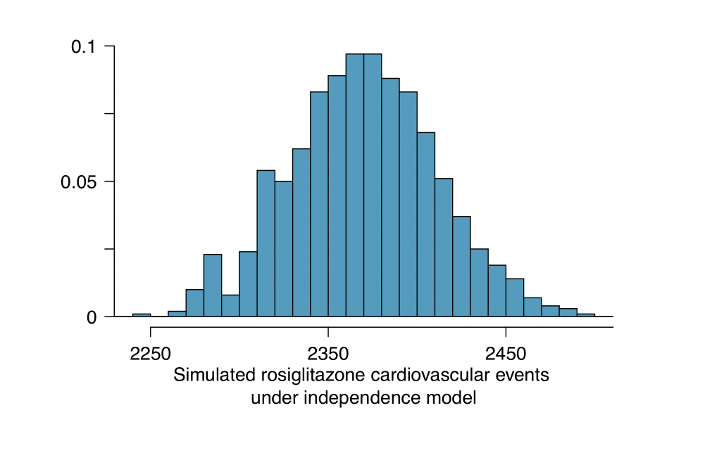
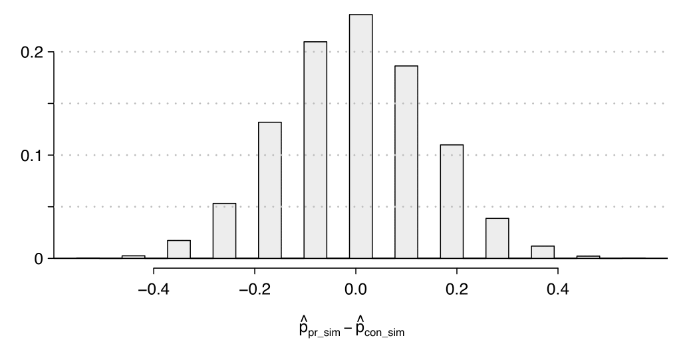

# Dati categorici

## Tabelle di contingenza

### Esercizio 4.1 {-}

*Depressione e stato civile, I parte*

Consideriamo i dati di un medico su 159 pazienti depressi. La seguente
tabella riporta il livello depressivo osservato rispetto allo stato
civile:

|                        |             | **stato civile** |            |            |
|:----------------------:|:-----------:|:----------------:|:----------:|:----------:|
| **livello depressivo** | **sposato** | **celibe**       | **vedovo** | **Totale** |
| **grave**              | 22          | 16               | 19         | 57         |
| **medio**              | 33          | 29               | 14         | 76         |
| **leggero**            | 14          | 9                | 3          | 26         |
| **Totale**             | 69          | 54               | 36         | 159        |

a.  Di che tipo di variabili si tratta?

b.  Determinare la distribuzione marginale di frequenza dello stato
    civile.

c.  Quale é la moda per il carattere livello depressivo?

d.  Quale è la percentuale di pazienti che risultano vedovi e con un
    livello depressivo grave?

e.  Quale è la percentuale di vedovi con livello depressivo grave?

f.  Quale è la percentuale di pazienti con livello depressivo almeno
    pari a un livello 'medio'?

g.  Determinare la distribuzione condizionata, di frequenze assolute e
    di frequenze percentuali, del livello depressivo allo stato civile
    vedovo.

h.  Determinare la distribuzione marginale del livello depressivo e
    confrontarla con la distribuzione condizionata ricavata al punto
    precedente. Cosa si può dire sull'associazione tra i due caratteri?
    
#### Soluzione {- .sol}

a.  Il livello depressivo è un carattere qualitativo ordinato, lo stato
    civile è un carattere qualitativo sconnesso.

b.  La distribuzione marginale dello stato civile è la seguente:

    ::: {.center}
      --------- -------- -------- --------
       sposato   celibe   vedovo   Totale
         69        54       36      159
      --------- -------- -------- --------
    :::

c.  La moda è il livello depressivo 'medio' ovvero la modalità del
    carattere alla quale è associata la massima frequenza.

d.  La percentuale di pazienti che sono simultaneamente vedovi e con
    livello depressivo grave è data da: $$\frac{19}{159} 100 = 11.9\%$$

e.  La percentuale di vedovi che presentano un livello depressivo grave
    è data da $$\frac{19}{36} 100 = 52.8\%$$

f.  Il numero di pazienti con un livello depressivo pari almeno ad un
    livello medio è dato dalla somma tra il numero di pazienti con
    livello depressivo medio e quello con livello depressivo grave,
    $76+57 = 133$. La percentuale richiesta è quindi:
    $$\frac{133}{159} 100 = 84\%$$

g.  la distribuzione condizionata è riportata nella seguente tabella:

    ::: {.center}
       **stato civile**$=$vedovo                   
      --------------------------- ---------------- -----------------------------
        **livello depressivo**     freq. assolute        freq.percentuali
                 grave                   19         $19/ 36 \cdot 100 = 52.8\%$
                 medio                   14          $14/36\cdot 100 = 38.9\%$
                leggero                  3            $3/36\cdot 100 = 8.3\%$
                Totale                   36                     100
    :::

h.  La distribuzione marginale del livello depressivo è la seguente:

    ::: {.center}
      ------------------------ ---------------- ------------------------------
       **livello depressivo**   freq. assolute         freq.percentuali
               grave                  57         $57/ 159 \cdot 100 = 35.8\%$
               medio                  76          $76/159\cdot 100 = 47.8\%$
              leggero                 26          $26/159\cdot 100 = 16.4\%$
               Totale                159                     100
      ------------------------ ---------------- ------------------------------
    :::

    Analizzando la distribuzione condizionata allo stato civile vedovo,
    possiamo notare che la proporzione di vedovi con livello depressivo
    grave è superiore rispetto a quella calcolata sul totale. Dal
    confronto tra distribuzione condizionata e distribuzione marginale
    si può notare che le frequenze percentuali sono diverse, il che
    indica la presenza di un'associazione tra i due caratteri.

### Esercizio 4.2 {-}

*Effetti collaterali di Avandia, I parte.*

**(dal libro di testo *OpenIntro Statistics* di Diez et al., es. 1.51)**\

Il rosiglitazone è il principio attivo presente nella medicina per il
diabete di tipo 2 Avandia ed è stato considerato causa dell'insorgenza
di seri problemi cardiovascolari come infarto, insufficienza cardiaca e
morte. Un trattamento alternativo è il pioglitazone, principio attivo
presente in un'altra medicina per il diabete, Actos. Nella seguente
tabella sono riportati i dati relativi ad uno studio osservazionale
retrospettivo su 22,571 beneficiari di assistenza pubblica di età pari a
65 anni o più.

::: {.center}
                   *Problemi cardiovascolari*            
  --------------- ---------------------------- --------- ---------
   *Trattamento*               Si                 No      Totale
   Rosiglitazone             2,593              65,000    67,593
   Pioglitazone              5,386              154,592   159,978
      Totale                 7,979              219,592   227,571
:::

Determinare se ciascuna delle seguenti affermazioni è vera o falsa. Se
falsa, spiegare perché. Attenzione: il ragionamento può essere sbagliato
anche se la conclusione dell'affermazione è corretta. I questi casi,
l'affermazione dovrebbe essere considerata falsa.

a.   Poiché più pazienti con trattamento pioglitazone hanno avuto
    problemi cardiovascolari (5,386 vs. 2,593), possiamo concludere che
    il tasso di problemi cardiovascolari per quelli a cui è stato
    somministrato questo trattamento è più alto.

b.   I dati suggeriscono che i pazienti diabetici a cui è stato
    somministrato rosiglitazone sono più inclini ad avere problemi
    cardiovascolari poiché il tasso di incidenza è
    ($2,593 / 67,593 = 0.038$) $3.8\%$ per pazienti con questo
    trattamento, mentre solo ($5,386 / 159,978 = 0.034$) $3.4\%$ per
    pazienti a cui è stato somministrato l'altro trattamento
    (pioglitazone).

c.   Il fatto che il tasso di incidenza sia più alto per il gruppo
    rosiglitazone dimostra che il rosiglitazone causa seri problemi
    cardiovascolari.

d.   Sulla base delle informazioni a disposizione, non possiamo dire se
    la differenza tra i tassi di incidenza è dovuta alla relazione tra
    le due variabili o al caso.
    
#### Soluzione {- .sol}

a.   Falso. Invece di confrontare le frequenze assolute, bisognerebbe
    confrontare le percentuali.

b.   Vero.

c.   Falso. Non possiamo dedurre una relazione causale da una
    associazione in uno studio osservazionale. Comunque, possiamo dire
    che il trattamento a cui uno è sottoposto ha un impatto sul rischio
    in questo caso, perché il paziente ha scelto quel trattamento e la
    sua scelta può essere associata ad altre variabili, che è il motivo
    per cui il punto b. è vero. La differenza in queste affermazioni è
    sottile ma importante.

d.   Vero.

## Inferenza su una singola proporzione

### Esercizio 4.3 {-}

*Studenti fumatori*

Su un campione casuale di 100 studenti di un'università, 82 hanno
dichiarato di non essere fumatori. Sulla base di questo, costruisci un
intervallo di confidenza a livello $1-\alpha = 0.99$ per $p$, la
proporzione di tutti gli studenti dell'università che non fumano.\

#### Soluzione {- .sol}

Dobbiamo costruire un intervallo di confidenza per la proporzione $p$ di
tutti gli studenti dell'università che non fumano. Tale intervallo di
confidenza ha la seguente forma
$$\left[\hat{p}-z^{*}\sqrt{\frac{\hat{p}(1-\hat{p})}{n}}, \hat{p}+z^{*}\sqrt{\frac{\hat{p}(1-\hat{p})}{n}}\right]$$
dove

-   $\hat{p}$ è la proporzione di non fumatori nel campione osservato:
    $\hat{p}=\frac{82}{100}=0.82$;

-   $z^{*}$ è il quantile a livello $\alpha/2=(1-0.99)/2=0.005$ di una
    distribuzione Normale standard; dalla tavola C (oppure dalla tavola
    della distribuzione Normale standard) si ha $z^{*}=2.576$;

-   $n = 100$ è la numerosità campionaria.

Sostituendo questi valori, si ottiene il seguente intervallo di
confidenza: $$[0.721,0.919]$$

### Esercizio 4.4 {-}

*Legalizzazione delle droghe leggere *

Un'indagine Gallup studia periodicamente un campione casuale di 1500
americani. La percentuale di individui nel campione che è a favore della
legalizzazione del possesso di marijuana è scesa dal 52% nel 1980 al 46%
nel 1985.

1.  Si costruisca un intervallo di confidenza al 95% per la percentuale
    della popolazione a favore della legalizzazione nel 1980;

2.  Si costruisca un intervallo di confidenza al 95% per la percentuale
    della popolazione a favore della legalizzazione nel 1985.

#### Soluzione {- .sol}
Dobbiamo costruire un intervallo di confidenza per una proporzione:
$$\left[\hat{p}-z^{*}\sqrt{\frac{\hat{p}(1-\hat{p})}{n}} ; \hat{p}+z^{*}\sqrt{\frac{\hat{p}(1-\hat{p})}{n}} \right]$$
Quindi per ciascun anno si ha:

1.  Per l'anno 1980:
    $$\left[0.52 - 1.96 \sqrt{\frac{0.52(1-0.52)}{1500}} ; 0.52 + 1.96 \sqrt{\frac{0.52(1-0.52)}{1500}}\right] = [0.495; 0.545]$$

2.  Per l'anno 1985:
    $$\left[0.46 - 1.96 \sqrt{\frac{0.46(1-0.46)}{1500}} ; 0.46 + 1.96 \sqrt{\frac{0.46(1-0.46)}{1500}}\right] = [0.435; 0.485]$$

### Esercizio 4.5 {-}

*Effetti collaterali di Avandia, II parte. *

 **(dal libro di testo *OpenIntro Statistics* di Diez et al., es. 1.53)**\

Nell'Esercizio 4.2 è stato introdotto uno studio in cui vengono
confrontati i tassi di incidenza di alcune gravi patologie
cardiovascolari per pazienti affetti da diabete, trattati con
rosiglitazone e pioglitazone. La seguente tabella rappresenta i dati
raccolti:

::: {.center}
                   *Problemi cardiovascolari*            
  --------------- ---------------------------- --------- ---------
   *Trattamento*               Si                 No      Totale
   Rosiglitazone             2,593              65,000    67,593
   Pioglitazone              5,386              154,592   159,978
      Totale                 7,979              219,592   227,571
:::

a.   Quale è la proporzione di pazienti sul totale che hanno avuto
    problemi cardiovascolari?

b.   Se il tipo di trattamento e l'insorgenza di problemi cardiovascolari
    fossero indipendenti, quanti pazienti con problemi cardiovascolari
    ci dovremmo aspettare nel gruppo rosiglitazone?

c.   La relazione tra trattamento e outcome in questo studio può essere
    analizzata adottando una tecnica di randomizzazione. L'istogramma
    seguente rappresenta la simulazione dei conteggi degli eventi
    cardiovascolari nel gruppo rosiglitazione assumendo il modello di
    indipendenza. (i) Quali sono le ipotesi sottoposte a verifica? (ii)
    Rispetto al numero calcolato al punto b., fornirebbe maggiore
    supporto all'ipotesi alternativa un numero maggiore o un numero
    minore di pazienti con problemi cardiovascolari nel gruppo
    rosiglitazione? (iii) Cosa suggeriscono i risultati della
    simulazione rispetto alla relazione tra il trattamento
    rosiglitazione e l'insorgenza di problemi cardiovascolari nei
    pazienti diabetici?

#### Soluzione {- .sol}

a.   La proporzione di pazienti che hanno avuto problemi cardiovascolari
    è pari a $\frac{7979}{227571} \approx 0.035$.

b.   Il numero atteso di problemi cardivascolari nel gruppo
    rosiglitazione sotto l'ipotesi di indipendenza, può essere calcolato
    moltiplicando il numero di pazienti di quel gruppo per il tasso
    complessivo di problemi cardiovascolari osservato nello studio,
    ovvero: $67593 \cdot \frac{7979}{227571} = 2730$

c.  \ (i) L'ipotesi nulla $H_0$ corrisponde al modello di indipendenza:
    il trattamento e l'insorgenza di problemi cardiovascolari sono
    indipendenti, ovvero non c'è relazione tra loro, quindi la
    differenza riscontrata nei tassi di incidenza nei due gruppi di
    trattamento è dovuta al caso. L'ipotesi alternativa $H_A$
    corrisponde invece alla negazione del modello di indipendenza: il
    trattamento e l'insorgenza di problemi cardiovascolari non sono
    indipendenti, ovvero la differenza riscontrata nei tassi di
    incidenza nei due gruppi di trattamento non è dovuta al caso, ma il
    rosiglitazione è associato con un maggior rischio di sviluppare
    problemi cardiovascolari. (ii) Un numero di pazienti con problemi
    cardiovascolari nel gruppo rosiglitazione piú elevato rispetto a
    quello atteso sotto l'ipotesi di indipendenza fornirebbe un maggiore
    supporto all'ipotesi alternativa. Questo suggerirebbe che il
    rosiglitazione comporta un incremento del rischio di problemi
    cardiovascolari. (iii) In questo studio sono stati effettivamente
    osservati 2593 eventi cardiovascolari nel gruppo rosiglitazione.
    Nelle 1000 simulazioni effettuate sotto il modello di indipendenza
    sono stati osservati praticamente sempre meno di 2593 eventi, il che
    induce a concludere che i dati osservati non siano compatibili con
    il modello di indipendenza. In altre parole, l'analisi fornisce
    forte evidenza contro l'ipotesi nulla ovvero a supporto dell'ipotesi
    che il rosiglitazione sia associato significativamente con un
    maggiore rischio di problemi cardiovascolari.

### Esercizio 4.6 {-}

*Studenti vegetariani *

**(dal libro di testo *OpenIntro Statistics* di Diez et al., es. 6.1)**\

Supponendo che l' $8\%$ degli studenti siano vegetariani, determinare se
le seguenti affermazioni sono vere o false, fornendo motivazioni
appropriate.

a.   La distribuzione della proporzione campionaria di vegetariani in un
    campione casuale di dimensione 60 è approssimativamente normale dal
    momento che $n \geq 30$.

b.   La distribuzione della proporzione campionaria di vegetariani in un
    campione casuale di dimensione 50 è asimmetrica a destra.

c.   Un campione casuale di 125 studenti di cui il $12\%$ sono
    vegetariani può essere considerato anomalo.

d.   Un campione casuale di 250 studenti di cui il $12\%$ sono
    vegetariani può essere considerato anomalo.

e.   L'errore standard si dimezzerebbe se la dimensione campionaria
    aumentasse da 125 a 250.

#### Soluzione {- .sol}

a.   Falso. Infatti non è soddisfatta la condizione: $np \geq 10$ e
    $n(1 - p) \geq 10$.

b.   Vero. Infatti non è soddisfatta la condizione: $np \geq 10$ e
    $n(1 - p) \geq 10$. Inoltre, nella maggior parte dei campioni ci si
    può aspettare che $\hat{p}$ sia vicina a 0.08 che rappresenta la
    proporzione vera di vegetariani nella popolazione. Mentre $\hat{p}$
    può assumere valori anche di molto superiori a 0.08, sarà certamente
    limitata dal valore 0; ciò implica che la forma della distribuzione
    tenderà ad essere asimmetrica a destra.

c.   Falso. L'errore standard è pari a
    $SE_{\hat{p}} = \sqrt{\frac{p(1-p)}{n}} = 0.0243$ e $\hat{p} = 0.12$
    è distante soltanto $\frac{0.12-0.08}{0.0243} = 1.65 SE$ dalla
    media, cosa che non può essere considerata anomala.

d.   Vero. L'errore standard è pari a
    $SE_{\hat{p}} = \sqrt{\frac{p(1-p)}{n}} = 0.0172$ e $\hat{p} = 0.12$
    è distante soltanto $\frac{0.12-0.08}{0.0172} = 2.32 SE$ dalla media
    e rappresenta quindi un valore anomalo.

e.   Falso. L'errore standard si ridurrebbe di un fattore
    $\frac{1}{\sqrt{2}}$.
    

### Esercizio 4.7 {-}

*Gatti rossi tigrati*

**(dal libro di testo *OpenIntro Statistics* di Diez et al., es. 6.3)**\

Supponendo che il $90\%$ dei gatti rossi tigrati sia maschio,
determinare se le seguenti affermazioni sono vere o false, fornendo
motivazioni appropriate.

a.   La distribuzione della proporzione campionaria di un campione
    casuale di dimensione 30 è asimmetrica a sinistra.

b.   Adottando una dimensione campionaria 4 volte maggiore, lo standard
    error della proporzione campionaria si dimezza.

c.   La distribuzione della proporzione campionaria di un campione
    casuale di dimensione 140 è approssimativamente normale.

d.   La distribuzione della proporzione campionaria di un campione
    casuale di dimensione 280 è approssimativamente normale.

#### Soluzione {- .sol}

a.   Vero. Infatti non è soddisfatta la condizione: $np \geq 10$ e
    $n(1 - p) \geq 10$. Inoltre, nella maggior parte dei campioni ci si
    può aspettare che $\hat{p}$ sia vicina a 0.90 che rappresenta la
    proporzione vera di maschi nella popolazione. Mentre $\hat{p}$ può
    assumere valori anche di molto inferiori a 0.90, sarà certamente
    limitata dal valore 1; ciò implica che la forma della distribuzione
    tenderà ad essere asimmetrica a sinistra.

b.   Vero. Nella formula dell'errore standard compare infatti la radice
    quadrata della numerosità campionaria.

c.   Vero. Sono rispettate sia la condizione di indipendenza sia la
    condizione: $np \geq 10$ e $n(1 - p) \geq 10$.

d.   Vero. Sono rispettate sia la condizione di indipendenza sia la
    condizione: $np \geq 10$ e $n(1 - p) \geq 10$.

### Esercizio 4.8 {-}

*Prop 19 in California*

**(dal libro di testo *OpenIntro Statistics* di Diez et al., es. 6.5)**\

In un'indagine condotta da Survey USA nel 2010, il $70\%$ dei $119$
rispondenti di età compresa tra i 18 e i 34 anni ha affermato che
avrebbe votato a favore della cosiddetta *Prop 19*, un provvedimento per
legalizzare la marjiuana in California modificando la legge vigente e
adottando una opportuna regolamentazione e tassazione. Ad un livello di
confidenza del $95\%$, il margine di errore per questo campione è pari
all'$8\%$. Sulla base di queste informazioni, determinare se le seguenti
affermazioni sono vere o false, fornendo motivazioni appropriate.

a.   Si può essere fiduciosi, con un livello di confidenza del $95\%$,
    che una percentuale di elettori compresa tra il $62\%$ e il $78\%$
    in questo campione voterà a favore della Prop 19.

b.   Si può essere fiduciosi, con un livello di confidenza del $95\%$,
    che tra gli elettori di età tra i 18 e i 34 anni, una percentuale
    compresa tra il $62\%$ e il $78\%$ voterà a favore della Prop 19.

c.   Se si considerassero molti campioni casuali di 119 elettori di età
    tra i 18 e i 34 anni, e si calcolassero i corrispondenti intervalli
    di confidenza, il $95\%$ di essi includerebbe il valore vero della
    proporzione di elettori favorevoli alla Prop 19 nella popolazione.

d.   Per ridurre il margine di errore al $4\%$, è necessario moltiplicare
    la dimensione campionaria per 4.

e.   In base a questo intervallo di confidenza, c'è evidenza sufficiente
    per concludere che la maggioranza degli elettori Californiani di età
    tra i 18 e i 34 anni, supportano la Prop 19.

#### Soluzione {- .sol}

a.   Falso. Un intervallo di confidenza viene costruito per stimare la
    proporzione nella popolazione, non nel campione.

b.   Vero. L'intervallo di confidenza al $95\%$ è $70\% \pm 8\%$.

c.   Vero, per la definizione di intervallo di confidenza.

d.   Vero. Moltiplicando la dimensione campionaria per 4, l'errore
    standard e il margine di errore si riducono di un fattore
    $\frac{1}{\sqrt{4}}$.

e.   Vero. L'intervallo di confidenza al $95\%$ è tutto al di sopra del
    $50\%$.

### Esercizio 4.9 {-}

*Fuochi d'artificio il 4 Luglio *

**(dal libro di testo *OpenIntro Statistics* di Diez et al., es. 6.7)**\

Alla fine di Giugno 2012, Survey USA ha pubblicato i risultati di
un'indagine in cui si diceva che il $56\%$ di 600 residenti del Kansas
scelti in modo casuale aveva programmato di fare i fuochi d'artificio il
4 Luglio. Determinare il margine di errore per la stima puntuale per un
livello di confidenza del $95\%$.

#### Soluzione {- .sol}

Dal momento che il campione considerato è inferiore al 10$\%$ della
popolazione, la condizione di indipendenza è soddisfatta. Anche la
condizione $np \geq 10$ e $n(1 - p) \geq 10$ è verificata. Il margine di
errore è dunque:
$ME = z^* \sqrt{\frac{\hat{p}(1-\hat{p})}{n}} = 1.96 \sqrt{\frac{0.56 \cdot 0.44}{600}} = 0.0397 = 4\%$.

### Esercizio 4.10 {-}

*Vita dopo il college*

**(dal libro di testo *OpenIntro Statistics* di Diez et al., es. 6.9)**\

L'obiettivo di questa indagine è stimare la proporzione di laureati in
una classe di piú di 4500 studenti che hanno trovato un lavoro entro un
anno dalla laurea. Supponendo che 348 su 400 studenti estratti
casualmente abbiano dichiarato di avere un lavoro, rispondere ai
seguenti quesiti.

a.   Descrivere il parametro di interesse della popolazione. Quale è la
    stima puntuale di questo parametro?

b.   Controllare se le condizioni per la costruzione di un intervallo di
    confidenza sono soddisfatte dai dati a disposizione.

c.   Calcolare un intervallo di confidenza al $95\%$ per la proporzione
    di laureati che ha trovato lavoro entro un anno dalla laurea e
    fornire una sua interpretazione.

d.   Cosa significa confidenza al $95\%$?

e.   Calcolare ora un intervallo di confidenza al $99\%$ per la
    proporzione di laureati che ha trovato lavoro entro un anno dalla
    laurea e fornire una sua interpretazione.

f.   Confrontare le ampiezze dei due intervalli al livello $95\%$ e
    $99\%$. Quale è piú ampio? Spiegare il perché.

#### Soluzione {- .sol}

a.   Il parametro di interesse della popolazione è la proporzione di
    laureati che ha trovato lavoro a un anno dalla laurea. La stima
    puntuale è $\hat{p} = 348/400 = 0.87$.

b.   Il campione considerato è inferiore al 10$\%$ della popolazione,
    quindi la condizione di indipendenza è soddisfatta. Anche la
    condizione $np \geq 10$ e $n(1 - p) \geq 10$ è verificata.

c.   L'intervallo è: $(0.8371,0.9029)$. Si può essere fiduciosi al $95\%$
    che approssimativamente una percentuale compresa tra l'$84\%$ e il
    $90\%$ dei laureati abbia trovato lavoro entro un anno dalla laurea.

d.   Significa che estraendo un gran numero di campioni e calcolando gli
    intervalli corrispondenti, si otterrebbe nel $95\%$ dei casi un
    intervallo contenente il valore vero del parametro.

e.   L'intervallo è $(0.8267, 0.9133)$. Si può essere fiduciosi al $99\%$
    che approssimativamente una percentuale compresa tra l'$83\%$ e il
    $91\%$ dei laureati abbia trovato lavoro entro un anno dalla laurea.

f.   L'intervallo a livello $99\%$ è piú ampio, perché richiede un
    livello di fiducia maggiore che la proporzione vera sia contenuta
    all'interno dell'intervallo e quindi deve coprire un range maggiore.
    
### Esercizio 4.11 {-}

*Studiare all'estero*

 **(dal libro di testo *OpenIntro Statistics* di Diez et al., es. 6.11)**\

Un'indagine su 1509 studenti liceali che hanno compilato un questionario
online non obbligatorio tra il 25 e il 30 aprile 2007 mostra che il 55$\%$ degli intervistati è piuttosto sicuro che in seguito parteciperà ad un programma di studio all'estero.

a.   Questo campione è rappresentativo della popolazione di tutti i
    liceali degli Stati Uniti? Spiegare il perché.

b.   Supponendo che le condizioni per fare inferenza siano soddisfatte,
    anche se la risposta al punto a. indicasse che questo approccio non
    è affidabile, questa analisi potrebbe essere ancora interessante.
    Costruire un intervallo di confidenza al $90\%$ per la proporzione
    di studenti che è piuttosto sicura che in seguito parteciperà ad un
    programma di studio all'estero e fornire una sua interpretazione.

c.   Cosa significa confidenza al $90\%$?

d.   In base a questo intervallo, sarebbe corretto affermare che la
    maggior parte degli studenti è piuttosto sicura che in seguito
    parteciperà ad un programma di studio all'estero?

#### Soluzione {- .sol}

a.   No. Si tratta di un campione di volontari, quindi un campione non
    casuale.

b.   $(0.5289, 0.5711)$. Si può essere fiduciosi al $90\%$ che una
    percentuale di studenti compresa tra il $53\%$ e il $57\%$ sia
    piuttosto sicura che in seguito parteciperà ad un programma di
    studio all'estero.

c.   Significa che estraendo un gran numero di campioni e calcolando gli
    intervalli corrispondenti, si otterrebbe nel $90\%$ dei casi un
    intervallo contenente il valore vero del parametro.

d.   Si perché l'intervallo cade al di sopra del valore 0.5.

### Esercizio 4.12 {-}

*Sistema sanitario pubblico, I parte*

 **(dal libro di testo *OpenIntro Statistics* di Diez et al., es. 6.13)**\

Un articolo del Washington Post del 2009 ha riportato che 7 democratici
su 10 sostengono la riforma della sanità, mentre quasi 9 su 10
repubblicani sono contrari a questa riforma. Il 52$\%$ degli
indipendenti sono contro e il 42$\%$ a favore (il $6\%$ rispondono
'altro'). Complessivamente erano stati intervistati 819 democratici, 566
repubblicani e 783 indipendenti.

a.   Una trasmissione televisiva riportando questa notizia, ha affermato
    che la maggior parte degli Indipendenti è contraria alla riforma.
    Questi dati forniscono una forte evidenza a supporto di questa
    affermazione?

b.   Ci si può aspettare che un intervallo di confidenza per la
    proporzione di indipendenti contrari alla riforma includa il valore
    $0.5$? Motivare la risposta.

#### Soluzione {- .sol}

a.   In questo caso si può impostare il seguente sistema di ipotesi:
    $H_0: p = 0.50 \text{   vs   } H_A: p > 0.50$. Le due condizioni
    (indipendenza e $np \geq 10$ e $n(1 - p) \geq 10$) sono entrambe
    verificate. In questo caso si ottiene un valore osservato della
    statistica test $z = 1.12$ che corrisponde ad un p-value pari a
    $0.1314$. Dal momento che il p-value supera la soglia $0.05$, non è
    possibile rifiutare $H_0$, ovvero i dati non forniscono forte
    evidenza a favore dell'affermazione di interesse.

b.   Si, da quanto affermato al punto precedente segue che l'intervallo
    conterrà il valore $0.5$.

### Esercizio 4.13 {-}

*Internet su dispositivi mobili*

 **(dal libro di testo *OpenIntro Statistics* di Diez et al., es. 6.15)**\

Un'indagine del 2012 su 2254 americani adulti ha mostrato che il $17\%$
di coloro che possiedono un telefono cellulare naviga su internet
utilizzando il suo dispositivo mobile anziché un personal computer.

a.   Secondo un articolo pubblicato online, una ricerca condotta da una
    compagnia telefonica ha mostrato che il $38\%$ degli utenti Cinesi
    accede a internet solo attraverso i cellulari. Verificare mediante
    un test di ipotesi se questi dati supportano l'ipotesi che la
    proporzione di Americani che utilizza il telefono cellulare per
    navigare su internet è differente dalla medesima proporzione nella
    popolazione cinese.

b.   Interpretare il p-value ottenuto al punto a.

c.   Calcolare un intervallo al $95\%$ per la proporzione di americani
    che utilizza il telefono cellulare per navigare su internet e
    fornire un'interpretazione.

#### Soluzione {- .sol}

a.   In questo caso si può impostare il seguente sistema di ipotesi:
    $H_0: p = 0.38 \text{   vs   } H_A: p \neq 0.38$. Le due condizioni
    (indipendenza e $np \geq 10$ e $n(1 - p) \geq 10$) sono entrambe
    verificate. Il valore osservato della statistica test è $z = 20.5$ e
    il corrispondente p-value $\approx 0$, Dal momento che il p-value è
    trascurabile si può rifiutare l'ipotesi nulla, quindi i dati
    forniscono forte evidenza che la proporzione di Americani che
    utilizza il telefono cellulare per navigare su internet è diversa
    dalla (in particolare, inferiore alla) proporzione corrispondente
    nella popolazione Cinese.

b.   Se il $38\%$ degli americani usasse il cellulare come mezzo per
    accedere a internet, la probabilità di ottenere un campione casuale
    di 2254 americani in cui una percentuale inferiore o uguale al
    $17\%$ o superiore o uguale al $59\%$ di utenti di internet via
    cellulare sarebbe pressoché trascurabile.

c.   L'intervallo è $(0.1545, 0.1855)$. Si può avere fiducia a livello
    $95\%$ che approssimativamente una percentuale compresa tra il
    $15\%$ e il $18.6\%$ degli americani utilizza il proprio cellulare
    per navigare su internet.
    
### Esercizio 4.14 {-}

*Test sul gusto*

**(dal libro di testo *OpenIntro Statistics* di Diez et al., es. 6.17)**\

Alcune persone sostengono di poter individuare la differenza tra una
bevanda dietetica e una normale al primo sorso. Un ricercatore volendo
sottoporre a verifica questa affermazione, ha estratto un campione
casuale tra queste persone di numerosità pari a 80. Ha poi predisposto
40 bicchieri della bevanda dietetica e 40 di quella normale in modo
casuale e infine ha chiesto a ciascun assaggiatore di provare le bevande
e classificarle come dietetiche o regolari. 53 partecipanti hanno
classificato correttamente le bevande.

a.   Questi dati forniscono forte evidenza del fatto che queste persone
    sono capaci di individuare la differenza tra la bevanda dietetica e
    quella normale? In altre parole, i risultati sono significativamente
    migliori rispetto a un'assegnazione casuale alle due tipologie?

b.   Interpretare il p-value ottenuto al punto a.

#### Soluzione {- .sol}

a.   In questo caso si può impostare il seguente sistema di ipotesi:
    $H_0: p = 0.5 \text{   vs   } H_A: p > 0.5$. Le due condizioni
    (indipendenza e $np \geq 10$ e $n(1 - p) \geq 10$) sono entrambe
    verificate. Il valore osservato della statistica test è $z = 2.91$ e
    il corrispondente p-value è pari a $0.0018$. Poiché il p-value è
    inferiore a 0.05, rifiutiamo l'ipotesi nulla. I dati forniscono
    forte evidenza che il tasso di corretta identificazione della
    tipologia di bevanda di queste persone è significativamente migliore
    rispetto a un'assegnazione casuale.

b.   Se le persone assegnassero casualmente la tipologia di bevanda, la
    probabilità di ottenere una campione casuale in cui 53 persone su 80
    identificassero correttamente la bevanda sarebbe pari a $0.0018$.

### Esercizio 4.15 {-}

*Fumatori universitari *

**(dal libro di testo *OpenIntro Statistics* di Diez et al., es. 6.19)**\

Si vuole stimare la proporzione di studenti universitari fumatori. In un
campione casuale di 200 studenti universitari, 40 sono fumatori.

a.   Calcolare un intervallo di confidenza al $95\%$ per la proporzione
    di studenti universitari fumatori, e fornire un'interpretazione
    dell'intervallo.

b.   Se si volesse un margine di errore non superiore al $2\%$ per
    l'intervallo di confidenza al $95\%$, quale dovrebbe essere la
    dimensione campionaria?

#### Soluzione {-.sol}

a.   Le due condizioni (indipendenza e $np \geq 10$ e $n(1 - p) \geq 10$)
    sono entrambe verificate. L'intervallo di confidenza a livello
    $95\%$ risulta essere $(0.145,0.255)$. Si può avere un livello di
    fiducia del $95\%$ che una percentuale compresa tra il $14\%$ e il
    $25.5\%$ degli studenti universitari fumi.

b.   $z^*  SE$ non deve eccedere il valore 0.02. Dato che $z^* = 1.96$,
    sostituendo la stima puntuale di p, $\hat{p} = 0.2$ nella formula
    dell'errore standard si ha $1.96 \sqrt{0.2(1-0.2)/n} \leq 0.02$, da
    cui segue che la numerosità campionaria dovrà essere almeno pari
    a 1537.

### Esercizio 4.16 {-}

*Sistema sanitario pubblico, II parte*

**(dal libro di testo *OpenIntro Statistics* di Diez et al., es. 6.21)**\

Nell'Esercizio 4.12 si è detto che il $52\%$ degli Indipendenti
intervistati a proposito della riforma del sistema sanitario, si è
dichiarato contrario alla riforma stessa. Se volessimo stimare questo
numero con un margine di errore dell'$1\%$ con un livello di confidenza
del $90\%$, quale dimensione campionaria risulterebbe adeguata a tale
obiettivo?

#### Soluzione {-.sol}

Il margine di errore $z^* SE$ deve essere minore di $0.01$. Poiché
vogliamo un livello di confidenza del $90\%$ avremo $z^* = 1.65$ e
sostituiremo la stima puntuale $\hat{p} = 0.52$ nella formula
$1.96 \sqrt{0.52(1-0.52)/n} \leq 0.01$, ottenendo una numerosità
campionaria maggiore o uguale a 6796.

### Esercizio 4.17 {-}

*Attività in fallimento*

In un campione di 400 proprietari di negozi e piccole imprese, che hanno
dichiarato fallimento, 88 non hanno alcuna esperienza professionale
precedente.

1.  Sottoporre a test l'ipotesi nulla che il 25% di coloro che vanno in
    fallimento non hanno esperienze precedenti al livello di
    significatività del 5% contro l'ipotesi alternativa che la
    percentuale sia inferiore;

2.  Definire il $p-value$ del test e calcolarlo;

3.  Se il livello di significatività fosse stato il 10% l'ipotesi nulla
    sarebbe stata respinta?

#### Soluzione {-.sol}

È un test sulla proporzione di successi. Qui il successo è "il proprietario ha dichiarato fallimento". La proporzione stimata è
$\hat{p}=88/400=0.22$. Useremo l'approssimazione normale della
statistica test, avendo cura di sostituire la deviazione standard con
l'errore standard. Le ipotesi sono:
$$H_0:\: p=p_0=0.25; \qquad H_1:\: p < 0.25$$ Determiniamo il $p-value$:
$$p-value = P(Z<z)$$ La statistica test Z si distribuisce come una
normale standard. Il valore $z$ è il valore della statistica test
osservato nel campione
$$z= \frac{\hat{p} - p_0}{\sqrt{\frac{p_0 (1-p_0)}{n}}} = \frac{0.22 -0.25}{
        \sqrt{\frac{0.25 \cdot (1-0.25)}{400}}} = -1.39$$ Il $p-value$
risulta quindi $$p-value = P(Z<z)=0.0823$$ Non possiamo rifiutare
l'ipotesi $H_0$ a livello di significatività $\alpha = 0.05$ perché
ovviamente il $p-value$ è $>$ 0.05.

Se consideriamo invece un livello di significatività $\alpha = 0.1$,
poiché $p-value < \alpha$, possiamo rifiutare l'ipotesi nulla.

### Esercizio 4.18 {-}

*Educazione in TV*

Un famoso educatore dichiara che piú della metà della popolazione adulta
degli USA è preoccupata dalla carenza di programmi educativi in
televisione. Per raccogliere dati sulla questione, nell'ambito di un
sondaggio nazionale vengono scelti e intervistati 920 individui. Se 478
(52%) degli intervistati dichiarano di essere preoccupati, abbiamo
dimostrato la dichiarazione dell'educatore?\

#### Soluzione {-.sol}

Dobbiamo valutare il seguente sistema di ipotesi per la proporzione $p$
di popolazione americana preoccupata per la carenza di programmi
educativi in televisione: $$H_{0}: p = 0.50 \hspace{2cm} H_{1}:p>0.50$$
Si tratta di un test per proporzioni; in questo caso la statistica test,
$Z$, è definita come
$$Z=\frac{\hat{p}-p_0}{\sqrt{\frac{p_0(1-p_0)}{n}}}$$ dove

-   $\hat{p}$ è la proporzione di individui preoccupati nel campione
    osservato ($\hat{p}=0.52$);

-   $n$ è la numerosità campionaria ($n=920$).

Si dimostra che sotto l'ipotesi nulla $H_{0}$, questa statistica test ha
distribuzione Normale standardizzata, ossia $$Z \sim N(0,1)$$ Al fine di
valutare questo sistema di ipotesi possiamo calcolare il p-value
corrispondente, ossia dobbiamo valutare $Pr(Z>z)$ dove
$z=\frac{\hat{p}-p_{0}}{\sqrt{\frac{p_{0}(1-p_{0})}{n}}}$ con $p_{0}$
valore della proporzione assunta sotto l'ipotesi nulla ($p_{0}=0.5$).
Possiamo quindi calcolare il $p-value$ come segue: $$\begin{aligned}
p-value=Pr(Z > z) &= Pr\left(Z>\frac{\hat{p}-p_{0}}{\sqrt{\frac{p_{0}(1-p_{0})}{n}}}\right)=\\
&= Pr\left(Z> \frac{0.52-0.50}{\sqrt{\frac{0.50(1-0.50)}{920}}}\right)=\\
&= Pr(Z> 1.21)=1-Pr(Z \leq 1.21) = 1-0.887=0.113\end{aligned}$$ dove il
valore 0.877 è stato controllato sulle tavole della distribuzione
Normale standardizzata.\
Concludendo, poiché il $p-value=0.113$, possiamo rifiutare l'ipotesi
nulla e quindi validiamo l'ipotesi dell'educatore, solo se consideriamo
un livello di significatività $\alpha>0.113$ (con $\alpha=0.05$ o
$\alpha=0.10$ l'ipotesi nulla non viene rifiutata).

### Esercizio 4.19 {-}

*Pubblicazioni su riviste internazionali*

Un professore ritiene che la percentuale di ricercatori che, nel suo
settore scientifico disciplinare, pubblicano su riviste internazionali è
pari al 70%. In un campione di 160 ricercatori, 108 hanno pubblicazioni
internazionali. Verificare il seguente sistema di ipotesi:
$$H_{0}: p = 0.7 \       \ H_{1}: p <0.7$$

#### Soluzione {-.sol}
Anche in questo caso possiamo procedere come fatto nel precedente
esercizio calcolando il p-value come segue
($\hat{p}=\frac{108}{160}=0.675$): $$\begin{aligned}
p-value&=Pr(Z<z)=Pr\left(Z<\frac{\hat{p}-p_{0}}{\sqrt{\frac{p_{0}(1-p_{0})}{n}}}\right)=\\
&= Pr \left(Z< \frac{0.675-0.70}{\sqrt{\frac{0.70(1-0.70)}{160}}}\right)= Pr(Z < -0.69) = 0.2451\end{aligned}$$
Pertanto, il valore minimo di $\alpha$ per rifiutare l'ipotesi nulla è
0.25.

### Esercizio 4.20 {-}

*Bullismo nelle scuole *

**(dal libro di testo *OpenIntro Statistics* di Diez et al., es. 6.47)**\

In un'indagine campionaria USA del 2012 i residenti in Florida sono
stati interrogati su quanto grande fosse secondo loro il problema del
bullismo nelle scuole locali. 9 su 191 tra i 18 e i 34 anni hanno
risposto che il bullismo non è affatto un problema. Usando questi dati,
è possibile costruire un intervallo di confidenza utilizzando la formula
$\widehat{p}\pm z^* \sqrt{\widehat{p} (1-\widehat{p})/n}$ per la
proporzione vera di residenti in Florida di età 18-34 che pensano che il
bullismo non sia per niente un problema? Se si ritiene appropriato,
costruire l'intervallo di confidenza, altrimenti, spiegare il perché.

#### Soluzione {-.sol} 

Non è appropriato. Ci sono solo 9 successi nel campione,
quindi, la condizione $np \geq 10$ e $n(1 - p) \geq 10$ non è
verificata.

## Inferenza sulla differenza tra due proporzioni

### Esercizio 4.21 {-}

*Esperimento sociologico, I parte *

 **(dal libro di testo *OpenIntro Statistics* di Diez et al., es. 6.23)**\

Un esperimento sociologico condotto da un programma televisivo ha
analizzato il comportamento di alcune persone quando assistono a un
litigio di coppia in cui la donna viene palesemente offesa dall'uomo, in
due differenti occasioni allo stesso ristorante. Nel primo caso la donna
è vestita in modo provocante e nell'altro caso è invece abbligliata in
modo castigato. La seguente tabella riassume i dati raccolti su quante
persone hanno deciso di intervenire o meno:

::: {.center}
                     Provocante   Castigato   Totale
  ----------------- ------------ ----------- --------
     Intervenuti         5           15         20
   Non intervenuti       15          10         25
       Totale            20          25         45
:::

Spiegare perché la distribuzione campionaria della differenza tra le
proporzioni di intervento sotto i due scenari non segue una
distribuzione approssimativamente normale.

#### Soluzione {-.sol}

Si tratta di un esperimento non randomizzato e non è chiaro se le
persone possono essere influenzato dal comportamento degli altri
avventori del ristorante. In questo caso non è quindi possibile assumere
l'indipendenza. In piú ci sono solo 5 persone intervenute nel caso dello
scenario 'Provocante', quindi non vale neanche la condizione
$np \geq 10$ e $n(1 - p) \geq 10$. Anche se considerassimo un test di
ipotesi basato su una media delle proporzioni, tale condizione non
potrebbe essere soddisfatta. Per questi motivi non è possibile assumere
che la distribuzione campionaria della differenza delle proporzioni sia
approssimativamente normale.

### Esercizio 4.22 {-}

*Sesso e preferenze sui colori *

 **(dal libro di testo *OpenIntro Statistics* di Diez et al., es. 6.25)**\

In uno studio del 2001, 1924 maschi e 3666 femmine tra gli studenti del
college sono stati intervestati in merito al loro colore preferito. Un
intervallo al $95\%$ per la differenza tra le proporzioni di maschi e
femmine il cui colore preferito è il nero $(p_{male}-p_{female})$ è
risultato essere $(0.02,0.06)$. Sulla base di questa informazione,
determinare se le seguenti affermazioni sono vere o false, motivando la
risposta.

a.   Si può essere fiduciosi al $95\%$ che la proporzione vera di maschi
    il cui colore preferito è nero sia il $2\%$ inferiore e il $6\%$
    superiore rispetto alla proporzione vera di femmine.

b.   Si può essere fiduciosi al $95\%$ che la proporzione vera di maschi
    il cui colore preferito è nero sia tra il $2\%$ e il $6\%$ superiore
    rispetto alla proporzione vera di femmine.

c.   Il $95\%$ dei campioni casuali produrrà intervalli di confidenza che
    includono la differenza vera tra le proporzioni di maschi e femmine
    il cui colore preferito è nero.

d.   Possiamo concludere che c'è una differenza significativa tra le
    proporzioni di maschi e femmine il cui colore preferito è nero e che
    la grandezza della differenza tra le due proporzioni campionarie sia
    plausibilmente imputabile al caso.

e.   L'intervallo di confidenza al $95\%$ per $(p_{female}-p_{male})$ non
    può essere calcolato sulla base delle informazioni disponibili in
    questo esercizio

#### Soluzione {-.sol}

-   Falso. L'intero intervallo di confidenza supera lo 0.

-   Vero.

-   Vero.

-   Vero.

-   Falso. Si può ottenere banalmente cambiando i segni all'intervallo
    di cui sopra, ovvero $(-0.06,-0.02)$.

### Esercizio 4.23 {-}

*Esperimento sociologico, II parte *

**(dal libro di testo *OpenIntro Statistics* di Diez et al., es. 6.51)**\

Nell'esercizio 4.21 è stato introdotto un esperimento sociologico
condotto da un programma televisivo in cui è stato analizzato il
comportamento di alcune persone quando assistono a un litigio di coppia
in cui la donna viene palesemente offesa dall'uomo, in due differenti
occasioni allo stesso ristorante. Nel primo caso la donna è vestita in
modo provocante e nell'altro caso è invece in modo castigato. La
seguente tabella riassume i dati raccolti su quante persone hanno deciso
di intervenire o meno:

::: {.center}
                     Provocante   Castigato   Totale
  ----------------- ------------ ----------- --------
     Intervenuti         5           15         20
   Non intervenuti       15          10         25
       Totale            20          25         45
:::

Una simulazione è stata effettuata per verificare se le persone
reagiscono in maniera diversa nelle due situazioni. 10000 differenze
simulate sono state generate per costruire la distribuzione sotto
l'ipotesi nulla. Il valore $\widehat{p}_{pr,sim}$ rappresenta la
proporzione di clienti che è intervenuta nella simulazione per difendere
una donna vestita in modo provocante e $\widehat{p}_{con,sim}$ la
proporzione che è intervenuta per una donna vestita in modo castigato.

a.   Quali sono le ipotesi? Per gli scopi di questo esercizio, si può
    assumere che ogni persona osservata al ristorante si comporti in
    modo indipendente, anche se tale assunzione dovrebbe essere
    verificata in modo rigoroso se volessimo riportare ufficialmente i
    risultati dei questo esperimento.

b.   Calcolare la differenza osservata tra i tassi di intervento nelle
    due situazioni: $p_{pr}-p_{con}$.

c.   Stimare il $p$-value usando il grafico riportato sopra. Cosa si può
    dedurre?

#### Soluzione {-.sol} 
Il suffisso ${}_{pr}$ corrisponde a provocante e
${}_{con}$ a castigato.

a.   $H_0$: $p_{pr}=p_{con}$. $H_A$: $p_{pr}\neq p_{con}$.

b.   -0.35.

c.   La coda sinistra per il $p$-value è calcolata sommando $0.005$ e
    $0.015$. Raddoppiando tale valore ($0.02$) si ottiene che il
    $p$-value è pari a 0.04. (Gli studenti possono ottenere risultati
    approssimati, e un piccolo numero di studenti può ottenere un
    $p$-value pari a 0.05.) Poiché il $p$-value è piccolo, rifiutiamo
    $H_0$. I dati forniscono una forte evidenza empirica che le persone
    reagiscono in modo diverso nelle due situazioni.

### Esercizio 4.24 {-}

*Sistema sanitario pubblico, III parte *

**(dal libro di testo *OpenIntro Statistics* di Diez et al., es. 6.27)**\

L'esercizio 4.12 presenta i risultati di un sondaggio per valutare il
sostegno alla riforma del sistema sanitario nel 2009. Il $70\%$ dei
democratici e il $42\%$ degli indipendenti supporta tale riforma.

a.   Costruire l'intervallo di confidenza al $95\%$ per la differenza tra
    $p_D$ e $p_I$, ($p_D - p_I$), e commentare i risultati. Già sono
    state verificate le condizioni.

b.   Vero o falso: se estraiamo casualmente un democratico e un
    indipendente, contemporaneamente, dal campione preso in esame, è più
    probabile che un democratico sostenga la riforma del sistema
    sanitario piuttosto che un indipendente.

#### Soluzione {-.sol}

a.   L'intervallo di confidenza al $95\%$ è $(0.23, 0.33)$. Quindi, siamo
    sicuri al $95\%$ che la proporzione di Democratici che sostiene il
    sistema sanitario pubblico è da $23\%$ a $33\%$ più alta della
    proporzione di Indipendentisti.

b.   Vero.

### Esercizio 4.25 {-}

*Trivellazione in mare aperto, I parte *

**(dal libro di testo *OpenIntro Statistics* di Diez et al., es. 6.29)**\

Un'indagine del 2010 ha chiesto a 827 elettori scelti casualmente in
California \"Sei a favore o contro la trivellazione per estrarre
petrolio e gas naturale al largo delle coste della California? Oppure
non ne sai abbastanza per esprimerti?\" Di seguito è riportata la
distribuzione delle risposte, in cui gli elettori sono stati divisi tra
laureati e non laureati.

::: {.center}
  ------------ ---------- --------------
                Laureati   Non laureati
   Favorevoli     154          132
    Contrari      180          126
   Non sanno      104          131
     Totale       438          389
  ------------ ---------- --------------
:::

a.   Qual è la percentuale di laureati e quale la percentuale di non
    laureati in questo campione che non ne sa abbastanza per avere
    un'opinione sull'estrazione di petrolio e gas naturale al largo
    delle coste della California?

b.   Usare un test d'ipotesi per determinare se vi è una forte evidenza
    empirica per cui la proporzione di laureati che non ha un'opinione
    sull'argomento è diversa dalla proporzione di non laureati.

#### Soluzione {-.sol}

a.   Laureati: $23,7\%$. Non laureati: $33,7\%$.

b.   Siano $p_{L}$ e $p_{NL}$, rispettivamente, la proporzione di
    laureati e la proporzione di non laureati che hanno risposto "non
    so". $H_0: p_{L}=p_{NL}$ e $H_A: p_{L}\neq p_{NL}$. Le due
    condizioni (indipendenza e $np \geq 10$ e $n(1 - p) \geq 10$) sono
    entrambe verificate. Per la seconda condizione si usa la proporzione
    empirica/stimata ($\widehat{p}=235/827=0,284$).
    $Z=-3.18 \rightarrow$ $p$-value$=0.0014$. Poiché il $p$-value è
    molto piccolo, si rifiuta $H_0$. C'è abbastanza evidenza
    sperimentale per poter rifiutare l'ipotesi nulla, in altre parole la
    differenza tra laureati e non laureati che non hanno un'opinione
    sull'argomento è statisticamente significativa. I dati indicano
    anche che meno laureati che non laureati hanno risposto "non so"
    (cioè i dati indicano la direzione dopo il rifiuto di $H_0$).

### Esercizio 4.26 {-}

*Trivellazione in mare aperto, II parte *

**(dal libro di testo *OpenIntro Statistics* di Diez et al., es. 6.31)**\

I risultati di un'indagine sulla trivellazione per l'estrazione di
petrolio e gas naturale al largo della costa della California sono stati
introdotti nell'Esercizio 4.25.

a.   Qual è la percentuale di laureati e quale la percentuale di non
    laureati in questo campione che è a favore dell'estrazione di
    petrolio e gas naturale al largo delle coste della California?

b.   Usare un test d'ipotesi per determinare se vi è una forte evidenza
    empirica per cui la proporzione di laureati che è favorevole è
    diversa dalla proporzione di non laureati.

#### Soluzione {-.sol}

a.   Laureati: $35,2\%$. Non laureati: $33,9\%$.

b.   Siano $p_{L}$ e $p_{NL}$, rispettivamente, la proporzione di
    laureati e la proporzione di non laureati che sono favorevoli.
    $H_0: p_{L}=p_{NL}$ e $H_A: p_{L}\neq p_{NL}$. Le due condizioni
    (indipendenza e $np \geq 10$ e $n(1 - p) \geq 10$) sono entrambe
    verificate. Per la seconda si usa la proporzione empirica/stimata
    ($\widehat{p}=286/827=0.346$). $Z=0.39 \rightarrow$
    $p$-value$=0.6966$. Poiché il $p$-value è maggiore di $\alpha$
    (0.05), non si può rifiutare $H_0$. Non c'è abbastanza evidenza
    sperimentale per poter rifiutare l'ipotesi nulla, in altre parole la
    differenza tra laureati e non laureati che sono favorevoli alla
    trivellazione in California non è statisticamente significativa.

### Esercizio 4.27 {-}

*Carenza di sonno dei lavoratori del mondo dei trasporti *

**(dal libro di testo *OpenIntro Statistics* di Diez et al., es. 6.33)**\

La Fondazione del sonno statunitense ha condotto un'indagine sulle
abitudini di un campione aleatorio di lavoratori dei trasporti e un
campione controllo di persone che non lavorano nel mondo dei trasporti.
I risultati dell'indagine sono riportati sotto.

::: {.center}
  -------------- ------------- -------------------------- ------------ ----------- ---------------
                                Lavoratori dei Trasporti                           
                                                                        Operatori      Autisti
   Ore di sonno   *Controllo*            Piloti            Camionisti     treno     bus/taxi/limo
       $<6$           35                   19                  35          29            21
     $[6, 8]$         193                 132                 117          119           131
       $>8$           64                   51                  51          32            58
      Totale          292                 202                 203          180           210
  -------------- ------------- -------------------------- ------------ ----------- ---------------
:::

Usare un test d'ipotesi per valutare se i dati forniscono una forte
evidenza sulla significatività della differenza tra la proporzione di
camionisti e il gruppo controllo che dormono meno di 6 ore al giorno,
cioè che sono considerati carenti di sonno.

#### Soluzione {-.sol}

Indichiamo con $NT$ il gruppo controllo e con $C$ i
camionisti. $H_0: p_{NT}=p_{C}$ e $H_A: p_{NT}\neq p_{C}$. Le due
condizioni (indipendenza e $np \geq 10$ e $n(1 - p) \geq 10$) sono
entrambe verificate. Per la seconda si usa la proporzione
empirica/stimata ($\widehat{p}=70/495=0,141$). $Z=-1,58 \rightarrow$
$p$-value$=0,1164$. Poiché il $p$-value è maggiore di $\alpha$ (0,05),
non si può rifiutare $H_0$. Non c'è una forte evidenza sperimentale per
poter rifiutare l'ipotesi nulla. La differenza tra i tassi di carenza di
sonno del gruppo controllo e il gruppo dei camionisti non è
statisticamente significativa.

### Esercizio 4.28 {-}

*HIV in Africa sub-Sahariana *

**(dal libro di testo *OpenIntro Statistics* di Diez et al., es. 6.35)**\

A luglio 2008 gli istituti nazionali statunitensi di sanità hanno
annunciato che era stato interrotto uno studio clinico a causa di
risultati inaspettati. La popolazione oggetto di studio era formata da
donne dell'Africa sub-Sahariana a cui era stata somministrata una
singola dose di Nevaripine (un trattamento per l'HIV) durante il parto,
per prevenire la trasmissione dell'HIV al neonato. Con questo studio ci
si chiedeva se proseguire il trattamento dopo il parto con Nevaripine
oppure con il trattamento alternativo Lopinavir. Allo studio hanno
partecipato 240 donne; 120, aleatoriamente scelte, per ogni trattamento.
Ventiquattro settimane dopo aver iniziato lo studio sul trattamento,
ogni donna è stata analizzata per vedere se la situazione era peggiorata
(un risultato chiamato fallimento virologico). Un fallimento virologico
è stato riscontrato su 26 delle 120 donne trattate con Nevaripine e 10
delle 120 donne a cui era stato somministrato l'altro trattamento.

a.   Costruire una tabella a due vie in cui vengono riportati i risultati
    dello studio.

b.   Definire un appropriato test d'ipotesi per verificare l'indipendenza
    tra trattamento e fallimento virologico.

c.   Analizzare i risultati del test d'ipotesi e trarre le conclusioni.
    (N.B: verificare tutte le condizioni necessarie per il test.)

#### Soluzione {-.sol}

a.   Sintesi dello studio

::: {.center}
                Fallimento Virale        
  ------------ ------------------- ----- --------
                       Si           No    Totale
   Nevaripine          26           94     120
   Lopinavir           10           110    120
     Totale            36           204    240
:::

b.   $H_0: p_N=p_L$. Non c'è differenza tra i tassi di fallimento
    virologico nei due gruppi (Nevaripine e Lopinavir).
    $H_A: p_N \neq p_L$. C'è differenza tra i tassi di fallimento
    virologico nei due gruppi.

c.   È stata usata un'assegnazione aleatoria, quindi, le osservazioni in
    ciascun gruppo sono indipendenti. Se i pazienti in uno studio sono
    rappresentativi di quelli dell'intera popolazione (impossibile da
    verificare con le informazioni a disposizione), allora possiamo
    anche generalizzare i risultati alla popolazione. La condizione
    $np \geq 10$ e $n(1 - p) \geq 10$, che si verifica usando la
    proporzione campionaria ($\widehat{p}=36/240=0.15$), è soddisfatta.
    $Z=3.04 \rightarrow$ $p$-value$=0.0024$. Poiché il $p$-value è
    piccolo, si può rifiutare $H_0$. C'è una forte evidenza sperimentale
    per poter rifiutare l'ipotesi nulla. La differenza tra i tassi di
    fallimento virologico del gruppo Nevaripine e del gruppo Lopinavir è
    statisticamente significativa.

## Verifica della bontà di adattamento

### Esercizio 4.29 {-}

 *Vero o Falso, I Parte*

**(dal libro di testo *OpenIntro Statistics* di Diez et al., es. 6.37)**\

Indicare se le seguenti affermazioni sono vere o false. Per ogni
affermazione falsa, suggerire un modo alternativo di scriverla per
renderla vera.

a.   La distribuzione $\chi^2$, così come la distribuzione Normale, ha
    due parametri, la media e la deviazione standard.

b.   La distribuzione $\chi^2$ è sempre asimmetrica a destra, qualsiasi
    sia il valore del parametro "gradi di libertà".

c.   La statistica Chi quadrato ($X^2$) è sempre positiva.

d.   All'aumentare dei gradi di libertà, la forma della distribuzione
    $\chi^2$ diventa più asimmetrica.

#### Soluzione{-.sol}

a.   Falso. La distribuzione $\chi^2$ ha un parametro chiamato "gradi di
    libertà".

b.   Vero.

c.   Vero.

d.   Falso. All'aumentare dei gradi di libertà, la forma della
    distribuzione $\chi^2$ diventa più simmetrica.

### Esercizio 4.30 {-}

 *Libro di testo open-source*

 **(dal libro di testo *OpenIntro Statistics* di Diez et al., es. 6.39)**\

Un professore che usa un libro di introduzione alla statistica
open-source prevede che il $60\%$ degli studenti comprerà una copia
cartacea del libro, il $25\%$ stamperà il libro dal web e il $15\%$ lo
leggerà online. Alla fine del semestre chiede ai suoi studenti di
rispondere a un questionario dove dovranno indicare qual è il formato
del libro che hanno usato. Dei $126$ studenti, $71$ hanno detto di aver
comprato una copia cartacea del libro, $30$ lo hanno stampato dal web e
$25$ lo hanno letto online.

a.   Definire le ipotesi per verificare se le previsioni del professore
    erano accurate.

b.   Quanti studenti il professore si aspettava che comprassero il libro,
    lo stampassero e lo leggessero esclusivamente online?

c.   Si tratta di una situazione appropriata per usare un test Chi
    quadrato. Elencare le condizioni richieste per tale test e
    verificare che siano soddisfatte.

d.   Calcolare la statistica Chi quadrato, i gradi di libertà associati e
    il $p$-value.

e.   Sulla base del $p$-value calcolato, cosa possiamo concludere?
    Commentare i risultati ottenuti

#### Soluzione {-.sol}

a.   $H_0:$ La distribuzione del formato del libro usato dagli studenti è
    quella prevista dal professore. $H_A:$ La distribuzione del formato
    del libro usato dagli studenti non è quella prevista dal professore

b.   $E_{\textit{copia cartacea}}=126 \times 0.60=75.6$.
    $E_{\textit{stampa}}=126 \times 0.25=31.5$.
    $E_{\textit{online}}=126 \times 0.15=18.9$

c.   Indipendenza: il campione non è aleatorio. Comunque, se il
    professore ritiene che le proporzioni siano stabili da un periodo
    (semestre) al successivo e che le abitudini degli studenti non siano
    influenzate da quelle degli altri, allora l'indipendenza è
    probabilmente ragionevole.

d.   $X^2=2.32$, i gradi di libertà sono 2 e il $p$-value è maggiore di
    $0.3$.

e.   Poiché il $p$-value è grande, non possiamo rifiutare $H_0$. I dati
    non forniscono una forte evidenza che indichi che le previsioni del
    professore siano statisticamente non significative.

## Test di indipendenza

### Esercizio 4.31 {-}

 *Depressione e stato civile, II parte *

Torniamo a considerare i dati relativi all'Esercizio 4.1.
La seguente tabella riporta il livello depressivo osservato rispetto
allo stato civile:

::: {.center}
                            **stato civile**                    
  ------------------------ ------------------ -------- -------- --------
   **livello depressivo**       sposato        celibe   vedovo   Totale
           grave                   22            16       19       57
           medio                   33            29       14       76
          leggero                  14            9        3        26
           Totale                  69            54       36      159
:::

1.  Determinare la distribuzione marginale e la distribuzione
    condizionata del livello depressivo allo stato civile vedovo e
    confrontarle. Cosa si può dire sull'associazione tra i due
    caratteri?

2.  Verificare con un opportuno test l'ipotesi che ci sia associazione
    tra i due caratteri fissando il livello di significatività a 0.05.

#### Soluzione {-.sol}

1.  La distribuzione marginale del livello depressivo è la seguente:

::: {.center}
  ------------------------ ---------------- ------------------------------
   **livello depressivo**   freq. assolute         freq.percentuali
           grave                  57         $57/ 159 \cdot 100 = 35.8\%$
           medio                  76          $76/159\cdot 100 = 47.8\%$
          leggero                 26          $26/159\cdot 100 = 16.3\%$
           Totale                159                     100
  ------------------------ ---------------- ------------------------------
:::

  La distribuzione condizionata del livello depressivo allo stato
    civile vedovo è riportata nella seguente tabella:

::: {.center}
   **stato civile**$=$vedovo                   
  --------------------------- ---------------- -----------------------------
    **livello depressivo**     freq. assolute        freq.percentuali
             grave                   19         $19/ 36 \cdot 100 = 52.8\%$
             medio                   14          $14/36\cdot 100 = 38.9\%$
            leggero                  3            $3/36\cdot 100 = 8.3\%$
            Totale                   36                     100
:::

  Analizzando la distribuzione condizionata allo stato civile vedovo,
    possiamo notare che la proporzione di vedovi con livello depressivo
    grave è superiore rispetto a quella calcolata sul totale. Dal
    confronto tra distribuzione condizionata e distribuzione marginale
    si può notare che le frequenze percentuali sono diverse, il che
    indica la presenza di un'associazione tra i due caratteri. **Non
    possiamo dire però se questa associazione sia significativa o no.**

2.  Il test Chi quadrato ci consente di verificare il seguente test di
    ipotesi:

  $H_0:$ il livello depressivo non è associato allo stato civile

  $H_A:$ c'è un'associazione significativa tra livello depressivo e
    stato civile

  La statistica test
    $$X^2 = \sum_i \sum_j \frac{\left(n_{ij}-\frac{n_{i0} n_{0j}}{n}\right)^2}{\frac{n_{i0} n_{0j}}{n}} = n \left( \sum_i \sum_j \frac{n^2_{ij}}{n_{i0}n_{0j}}-1\right)$$
    si distribuisce, sotto l'ipotesi nulla come una v.a. Chi quadrato
    con $(r-1)(c-1) = 4$ gradi di libertà (dove $r$ e $c$ indicano
    rispettivamente il numero di righe e il numero di colonne della
    tabella di contingenza).

  Calcoliamo innanzi tutto il valore osservato della statistica test
    Chi-quadrato che esprime una misura della distanza tra frequenze
    osservate e frequenze teoriche. Si noti che le due formule sono
    equivalenti, ma la seconda ci consente di abbreviare i calcoli,
    ottenendo:

  $$\chi^2 = 159 \left( \frac{22^2}{57 \cdot 69}+\frac{16^2}{57 \cdot 54} +\frac{19^2}{57 \cdot 36}+\frac{33^2}{76 \cdot 69} + \right.$$
    $$\left.
    +\frac{29^2}{76 \cdot 54}+\frac{14^2}{76 \cdot 36}+\frac{14^2}{26 \cdot 69}+\frac{9^2}{54 \cdot 26}+\frac{3^2}{36 \cdot 26} -1  \right) = 6.828$$

  Possiamo ora calcolare il p-value, ovvero la probabilità di
    osservare un valore della statistica test Chi-quadrato piú estremo
    di quello effettivamente osservato:

  $$P\left(X^2_{(r-1)(c-1)} > \chi^2\right) = P\left(X^2_{4} > 6.828 \right) = 0.14$$

  Poiché il p-value è pari a $0.14 > 0.05 = \alpha$, possiamo
    concludere che non c'è abbastanza evidenza sperimentale per poter
    rifiutare l'ipotesi nulla, in altre parole l'associazione tra
    livello depressivo e stato civile non è statisticamente
    significativa.

### Esercizio 4.32 {-}

 *Smettere di fumare *

**(dal libro di testo *OpenIntro Statistics* di Diez et al., es. 6.41)**\

Far parte di un gruppo di sostegno influenza la capacità delle persone
di smettere di fumare? Il ministero della salute ha coinvolto 400
fumatori in un esperimento aleatorio. 150 partecipanti hanno usato un
cerotto alla nicotina e hanno incontrato settimanalmente un gruppo di
sostegno.; gli altri 150 hanno usato il cerotto ma non hanno incontrato
il gruppo di sostegno. Alla fine dell'esperimento, 40 partecipanti del
primo gruppo ha smesso di fumare mentre solo 30 fumatori del secondo
gruppo ha smesso di fumare.

a.   Creare una tabella a doppia entrata riportando i risultati di questo
    studio.

b.   Rispondere a ciascuna delle seguenti domande sotto l'ipotesi nulla
    che essere parte di un gruppo di sostegno non influenza la capacità
    di smettere di fumare, ed indicare se i valori attesi sono più alti
    o più bassi di quelli osservati.
    
      i.   Quanti soggetti del primo gruppo ti aspetti che smettano di fumare?
      ii.   Quanti soggetti del secondo gruppo ti aspetti che smettano di fumare?
        
#### Soluzione {-.sol}

a.   La tabella a doppia entrata è la seguente

::: {.center}
  ------------------------------ -------------------- ----- -------- --
                                  Smettere di fumare                 
           Trattamento                    Si           No    Totale  
   Cerotto + gruppo di sostegno           40           110    150    
           Solo cerotto                   30           120    150    
              Totale                      70           230    300    
  ------------------------------ -------------------- ----- -------- --
:::

b-i.   $E_{\textit{rig1, col1}}=\dfrac{(\textit{totale riga 1}) \times(\textit{totale colonna 1})}{\textit{totale tabella}}=\dfrac{150 \times 70}{300}=35$. Questo valore è più piccolo di quello osservato.

b-ii.   $E_{\textit{rig2, col2}}=\dfrac{(\textit{totale riga 2}) \times(\textit{totale colonna 2})}{\textit{totale tabella}}=\dfrac{150 \times 230}{300}=115$. Questo valore è più piccolo di quello osservato.

### Esercizio 4.33 {-}

 *Trivellazione in mare aperto, III parte *

**(dal libro di testo *OpenIntro Statistics* di Diez et al., es. 6.43)**\

La tabella sotto sintetizza il dataset analizzato nell'Esercizio 4.25 dove sono
riportate le risposte di un campione aleatorio di laureati e non
laureati sul tema della trivellazione. Usare un test Chi quadrato per
verificare se c'è una differenza statisticamente significativa tra le
risposte dei laureati e quelle dei non laureati.

::: {.center}
                Laureati   Non laureati
  ------------ ---------- --------------
   Favorevoli     154          132
    Contrari      180          126
   Non sanno      104          131
     Totale       438          389
:::

#### Soluzione{-.sol}

$H_0$: L'opinione dei laureati e dei non laureati è
differente sul tema della trivellazione per estrarre petrolio e gas
naturale al largo delle coste della California. $H_A$: L'opinione
riguardante la trivellazione per estrarre petrolio e gas naturale al
largo delle coste della California ha un'associazione con l'essere
laureati oppure no.

$$E_{\textit{rig1, col1}}=151.5 \qquad E_{\textit{rig1, col2}}=134.5$$
$$E_{\textit{rig2, col1}}=162.1 \qquad E_{\textit{rig2, col2}}=143.9$$
$$E_{\textit{rig3, col1}}=124.5 \qquad E_{\textit{rig3, col2}}=110.5$$

Indipendenza: i campioni sono entrambi aleatori, non collegati ed
estratti da meno del $10\%$ della popolazione, perciò l'ipotesi di
indipendenza tra le osservazioni è ragionevole. Campione: tutti le
frequenze osservate sono almeno pari a 5. Gradi di libertà:
$(R-1) \times (C-1)=(3-1) \times (2-1)=2$, che è più grande di 1.
$X^2=11.47$ e $p$-value compreso tra 0.001 e 0.005. Quindi c'è una forte
evidenza empirica sull'associazione tra supportare la trivellazione e
l'essere laureati.

### Esercizio 4.34 {-}

 *Privacy su Facebook *

**(dal libro di testo *OpenIntro Statistics* di Diez et al., es. 6.45)**\

In un'indagine del 2011 806 utenti Facebook adulti, scelti
aleatoriamente, sono stati interrogati sulle loro impostazioni sulla
privacy di Facebook. Una delle domande era "Sai come cambiare le
impostazioni riguardanti privacy di Facebook per controllare le persone
che possono e non possono vederti?". Le risposte sono riportate nella
seguente tabella divise per genere.

::: {.center}
             Genere               
  -------- ---------- ----------- --------
            Maschile   Femminile   Totale
     Si       288         378       666
     No        61         62        123
   Non so      10          7         17
   Totale     359         447       806
:::

a.   Definire un test d'ipotesi per verificare l'indipendenza tra genere
    e la capacità degli utenti di Facebook di modificare le impostazioni
    sulla privacy.

b.   Verificare tutte le condizioni necessarie per il test e determinare
    se è possibile utilizzare un test Chi quadrato.

#### Soluzione{-.sol}

a.   $H_0$: Non c'è relazione tra genere e la capacità degli utenti di
    Facebook di modificare le impostazioni sulla privacy. $H_A$: C'è una
    relazione tra genere e la capacità degli utenti di Facebook di
    modificare le impostazioni sulla privacy.

a.   I valori attesi sono:

  $$E_{\textit{rig1, col1}}=296.6 \qquad E_{\textit{rig1, col2}}=369.3$$
    $$E_{\textit{rig2, col1}}=54.8 \qquad E_{\textit{rig2, col2}}=68.2$$
    $$E_{\textit{rig3, col1}}=7.6 \qquad E_{\textit{rig3, col2}}=9.4$$

  Il campione è aleatorio, tutti i valori attesi sono più grandi di 5
    e i gradi di libertà sono pari a $(3-1) \times (2-1)=2 >1$, quindi è
    possibile effettuare il test.
