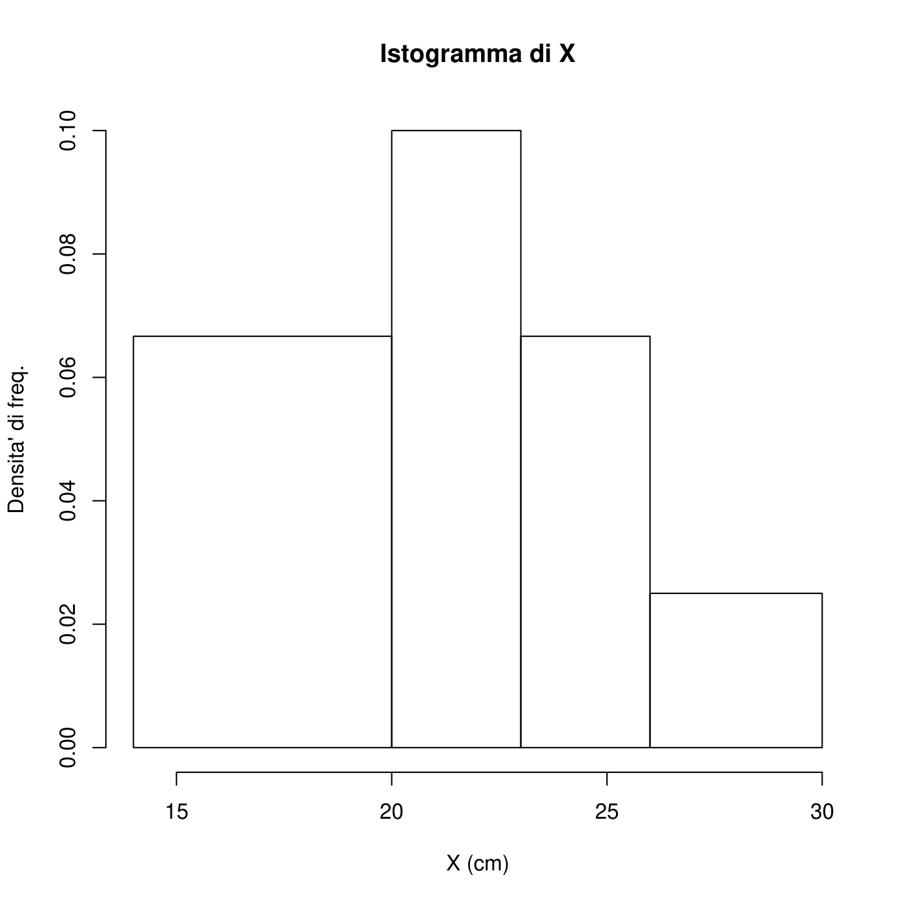
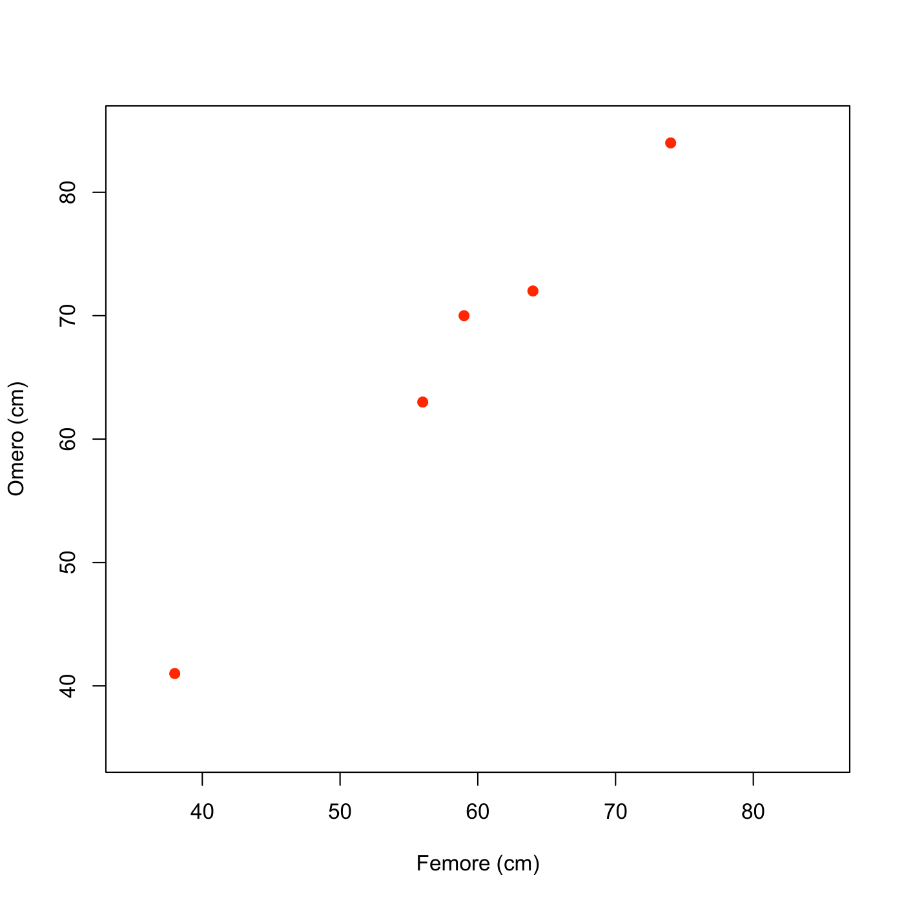
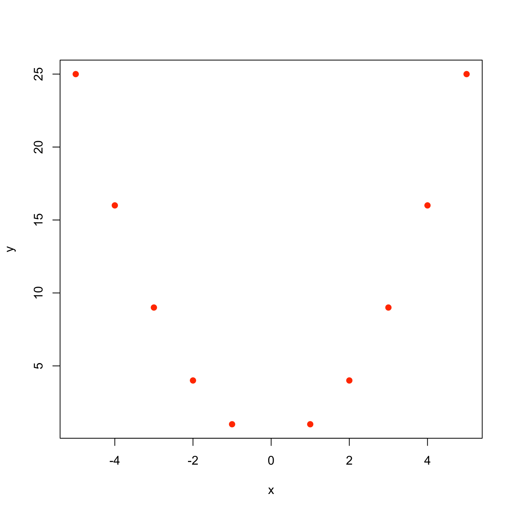
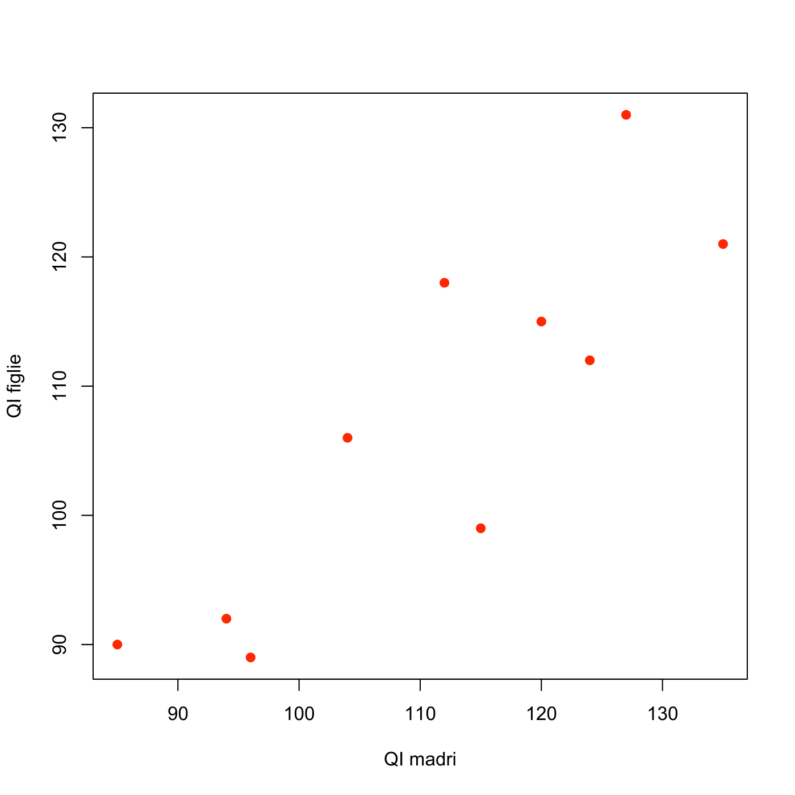
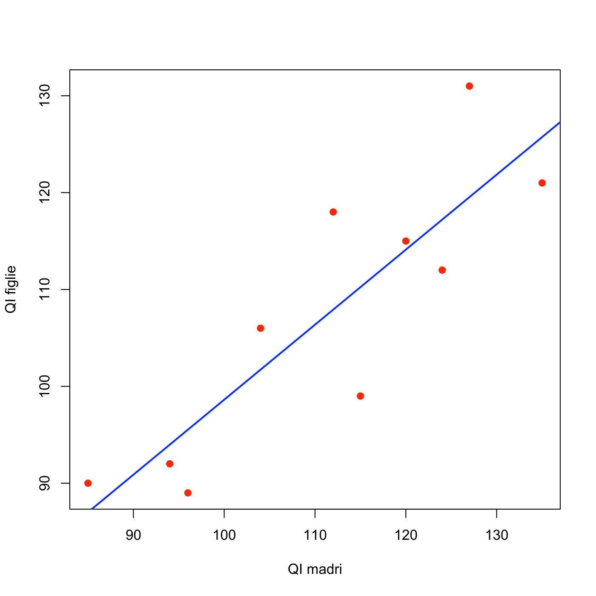
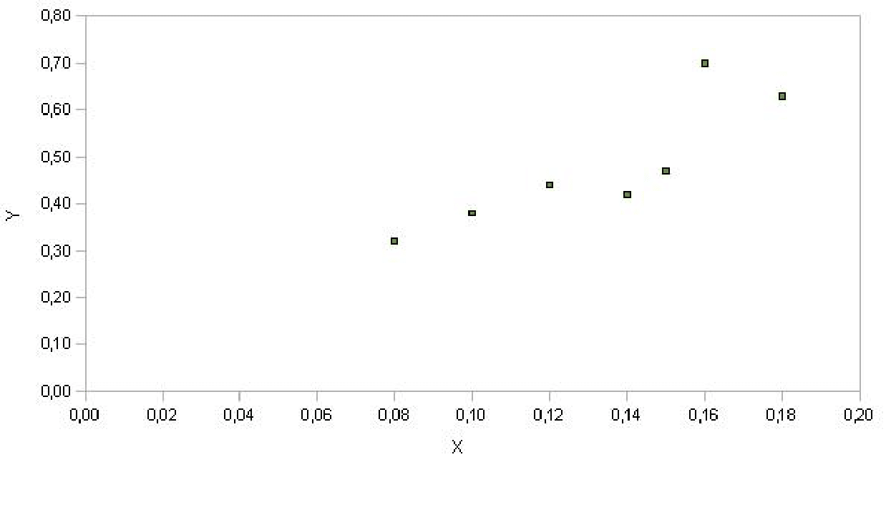
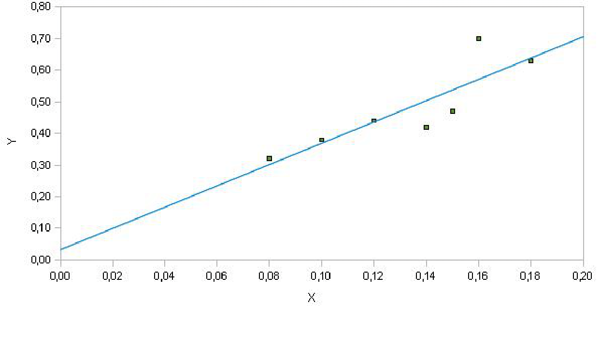
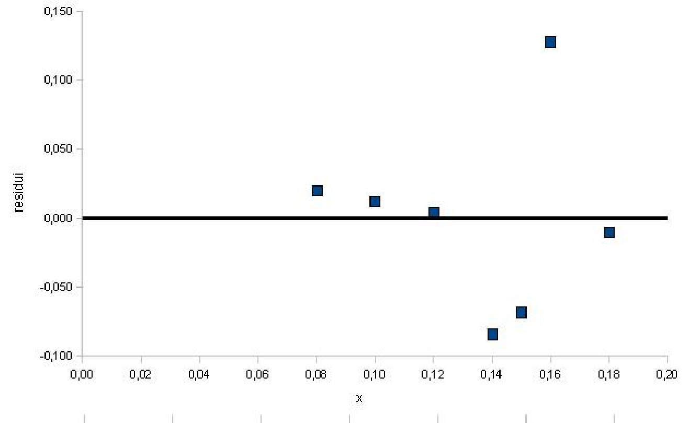

# Regressione lineare

## Regressione lineare semplice

### Esercizio 5.1 {-}

I dati nella seguente tabella mostrano l'indice di produttività X e lo
stipendio mensile Y di un campione di dipendenti di un'azienda:

        X   |   Y
        ----+----
        1.6 |  10
        2   |  15
        3.5 |  20
        3   |  21
        3.2 |  24
        4   |  30
        ----+----

1.  Calcolare i coefficienti del modello di regressione lineare e
    calcolare il coefficiente di determinazione $R^2$.

2.  Stabilire di quanto varia in media il reddito mensile se l'indice di
    produttività cresce di una unità.

3.  Prevedere, in base al modello adottato, l'ammontare dello stipendio
    mensile per un indice di produttività pari a 2.8.


#### Soluzione {-.sol}

1. Dato un modello di regressione lineare $y = \beta_0 + \beta_1 x$, si devono calcolare i due coefficienti $\beta_0$ e $\beta_1$ usando le note formule: $$\hat{\beta}_1=\frac{C_{xy}}{D_x}=\frac{\sigma_{xy}}{\sigma^2_x}, \qquad \qquad \hat{\beta}_0 = \bar{y}- \hat{\beta}_1 \bar{x}$$ dove $C_{xy}$ è la codevianza, $D_X$ è la deviazione standard del carattere $X$, e $\bar{x}$ e $\bar{y}$ sono le due medie. Calcoliamo tutto ciò che' è necessario: $$\bar{x}=\frac{1.6+2+3.5+3+3.2+4}{6}=2.88$$ $$\bar{y}=\frac{10+15+20+21+24+30}{6}=20$$ $$\begin{aligned}      \sigma_x&=\sqrt{\sigma_x^2} \\
    & =\sqrt{\frac{(1.6-2.88)^2+(2-2.88)^2+(3.5-2.88)^2+(3-2.88)^2
    +(3.2-2.88)^2+(4-2.88)^2}{6}} \\
    &= \sqrt{0.695}=0.834\end{aligned}$$ $$\begin{aligned}
     \sigma_y&=\sqrt{\sigma_y^2} \\
    & = \sqrt{ \frac{(10-20)^2+(15-20)^2+(20-20)^2+(21-20)^2+(24-20)^2+(30-20)^2}{5}} \\
    & = \sqrt{40.33}=6.35\end{aligned}$$ Infine, $$\sum_{i=1}^{n} x_i y_i = 1.6 \cdot 10+2 \cdot 15+3.5\cdot 20+3\cdot 21+ 3.2\cdot 24+4\cdot 30=375.8$$ da cui
$$\sigma_{xy}= \frac 1n \sum_{i=1}^{n} x_i y_i  - \bar{x}\bar{y} = \frac 16 \times 375.8 - 20 \times 2.88 = 4.97$$ Possiamo cosi' calcolare il valore del coefficiente di correlazione usando la formula in termini di deviazioni standard e covarianza: $$r = \frac{\sigma_{xy}}{\sigma_x \sigma_y} = \frac{4.97}{0.834 \times 6.35} =0.938$$ L'associazione fra le due variabili è positiva ed è molto forte. Il valore di $R^2$ è $0.938^2=0.88$, cioè circa l'88% della variabilità totale della variabile risposta $y$ (il reddito) è spiegato dal modello lineare. Troviamo ora i valori dei coefficienti di regressione: $$\begin{aligned}
    & \hat{\beta_1} =  \frac{5.03}{0.695} =7.149 \\
    & \hat{\beta_0} = \bar{y} - \hat{\beta} \bar{x} = 20 - 7.24 \times 2.88 = -0.613.\end{aligned}$$ Il modello di regressione lineare che rappresenta meglio i dati è quindi
$$\hat{y}=\beta_0 + \hat{\beta}_1 x =-0.613 +  7.149 \cdot x$$

2. Quando l'indice di produzione cresce di 1 unità, il reddito aumenta,
in media, di $\hat{\beta}=7.149$.

3. È sufficiente valutare il modello in $x=2.8$, cioè basta calcolare
$$\hat{y} = 7.149 \cdot 2.8 - 0.613 = 19.40$$ Lo stipendio
corrispondente è 19.40.

### Esercizio 5.2 {-}

Consideriamo un campione di 10 esemplari di fiore
di Codolina per ciascuno dei quali si misura in cm la lunghezza della
foglia superiore (indicata con $X$)

            X | 23.4  22  25  18.1  18.9  20.5  19.1  27.5  21.6  15

1.  Classificare il carattere nelle classi $[14,20]$, $(20,23]$, $(23,26]$, $(26,30]$.

2.  Rappresentare adeguatamente la distribuzione del carattere $X$.

3.  Determinare la moda e la classe modale.

4.  Calcolare la media, la varianza, la deviazione standard, la mediana
    e i quartili.

5.  Calcolare il valor medio usando solo la distribuzione in classi.


#### Soluzione {-.sol}

1)\

::: {.center}
  ----------- ----------------- ------------------------------- ------------------- ------------------------
      $X$      freq.ass. $n_i$   freq.rel. $f_i=\frac{n_i}{n}$   amp.class. $d_i$       dens.freq. $h_i=\frac{f_i}{d_i}$
   $[14,20]$       4                0.4                             6                     0.067
   $(20,23]$       3                0.3                             3                      0.1
   $(23,26]$       2                0.2                             3                     0.067
   $(26,30]$       1                0.1                             4                     0.025
                  $n=10$              1                               
  ----------- ----------------- ------------------------------- ------------------- ------------------------
:::

2)\


<center></center>

3) La moda è indeterminata. La classe modale è (20,23\].

4) $$\bar{x} = \frac{23.4+22+ \cdots + 15}{10} = 21.11$$ $$\begin{aligned}
        S^2 & = \frac{\sum_{i=1}^n (x_i - \bar{x} )^2}{n-1} = \frac{1}{n}
        \sum_{i=1}^n (x_i^2 - 2 x_i \bar{x} + \bar{x}^2 ) \\
        & = \frac{\sum_{i=1}^n x_i^2}{n} - \frac{2 \bar{x} \sum_{i=1}^n x_i}{n}
        +  \bar{x}^2 \\
        & = \frac{1}{n} \left[ \sum_{i=1}^n x_i^2 - 2 n \bar{x}^2 + n \bar{x}^2 \right]\\
        & = \frac{1}{n} \left[ \sum_{i=1}^n x_i^2 - n \bar{x}^2 \right]
    \end{aligned}$$ Calcoliamo ora $$\begin{aligned}
        \sum_{i=1}^n x_i^2 = 4574.25
    \end{aligned}$$ quindi
$$S^2 = \frac{1}{10} \left[ 4574.25-10 (21.11)^2 \right] = 11.79$$
$$S=\sqrt{S^2} = \sqrt{11.79} = 3.43 \text{cm}$$ Determiniamo ora la mediana. Riordiniamo i dati:

            X | 15  18.1  18.9  19.1  20.5  21.6  22  23.4  25  27.5

$$\text{Mediana}= \frac{20.5+21.6}{2} = 21.05$$
$$\text{Primo quartile} = 18.9$$ $$\text{Terzo quartile} = 23.4$$

5) Calcoliamo prima di tutto i valori centrali:

            [14,20]  |  17
            (20,23]  |  21.5
            (23,26]  |  24.5
            (26,30]  |  28
Si può calcolare il valor medio approssimato:
$$\bar{x} = \frac{17 \cdot 4 + 21.5 \cdot 3 + 24.5 \cdot 2 + 28}{10} = 20.95$$


### Esercizio 5.3 {-}

Si vuole verificare se il consumo (Y) delle automobili (in litri di
carburante per un dato chilometraggio) dipende dal loro peso (X) (in
tonnellate). In un campione di n=12 automobili sono stati ottenuti i
seguenti risultati: $$\sum_{i=1}^n x_i = 24.62, \qquad 
\sum_{i=1}^n y_i = 279.76, \qquad \sum_{i=1}^n x_i^2 = 51.49,$$
$$\qquad \sum_{i=1}^n y_i^2 = 6525.47, \qquad
\sum_{i=1}^n x_i y_i = 575.53$$

a.   Determinare la retta di regressione.

b.   Spiegare il significato del valore assunto dal coefficiente
    $\beta_1$.

c.   Calcolare l'indice di determinazione $R^2$ e commentare il
    risultato.

#### Soluzione {-.sol}

a.   La numerosità è $n=12$ e le medie risultano
    $$\bar{x} = \frac{\sum_{i=1}^n x_i}{n} = \frac{24.62}{12} = 2.05 \qquad
    \bar{y} = \frac{\sum_{i=1}^n y_i}{n} = \frac{279.76}{12} = 23.31$$
    Per determinare la retta di regressione, ovvero i coefficienti
    $$\beta_1 = \frac{\sum_{i=1}^n (x_i -\bar{x})(y_i-\bar{y})}{\sum_{i=1}^n (x_i -\bar{x})^2}$$
    e $$\beta_0 = \bar{y}-\beta_1 \bar{x}.$$ Utilizzando i dati a
    disposizione, è necessario calcolare:\
    $\sum_{i=1}^n (x_i -\bar{x})(y_i-\bar{y}) = \sum_{i=1}^n x_i y_i  - n\bar{x}\bar{y} = 575.53 -12 \cdot 2.05 \cdot 23.31 = 2.10$\
    $\sum_{i=1}^n (x_i -\bar{x})^2 = \sum_{i=1}^n x_i^2  - n\bar{x}^2 = 51.49 -12 \cdot 2.05^2 = 1.06$\
    $\sum_{i=1}^n (y_i -\bar{y})^2 = \sum_{i=1}^n y_i^2  - n\bar{y}^2 = 6525.47 -12 \cdot 23.31^2 = 5.20$.\
    Otteniamo quindi: $$\beta_1 = \frac{2.10}{1.06} = 1.98$$ e
    $$\beta_0 = 23.31 - 1.98 \times 2.05 = 19.25$$
    Quindi la retta di regressione è: $$\widehat{Y}_i = 19.25 + 1.98 X$$

b.   Il valore del coefficiente $\beta_1=1.98$ si può interpretare come
    il consumo medio di carburante a fronte di un aumento di peso
    dell'auto di 1 tonnellata.

c.   L'indice di determinazione è pari
    $$R^2 = \frac{\sum_{i=1}^n (\hat{y}_i -\bar{y})^2}{\sum_{i=1}^n (y_i -\bar{y})^2} = 1-\frac{\sum_{i=1}^n (y_i -\hat{y}_i)^2}{\sum_{i=1}^n (y_i -\bar{y})^2}$$
    e si può calcolare anche elevando al quadrato il coefficiente di
    correlazione, ovvero:
    $$R^2 = r^2 = \frac{\big(\sum_{i=1}^n (x_i -\bar{x})(y_i-\bar{y})\big)^2}{
    \sum_{i=1}^n (x_i -\bar{x})^2 \cdot \sum_{i=1}^n (y_i-\bar{y})^2} = \frac{2.10^2}{1.06 \cdot 5.20} = 0.8.$$
    Poiché il valore dell'indice $R^2$ è risultato pari a 0.8 possiamo
    concludere che l'$80\%$ della variabilità del consumo delle
    automobili è spiegata tramite la relazione lineare con il peso delle
    automobili.


### Esercizio 5.4 {-}

In uno studio sulle cause dell'inquinamento sono stati rilevati, in 41
città americane, la concentrazione di anidride solforosa (microgrammi
per metro cubo) e il numero di aziende manifatturiere con oltre 20
addetti. Indicando, per la generica città $i$-esima, con $x_{i}$ il
numero di aziende e con $y_{i}$ le osservazioni sulla concentrazione di
anidride solforosa, sono stati ottenuti i valori seguenti:\
$\sum_{i=1}^{41}x_{i}=18987$, $\sum_{i=1}^{41} y_{i}=1232$,\
$\sum_{i=1}^{41} x_{i}^{2}= 21492949$, $\sum_{i=1}^{41}y_{i}^{2}=59058$,\
$\sum_{i=1}^{41}x_{i}y_{i}=911645$.


1.  Stimare un modello di regressione che cerchi di spiegare la
    concentrazione di anidride solforosa in funzione del numero di
    aziende manifatturiere.

2.  Sottoporre a test l'ipotesi nulla $\beta=0$ verso l?ipotesi
    alternativa $\beta>0$ al livello di significatività del 5% e
    commentare il risultato.


#### Soluzione {-.sol}

Vogliamo stimare la retta di regressione
$$Y_{i}=\beta_0 + \beta_1  x_{i}+\epsilon_{i}$$

1.  La numerosità campionaria è $n=41$, la media del numero di aziende
    manifatturiere è $\bar{x}={18987}/{41}=463.1$ e il valore osservato
    della media campionaria della concentrazione di anidride solforosa è
    $\bar{y}=\frac{1232}{41}=30.1$ Applicando una delle tante formule
    per il calcolo di $\beta_1$ si ottiene la stima del coefficiente
    angolare
    $$\hat{\beta}_1=\frac{\sum_{i=1}^{n}x_{i}y_{i}-n\bar{x}\bar{y}}{\sum_{i=1}^{n}x_{i}^{2}-n\bar{x}^{2}}=\frac{911645-41 \cdot 463.1 \cdot 30.1}{21492949-41 \cdot 463.1^{1}}=0.027$$
    mentre l'intercetta risulta
    $$\hat{\beta}_0=\bar{y}-\hat{\beta}\bar{x}=17.6$$

2.  Le ipotesi da sottoporre a test sono
    $$H_{0}:\beta=0 \   \ H_{1}:\beta > 0$$ La statistica test è
    $$T=\frac{B}{\sqrt{\hat{\sigma}^{2}/\sum_{i=1}^{n}(x_{i}-\bar{x})^{2}}}$$
    e ha una distribuzione $t$ con $n-2=39$ gradi di libertà. Le tavole
    della t di Student non riportano i percentili in corrispondenza di
    39 gradi di libertà, ma questi ultimi si possono approssimare con
    quelli di una variabile casuale $t_{40}$.\
    Il valore empirico della statistica test è:
    $$t=\frac{\hat{\beta}}{SE(\hat{\beta})}=\frac{0.027}{0.005}=5.4$$
    dove
    $$SE(\hat{\beta})=\sqrt{s^{2}/\sum_{i=1}^{n}(x_{i}-\bar{x})^{2}}=
    \sqrt{\frac{s^{2}}{\sum_{i=1}^{n}x_{i}^{2}-n\bar{x}^{2}}}=\sqrt{\frac{327.7}{21492949 - 41\cdot 463.1^{2} }}=0.005$$
    Il valore di $t$ deve essere quindi confrontato con $t^{*}=1.684$.\
    Poiché $t>t^{*}$, possiamo rifiutare l'ipotesi nulla: infatti, il
    p-value $$Pr(T>t) < 0.0005$$

## Inferenza nel modello di regressione lineare

Negli esercizi che seguono cerca di visualizzare se le condizioni per
l'uso di un modello lineare sono soddisfatte. Non c'è bisogno di
riportare tali considerazioni nello svolgimento delle soluzioni.

### Esercizio 5.5 {-}
<center>*Birra e presenza di alcool nel sangue *</center>

Molte
persone sostengono che il genere, il peso, le abitudini di bere e molti
altri fattori siano più importanti nel prevedere l'entità della presenza
di alcool nel sangue (BAC, blood alcohol content) del semplice
considerare il numero di bicchieri che una persona consumi in un giorno.
Qui si esaminano dati derivanti dall'osservazione di 16 studenti
volontari presso la Ohio State University che hanno bevuto un numero
casuale preassegnato di bicchieri di birra . Tali studenti sono stati
poi suddivisi secondo il genere, e sono stati ulteriormente suddivisi
secondo il loro peso e le loro abitudini "alcoliche". Trenta minuti
dopo, a ciascuno di loro è stato misurato il BAC, misurato in grammi di
alcool per decilitro di sangue. The scatterplot and regression table
summarize the findings.


|                | **Stima** | **SE** | **t-value** | **p-value** |
|:--------------:|:---------:|:------:|:-----------:|:-----------:|
| **Intercetta** | -0.0127   | 0.0126 | -1.00       | 0.332       |
| **Birra**      | 0.0180    | 0.0024 | 7.48        | 0.0000      |


a. Describe the relationship between the number of cans of beer and BAC.

b. Write the equation of the regression line. Interpret the slope and
intercept in context.

c. Do the data provide strong evidence that drinking more cans of beer is
associated with an increase in blood alcohol? State the null and
alternative hypotheses, report the p-value, and state your conclusion.

d. The correlation coefficient for number of cans of beer and BAC is 0.89.
Calculate R2 and interpret it in context.

e. Suppose we visit a bar, ask people how many drinks they have had, and
also take their BAC. Do you think the relationship between number of
drinks and BAC would be as strong as the relationship found in the Ohio
State study?


## Correlazione e Regressione

### Esercizio 5.6 {-}

<center>*Correlazione *</center>

I dati relativi alle lunghezze di femore e
omero di 5 reperti fossili sono riportati nella seguente tabella (valori
espressi in cm):

::: {.center}
   Femore   Omero
  -------- -------
     38      41
     56      63
     59      70
     64      72
     74      84
:::

-   Si realizzi un grafico a dispersione;

-   Si calcoli il coefficiente di correlazione e si commenti il
    risultato ottenuto.


#### Soluzione {-.sol}
Le lunghezze di femore e omero sono rappresentate tramite grafico a
dispersione.

<center></center>

> ***Una nota sul calcolo del coefficiente di correlazione***
>
> Supponiamo di aver osservato le variabili $x$ e $y$ su un sottoinsieme
> di $n$ unità dalla popolazione di riferimento. I valori per la prima
> unità sono $x_1$ e $y_1$, i valori per la seconda unità sono $x_2$ e
> $y_2$ e così via. Le medie e le deviazioni standard delle due
> variabili sono
> $$\bar{x}=\frac{1}{n}\sum_{i=1}^n x_i \hspace{1cm} \mbox{e} \hspace{1cm}
> s_x=\sqrt{\frac{1}{n-1}\sum_{i=1}^n
> (x_i-\bar{x})^2}=\sqrt{\frac{1}{n}\sum_{i=1}^n
> x_i^2-\bar{x}^2}$$ per i valori $x$, e
> $$\bar{y}=\frac{1}{n}\sum_{i=1}^n y_i \hspace{1cm} \mbox{e} \hspace{1cm}
> s_y=\sqrt{\frac{1}{n}\sum_{i=1}^n
> (y_i-\bar{y})^2}=\sqrt{\frac{1}{n-1}\sum_{i=1}^n
> y_i^2-\bar{y}^2}$$ per i valori $y$. Il coefficiente di correlazione
> $r$ fra $x$ e $y$ è dato da
> $$r=\frac{1}{n} \sum_{i=1}^n \left(\frac{x_i-\bar{x}}{\sigma_x}\right)
> \left(\frac{y_i-\bar{y}}{\sigma_y}\right)=\frac{1}{s_x\,s_y}\frac{1}{n}
> \sum_{i=1}^n (x_i-\bar{x}) (y_i-\bar{y})$$ Notiamo che
> $$\begin{aligned}
> \sum_{i=1}^n (x_i-\bar{x})
> (y_i-\bar{y})&= \sum_{i=1}^n (x_i
> y_i-x_i\bar{y}-\bar{x}y_i+\bar{x}\bar{y})=\sum_{i=1}^n x_i y_i-n
> \bar{x}\bar{y}-n\bar{x}\bar{y}+n\bar{x}\bar{y}=\\&=\sum_{i=1}^n
> x_i y_i-n \bar{x}\bar{y}\end{aligned}$$ e allora $$\frac{1}{n}
> \sum_{i=1}^n (x_i-\bar{x}) (y_i-\bar{y})
> =
> \frac{1}{n}\sum_{i=1}^n x_i y_i- \bar{x}\bar{y}.$$
>
> In analogia a quanto già visto per la varianza, quando non si dispone
> di un supporto informatico, anche per il calcolo del coefficiente di
> correlazione è utile ricorrere alla seguente formula alternativa:
> $$r=\frac{1}{s_x\,\,s_y}\left[\frac{1}{n} \sum_{i=1}^n x_i y_i
> -  \bar{x} \bar{y}\right].$$ Quest'ultima formula è più conveniente in
> termini di economia di calcolo, è del tutto equivalente alla formula
> che definisce il coefficiente di correlazione (si ottiene da questa
> tramite alcuni passaggi algebrici) e dà lo stesso risultato numerico
> (a meno di approssimazioni dovute ad arrotondamenti nei calcoli
> intermedi).

Calcoliamo tale coefficiente come segue:

::: {.center}
         Femore $(x_{i})$   Omero $(y_{i})$       $x_{i}y_{i}$       $(x_{i}-\bar{x})^2$   $(y_{i}-\bar{y})^2$
  ----- ------------------ ----------------- ---------------------- --------------------- ---------------------
                38                41          38 $\cdot$ 41= 1558          408.04                  625
                56                63          56 $\cdot$ 63= 3528           4.84                    9
                59                70          59 $\cdot$ 70 = 4130          0.64                   16
                64                72           64 $\cdot$ 72=4608           33.64                  36
                74                84          74 $\cdot$ 84 = 6216         249.64                  324
   Tot         291                330                20040                  696.8                 1010
:::

Dai precedenti valori ricaviamo le seguenti quantità:

-   $\bar{x}=\frac{1}{n} \sum_{i=1}^{n} x_{i}=\frac{1}{5} 291= 58.2$

-   $\bar{y}=\frac{1}{n} \sum_{i=1}^{n} y_{i}=\frac{1}{5} 330= 66$

-   $\sigma_{x}=\sqrt{\frac{1}{n}\sum_{i=1}^{n}(x_{i}-\bar{x})^2} =\sqrt{139.4}=11.8$

-   $\sigma_{y}=\sqrt{\frac{1}{n}\sum_{i=1}^{n}(y_{i}-\bar{y})^2} =\sqrt{202}=14.21$

Pertanto il coefficiente di correlazione è pari a

$$r=\frac{1}{11.8 \cdot 14.21} \left[ \frac{20040}6 -58.2 \cdot 66\right ] =0.994$$

Ciò significa che tra lunghezza del femore e dell'omero esiste una forte
associazione lineare positiva.


### Esercizio 5.7 {-}

Si osservano i seguenti valori della variabile $X$:\
      
  $X: 1\quad   2\quad   3\quad   4\quad   5\quad   -1\quad   -2\quad   -3\quad   -4\quad   -5$;

-   si costruisca la variabile $Y=X^2$ e se ne calcolino media e
    varianza;

-   si costruisca il diagramma a dispersione tra le variabili $X$ e $Y$;

-   si calcoli il coefficiente di correlazione tra le 2 variabili e si
    commenti il risultato.

#### Soluzione {-.sol}


La variabile $Y$ assume i seguenti valori:\

   $Y: 1\quad  4\quad  9\quad  16\quad  25\quad  1\quad  4\quad  9\quad  16\quad  25$;\
La media e la varianza di $Y$ sono pari rispettivamente a :

-   $\bar{y}=\frac{1}{n}\sum_{i=1}^{n}y_{i}=11$

-   $\sigma^{2}_{y}=\frac{1}{n}\sum_{i=1}^{n}(y_{i}-\bar{y})^2 =74.8$

Il diagramma a dispersione per le variabili $X$ e $Y$ è 


<center></center>


Calcoliamo quindi il coefficiente di correlazione tra $X$ e $Y$:

::: {.center}
         $x_{i}$   $y_{i}$       $x_{i}y_{i}$        $(x_{i}-\bar{x})^2$   $(y_{i}-\bar{y})^2$
  ----- --------- --------- ----------------------- --------------------- ---------------------
            1         1         1 $\cdot$ 1= 1                1                    100
            2         4         2 $\cdot$ 4= 8                4                    49
            3         9        3 $\cdot$ 9 = 27               9                     4
            4        16         4 $\cdot$ 16=64              16                    25
            5        25       5 $\cdot$ 25 = 125             25                    196
           -1         1        -1 $\cdot$ 1= -1               1                    100
           -2         4        -2 $\cdot$ 4= -8               4                    49
           -3         9       -3 $\cdot$ 9 = -27              9                     4
           -4        16        -4 $\cdot$ 16=-64             16                    25
           -5        25      \- 5 $\cdot$ 25 = 125           25                    196
   Tot      0        110               0                     110                   748
:::

-   $\bar{x}=\frac{1}{n} \sum_{i=1}^{n} x_{i}=0$

-   $\bar{y}=\frac{1}{n} \sum_{i=1}^{n} y_{i}=11$

-   $\sigma_{x}=\sqrt{\frac{1}{n}\sum_{i=1}^{n}(x_{i}-\bar{x})^2} = 3.32$

-   $s_{y}=\sqrt{\frac{1}{n-1}\sum_{i=1}^{n}(y_{i}-\bar{y})^2} = 8.65$

Pertanto il coefficiente di correlazione è pari a

$$r= \frac{1}{3.50 \cdot 9.12} \left[\frac{1}{10} 0 -  0 \cdot 11  \right]=0$$

Il coefficiente di correlazione è pari a 0: ciò significa che non c'è
relazione lineare tra le 2 variabili, nonostante esse siano fortemente
dipendenti, in quanto legate da una relazione deterministica.


### Esercizio 5.8 {-}

Si trovi l'errore contenuto in ognuna delle seguenti affermazioni:

-   C'è una forte correlazione tra il sesso dei lavoratori americani e
    il loro reddito;

-   E' stata trovata un'alta correlazione($r=1.09$) fra i voti che gli
    studenti ottengono all'esame di statistica e i voti presi all'esame
    di matematica;

-   La correlazione fra l'altezza e il peso calcolata su 50 studenti
    corrisponde a $r=0.25$Kg.

#### Soluzione {-.sol}

-   Errore: il sesso è un carattere qualitativo sconnesso per il quale
    il coefficiente di correlazione non è calcolabile;

-   Errore: la correlazione assume valori tra $-1$ e $1$. Pertanto un
    valore $r=1.09$ non è accettabile;

-   Errore: l'indice di correlazione è un numero puro, ossia non dipende
    dall'unità di misura. Pertanto $r=0.25$ Kg non è un valore
    accettabile.

### Esercizio 5.9 {-.sol}

I dati seguenti mostrano i quozienti intellettivi (QI) di 10 madri e
figlie primogenite.

::: {.center}
   x=QI madre   y= QI figlia
  ------------ --------------
      135           121
      127           131
      124           112
      120           115
      115            99
      112           118
      104           106
       96            89
       94            92
       85            90
:::

1.  Disegnare il diagramma a dispersione;

2.  Calcolare il coefficiente di correlazione;

3.  Calcolare la retta di regressione dei minimi quadrati e
    rappresentarla sul grafico a dispersione.


#### Soluzione {-.sol}

1.  Il diagramma a dispersione del QI delle figlie rispetto al QI delle
    madri è 
    
<center></center>

2.  Calcoliamo nella seguente tabella gli elementi necessari per il
    calcolo del coefficiente di correlazione $r$:

::: {.center}
          x      y     $x_{i}^{2}$   $y_{i}^{2}$   $x_{i}y_{i}$
  ----- ------ ------ ------------- ------------- --------------
         135    121       18225         14641         16335
         127    131       16129         17161         16637
         124    112       15376         12544         13888
         120    115       14400         13225         13800
         115     99       13225         9801          11385
         112    118       12544         13924         13216
         104    106       10816         11236         11024
          96     89       9216          7921           8544
          94     92       8836          8464           8648
          85     90       7225          8100           7650
   Tot   1112   1073     125992        117017         121127
:::
e deriviamo le quantità necessarie per il calcolo di $r$:
-   $\bar{x}=1112/10 = 111.2$

-   $\bar{y}=1073/10 =107.3$

-   $\sigma_{x}=\sqrt{125992/10 -  111.2^{2}}=\sqrt{233.7}= 15.28$

-   $\sigma_{y}=\sqrt{117017/10 - 107.3^{2}}=13.72$
    
da cui segue che:   $$r=\frac{1}{15.28 \cdot 13.72} \left[ 121127/10 - 111.2 \cdot 107.3 \right]= 0.863.$$

3.  La retta di regressione è $y = \beta_0 + \beta_1 \, x$ dove
    $\beta_1= \frac{\sigma_{xy}}{\sigma^2_{x}}=    \frac{121127/10- 111.2 \times 107.3}{233.7} = 0.774$ e
    $\beta_0 =\bar{y}-\beta_1 \bar{x}=107.3 - 0.774 \cdot 111.2=21.23$.\
    Ciò significa che al crescere di 1 unità del quoziente intellettivo
    della madre, quello delle figlie aumenta di 0.774. Rappresentiamo la
    retta di regressione sul grafico

<center></center>


### Esercizio 5.10 {-}

I dolcificanti causano un aumento di peso? Le
persone che utilizzano dolcificanti al posto dello zucchero tendono ad
essere piú grasse rispetto a quelle che usano lo zucchero. Dare una
spiegazione plausibile per questa associazione.

#### Soluzione {-.sol}

È un esempio di **correlazione spuria**: non esiste un legame causale tra
il peso e l'uso di dolcificante, ma esiste una variabile nascosta
influente sia sul peso che sull'uso di dolcificante, che induce un'alta
correlazione tra di esse. lecito, infatti, pensare che il consumo di
dolcificante sia suggerito a persone sovrappeso o che seguono una dieta
alimentare.

### Esercizio 5.11 {-}

Un recente studio ha rilevato una forte correlazione positiva tra il
livello di colesterolo dei giovani adulti e il tempo speso a guardare la
televisione.

1.  Ti saresti aspettato questo risultato? Perché?

2.  Ritieni che guardare la tv causi un aumento del livello di
    colesterolo?

#### Soluzione {-.sol}

1.  Il risultato può essere giustificato alla luce del fatto che chi
    spende molto tempo a guardare la televisione tende a non fare molta
    attività fisica con un conseguente incremento della massa grassa
    corporea e del colesterolo.

2.  L'affermazione non è esatta in quanto la correlazione **non**
    dimostra causalità.

## Analisi dei residui

### Esercizio 5.12 {-}

Si ritiene che più alcool c'è in circolo, più lento sia il tempo di
reazione di una persona. Per verificare questa affermazione, 7 volontari
assumono ciascuno una diversa quantità di alcool. La concentrazione di
alcool nel sangue viene determinata come percentuale del peso corporeo.
In seguito viene misurato il tempo di reazione di ciascuno a un certo
stimolo, ottenendo i seguenti dati.

::: {.center}
  ---------------------------- ----------------------
   x=concentrazione di alcool   y= tempo di reazione
         nel sangue (%)              (secondi)
              0.08                      0.32
              0.10                      0.38
              0.12                      0.44
              0.14                      0.42
              0.15                      0.47
              0.16                      0.70
              0.18                      0.63
  ---------------------------- ----------------------
:::

a.  Disegnare il grafico a dispersione dei dati.

b.  Disegnare la retta di regressione.

c.  Usare la retta di regressione per predire il tempo di reazione di un
    individuo con una concentrazione di alcool nel sangue di x=0.15.

d.  Disegnare il grafico dei residui. Cosa ci dice?

e.  Determinare l'indice di determinazione. Come lo interpretiamo?

#### Soluzione {-.sol}

a.  Il diagramma a dispersione per le variabili x=concentrazione di
    alcool nel sangue e y=tempo di reazione rappresentato nella figura
<center></center>


b.  Dobbiamo calcolare la retta di regressione $\hat{y}=a + bx$ dove $a$
e $b$ sono:
$$b=r \frac{s_{y}}{s_{x}}$$ $$a=\bar{y}-b\bar{x}$$
Per il calcolo quindi di $a$ e $b$ abbiamo bisogno delle seguenti quantità:
-   $\bar{x}=\frac{1}{n}\sum_{i=1}^{n}x_{i}$

-   $\bar{y}=\frac{1}{n}\sum_{i=1}^{n}y_{i}$

-   $s_{x}=\sqrt{\frac{1}{n-1}\sum_{i=1}^{n}x_{i}^{2} - \frac{n}{n-1}\bar{x}^{2}}$

-   $s_{y}=\sqrt{\frac{1}{n-1}\sum_{i=1}^{n}y_{i}^{2} - \frac{n}{n-1} \bar{y}^{2}}$

-   $r=\frac{1}{s_{x}s_{y}}\left[\frac{1}{n-1}\sum_{i=1}^{n}x_{i}y_{i} -\frac{n}{n-1}\bar{x}\bar{y} \right]$

Calcoliamo:

::: {.center}
          x      y     $x_{i}^{2}$   $y_{i}^{2}$   $x_{i}y_{i}$
  ----- ------ ------ ------------- ------------- --------------
         0.08   0.32     0.0064        0.1024         0.0256
         0.10   0.38     0.0100        0.1444         0.0380
         0.12   0.44     0.0144        0.1936         0.0528
         0.14   0.42     0.0196        0.1764         0.0588
         0.15   0.47     0.0225        0.2209         0.0705
         0.16   0.70     0.0256        0.4900         0.1120
         0.18   0.63     0.0324        0.3969         0.1134
   Tot   0.93   3.36     0.1309        1.7246         0.4711
:::
da cui si ha che:
-   $\bar{x}=\frac{1}{7} 0.93 = 0.1329$

-   $\bar{y}=\frac{1}{7} 3.36 = 0.48$

-   $s_{x}=\sqrt{\frac{1}{6} 0.1309 - \frac{7}{6}(0.1329^2)} = 0.0348$

-   $s_{y}=\sqrt{\frac{1}{6} 1.7246 - \frac{7}{6}(0.48^2)} = 0.14$

-   $r = \frac{1}{0.0348 \cdot 0.14} \left[\frac{1}{6}0.4711 - \frac{7}{6} 0.1329 \cdot 0.48 \right]=0.87$

e quindi $b=0.87 \cdot \frac{0.14}{0.0348}=3.4$ e    $a=0.48 -3.4\cdot 0.1329=0.03$.\
La retta di regressione è pertanto  $$\hat{y}=0.03 + 3.4 x$$ e possiamo rappresentarla sul diagramma a dispersione nella figura del grafico a dispersione soprariportato.\
Tale retta ci dice che al crescere di 1 unità percentuale di alcool, il tempo di reazione cresce in media di 3.4 secondi.
<center></center>

c.  La retta di regressione può essere utilizzata anche per fare previsioni: il valore previsto dalla retta per $x=0.15$ è     $\hat{y}_{x=0.15}=0.03 + 3.4 \cdot 0.15 =0.5383$.

d.  I residui si possono ottenere calcolando le differenze tra valori   osservati e valori predetti dal modello:

  $i$   $x_i$   $y_i$   $\hat{y}_i$   $y_i-\hat{y}_i$
 ----- ------- ------- ------------- -----------------
   1    0.08    0.32      0.3003           0.020
   2    0.10    0.38      0.3683           0.012
   3    0.12    0.44      0.4363           0.004
   4    0.14    0.42      0.5043          -0.084
   5    0.15    0.47      0.5383          -0.068
   6    0.16    0.70      0.5723           0.128
   7    0.18    0.63      0.6403          -0.010

Il grafico dei residui rispetto ai valori della variabile    esplicativa, è il seguente
<center></center>
Si può osservare che il residuo corrispondente all'osservazione
$x=0.16$ è un valore anomalo che rappresenta una deviazione dal
modello.

e.  L'indice $R^2=r^{2}$ misura quanta parte della variabilità totale di     $y$ spiegata dalla $x$: nel nostro esempio, $r^{2}=0.87^2=0.75$,     quindi circa il 75% della variabilità del tempo di reazione è     spiegata dalla concentrazione di alcool.


### Esercizio 5.13 {-}
<center>*Visualize the residuals. *</center>

The scatterplots shown
below each have a superimposed regression line. If we were to construct
a residual plot (residuals versus x) for each, describe what those plots
would look like.

### Esercizio 5.14 {-}
<center>*Trends in the residuals. *</center>

Shown below are two plots
of residuals remaining after fitting a linear model to two different
sets of data. Describe important features and determine if a linear
model would be appropriate for these data. Explain your reasoning.

### Esercizio 5.15 {-}
<center>*Identify relationships, Part I. *</center>

For each of the six plots, identify the strength of
the relationship (e.g. weak, moderate, or strong) in the data and
whether fitting a linear model would be reasonable.

### Esercizio 5.16 {-}
<center>*Identify relationships, Part II. *</center>

For each of the six plots, identify the strength of
the relationship (e.g. weak, moderate, or strong) in the data and
whether fitting a linear model would be reasonable.

### Esercizio 5.17 {-}
<center>*Scatterplots. *</center>

The two scatterplots below show the
relationship between final and mid-semester exam grades recorded during
several years for a Statistics course at a university.

a. Based on these graphs, which of the two exams has the strongest
correlation with the final exam grade? Explain.

b. Can you think of a reason why the correlation between the exam you chose
in part (a) and the final exam is higher?

### Esercizio 5.18 {-}

Volendo costruire un modello che spieghi il Peso
(espressa in funzione dell'Altezza (espressa in cm) si è osservato su $n= 10$ studenti della facoltà di Economia; i dati riportati nella tabella
seguente:

::: {.center}
   Altezza   Peso
  --------- ------
     165      71
     172      75
     159      81
     168      76
     166      88
     158      72
     157      98
     177      89
     164      83
     172      81
:::

Sia la variabile Altezza la variabile esplicativa $X$ e la variabile
Peso la variabile dipendente $Y$.

1.  Stimare la retta di regressione;

2.  costruire un intervallo di confidenza per il coefficiente angolare a
    livello di significatività $\alpha=0.05$;

3.  sulla base delle osservazioni campionarie verificare l'ipotesi nulla
    di assenza di legame lineare tra le due variabili.

#### Soluzione {-.sol}

1.  Stimiamo i parametri della retta di regressione
    $$y=\hat{\alpha}+\hat{\beta}x$$ mediante il metodo dei minimi
    quadrati:
    $$\hat{\beta}=\frac{\sum_{i=1}^{10}(x_{i}-\bar{x})(y_{i}-\bar{y})}{\sum_{i=1}^{10}(x_{i}-\bar{x})^{2}}=-0.0813$$
    $$\hat{\alpha}=\bar{y}-\hat{\beta}\bar{x}=94.8952$$ dove
    $\bar{x}=165.8$ e $\bar{y}=81.4$

2.  L'intervallo di confidenza per il parametro $\beta$ è
    $$[\hat{\beta}-t^{*}SE(\hat{\beta}) ; \hat{\beta}+t^{*}SE(\hat{\beta})]$$
    dove
    $$SE[\beta]=\sqrt{\frac{\hat{\sigma}^{2}}{\sum_{i=1}^{n}(x_{i}-x)^{2}}}=0.4510$$
    e
    $$\hat{\sigma}^{2}=\sum_{i=1}^{n}e_{i}^{2}=\sum_{i=1}^{n}(y_{i}-\bar{y})^{2}-\hat{\beta}^{2}(x_{i}-\bar{x})^{2}=8.97064$$
    e $t^{*}=2.306$ (quantile a livello 0.025 di una distribuzione T con
    $n-2=8$ gradi di libertà).\
    Pertanto l'intervallo di confidenza è pari a $$[-1.12144,0.95865]$$

3.  Dobbiamo valutare il seguente sistema di ipotesi:
    $$H_{0}: \beta=0 \hspace{3cm} H_{1}:\beta \neq 0$$ Poiché il valore
    0 cade all'interno dell'intervallo di confidenza, non si ha
    abbastanza evidenza sperimentale per rifiutare l'ipotesi nulla.


### Esercizio 5.19 {-}
<center>*Husbands and wives, Part I. *</center>

The Great
Britain Office of Population Census and Surveys once collected data on a
random sample of 170 married couples in Britain, recording the age (in
years) and heights (converted here to inches) of the husbands and wives.
The scatterplot on the left shows the wife's age plotted against her
husband's age, and the plot on the right shows wife's height plotted
against husband's height.

a. Describe the relationship between husbands' and wives' ages.

b. Describe the relationship between husbands' and wives' heights.

c. Which plot shows a stronger correlation? Explain your reasoning.

d. Data on heights were originally collected in centimeters, and then
converted to inches. Does this conversion affect the correlation between
husbands' and wives' heights?

### Esercizio 5.20 {-}
<center>*Correlazione, Part I. *</center>

Match the
calculated correlations to the corresponding scatterplot.

R = -0.7

R = 0.45

R = 0.06

R = 0.92

### Esercizio 5.21 {-}
<center>*Correlazione, Part II. *</center>

Match the
calculated correlations to the corresponding scatterplot.

R = 0.49

R = -0.48

R = -0.03

R = -0.85

### Esercizio 5.22 {-}
<center>*Speed and height. *</center>

1302 UCLA students were asked to
fill out a survey where they were asked about their height, fastest
speed they have ever driven, and gender. The scatterplot on the left
displays the relationship between height and fastest speed, and the
scatterplot on the right displays the breakdown by gender in this
relationship.

a. Describe the relationship between height and fastest speed.

b. Why do you think these variables are positively associated?

c. What role does gender play in the relationship between height and
fastest driving speed?

### Esercizio 5.23 {-}
<center>*Trees. *</center>

The scatterplots below show the
relationship between height, diameter, and volume of timber in 31 felled
black cherry trees. The diameter of the tree is measured 4.5 feet above
the ground.

a. Describe the relationship between volume and height of these trees.

b. Describe the relationship between volume and diameter of these trees.

c. Suppose you have height and diameter measurements for another black
cherry tree. Which of these variables would be preferable to use to
predict the volume of timber in this tree using a simple linear
regression model? Explain your reasoning.

### Esercizio 5.24 {-}
<center>*Un treno costiero  *</center>

Part I. The Coast
Starlight Amtrak train runs from Seattle to Los Angeles. The scatterplot
below displays the distance between each stop (in miles) and the amount
of time it takes to travel from one stop to another (in minutes).

a. Describe the relationship between distance and travel time.

b. How would the relationship change if travel time was instead measured in
hours, and distance was instead measured in kilometers?

c. Correlation between travel time (in miles) and distance (in minutes) is
R = 0.636. What is the correlation between travel time (in kilometers)
and distance (in hours)?

### Esercizio 5.25 {-}
<center>*Crawling babies, Part I. *</center>

A study conducted at the University of Denver
investigated whether babies take longer to learn to crawl in cold
months, when they are often bundled in clothes that restrict their
movement, than in warmer months.18 Infants born during the study year
were split into twelve groups, one for each birth month. We consider the
average crawling age of babies in each group against the average
temperature when the babies are six months old (that is when babies
often begin trying to crawl). Temperature is measured in degrees
Fahrenheit (F) and age is measured in weeks.

a. Describe the relationship between temperature and crawling age.

b. How would the relationship change if temperature was measured in degrees Celsius (C) and age was measured in months?

c. The correlation between temperature in F and age in weeks was R = -0.70.
If we converted the temperature to C and age to months, what would the
correlation be?

### Esercizio 5.26 {-}
<center>*Misure corporee *</center>


Part I.
Researchers studying anthropometry collected body girth measurements and
skeletal diameter measurements, as well as age, weight, height and
gender for 507 physically active individuals.19 The scatterplot below
shows the relationship between height and shoulder girth (over deltoid
muscles), both measured in centimeters.

a. Describe the relationship between shoulder girth and height.

b. How would the relationship change if shoulder girth was measured in
inches while the units of height remained in centimeters?

### Esercizio 5.27 {-}
<center>*Misure corporee, II parte. *</center>

The
scatterplot below shows the relationship between weight measured in
kilograms and hip girth measured in centimeters from the data described
nell'Esercizio 5.26

a. Describe the relationship between hip girth and weight.

b. How would the relationship change if weight was measured in pounds while
the units for hip girth remained in centimeters?

### Esercizio 5.28 {-}
<center>*Correlation, Part I. *</center>

What would be
the correlation between the ages of husbands and wives if men always
married woman who were

a. 3 years younger than themselves?

b. 2 years older than themselves?

c. half as old as themselves?

### Esercizio 5.29 {-}
<center>*Correlation, Part II. *</center>

What would be
the correlation between the annual salaries of males and females at a
company if for a certain type of position men always made

a. $5,000$ USD more than women?

b. 25% more than women?

c. 15% less than women?

### Esercizio 5.30 {-}
<center>*Tourism spending. *</center>

The Association of Turkish
Travel Agencies reports the number of foreign tourists visiting Turkey
and tourist spending by year.20 The scatterplot below shows the
relationship between these two variables along with the least squares
fit.

a. Describe the relationship between number of tourists and spending.

b. What are the explanatory and response variables?

c. Why might we want to fit a regression line to these data?

d. Do the data meet the conditions required for fitting a least squares
line?

e. In addition to the scatterplot, use the residual plot and histogram to
answer this question.

### Esercizio 5.31 {-}
<center>*Nutrition at Starbucks, Part I. *</center>

The
scatterplot below shows the relationship between the number of calories
and amount of carbohydrates (in grams) Starbucks food menu items contain 21. Since Starbucks only lists the number of calories on the display
items, we are interested in predicting the amount of carbs a menu item
has based on its calorie content.

a. Describe the relationship between number of calories and amount of
carbohydrates (in grams) that Starbucks food menu items contain.

b. In this scenario, what are the explanatory and response variables?

c. Why might we want to fit a regression line to these data?

d. Do these data meet the conditions required for fitting a least squares
line?

### Esercizio 5.32 {-}
<center>*Treno Costiero, parte II *</center>

Exercise 5.24 introduces
data on the Coast Starlight Amtrak train that runs from Seattle to Los
Angeles. The mean travel time from one stop to the next on the Coast
Starlight is 129 mins, with a standard deviation of 113 minutes. The
mean distance traveled from one stop to the next is 107 miles with a
standard deviation of 99 miles. The correlation between travel time and
distance is 0.636.

a. Write the equation of the regression line for predicting travel time.

b. Interpret the slope and the intercept in this context.

c. Calculate R2 of the regression line for predicting travel time from
distance traveled for the Coast Starlight, and interpret R2 in the
context of the application.

d. The distance between Santa Barbara and Los Angeles is 103 miles. Use the
model to estimate the time it takes for the Starlight to travel between
these two cities.


e. It actually takes the the Coast Starlight about 168 mins to travel from
Santa Barbara to Los Angeles. Calculate the residual and explain the
meaning of this residual value.

f. Suppose Amtrak is considering adding a stop to the Coast Starlight 500
miles away from Los Angeles. Would it be appropriate to use this linear
model to predict the travel time from Los Angeles to this point?

### Esercizio 5.33 {-}
<center>*Misure corporee, III parte. *</center>


L'Esercizio 5.26 introduces data on shoulder girth and height of a
group of individuals. The mean shoulder girth is 108.20 cm with a
standard deviation of 10.37 cm. The mean height is 171.14 cm with a
standard deviation of 9.41 cm. The correlation between height and
shoulder girth is 0.67.

a. Write the equation of the regression line for predicting height.

b. Interpret the slope and the intercept in this context.

c. Calculate $R^2$ of the regression line for predicting height from
shoulder girth, and interpret it in the context of the application.

d. A randomly selected student from your class has a shoulder girth of 100 cm. Predict the height of this student using the model.

e. The student from part (d) is 160 cm tall. Calculate the residual, and
explain what this residual means.

f. A one year old has a shoulder girth of 56 cm. Would it be appropriate to
use this linear model to predict the height of this child?

### Esercizio 5.34 {-}
<center>*Grades and TV. *</center>


Data were collected on the number of hours per week students watch TV
and the grade they earned in a biology class on a 100 point scale. Based
on the scatterplot and the residual plot provided, describe the
relationship between the two variables, and determine if a simple linear
model is appropriate to predict a student's grade from the number of
hours per week the student watches TV.

### Esercizio 5.35 {-}
<center>*Nutrition at Starbucks, Part II. *</center>


Nell'Esercizio 5.31 abbiamo introduced a data set on nutrition information on Starbucks food
menu items. Based on the scatterplot and the residual plot provided,
describe the relationship between the protein content and calories of
these menu items, and determine if a simple linear model is appropriate
to predict amount of protein from the number of calories.


### Esercizio 5.36 {-}
<center>*Helmets and lunches. *</center>

The scatterplot shows the
relationship between socioeconomic status measured as the percentage of
children in a neighborhood receiving reduced-fee lunches at school
(lunch) and the percentage of bike riders in the neighborhood wearing
helmets (helmet). The average percentage of children receiving
reduced-fee lunches is 30.8 of 26.7% and the average percentage of bike
riders wearing helmets is 38.8 deviation of 16.9%.

a. If the $R^2$ for the least-squares regression line for these data is
72%, what is the correlation between lunch and helmet?

b. Calculate the slope and intercept for the least- squares regression line
for these data.

c. Interpret the intercept of the least-squares regression line in the
context of the application.

d. Interpret the slope of the least-squares regression line in the context
of the application.

e. What would the value of the residual be for a neighborhood where 40% of
the children receive reduced-fee lunches and 40% of the bike riders
receiving reduced-fee lunch wear helmets? Interpret the meaning of this
residual in the context of the application

### Esercizio 5.37 {-}
<center>*Outliers, Part I. *</center>

Identify
the outliers in the scatterplots shown below, and determine what type of
outliers they are. Explain your reasoning.

### Esercizio 5.38 {-}
<center>*Outliers, Part II. *</center>

Identify the outliers in the scatterplots shown below, and determine
what type of outliers they are. Explain your reasoning.

### Esercizio 5.39 {-}
<center>*Crawling babies, Part II.  *</center>

L'Esercizio 5.25 introduces data on the average monthly tem-
perature during the month babies first try to crawl (about 6 months
after birth) and the average first crawling age for babies born in a
given month. A scatterplot of these two variables reveals a potential
outlying month when the average temperature is about 53 F and average
crawling age is about 28.5 weeks. Does this point have high leverage? Is
it an influential point?

### Esercizio 5.40 {-}
<center>*Urban homeowners, Part I.   *</center>

The
scatterplot below shows the percent of families who own their home vs.
the percent of the population living in urban areas in 2010.22 There are
52 observations, each corresponding to a state in the US. Puerto Rico
and District of Columbia are also included.

a. Describe the relationship between the per- cent of families who own
their home and the percent of the population living in urban areas in 2010.

b. The outlier at the bottom right corner is District of Columbia, where
100% of the population is considered urban. What type of outlier is this
observation?

### Esercizio 5.41 {-}
<center>*Misure corporee, IV parte. *</center>

The
scatterplot and least squares summary below show the relationship
between weight measured in kilograms and height measured in centimeters
of 507 physically active individuals.


::: {}
                    Stima       SE   t-value   p-value
  ------------ ---------- -------- --------- ---------
    Intercetta   -105.011    7.539    -13.93     0.000
       Altezza     1.0176   0.0440     23.13    0.0000
:::

a. Describe the relationship between height and weight.

b. Write the equation of the regression line. Interpret the slope and
intercept in context.

c. Do the data provide strong evidence that an increase in height is
associated with an increase in weight? State the null and alternative
hypotheses, report the p-value, and state your conclusion.

d. The correlation coefficient for height and weight is 0.72. Calculate
$R^2$ and interpret it in context.


### Esercizio 5.42 {-}
<center>*Husbands and wives, Part II. *</center>


L'Esercizio 5.19 
presents a scatterplot displaying the relationship between husbands' and
wives' ages in a random sample of 170 married couples in Britain, where
both partners' ages are below 65 years. Given below is summary output of
the least squares fit for predicting wife's age from husband's age.


::: {}
                  Stima       SE   t-value   p-value
  ------------ -------- -------- --------- ---------
    Intercetta   1.5740   1.1501      1.37     0.173
    eta-marito   0.9112   0.0259     35.25     0.000
:::

a. We might wonder, is the age difference between husbands and wives
constant over time? If this were the case, then the slope parameter
would be $\beta_1 = 1$. Use the information above to evaluate if there
is strong evidence that the difference in husband and wife ages actually
has changed.

b. Write the equation of the regression line for predicting wife's age from
husband's age.

c. Interpret the slope and intercept in context.

d. Given that $R^2 = 0.88$, what is the correlation of ages in this data
set?

e. You meet a married man from Britain who is 55 years old. What would you
predict his wife's age to be? How reliable is this prediction?

f. You meet another married man from Britain who is 85 years old. Would it
be wise to use the same linear model to predict his wife's age? Explain

### Esercizio 5.43 {-}
<center>*Husbands and wives, Part III. *</center>


The
scatterplot below summarizes husbands' and wives' heights in a random
sample of 170 married couples in Britain, where both partners' ages are
below 65 years. Summary output of the least squares fit for predicting
wife's height from husband's height is also provided in the table.


::: {}
                      Stima       SE   t-value   p-value
  ---------------- -------- -------- --------- ---------
        Intercetta   43.575   4.6842      9.30     0.000
    altezza-marito   0.2863   0.0686      4.17     0.000
:::

a. Is there strong evidence that taller men marry taller women? State the
hypotheses and include any information used to conduct the test.

b. Write the equation of the regression line for predicting wife's height
from husband's height.

c. Interpret the slope and intercept in the context of the application.

d. Given that R2 = 0.09, what is the correlation of heights in this data
set?

e. You meet a married man from Britain who is 5'9" (69 inches). What would
you predict his wife's height to be? How reliable is this prediction?

f. You meet another married man from Britain who is 6'7" (79 inches). Would
it be wise to use the same linear model to predict his wife's height?
Why or why not?

### Esercizio 5.44 {-}
<center>*Urban homeowners, Part II.     *</center>


L'Esercizio 5.40 gives a scatterplot displaying the relationship
between the percent of families that own their home and the percent of
the population living in urban areas. Below is a similar scatterplot,
excluding District of Columbia, as well as the residuals plot. There
were 51 cases.

a. For these data, $R^2 = 0.28$. What is the correlation? How can you tell
if it is positive or negative?

b. Examine the residual plot. What do you observe? Is a simple least
squares fit appropriate for these data?

### Esercizio 5.45 {-}
<center>*Babies. *</center>

Is the gestational age (time between
conception and birth) of a low birth-weight baby useful in predicting
head circumference at birth? Twenty-five low birth-weight babies were
studied at a Harvard teaching hospital; the investigators calculated the
regression of head circum- ference (measured in centimeters) against
gestational age (measured in weeks). The estimated regression line is
$$\mbox{circonferenza del cranio} = 
3.91 + 0.78 \times\mbox{et\`{a} di gestazione}$$

a. What is the predicted head circumference for a baby whose gestational
age is 28 weeks?

b. The standard error for the coefficient of gestational age is 0.35, which
is associated with df = 23. Does the model provide strong evidence that
gestational age is significantly associated with head circumference?

### Esercizio 5.46 {-}
<center>*Rate my professor.  *</center>


Some college students critique
professors' teaching at RateMyProfessors.com, a web page where students
anonymously rate their professors on quality, easiness, and
attractiveness. Using the self-selected data from this public forum,
researchers examine the relations between quality, easiness, and
attractiveness for professors at various universities. In this exercise
we will work with a portion of these data that the researchers made
publicly available^[J. Felton et al. "Web-based student evaluations of professors: the relations between perceived quality, easiness and sexiness". In: Assessment and Evaluation in Higher Education 29.1 (2004), pp. 91--108.].

The scatterplot on the right shows the relationship between teaching
evaluation score (higher score means better) and standardized beauty
score (a score of 0 means average, negative score means below average,
and a positive score means above average) for a sample of 463
professors. Given below are associated diagnostic plots. Also given is a
regression output for pre- dicting teaching evaluation score from beauty
score.


::: {#reg1}
                    Stima       SE   t-value   p-value
  ------------ ---------- -------- --------- ---------
    Intercetta      4.010   0.0255    157.21     0.000
                 bellezza   0.0322      4.13     0.000
:::

a. Given that the average standardized beauty score is -0.0883 and average
teaching evaluation score is 3.9983, calculate the slope. Alternatively,
the slope may be computed using just the information provided in the
model summary table.

b. Do these data provide convincing evidence that the slope of the
relationship between teaching evaluation and beauty is positive? Explain
your reasoning.

c. List the conditions required for linear regression and check if each one
is satisfied for this model.

## Esercitazione 5.1 {-}

### Esercizio 5.1.1 {-}

La seguente tabella riporta il reddito annuale disponibile netto $X$ (in migliaia di Euro) di 8 famiglie e la superficie $Y$ (in metri quadri) dell’abitazione della rispettiva famiglia.

```{r echo=F}
x = c(21.31,30.17,32.89,46.81,31.67,39.57,42.35,27.30)
y = c(48,95,112,125,88,146,128,76)

data.frame(rbind(data.frame(c(1:8),x,y),c("Totale", sum(x), sum(y))))%>%
  kbl(align = 'c', col.names = c("i", "REDDITO $X$", "SUPERFICIE $Y$"))%>%
  kable_classic(html_font = 'Computer Modern', full_width=F)%>%
  column_spec(1, bold=T)%>%
  row_spec(c(0,9), bold = T, 
           extra_css = 'border-top: thin solid;border-bottom: thin solid')%>%
  row_spec(8,extra_css = 'border-bottom: thin solid')  

```
Sapendo che $$\sum_{j=1}^8x_j^2=9744.86;\quad \sum_{j=1}^8y_j^2=90718;\quad \sum_{i=1}^8x_i y_i=29483.74$$
<ol type='a'>
  <li>Si calcoli il grado di concordanza (o discordanza) tra le variabili $X$ e $Y$;</li>
  <li>Si determinino i parametri della retta a minimi quadrati che interpola la superficie $Y$ in funzione del reddito $X$, si commentino i valori ottenuti;</li>
  <li>Si rappresentino graficamente i residui e si calcoli la varianza residua;</li>
  <li>Si valuti la bontà di adattamento della retta determinata al punto b);</li>
  <li>Si determini la superficie che dovrebbe avere l’abitazione di una famiglia con reddito pari a 39000 Euro sulla base della retta determinata al punto b).</li>
</ol>

### Esercizio 5.1.2 {-}

La seguente tabella riporta la distribuzione di frequenze congiunte dei caratteri raggruppati in classi "*numero di chilometri percorsi*" $X$ (in migliaia di km) e "*prezzo di vendita*" $Y$ (in migliaia di Euro) relativi a 83 utilitarie usate.

```{r echo=FALSE}
tab2=data.frame(c("$X$","$(0,50]$","$(50,100]$","$(100,150]$","Totale"),
                c("$(0,2]$",1,8,38,47),c("$(2,4]$",0,5,9,14),
                c("$(4,7]$",2,11,1,14),c("$(7,10]$",3,3,1,1),c("Totale",6,27,49,82))
tab2%>%
  kbl(align = 'rrrrrc', col.names = NULL)%>%
  kable_classic(html_font = 'Computer Modern', full_width=T)%>%
  add_header_above(c(' '=1,'$Y$'=4,' '=1), extra_css = 'border-top: ')%>%
  column_spec(1, bold=T, border_left = T, border_right = T)%>%
  column_spec(6, bold=T, border_left = T, border_right = T)%>%
  row_spec(c(0,1,5), bold = T, 
           extra_css = 'border-top: thin solid;border-bottom: thin solid')%>%
  row_spec(4,extra_css = 'border-bottom: thin solid')
```


Sapendo che $$\sum_{i=1}^3x_i n_{i.}=8300;\quad \sum_{j=1}^4 y_j n_{.j}=225.5;\quad \sum_{i=1}^3x_i^2 n_{i.}=921250;$$ $$\sum_{j=1}^4y_j^2 n_{.j}=1102.25;\quad \sum_{i=1}^3\sum_{j=1}^4x_i y_j n_{ij}=18987.5$$
<ol type='a'>
  <li>Si determinino i parametri della retta a minimi quadrati che interpola $Y$ in funzione di $X$, si commentino i valori ottenuti;</li>
  <li>Si calcoli il grado di concordanza (o discordanza) tra le variabili $X$ e $Y$;</li>
  <li>Si valuti la bontà di adattamento della retta determinata al punto a).</li>
</ol>

### Soluzioni esercitazione 5.1 {-.sol}

#### Esercizio 5.1.1 {-}

$$\sum_{j=1}^{10}x_i^2=9744.86;\quad \sum_{j=1}^{10}y_i^2=90718;\quad \sum_{i=1}^{10}x_i y_i=29483.74$$
<ol type='a'>
  <li>Coefficiente di correlazione lineare di Bravais-Pearson $$r(X,Y)=\frac{C_{XY}}{\sqrt{D_X  D_Y}}$$ $$ \mu_X=34.01;\quad \mu_Y=102.25$$ $$C_{XY}=\sum_{i=1}^N(x_i-\mu_X)(y_i-\mu_Y )=\sum_{i=1}^Nx_i y_i-N\mu_X\mu_Y=29483.74-8\cdot34.01\cdot102.25=1663.58$$ $$D_X=\ldots=\sum_{i=1}^Nx_i^2-N\mu_X^2=9744.86-(8\cdot34.01)^2=491.4192$$ $$D_Y=\ldots=\sum_{i=1}^Ny_i^2-N\mu_Y^2=90718-(8\cdot102.25)^2=7077.5$$ $$r(X,Y)=\frac{1663.56}{\sqrt{491.419\cdot7077.5}}=0.8920$$
  </li>
  <li>	$$b_1=\frac{C_{XY}}{D_X} =\frac{1663.56}{491.4192}=3.3852 \quad\mathrm{\ldots commento}$$ $$b_0=\mu_Y-b_1\cdot\mu_Y=102.25-3.3852\cdot34.01=-12.8807\quad\mathrm{\ldots commento}$$</li>
  <li>
```{r echo=FALSE, fig.align='center'}
b1=(sum(y*x)-length(x)*mean(x)*mean(y))/(sum(x^2)-length(x)*mean(x)^2)
b0=mean(y)-b1*mean(x)
yhat=b0+b1*x
e=y-yhat

e2=e^2
data.frame(rbind(data.frame(c(1:8),x,y,round(yhat,2),round(e,2),round(e2,2)),c("Totale",sum(x),sum(y),sum(yhat),round(sum(e),2),round(sum(e2),2))))%>%
  kbl(align = 'c', col.names = c("$i$","$X$","$Y$","$\\hat{Y}$","$E$","$E^2$"))%>%
  kable_classic(html_font = 'Computer Modern', full_width=T)%>%
  column_spec(1, bold=T)%>%
  row_spec(c(0,9), bold = T, 
           extra_css = 'border-top: thin solid;border-bottom: thin solid')%>%
  row_spec(8,extra_css = 'border-bottom: thin solid')  

plot(yhat, e, pch=19)
abline(h=0,lty=2)
```
  $$\sigma_{RL}^2=\frac{1}{N}\sum_{i=1}^Ne_i^2=\frac{1446.85}{8}=180.8562$$
  </li>
  <li>$$r^2=1-\frac{\sigma_R^2}{\sigma_Y^2}$$ $$\sigma_Y^2=\frac{D_Y}{N}=\frac{7077.5}{8}=884.6875$$ $$r^2=1-\frac{180.8713}{884.6875}=0.7956 \quad\mathrm{\ldots commento} $$</li>
  <li>$$3.3852\cdot39-12.8807=119.1421 \,\,m^2$$</li>
</ol>

#### Esercizio 5.1.2 {-}

$$\sum_{i=1}^3x_i n_{i.}=8300;\quad \sum_{j=1}^4y_j n_{.j}=225.5;\quad \sum_{i=1}^3x_i^2 n_{i.}=921250;$$ $$\sum_{j=1}^4y_j^2 n_{.j}=1102.25;\quad \sum_{i=1}^3\sum_{j=1}^4x_i y_j n_{ij}=18987.5$$

<ol type='a'>
  <li>
```{r echo=FALSE}
tab2=data.frame(c("$X$",25,75,125,"Totale"),
                c(1,1,8,38,47),c(3,0,5,9,14),
                c(5.5,2,11,1,14),c(8.5,3,3,1,1),c("Totale",6,27,49,82))
tab2%>%
  kbl(align = 'c', col.names = NULL)%>%
  kable_classic(html_font = 'Computer Modern', full_width=T)%>%
  add_header_above(c(' '=1,'$Y$'=4,' '=1), extra_css = 'border-top: ')%>%
  column_spec(1, bold=T, border_left = T, border_right = T)%>%
  column_spec(6, bold=T, border_left = T, border_right = T)%>%
  row_spec(c(0,1,5), bold = T, 
           extra_css = 'border-top: thin solid;border-bottom: thin solid')%>%
  row_spec(4,extra_css = 'border-bottom: thin solid')
```
  $$\mu_X=\frac{1}{N}\sum_{i=1}^rx_i n_{i0}=\frac{8300}{82}=101.2195$$ $$\mu_Y=\frac{1}{N}\sum_{i=1}^cy_j n_{0j}=\frac{225.5}{82}=2.7439$$ $$\sigma_X^2=\ldots=\frac{1}{N}\sum_{i=1}^sx_i^2 n_{i0} -\mu_X^2=\frac{921250}{82}-101.2195^2=989.3689$$ $$\sigma_Y^2=\ldots=\frac{1}{N}\sum_{j=1}^ty_j^2 n_{0j} -\mu_Y^2=\frac{1102.25}{82}-2.7439^2=5.9131$$ $$\begin{align*}\sigma_{XY} &  =\frac{1}{N}\sum_{i=1}^s\sum_{j=1}^t(x_i-\mu_X)(y_j-\mu_Y)n_{ij}=\frac{1}{N}\sum_{i=1}^s\sum_{j=1}^tx_j y_j n_{ij}-\mu_X \mu_Y=\\ & = \frac{18987.5}{82}-101.2195\cdot2.7439=-46.2057\end{align*}$$ $$b_1=\frac{\sigma_{XY}}{\sigma_X^2}=\frac{-46.2057}{989.3689}=-0.0467\quad\mathrm{\ldots commento\ e\ notare\ che\ i\ caratteri\ sono\ in\ migliaia} $$ $$b_0=\mu_Y-b_1 \mu_X=2.7439-(-0,0467)\cdot 101.2195=7.4709\quad \mathrm{\ldots commento} $$
  </li>
  <li>$$r_{XY}=\frac{\sigma_{XY}}{\sigma_X  \sigma_Y}=\frac{-46,2057}{\sqrt{989.3689\cdot5.9131}}=-0.6041$$</li>
  <li>$$r^2=r_{XY}^2=(-0.6041)^2=0.3649\quad\mathrm{\ldots commento} $$
  
  NB: $$\sigma_Y^2=5.9131$$ $$\sigma_{SL}^2=\ldots=b_1^2 \sigma_X^2=(-0.0467)^2 \cdot 989.3689=2.1577$$ $$r^2=\frac{2.1577}{5.9131}=0.3649$$
  </li>
</ol>


